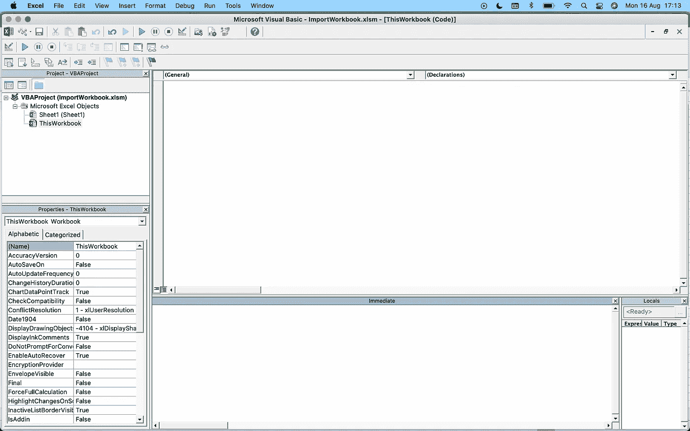

# 如何使用 VBA 从 Excel 中的另一个工作簿导入数据

> 原文：<https://medium.com/geekculture/how-to-import-data-from-another-workbook-in-excel-using-vba-3dc7e3604755?source=collection_archive---------0----------------------->

尽管 Excel 于 1985 年推出，但它在大多数行业中仍然非常流行，几乎每个公司都以某种方式使用它。该应用程序的一些功能只能通过使用 VBA 来使用，这使得这个旧软件在分析和处理数据时更加有用。

您经常会发现自己将其他文件中的数据复制粘贴到一个合并的工作簿中，以便进一步研究那里的数据。复制粘贴数据的过程可能会花费大量的时间。在我们使用一些简单的 VBA 代码自动完成这个过程后，我们可以利用这段时间做更重要的事情。我来解释一下怎么做！

在本教程中，我们将导入阿姆斯特丹过去的无版权的天气数据，你可以在这里找到。每个人都应该能够遵循这个指南，即使没有任何编程经验，尽管任何先前的编码经验将使某些概念更容易理解。

# 开发者标签

在我们开始编写一些代码之前，启用所需的功能是很重要的。由于我最近写了很多关于 VBA 的文章，你最好按照本文副标题“如何用 Visual Basic for Applications 构建宏”[下的步骤去做。](https://www.freecodecamp.org/news/automate-repetitive-tasks-in-excel-with-vba/)

在功能区中启用“开发人员”选项卡后，将工作簿保存为启用 Excel 宏的工作簿(。xlsm)，打开 Visual Basic 编辑器，在左上角的项目资源管理器中双击 ThisWorkbook 选项。

这应该会在编辑器中打开一个新的窗格，您可以在其中开始键入一些代码，如图 01 所示。

Figure 01: Visual Basic

# 编写 VBA 代码

在新打开的窗格中，我们将开始编写从外部源导入数据所需的代码。
键入 Sub，子例程的缩写，输入 ImportData 作为名称，以两个括号结束，然后按 enter。然后编辑器会自动完成您的宏，如下面的代码块所示，之后我们只需要输入在两个子关键字之间运行实际宏时应该执行的代码。

如前所述，本教程的目标是将数据从一个工作表复制粘贴到另一个工作表。为了导入另一个工作簿，有几个强制步骤，我将在下面详细解释。

Figure 01: Visual Basic

在前面定义的宏中，我们从在第二行添加一个变量开始。如果你以前从未编码过，你可以把一个变量想象成一个存储信息的盒子。就像当你移动并写下盒子的内容时，需要定义变量的名称和它的数据类型。最常用的数据类型是字符串(单词和句子)、整数(四舍五入的数字)和双精度数(带小数的数字)。

> 如果您不确定使用哪种数据类型，那么 Variant 类型是最佳选择。不要每次都使用这种类型，因为它会占用更多的内存，从而降低程序的速度。

在这种情况下，我们声明了一个变量(也就是准备一个盒子)，所以我们可以在以后存储文件的位置。

在第四行，Excel 内置的 GetOpenFile 方法将打开一个文件浏览器，并返回您选择的文件的位置。这个位置，你可能从常规文件浏览器的顶栏中的那些路径中认出来，然后被保存在我们先前声明的变量中。

在我们继续之前，我们需要检查用户是否真的选择了一个文件。如果我们跳过这一部分，并且没有选择任何文件，程序将立即崩溃。因为我们包含了一个检查来查看变量中是否真的存储了什么，所以程序知道在这两种情况下该做什么。如果 file location 变量为 null (false)，表示没有选择任何文件，Excel 将发出标志性的嘟嘟声，然后毫不费力地退出宏。

如果选择了一个文件，我们需要设备的所有处理能力来处理打开的文件，这可以通过关闭 ScreenUpdating 属性来实现。从那时起，Excel 屏幕上的所有内容都将暂停，而设备将使用该功能进行计算。老实说，现在可能不需要这样做，但是在开始构建更复杂的宏之前，这是一个很好的习惯，因为这样的属性实际上会有所不同。

在我们关闭所有的视觉效果后，我们将使用 Set 关键字定义一个对象。为了访问工作簿中的数据，我们需要将工作簿存储为一个对象。基本上，您在初始工作簿上期望的每个方法和属性在这个对象上也是可用的。

最后，我们关闭导入的工作簿并再次启用屏幕更新，以确保一切恢复正常。

现在，当光标停留在两个子关键字之间的某个位置时，您可以通过在 Visual Basic 中按绿色箭头来运行这段代码。

我知道。在文件资源管理器窗口打开后，您选择了包含天气数据的文档，但是除此之外，什么也没有发生。别担心，那实际上是正确的！
我们现在编写的所有内容都需要将外部工作簿中的数据存储到我们称为 ImportWorkbook 的对象中。

现在我们将有一些乐趣，让我们的生活变得轻松一点！

在以编程方式关闭文件之前，可以使用 Copy 方法将导入的工作簿中的数据复制粘贴到原始工作簿中。

上面的代码块从导入的工作簿的第一个工作表中复制单元格 A1:D25(本教程开头讨论的数据文件中使用的单元格)。

这个方法带有一个可选参数，您可以用它来定义粘贴位置。

> 不为数据定义这个新位置会将导入的数字复制到你的剪贴板，然后你可以自己粘贴到其他地方。

在我们的例子中，我们希望将数据粘贴到原始文件的左上角(从单元格 A1 开始)，该文件是使用 ThisWorkbook 对象定位的。

如果您现在将这一行代码粘贴到已经存在的子程序中，就在我们关闭文件的地方，保存并运行宏，然后从 Meteoblue 导入下载的数据文件，您应该会看到粘贴到原始文件中的数据。

# 替代用法

如前所述，ImportWorkbook 包含了您对工作簿的所有期望。这意味着您还可以从导入的工作簿中获取其他可能需要的信息。

用上面的两行代码替换以前使用的将数据从一个工作表复制粘贴到另一个工作表的代码，应该会打印出导入的工作簿的名称和当前在编辑器的即时窗口中选择的工作表的名称。

> *如果运行宏时没有看到打印的信息，选择编辑器中的视图下拉菜单，并确保选择即时窗口。*

为了在不打开 Visual Basic 编辑器的情况下运行此宏，请从功能区的“开发人员”选项卡中选择“宏”按钮，并从那里选择要运行的宏。或者，您可以选择从同一选项卡中选择按钮选项，然后选择宏，这将在您的工作簿中创建一个按钮，当您按下该按钮时，该按钮将执行宏。

# 结论

恭喜，您现在可以从外部工作簿导入数据了！

请随意试验这段代码，这样您就可以使用自己的数据文件，如果您喜欢本教程，请不要忘记留下一点掌声。