# 如何为 Google 登录功能集成 Firebase 身份验证？

> 原文：<https://medium.com/geekculture/how-to-integrate-firebase-authentication-for-google-sign-in-functionality-e955d7e549bf?source=collection_archive---------2----------------------->

# 介绍

个性化体验现在是一个时髦词。工业界已经开始意识到了解每个人在做决定时的想法的重要性。它有助于优化资源和扩大产品范围。因此，现在大多数应用程序都要求用户身份来创建个性化体验的前提。然而，让您自己的认证/身份提供解决方案并不容易。当这种情况发生时，Firebase 身份认证会帮助我们扭转局面。

# 什么是 Firebase 认证？

Firebase 身份验证是一种快速、安全地验证用户身份的工具。它为认证和登录方法提供了非常清晰的流程，并且易于使用。

# 为什么应该使用 Firebase 身份验证

*   时间、成本、安全性和稳定性是将身份验证作为一项服务而不是自己构建的优势。Firebase Authentication 已经在安全帐户存储、电子邮件/电话身份验证流程等方面为您做了大量工作。
*   Firebase Authentication 与云 Firestore、实时数据库和云存储等开发产品进行了许多集成。声明性安全规则用于保护这些产品，而 Firebase 身份验证用于引入细粒度的每用户安全性。
*   您可以使用任何平台轻松登录。它提供了一个端到端的身份解决方案，支持电子邮件和密码帐户，电话认证，以及谷歌，Twitter，脸书和 GitHub 登录，等等。

# 入门指南

这篇博客将重点关注使用 Google 和 Firebase APIs 在我们的 Android 应用程序中集成 Google 登录功能的 Firebase 身份验证。

# 创建一个 Android 项目

*   创建一个新项目，并选择您所选择的模板。

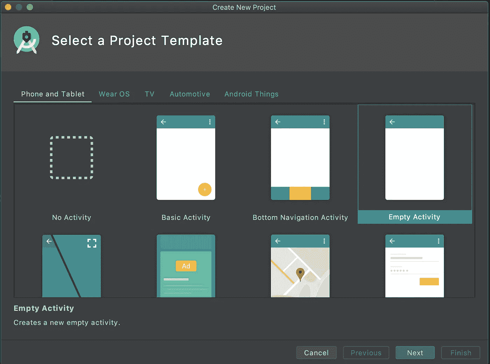

> 我选择了“空活动”。

*   添加名称并单击完成

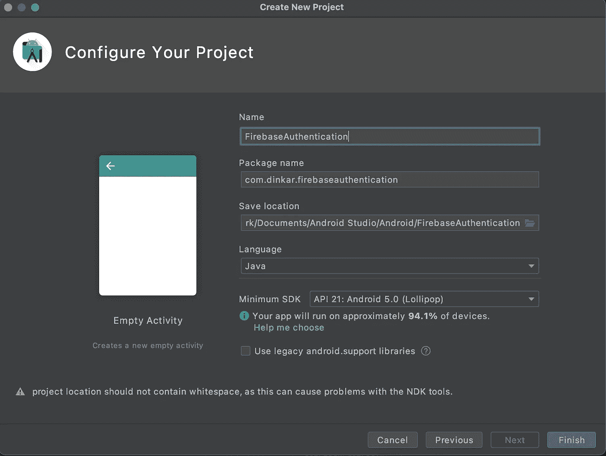

*   让我们改变主要活动的布局，以获得一些有用的信息，如姓名、个人资料照片。此外，添加一个注销按钮，以便我们了解注销流程。

# 创建一个 Firebase 项目

要使用任何 firebase 工具，我们需要为其创建一个 firebase 项目。

让我们为我们的应用程序 RemoteConfigSample 创建一个

*   转到[https://console.firebase.google.com/](https://console.firebase.google.com/)，点击“添加项目”创建一个新项目

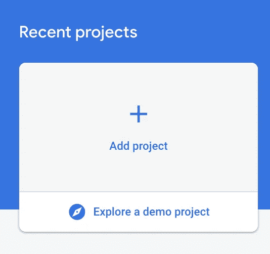

*   为您的项目命名，然后点击“继续”

*   选择您的分析位置并创建项目。

# 将 Android 应用程序添加到我们的 Firebase 项目中

*   单击 Android 图标，在 firebase 项目中创建一个 Android 应用程序

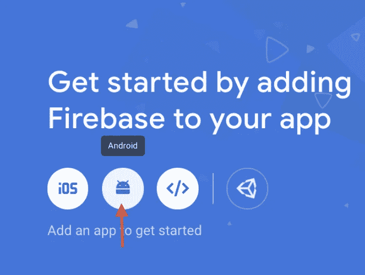

*   我们必须为 Google 登录添加 SHA-1 设置，在项目目录中运行下面的命令来确定您的调试密钥的 SHA1:

*。/gradlew 签名报告*

*   在 firebase 的应用注册中使用上面的 SHA1
*   提交相关信息后，点击注册应用程序

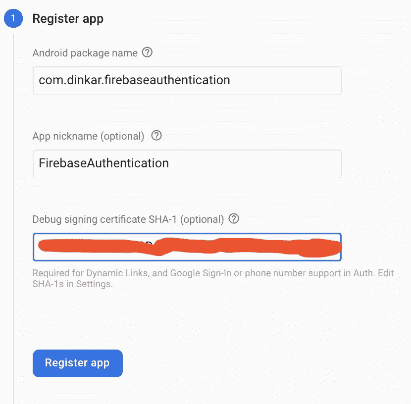

*   按照提供的说明下载 google-services.json 并将其添加到您的项目中。

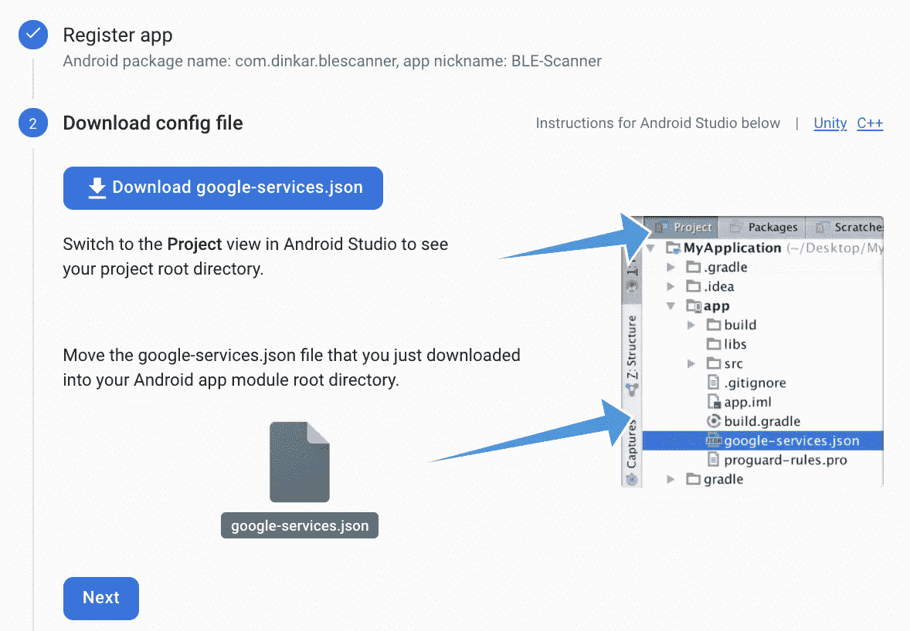

*   按照说明将 Firebase SDK 连接到您的项目后，单击 Next。

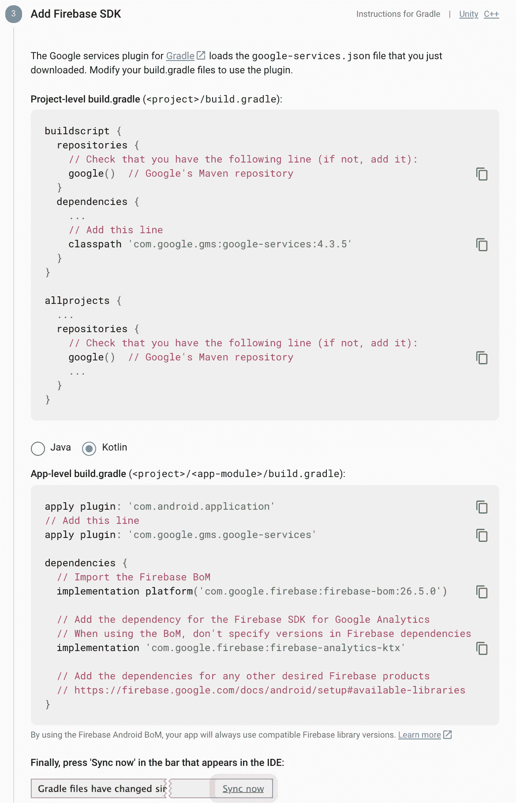

# 添加 Firebase 身份验证依赖项

*   转到左侧窗格中“构建”下的“身份验证设置”

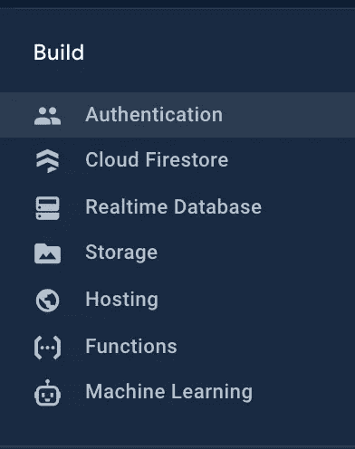

*   点击“开始”

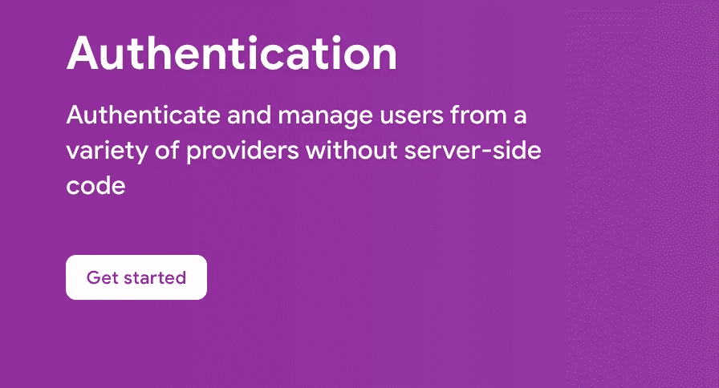

*   选择登录方法选项卡
*   将谷歌开关切换到启用(蓝色)

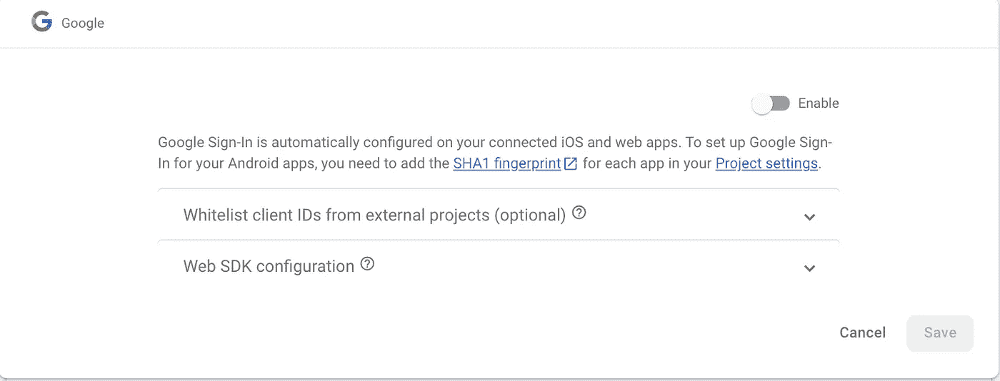

*   设置一个支持电子邮件并保存它。

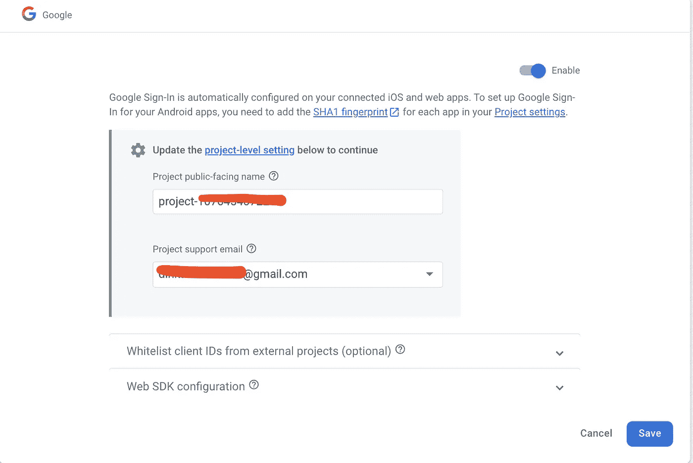

*   转到项目设置

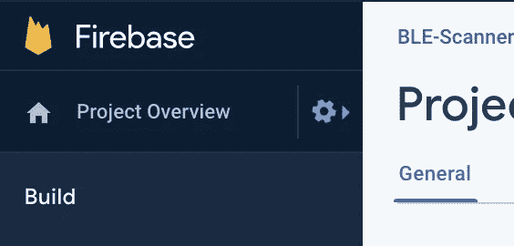

*   并下载最新的***Google-services . json***，它将启用 google sign in 的认证设置，并用新的 JSON 文件替换旧的 JSON 文件。
*   在 build . gradle
    实现' com . Google . Firebase:Firebase-auth '中添加 Firebase 认证依赖
*   在 build.gradle
    *实现中添加 Google sign in 依赖项' com . Google . Android . GMS:play-services-auth:19 . 0 . 0 '*

# 创建登录流程

要开始身份验证，需要使用一个简单的登录按钮。在这个阶段，您将实现使用 Google 登录的逻辑，然后使用该 Google 帐户通过 Firebase 进行身份验证。

*   创建一个新的登录活动，并带有一个启动登录流入的按钮

*   初始化 FirebaseAuth

*mfirebase auth = firebase auth . getinstance()；*

*   初始化 GoogleSignInClient

*   创建一个登录方法，我们可以通过单击登录按钮来调用它

*   签到结果需要在 **onActivityResult 中处理。**如果 Google 登录成功，请使用该帐户通过 Firebase 进行身份验证:

*   用 firebase 验证 GoogleSignInAccount 以获得 Firebase 用户

# 提取用户数据

使用 firebase 身份验证成功验证 google 帐户后，我们可以提取相关的用户信息。

# 获取用户名

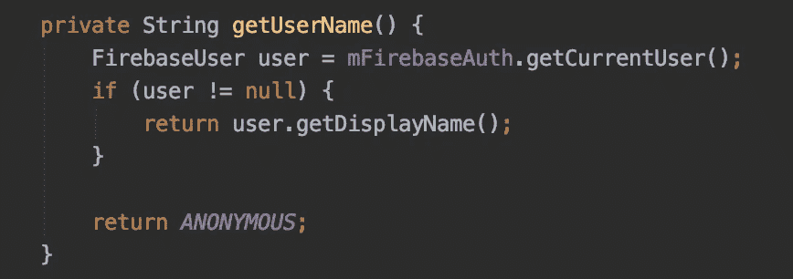

# 获取用户个人资料照片 URL

# 注销

我们已经完成了登录过程。如果用户仍然登录，我们的下一个目标是将他们注销。为此，我们创建了一个名为 signOut()的方法。

# 查看应用程序运行情况

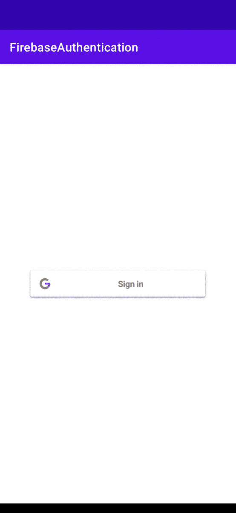

我们可以看到，该用户也是在 Firebase 身份验证的“用户”选项卡中创建的

万岁，我们已经做到了，现在我们知道如何在没有我们自己的服务器的情况下拥有一个认证解决方案来获得用户身份并提供个性化的用户体验。

要了解更多细节和更深入的观点，你可以在这里找到代码

参考资料:[https://firebase.google.com/products/auth](https://firebase.google.com/products/auth)，[https://firebase.google.com/docs/auth](https://firebase.google.com/docs/auth)

*原文由我在***发表。**