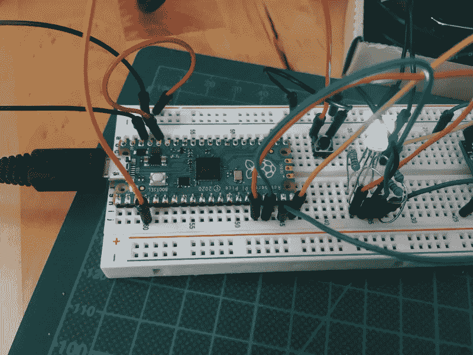

# 单片机编程如何学习 C/C++？

> 原文：<https://medium.com/geekculture/how-to-learn-c-c-for-microcontroller-programming-60324c4fec09?source=collection_archive---------6----------------------->

每个 Arduino 程序员都是从使用 C 编程语言编写第一个 LED 闪烁草图开始的。您了解定义输出引脚和更改引脚的基本命令。您还知道什么是函数，以及`setup()`和`loop()`方法如何交互。从那以后，您就可以使用 C 和 C++编程语言的全部功能了。

问题“我应该使用哪种语言？”不由自主的引出“C 和 C++有什么区别？”以及“这些语言提供了哪些功能？”。

在这篇写于 2021 年秋季的博文中，我提供了一个回答这些问题的个人快照。我反思我迄今为止的选择，我学习语言的方法，并预测我将选择哪条语言道路。

*本文原载于我的博客*[*admantium.com*](https://admantium.com/blog/micro14_learning_a_programming_language/)。

# 语言习得的以往经验

我在大学开始学习用面向对象的 Java 编程。两个学期的语言课程，图书馆和许多作业。后来在我的研究中，在日本的一次访问中，我被介绍给 Ruby。这种迷人的语言——在著名的《鹤嘴锄书》问世的时候，当 Rails 受到关注的时候——非常有趣。我逐字逐句地在键盘上输入每一个例子，我玩弄这种语言，用心去了解它。在我的工作生涯中，我扩展到了 web 开发、普通 JavaScript 和 React。然后，在这一年，我对 Arduino 产生了兴趣，这最终导致了 C 和 C++(也许还有汇编程序？！).

# 使用 C 语言的第一步

阅读和理解 Arduino C 程序对我来说相当容易，至少在我查看库代码之前是如此，例如控制电机或 LED 矩阵。起初，我迷失在如此多的`*`和`&`(指针，没错！)，想知道为什么字符串是数组，并对`ifndef`头定义感到困惑。所以，我的第一反应是抓起一本著名的书——简而言之就是 C。我学会了这种语言，但是也因为太多的实现细节而分心，比如 16 种不同的有符号、无符号、长、短字符、单词和 int。但与此同时，我又在钻研图书馆的代码，让我的机器人工作起来。通过阅读关于这些库的论坛帖子，以及查看 lib 代码语句，我的困惑变成了迷恋。c 接近硬件，接近计算机固有的抽象。5 周后，我的第一个原型完成了。然而，我没有信心从头开始编写一个 C 程序，仍然依赖于一起复制示例，直到它工作为止。

我错过了什么？我理解这种语言，并能阅读复杂的源代码。但是我不能拿出来。无论我在做什么项目，我都想理解、学习和应用。

# 怎么学？

所以，再次回到问题:如何学习一门语言？第一步是对语法、关键字和程序结构的基本理解。这是你操作的一般框架。第二步是使用语言，自己编程。你最好用小任务(例如练习)挑战自己，并通过语言游戏(探索性编程)来做到这一点。下一步是获得最佳实践，并在计划中再次使用它们。最后，你可以查阅详尽的语言参考资料，了解这门语言的来龙去脉。

现在，你喜欢怎样倾斜？我仍然喜欢用书，因为它们给我关于一个主题的最好的结构化知识，读完一本书的感觉很好——这是你实现的东西。把我的方法分解成几本书给了我下面的列表。

*   语法参考:从一本教你语言语法的书开始。我强烈推荐去看看奥雷利的袖珍参考图书馆或者来自 Apress 的书；它们很短，不到 120 页，你可以在一个晚上看完。但是不要只是读这本书，而是把每个例子输入你的电脑。如果您想尝试不同的东西，请随意尝试这种语言。参考:现代 C 快速语法参考
*   语言教程:语言教程是很有分量的完整书籍，通常是为初学者编写的，从下往上教东西。我们会用这些书来进行语言练习。因此，直接进入每一章的练习部分，开始编码。如果你不能完成这个练习，回到捕获部分，阅读对你来说新的或熟悉的内容。读完这本书后，你就有了坚实的语言基础。提示:如果你已经知道你想使用这种语言的应用领域，挑一本有相应练习的书
*   最佳实践书:当你在做你的项目时，拿起这种类型的书。它们将帮助您学习如何最好地使用编程语言，还将帮助您了解最新的语言变化。许多编程语言都更新了新版本和新的语言特性。教程书籍通常都比较老，但是最佳实践书籍可以让你跟上时代。
*   语言参考:书的最终类型是一个附加的插件。如果你真的喜欢学习一门语言的来龙去脉，就去找一本语言参考书。这些书详细介绍了语言的每个方面，包括类型的详细解释、内存管理和核心语言库的广泛描述。这本书既可以单独使用，也可以在你遇到应用程序中的特殊问题时阅读

# 我学习 C 语言的方法

让我们看看这种方法的实践。学 C 的时候，我用了这些书。

*   语法参考
*   [现代 C 快速语法参考](https://www.apress.com/gp/book/9781484242872)写于 2019 年，涵盖了最新的 C 标准
*   [C 袖珍参考](https://www.oreilly.com/library/view/c-pocket-reference/0596004362/):经典，但来自 2002 年，因此不包含当前对 C 语言的修改

语言教程

*   [现代 C](https://www.oreilly.com/library/view/c-pocket-reference/0596004362/):2019 年编写，包含最新标准。这本书也面向初学者和有经验的程序员。它结构良好，在 C 语言的幕后向你传授这门语言。
*   这本书的第六版写于 2020 年。这是一本针对初学者的综合性书籍，用几页的篇幅展示和解释程序，以提供深入的理解。

最佳实践

*   21 世纪的信息宝库。这本书既有知识性又有娱乐性，让你的 C 用法跟上时代。由于其悠久的历史，许多 C 代码往往是复杂和冗长的——这本书教你如何变得更好！

语言参考

*   [C 简评](https://www.oreilly.com/library/view/21st-century-c/9781491904428/):2005 年的经典著作，解释了 C 语言的每个细节，包括每个标准库函数的 200 页内容。

# 结论

本文讨论了一个基本问题“如何学习一门新的编程语言？”。对我来说，这个问题可以通过 4 个步骤来回答:熟悉、实践、应用开发、最佳实践和参考学习。首先，您开始键入中小型程序，通常只是重复示例代码。你开始熟悉这种语言。然后你练习，你选择一组练习，最好是从你想编程的目标领域。完成这个的时候，你懂语言，能解决问题。然后你继续应用程序开发，从一个自我导向的目标开始。此外，您可以获得关于最佳实践的最新知识，并将其应用到您的项目中。这些阶段可以伴随着精心选择的学习材料——我更喜欢书籍，但在线教程和视频也是有益的。