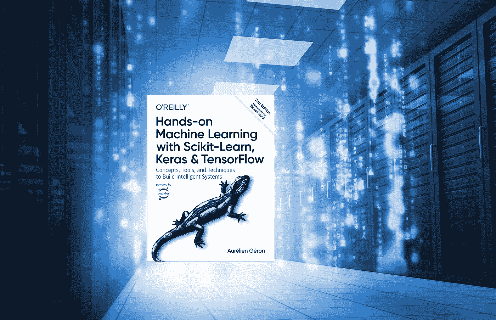
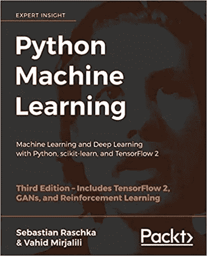
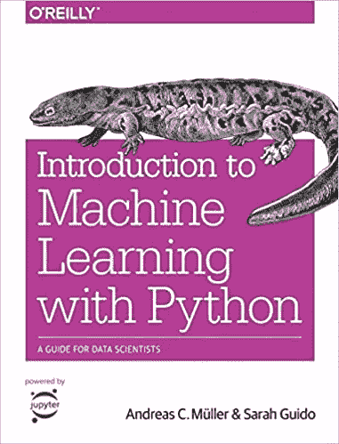

# 如何学习机器学习

> 原文：<https://medium.com/geekculture/how-to-learn-machine-learning-672f7ab524b2?source=collection_archive---------31----------------------->

关于如何教会愚蠢的计算机变聪明的综合指南

Photo by [Pietro Jeng](https://unsplash.com/@pietrozj?utm_source=medium&utm_medium=referral) on [Unsplash](https://unsplash.com?utm_source=medium&utm_medium=referral)

如果你正在阅读这篇文章，你很可能想学习机器学习，但不知道从哪里开始。你可能会考虑要完成什么课程，买什么书，参加什么脸书聚会等等。你可能会被现有的大量资源淹没，以至于你可能会决定放弃学习机器学习。放心，这个位置不止你一个人。其实我也有过和你一样的处境。不要放弃！机器学习是一个非常广阔的领域，但花时间学习机器学习的某些子领域的技能可以获得巨大的回报。

机器学习已经存在很长时间了。它的概念起源于 20 世纪后期；然而，由于缺乏计算能力，科学家们“放弃”了这一领域。只是在过去的一二十年里，它才获得了一些动力。这主要是由于两件事:数据消耗和计算能力的指数增长。互联网的兴起让我们比以前“耗尽”了更多的数据。无论你去哪里，你都会留下一些数据。例如，如果我去咖啡店，我将通过我的手机耗尽位置数据。正如你可能或将要理解的那样，机器学习系统的好坏取决于它们所获得的数据。

我为这样离题道歉；然而，我相信如果你要了解机器学习，你必须了解它的根源。然而，我想再次提出的一点是，机器学习已经存在了一段时间。考虑到这一点，有无数的资源可以用来学习机器学习。为了方便起见，我将资源分为书籍/参考资料和课程。然而，在我进入列表之前，我需要提到一个**必备的**资源。

# 必备资源

Hands-On Machine Learning with Scikit-Learn, Keras, and Tensorflow Book. Source: [TechTalks](https://bdtechtalks.com/2020/07/22/hands-on-machine-learning-2nd-edition-review/)

使用 Scikit-Learn、Keras 和 Tensorflow 的 [*动手机器学习可以说是任何机器学习工程师的最佳资源。这本书非常非常全面地解释了机器学习的基本原理。它将支持向量机等复杂算法分解成非常容易理解的概念。此外，这本书分解了各种数据科学概念，如在数据预处理中替换缺失值的特性缩放&。不知道你能不能看出来，但是我非常非常推荐这本书。即使你不使用我提供给你的任何其他资源，你也必须至少使用这本书。我觉得怎么推荐都不够。即使在今天，如果我有关于机器学习的问题，我总是先翻到这本书。9/10 次，这本书能够回答我的问题。这本书适用于从初学者到专业人员的所有技能水平的机器学习工程师。在我结束之前，我想提一下这本书是用 Python 写的。考虑到这一点，在阅读本书之前，您可能需要调整您的 Python 技能。但是，尽管如此，**我强烈推荐你得到这本书的副本。你可以以后再谢我。***](https://www.amazon.com/Hands-Machine-Learning-Scikit-Learn-TensorFlow/dp/1492032646?&linkCode=sl1&tag=pytonbooks-20&linkId=677172bbf90e88ab7e5af8e1b285d09d&language=en_US&ref_=as_li_ss_tl)

# 书

除了上面介绍的书，还有许多其他的书可以帮助你追求机器学习。我相信上面的书应该能满足你的需要；然而，为了提供选择，这里列出了一些书籍:

*   [百页机器学习书](https://www.amazon.com/Hundred-Page-Machine-Learning-Book/dp/199957950X?&linkCode=sl1&tag=pytonbooks-20&linkId=1264c47184e924e27f1e40f0d67958b1&language=en_US&ref_=as_li_ss_tl)
*   [Python 机器学习](https://www.amazon.com/Python-Machine-Learning-scikit-learn-TensorFlow/dp/1789955750?&linkCode=sl1&tag=pytonbooks-20&linkId=abcab52a4b942f7079773afb205338e6&language=en_US&ref_=as_li_ss_tl)
*   [Python 机器学习简介](https://www.amazon.com/Introduction-Machine-Learning-Python-Scientists/dp/1449369413?&linkCode=sl1&tag=pytonbooks-20&linkId=3fadfe4c32c126bed00fd78d6fee4635&language=en_US&ref_=as_li_ss_tl)

我明白，仅仅给你书并不能真正帮助你决定买哪些书，不买哪些书。考虑到这一点，让我们仔细阅读每本书，了解利弊。

## 一百页的机器学习书

Book Cover, Source: [KDNuggets](https://www.kdnuggets.com/2020/01/artificial-intelligence-books-read-2020.html)

有人真的能在 100 页内涵盖所有的机器学习吗？这是极不可能的，但有人可以在 100 页内涵盖机器学习的一些基础知识。这本书对机器学习初学者是一个很好的介绍，可以作为专业人士的参考。这本书的亮点在于它能够从概念的角度描述这些算法，而不是深入数学。但是你不需要理解数学吗？除非你计划发现新的机器学习模型，否则数学没有概念理解重要。在你来抓我的喉咙之前，让我说，是的，它确实有助于你了解机器学习算法中正在发生的事情，但如果你不明白，那也没什么大不了的。

然而，我发现这本书可能有点贵(亚马逊上大约 34 美元)。我觉得 34 美元，我应该得到一本深入研究算法及其用例的书。但这只是我的看法。

## Python 机器学习

Book Cover, Source: [Amazon](https://www.amazon.com/Python-Machine-Learning-scikit-learn-TensorFlow/dp/1789955750?&linkCode=sl1&tag=pytonbooks-20&linkId=abcab52a4b942f7079773afb205338e6&language=en_US&ref_=as_li_ss_tl#customerReviews)

这本书比那本上百页的机器学习书要长得多，而且从视觉方面&基于知识的方面来看，这本书可能更难读。视觉上，印刷不像你可能遇到的其他书那么“好看”。话说的那么拥堵，看起来像是要越狱。然而，在与前一本书相似的价格点上，这本书进入了更多关于机器学习算法的细节。此外，它还要经过数据预处理和模型部署，这两个过程对于利用机器学习模型都是至关重要的。

此外，这本书深入探讨了深度学习的广泛细节。你可能知道或者不知道，深度学习是使用神经网络的机器学习的一个子领域。迷茫？看看我几周前写的这篇关于深度学习的文章。我相信这篇文章会消除你的疑虑。

总之，这本书深入研究了深度学习概念以及如何在 Tensorflow 2 中实现它们。我相信每本机器学习的书都应该有一个类似的部分，因为世界正在进步。作为一名人工智能爱好者，我不断看到越来越多的研究论文发表，这些论文应用深度学习方法来解决问题。因此，要想留在机器学习马拉松中，你应该有一些关于深度学习和构建深度学习系统的知识。

总的来说，这本书比前一本书要复杂得多，但是考虑到它们的价格差不多，我可能会选择这本书而不是前一本书。

## Python 机器学习简介

Book Cover. Source: [Amazon](https://www.amazon.com/Introduction-Machine-Learning-Python-Scientists/dp/1449369413?&linkCode=sl1&tag=pytonbooks-20&linkId=3fadfe4c32c126bed00fd78d6fee4635&language=en_US&ref_=as_li_ss_tl)

榜单上最后一本书是*Python 机器学习入门。*你大概能猜到，这本书用的是 Python 编程语言。我认为这本书对初学者来说是一个很好的资源，但你可能会发现自己因为它的“简单”而感到厌倦。虽然它确实明确地进入了机器学习算法，并允许你将脚浸入水中，但我认为它未能呈现谜题的其余部分。让我解释一下。

当构建机器学习应用程序时，您不仅需要知道机器学习算法，还需要知道数据处理部分。我如何处理这些数据？我从哪里获得这些数据？这些是你需要回答的一些问题。这本书在那方面不会真正帮助你。然而，如果你不确定自己是否想进入机器学习世界，这本书可能非常适合你，因为它将让你全面了解各种机器学习技术和算法。

# 课程

为了全面起见，让我回顾一下我发现对学习机器学习非常有帮助的几门课程。我提到的课程是全面的，将有助于你获得机器学习能力。以下是课程清单:

*   [吴恩达的机器学习](https://www.coursera.org/learn/machine-learning?utm_source=gg&utm_medium=sem&utm_campaign=07-StanfordML-US&utm_content=07-StanfordML-US&campaignid=685340575&adgroupid=52515609594&device=c&keyword=machine%20learning%20mooc&matchtype=b&network=g&devicemodel=&adpostion=&creativeid=516914090332&hide_mobile_promo&gclid=Cj0KCQjw5auGBhDEARIsAFyNm9H-N0zkl3wIk02-yGGMoMiZUVEC5feSBackNDWBXbWI3ic_KhcPgS8aAmMkEALw_wcB):吴恩达教授是最受欢迎的&备受尊敬的机器学习实践者之一。有人可能会说他是目前比赛中最好的。这门课程有点长，但它将 100%帮助你在机器学习领域取得成功。这门课的主要缺点是用 Octave (Octave 类似于 Matlab)授课，非常数学化。然而，作为一个不是数学专业的人，我发现数学部分并不太难。一定要注意！这将大有帮助。
*   机器学习 A-Z :我会说这是一门非常基于代码的课程。它完全由 Python & R 编写，允许学生使用他们最熟悉的面向数据科学的语言。这门课多了很多编码，挺好的。该课程还介绍了各种数据科学技能，如数据预处理。这对应用程序开发非常有帮助。一个很大的缺点是，有时候，我觉得这门课程变得令人困惑&有点无聊。此外，确保你不会为这个课程支付 90 美元。等着瞧吧，你可能会免费得到这门课程。

显然，还有很多课程，但这两个是我认为你应该知道的主要课程。

# 结论

在一个信息容易获取的时代，我们很容易被大量的信息淹没。通过浏览指导课程和书籍，我们可以全面地学习机器学习。我应该提一下，没有必要出去做每一门关于机器学习的课程&阅读每一本关于机器学习的书。**我最大的建议是完成 1-2 门课程，阅读 1-2 本书。**通过这种方式，你将获得帮助你构建酷项目的基础知识。说到项目，**我强烈建议你在获得一些基本技能后立即开始项目工作。**就像生活中的每一项技能一样，你需要练习才能变得更好！记住这一点，练习！！！！

我希望我的指南能够帮助你开始你的机器学习之路。如果您对要添加的资源有任何建议，请告诉我。此外，如果您有任何意见或问题，请随时告诉我。作为一名作家，你的反馈是我变得更好的方法之一。