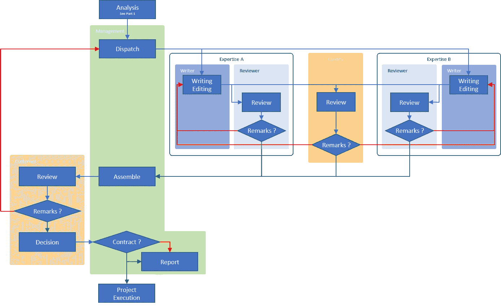
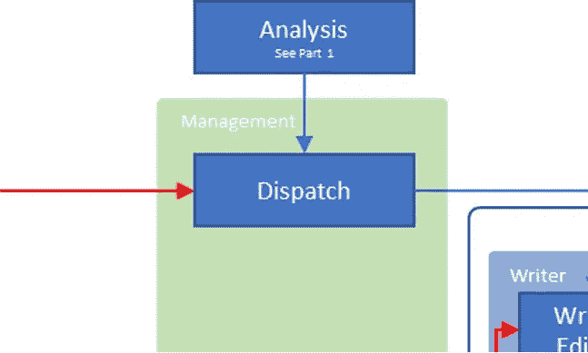
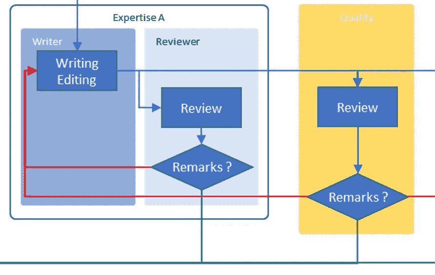
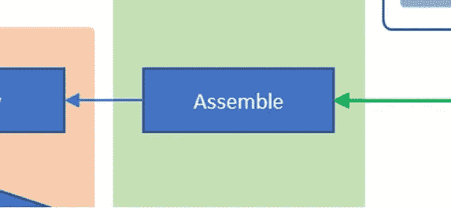
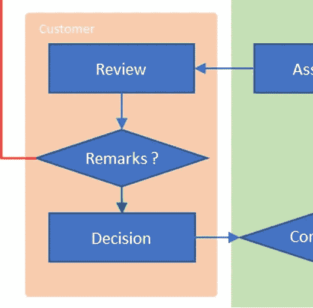
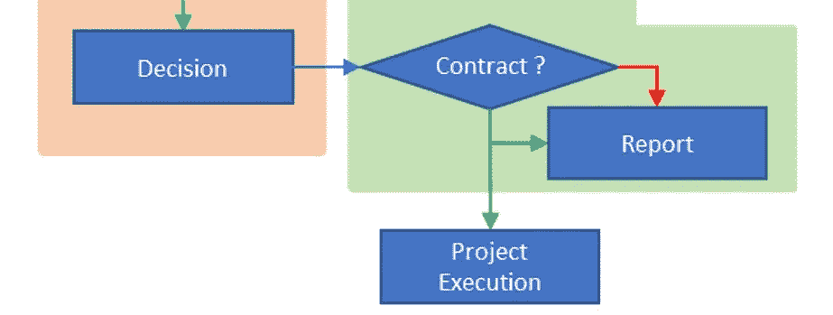

# 如何管理提案请求—第 2 部分:提案制定工作流程

> 原文：<https://medium.com/geekculture/how-to-manage-a-request-for-proposal-part-2-proposal-building-workflow-13a02ed3911a?source=collection_archive---------66----------------------->

Proposal building workflow

好的，您已经决定对该提案请求进行投标，因为您有合适的团队和技能来满足您客户的需求。现在你必须建造它。让我们进入一个跨越所有检查点的工作流程，在最有效的时间内提出一个详尽的建议。

这个图表一开始可能感觉有点复杂。但是别担心，我们会把它分解的。这只是保护文档内容的常识和交叉验证。这个过程已经被数百家不同规模的公司所经历和验证。无论你的团队规模有多大，它都能适应你的项目。

# 主角都是谁？

每种颜色代表项目中不同的人。所以最好的情况是:

*   顾客(橙色)
*   项目经理(绿色)
*   项目所需的每个技术专家的技术作者(深蓝色)
*   项目所需的每个技术专家的技术审查人(浅蓝色)
*   质量审查员(黄色)

因此，如果你的项目需要 3 个专业领域，在最好的情况下，项目团队包含 8 个人+ 1 个客户。但是我们并不是生活在一个完美的世界里，所以在现实生活中，几个角色通常是由相同的人扮演的。对于每一步，我们将描述如何由同一个人完成几项任务，并且仍然保持高质量水平。

# 该过程

事不宜迟，让我们一步一步地进入工作流程吧！

## 1 —派遣

分析得出的结论是，贵公司应对这份招标书进行投标(参见[我们之前的文章](/geekculture/how-to-manage-a-request-for-proposal-part-1-analysis-98c0b3e89dfd)以了解该分析的所有细节)。有时，执行分析的团队与构建提案的团队并不相同。因此，项目经理至少应再次向所有团队成员简要介绍他们的具体任务:

1.  确定提案的所有技术作者，并给他们每个人一个特定的范围:一组客户需求或特定的专业知识。
2.  然后，经理将为每个作者分配审阅者。这是最好的情况。如果团队不能有这么多成员，作家可以交换他们的作品，每个人都成为另一个的同行评审。如果只有一个作者，经理可以是技术同行评审员。
3.  经理应指派一名项目质量审查员。这样的团队成员负责验证任何制作的内容是否符合贵公司的所有质量标准:特定的布局、文本中的特定语气、一些文档标准……该审核者不应关注技术内容。通常，如果没有质量评审员，项目经理也可以执行这项任务。

## 2 —写作/审阅/编辑循环

这里我们将只考虑一种专业知识，但是对于任何数量的专业知识，过程都是相同的。

经理将任务分派给所有团队成员后，作者就可以开始撰写提案中属于他的部分了。在以后的文章中，我们将详细介绍提案文档的内容，并解释如何使其尽可能详尽。

一旦作者认为他已经完成了他的部分，并且已经涵盖了他周围的每个客户的需求，他就将他的作品发送给他的技术评审员和质量评审员。

正如我们前面提到的，在最好的情况下，这两个不同的审查者应该被调用。但如果团队缩减，技术审核可以由另一个写手来做。项目经理可以进行技术和质量审查。

审稿人不得修改作者制作的内容。他们应该在一份阅读材料中列出他们所有的评论(参见[我们的专门文章](https://luc-dumont.medium.com/reading-sheet-an-easy-tool-for-collaborative-review-e4e1ff1072ab)了解什么是阅读材料)。一旦他们收集了所有的意见，他们就把他们的阅读材料发给作者，这样他就可以在新的文件修订中考虑这些材料。只要阅读材料中还有未完成的评论，这个循环就会继续下去。详见[我们关于文档审核的文章](https://www.naept.com/blog/faire-une-relecture-de-document/)。

所有备注结束后，我们可以认为文档的每个部分都已完成，并且足够成熟，可以发送给客户了。我们可以进行下一步。

## 3 —组装

经理负责收集来自所有作者的文档的所有部分。他将把它们合并成一个文档(或一组文档),就像客户期望的那样。

感谢每篇课文的质量审查，这部分应该真的很容易快速完成。只需要合并文档并进行最终检查以确认一切正常。然后经理通过专用渠道把所有东西发给客户:通过邮件，通过特定的交换平台等。

## 4 —在客户处

显然，您的客户会审阅您的建议书，就像您自己的内部审阅一样，这份建议书可能会以备注结束。

如果是这样，客户会将它们发送给项目经理，项目经理会将它们发送给每个相关的作者。因此，我们返回到调度步骤，但编辑/审核循环要快得多。这一次，评审人员应重点关注客户备注的管理，不得自行添加新的备注。这里的目的是尽快提出一份更新的建议书。因为如果客户花时间给你发评论，那是因为你的提议引起了他的注意。但入围的可能不止你一个！

一旦你满足了他的所有要求，他就没有更多的话要说了，他将能够做出自己的决定…

## 5 —最终决定

好的，你的顾客已经把他的决定告诉你了。不管是什么，你都应该写一份报告。

如果答案是肯定的，请将您所有的文件(分析、阅读材料、建议书、客户意见)收集到一个文件夹中，并标记为“已接受”。将来，如果您收到类似的提案请求，您的档案中的这样一个文件夹将是一项重要的资产。你将确切地知道该如何回应，或者对如何启动你的提案有一个清晰的想法。

如果是否定的，仍然收集你所有的文件，但这次标记为“拒绝”。你的客户很可能会告诉你他为什么没有选择你。如果他没有，就去问他！这将是一个宝贵的反馈，有助于您下一次处理该客户的请求，或者只是为了您公司的持续改进。就像纳尔逊·曼德拉曾经说过的:“我从不松懈，我要么胜利，要么学习。”

我坚持认为，这里的要点是，无论结果如何，都要把所有完成的工作转化为一种活的资产，一种未来的知识来源。所以任何事情都不能做第二次！

# 结论

管理一个提案的请求没有秘密可言。一切都是组织的问题。陷阱是在一瞬间浪费时间，因为你真的没有那么多时间。因为如果你收到了这个请求，你的竞争对手也会收到。

好吧，他们比你便宜就能赢这一次。这是一种在短时间内赢得胜利的错误的简单方法，因为低得离谱意味着他们没有像你一样在分析上花那么多时间，所以他们冒了更大的风险。如果这些风险变成了现实，你可以肯定他们不会被客户注意到，并且这个客户下次不得不在两个供应商之间做出选择时不会犯同样的错误两次。

# 你呢？

你使用类似的工作流程吗？在将文档发送给客户之前，您如何管理文档审核？
你还有其他工具吗？你使用软件还是雇佣供应商来帮助你建立你的提案？

📝为我们的[商业项目文档研究做出贡献](https://docs.google.com/forms/d/e/1FAIpQLSc_qdxv6Cmqtkk5SVe3SBOGktS4nX4vKe81DUQ_N_x0qrYVUA/viewform?usp=sf_link)。