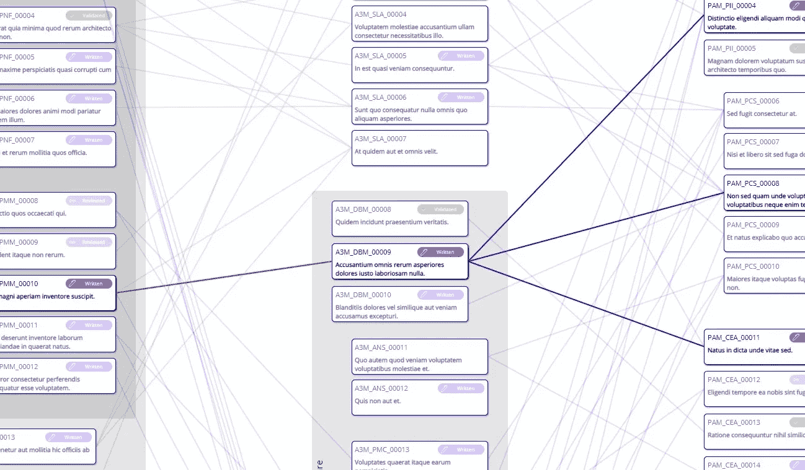

# 如何管理提案请求第 3 部分:规格提案模板

> 原文：<https://medium.com/geekculture/how-to-manage-a-request-for-proposal-part-3-a-specifications-proposal-template-65a210d087a0?source=collection_archive---------34----------------------->

好吧，RFQ 分析告诉你去做吧！现在是写提案的时候了(也就是你推荐的项目规范)。

由于第 2 部分，你设法组织你的所有团队在最短的时间内有效地写提案。在第三部分中，我们将与您分享一个模板:放入什么，如何用模块化部分构建一个易于更新的内容。

正如我们在 Naept 经常说的，文档中主要的最佳实践是重用和迭代。因此，我们在这里将要描述的模板是我们在专用文章的[中解释的提案请求的变体。目的是有相似的模板，这样读者可以轻松直观地在文档中导航。除了大量的内容需要从一个到另一个重复，如果相似的内容位于相似的位置会更好。](https://www.naept.com/en/blog/how-to-build-a-request-for-proposal/)

就像在征求建议书模板文章中一样，选择任何适合你需要的建议，我们将它们构建成相对独立和模块化的。

让我们深入了解它们…

# 文档参与者列表

重要性:1/5

这是为该文档的构建做出贡献的人员列表。我们甚至可以添加他们的电子邮件地址和他们所扮演的角色，以帮助文档的读者获得他们问题的答案。

Contributors list

# 进化列表

重要性:4/5

这是一条非常重要的信息，需要添加到您的文档中。随着时间的推移，并根据与客户的讨论，您的提案将变得更加成熟。所以你要保持它是最新的。简化并加快对文档新修订的审阅；这对于识别自上一个项目以来发生变化的项目非常有帮助。

Evolutions list

查看[我们关于矩阵的文章](https://www.naept.com/en/blog/what-is-a-traceability-matrix-part-two/)的专门章节了解更多详情。

# 词汇

重要性:5/5

在你的文档中使用技术术语之前，定义你将使用的所有缩略语、概念和技术术语会很有帮助。

读者很可能会使用相同的措辞，但含义略有不同。这种差异可能会导致项目后期的误解。或者也许你有其他人难以理解的非常具体的概念。

因此，为了限制风险，最好是在文档的开头用一个表格解释每一个技术概念。

我们将在下面的文章中更深入地探讨这个问题:[编写规范文档的 4 个主要困难](https://www.naept.com/en/blog/4-major-difficulties-in-writing-a-specification-document/)

# 描述

这是写文档的另一个主要难点:描述文档所属项目的上下文非常重要。这种语境化在几个级联描述中清晰地表达出来。

您基本上可以复制提案请求中的每个描述，至少可以避免首先检索原始文档。这样做的目的是为未来的读者提供最少的上下文语境，如果他在项目结束后很久还在阅读文档，例如为新的项目寻找可重用的材料。

## 公司的描述

重要性:3/5

在提案中，现在有两家公司在一起工作:客户和供应商。

描述两家公司:他们的专业领域是什么？他们的植入:本地，全国，全球？谁是他们的客户，他们的市场？他们的价值观是什么？等等。

## 整个项目的描述

重要性:4/5

你的提议属于一个更大的项目。描述一下

## 提案主题的描述

重要性:5/5

在通过列出其规格来深入了解您的解决方案的细节之前，您可以用两三句话来告诉读者它的目的，以便让读者了解“整体情况”。

## 文档的描述

重要性:2/5

最后，我们讨论文档本身的目的。在项目期间，您可能会有几种文档(提案请求、硬件规格、软件规格、验证计划……)。它们可以复制先前详述的相同描述，但每个都有一个给出文档本身目的的特定描述。

建议书的目的是描述符合客户需求的解决方案，并提供商定的详细程度。

# 文献学

重要性:5/5

描述规格时，您可以参考外部文档。读者也应该阅读这些外部文件，以了解你的要求。

这种外部文件可以是例如:

*   交付物应遵守的标准的描述
*   建筑计划
*   元件数据表
*   专业杂志上的一篇文章
*   …

在专门的表格中列出所有这些外部文档将非常有用。该表至少应包含标题、文件的修订版，如有可能，还应包含找到该文件的链接。

此外，为了避免在每次需要引用文档时重复完整的标题，我们可以给每个外部文档一个小的引用放在文本中。该参考文献可以由几个字母数字字符组成，参考文献和外部文件之间的链接由参考文献表给出，如下所示:

Bibliography

这种方法的一个好处是，如果一个外部文档版本发生变化，您不必在提到它的任何地方都更新您的文档，您只需更新文献目录表，小的参考文献可以保持不变。所以你的文档更容易维护！

# “待定”元素表

重要性:4/5

出于以下几个原因，您可能必须在文档完全完成之前发布它:

*   你在等待一些信息细节
*   内容还不完整，因为你需要一些专家的意见
*   为了赶上最后期限，你需要尽快启动这个项目

考虑到这一点，在你的文档中仍然有一些细节需要定义，一些“球拍上的洞”。就像外部文件提到的那样，这些缺失的细节可能到处出现。因此，一个好的做法是将它们都列在各自的专用表格中，并给每个人提供自己的小参考:

To Be defined elements list

1.  你现在有了一个清晰而精确的列表，列出了所有需要定义的东西。
2.  多亏了这个小引用，您只需按几个“Ctrl + H”键就可以更新所有丢失的细节！

# 规格清单

重要性:5/5

终于！这一部分代表了文档内容的 95%。在这里，您将尽可能详尽地描述符合客户要求的所有规格。

把每一个规范看作是一个相对小的独立的任务来完成一个需求，一次完成几个需求，或者只是一个大客户需求的一小部分。

尽可能使它们简单。如果不可能，将一个复合规格分解成几个。规格比客户要求多很多，其实是一件好事。这意味着您的解决方案得到了很好的描述，并且更容易开发。小步总是比大步好。

就像提案请求中的要求一样，按主题收集您的规范。

# 如何构建一个规范使之有效

我们之前说过很多次了，规范是对你的解决方案的一个小的、具体的和独立的部分的描述。这里我们将讨论如何安排规范内容，以便更容易识别、更新和在其他项目中重用。我们将分解这个例子:

> *NPT_PROJETX_TP_AESTH_0014.1 车辆颜色
> >用于车身的油漆参考应为:MOTIP — 41530。
> 结束*
> 
> *覆盖范围:
> NPT _ PROJETX _ CDC _ AESTH _ 0038.2 车辆颜色
> NPT_PROJECT_CDC_GEN_0127.6 项目指南
> NPT _ PROJECT _ CDC _ WEATHER _ 0538.2 天气情况*

# 参考文献和标题

> *NPT_PROJETX_TP_AESTH_0014.1 车辆颜色*

我们已经解释了使用唯一引用来识别需求或规范的好处，以便在可追溯性矩阵、演进表或任何其他文档中提及它们。

这里规范引用的根是文档引用:NPT_PROJECTX_TP_。这代表项目 X (PROJECTX_)的公司 Naept (NPT_)技术建议书(TP_)(见[如何组织您的项目文件(命名约定、存储位置、顺序…)](https://www.naept.com/en/blog/how-to-organize-all-your-documents/) )。

对于这个根，我们添加一个短字符串来标识规范类别。在本例中，字符串是“AESTH ”,表示类别“审美”。我们重用提案请求中的相同类别，以减轻文档之间的来回切换。

则引用包含由数字组成的字符串。该编号应识别规格。两个不同的规范在文件中不应有相同的编号。所以你知道要求“0014”是关于车辆颜色的。

最后，引用以一个点和另一个代表其修订的数字结束。版本是指规格更新的次数。在我们的示例中，规范 0014 处于其第一次修订中。为每个规范指定一个修订号对于快速识别文档两次修订之间的更新非常有用。

在参考文献之后，我们添加一个标题，用几句话来说明该规范是关于什么的。这有助于快速阅读文件。

# 内容和结束标记

> *>车身使用的油漆基准应为:MOTIP — 41530。
> 结束*

在参考下，您现在可以描述您的规范的内容。

以“END”标签结束描述允许框定什么是强制性的，并精确地定义项目边界。读者知道，从契约的角度来看，引用和结束标签之间包含的所有内容都是不可协商的(至少一旦双方都接受了)。例如，这种约定可以在文档描述中确定。

我给内容加了页边空白，让它读起来更舒服。这是识别内容的另一种方式。

# 意图

如果您查看我们关于提案模板请求的文章，您会看到我们在需求内容之后有一个“意图”部分。这有助于将需求放在上下文中，有助于理解为什么这个需求是针对。但是这种意图对于唯一目的是满足需求的规范来说是不太相关的。这就是为什么我们不建议在规范中添加意图。

# 覆盖范围

> *覆盖范围:
> NPT _ PROJETX _ CDC _ AESTH _ 0038.2 车辆颜色
> NPT_PROJECT_CDC_GEN_0127.6 项目指南
> NPT _ PROJECT _ CDC _ WEATHER _ 0538.2 天气情况*

对于一个规范来说，覆盖率部分是一个新的但是非常重要的特性。它列出了当前规范涵盖的所有要求。

因此，在我们的示例中，规范 NPT_PROJETX_TP_AESTH_0014.1 有助于满足以下要求中描述的全部或部分需求:

*   NPT_PROJETX_CDC_AESTH_0038.2 车辆颜色
*   NPT_PROJECT_CDC_GEN_0127.6 项目指南
*   NPT_PROJECT_CDC_WEATHER_0538.2 天气条件

警告:我坚持认为规范不需要完全符合列出的需求。它只能匹配每个的一部分。您可能有非常复杂的需求，这些需求将被几个规范的贡献完全覆盖。这也是一个很好的实践！用几个规范来覆盖一个需求使得项目(和提案文档)更加灵活，从而更容易管理和适应客户的发展。

# 追溯矩阵

在文档的最后，在规范列表之后，有一个新的特性要添加到提案请求中:可追溯性矩阵。我们发表了一篇关于这个主题的两部分文章:[什么是可追溯矩阵？第一部分](https://www.naept.com/en/blog/what-is-a-traceability-matrix-part-one/)，我们将详细说明如何在您的文档中实现它们。但下面是它们在几个词中的用法。

正如我们刚刚看到的，一个规范可以部分覆盖几个需求。那么，你最终如何确保你的提议完全涵盖了客户的要求呢？通过使用追溯矩阵。

追溯矩阵是一个简单的两列表格。第一列包含您的所有客户需求。在第二列中，面对每一个需求，你列出了覆盖它的每一个规范。一旦完成了每个规格覆盖部分的表格，您将对您的解决方案如何覆盖您的客户需求有一个完整清晰的了解。您会立即发现是否有未覆盖的需求。此外，如果您的客户更新了一个需求，您也确切地知道哪些规范需要更新。

Downstream Traceability Matrix

这个矩阵被称为下游可追溯性矩阵，因为它来自客户请求，并符合您的规范。您还可以添加一个上游可追溯性矩阵，从您的规格到要求，以相反的方式进行。这个工具对于项目管理是有用的:它帮助识别最关键的规范:那些覆盖大部分需求的规范。你可能想先处理它们。

Upstream Traceability Matrix

# 结论

我们有意使这种方法尽可能地接近征求建议书的方法，以便最大限度地从一个文档到另一个文档重用内容。这些模块化元素有助于创建高度模块化的文档，可能并不都与您自己的文档相关，但至少它们允许为您的读者创建一个一致的环境来更快地理解您的项目，但它们可能并不都与您自己的文档相关。把这篇文章看作是一个工具箱。

您的文档越是可重用，您就可以花越多的时间来有效地满足客户的需求。

# 你呢？

你的文档使用模板吗？有你经常放进去的内容或模块吗？
你如何设法不在这项活动上花费太多时间？

📝为我们的[商业项目文档研究做出贡献](https://docs.google.com/forms/d/e/1FAIpQLSc_qdxv6Cmqtkk5SVe3SBOGktS4nX4vKe81DUQ_N_x0qrYVUA/viewform?usp=sf_link)。