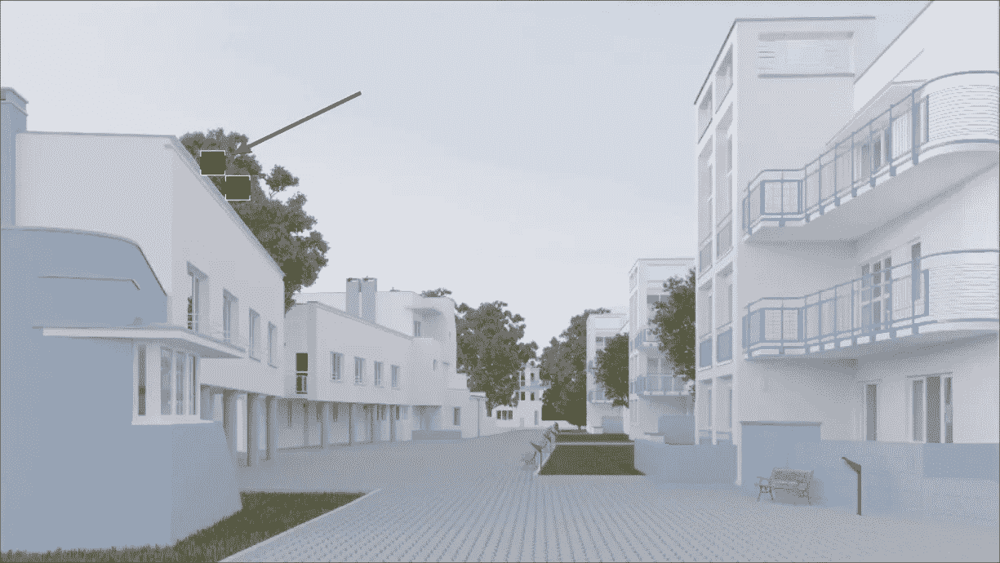
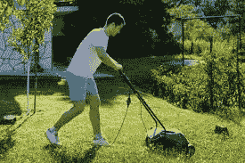

# 如何优化 V-Ray 中的桶设置并避免“挂桶”

> 原文：<https://medium.com/geekculture/how-to-optimize-bucket-settings-in-v-ray-and-avoid-hanging-buckets-968b960f29d5?source=collection_archive---------33----------------------->

任何曾经在 V-Ray 中渲染过任何东西的人，一定都遇到过那些烦人的吊桶——那些需要很长时间才能完成渲染或者根本没有完成渲染的图像的小部分。看起来是这样的:

注意图像的左上方(在树上，白色建筑的上方)是两个未渲染的“桶”。实际上，这些部分仍然可以被渲染，但是花费的时间太长了(图像的其余部分可能在几个小时前就完成了)。或者，可能是渲染已经被那些有问题的部分完全破坏了。

为什么这是一个问题？好吧，假设你正在修剪草坪。所以你拿出割草机，开始在草坪上跑来跑去割草。

你几乎完成了整个草坪的割草，但是你跑进了这片区域，那里有顽固的草。不管你用割草机碾这个部位多少次，草就是不割。所以你花了一整天的时间来来回回地运行割草机，它仍然不会被切断。你浪费了几个小时去清理最后一部分，如果你按小时付钱给别人帮你修剪草坪，你也在浪费钱。

那片顽固的草地有点像 V-Ray 里的吊桶。这可能会导致你在渲染上浪费时间(可能会导致你在截止日期前失败)，更糟糕的是，如果你在云渲染农场上渲染，会烧掉你的预算。

如何避免这种情况？在回答这个问题之前，我们先来了解一下什么是桶，桶在渲染中的作用是什么。

# 桶 101

桶是指 V 射线中的*桶形图像采样器*。这是一种渲染类型，其中图像被细分为称为桶的矩形部分。

这是在将图像细分为桶之后，桶以一定的顺序一片一片地渲染图像(稍后将详细介绍)。您可以为正在使用的 CPU 处理器的每个内核或线程获得一个存储桶。

如果你使用像 GarageFarm.NET[这样的渲染农场进行渲染，你可以使用更多的处理器，因此也有更多的桶同时渲染一幅图像，从而加快渲染速度。如果这对你来说不是很清楚，你可以从我们解释](https://garagefarm.net/)[什么是渲染农场](https://garagefarm.net/blog/the-benefits-of-using-a-render-farm)的文章中了解更多关于渲染和 CPU 内核之间的关系。

# 桶会影响渲染时间

桶基本上是一组像素。根据我们运行的测试，桶越大(意味着每个桶有更多的像素)，渲染时间就越快。

为什么会这样呢？有几个原因可以解释这个一般原则:

*   存储桶在渲染它们的图像部分之前加载和卸载数据，这需要时间。如果桶的大小很小，这意味着与较大的桶相比，每个桶需要做更多次这样的工作，这样时间就累积起来了。
*   如果渲染时没有足够的内存来存储整个图像，较小的存储桶大小会造成更严重的延迟，从而导致更长的渲染时间。
*   当您选择的渲染模式导致桶在图像周围跳跃时，这再次恶化了由小桶大小造成的延迟。

简单地说，我们从不建议将你的桶大小设置为 1 或 2 个像素。然而，尽管如此，稍后我们将看到较小的桶尺寸可以在解决有问题的悬挂桶方面发挥作用(但同样，永远不要小到每个桶 1-2 个像素)。

**专业提示:**为了避免在云农场上渲染高分辨率静态图像时出现问题，在尝试更大的桶尺寸(256 或 512 像素)之前，首先确保您的图像将在单个节点上渲染。如果你不确定，最好坚持较小的默认 48 像素。

# 关于铲斗尺寸和形状的快速说明

根据我们的测试，最好将存储桶大小设置为 2 的幂(512 = 2 x2 x2 x2 x2 x2 x2 x2)或 2 的 3 倍幂(48 = 3 x2 x2 x2 x2 x2)。这有点数学和计算机科学的味道，但是这样做可以提高 CPU 的计算效率，从而加快渲染速度。

此外，默认情况下，V-Ray 将桶形状设置为正方形。我们测试了非方形桶的形状，方形桶比非方形桶渲染得更快。因此，除了极少数情况，没有任何实际理由改变默认的桶形状。

# 不同的渲染顺序

V-Ray 为用户提供了选择桶从哪里开始渲染以及从该起始点开始渲染的顺序的选项。以下是不同的序列/模式及其优缺点和对渲染时间的影响。理解这些渲染序列很重要，因为稍后它们会在解决吊桶时发挥作用。

# 从左到右

桶从图像的左侧开始渲染，然后向右移动。优点:这允许您在任何时候取消渲染，如果您想要更改图像，然后在 Photoshop 中将图像的完成部分缝合到稍后渲染的图像的修改部分。最适合拱形 viz 图像，因为这些图像通常是横向的。

# 从上到下

桶从图像的顶部开始渲染，然后向底部进行渲染。与左右顺序的优点相同。

# 三角测量

这是 V-Ray 的默认设置。开始渲染的新桶接近完成的桶。不再需要重复从图像中卸载和加载数据，从而加快渲染速度。优势:速度。缺点:如果您想停止并进行更改，部分渲染的图像不可用。

# 希尔伯特曲线

与三角测量类似的方法，但遵循不同的路径。还针对速度进行了优化。如果选择停止渲染并进行更改，也会产生不可用的部分图像。

# 螺旋形

渲染从中心开始，然后桶以螺旋模式向外进行。优点:适用于预览和快速浏览渲染图像。缺点:较慢的渲染时间，因为随着渲染远离中心起始点，桶会跳过整个图像。

# 棋子

渲染在交替的桶中进行，像棋盘一样细分图像。优点:提供渲染图像的快速预览，并提供精确的渲染时间估计。缺点:如果停止渲染，部分图像将不可用，并且渲染通常会花费更长时间。

# 鼠标跟踪

桶渲染鼠标指向的图像部分。优点:您可以预览图像的特定部分。缺点:效率较低，不能用于云渲染农场。

# 吊桶的原因

现在我们可以谈谈如何处理那些讨厌的吊桶了。以下是导致渲染桶花费很长时间或根本不渲染的常见原因:

# 技术错误

这些错误与 3D 图像中破碎的几何图形有关(非均匀/翻转的法线，未焊接的顶点，较差的第三方模型/插件效果)，不支持的着色器或光线，场景的边界框太大，场景离原点太远，或软件错误。

# 场景复杂度高或者设置质量太高。

没有足够的内存来渲染图像的复杂部分会导致桶挂起。如果场景具有过高的采样集(高材质设置、运动模糊、焦散或自由度设置)，或者如果存在表面进入光泽反射或折射循环的对象(例如汽车前灯和汽车合金车轮)，则桶也会挂起。在试图渲染场景内的对象时，如果该对象反映了场景外的损坏/有问题的对象，Buckets 也会遇到麻烦。

# 夏洛克吊桶:寻找吊桶的原因

在我们修理吊桶之前，我们需要先确定是什么原因造成的。吊桶有两种情况:

*   水桶永远不会渲染。这通常是由技术错误造成的。
*   一桶会在很长时间后呈现。这通常是由高复杂性/设置导致的。

要确定桶是仍在渲染还是已经完全冻结，您必须检查桶的 CPU 使用情况:

*   如果吊桶的 CPU 内核**低于 10%容量**，很可能是由技术错误引起的。
*   如果 CPU 内核在 **10%-100%容量**内，场景可能需要更多 RAM。
*   如果 CPU 内核处于 **100%容量**，高复杂性就是罪魁祸首。

你可以做的另一件事是确定你的吊桶是永久冻结(技术错误)还是花了很长时间渲染(高设置)，你可以尝试渲染你的完整图像的 1/10 分辨率版本。如果这个较小版本的图像渲染超过 15 分钟，这意味着图像有严重的问题(技术错误)，除非解决该错误，否则它将永远不会完成渲染。

# 悬挂铲斗故障排除

现在，让我们开始修理。如果这是一个导致吊桶的技术错误，遗憾的是，我们在 V-Ray 中没有任何优化技巧，除了尝试另一个渲染过程，即*渐进图像采样器*方法。修复由技术错误导致的悬挂桶的方法是修复或删除导致渲染问题的损坏的模型或着色器。有时候从零开始重塑破碎的几何图形会更快。

我们如何找到破碎的物体？可能导致问题的对象甚至不在场景中，而是被场景中的一个对象反射。

‍

要隔离导致问题的对象，可以尝试删除一半的场景对象，然后运行测试渲染来检查渲染时间是否有变化。您可以重复这个过程，恢复已删除的对象，然后每次删除越来越小的对象子集，最终确定有问题的对象。我们在该视频的 7:18 标记处演示了这一技术:

‍Now，你发现了视野之外的破碎物体，你可以修复它，删除它或改造它。

接下来解决一个高质量设置导致的吊桶。以下是您可以对需要长时间渲染的桶执行的一些操作:

*   优化着色器的采样设置。
*   削减反射或折射的数量。
*   删除视野之外(FOV)但在 FOV 内反射中可见的长渲染对象。
*   使用较小的铲斗。这可以让你利用更多的 CPU 内核来渲染吊桶。然而，如上所述，降低桶的大小会损失一些渲染速度，但至少你不必修改你的图像。这是一种有来有往的局面。这个方法显示在上面视频的 10:00 标记处。
*   使用适当的渲染顺序。假设吊桶位于图像的左侧。您可以使用左右渲染顺序，以便桶从图像的左侧开始。这样，在渲染图像的其余部分时，将渲染图像中具有挑战性的部分的桶可以有机会完成渲染。如果吊桶位于图像中心附近，可以尝试使用螺旋序列。为了更加清晰，请观看上面 11:05 开始的视频部分。
*   使用“锁定铲斗起点”选项。这种方法与上述方法类似，但这里您可以使用鼠标更具体地设置起点。这个选项在上面视频的 12:07 分演示。
*   设置序列以完成长渲染部分。这是与上述方法相反的方法。这与 V-Ray 的自动桶划分系统一起工作。

你有它！现在你知道如何处理那些烦人的吊桶了。如果您对自己进行故障诊断没有信心，我们 GarageFarm.NET 公司有一名 [24/7 支持人员](https://garagefarm.net/contact)，如果您在我们的云农场渲染时遇到吊桶，您可以随时与他们聊天。所以你不需要担心你在挂水桶上浪费时间和金钱。我们支持你。

本文原载于 GarageFarm.NET[的](https://garagefarm.net/)博客[这里](https://garagefarm.net/blog/how-to-optimize-bucket-settings-in-v-ray-and-avoid-hanging-buckets)。