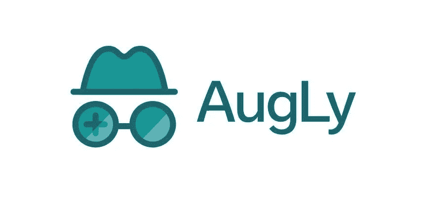
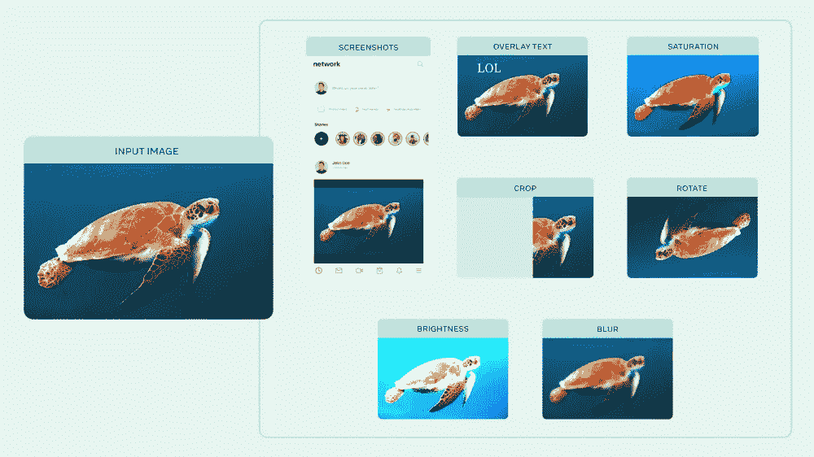
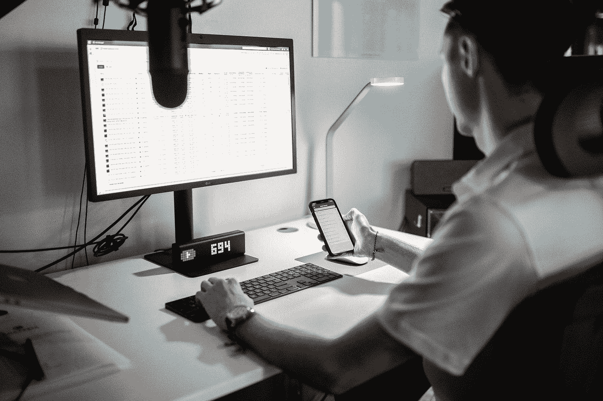
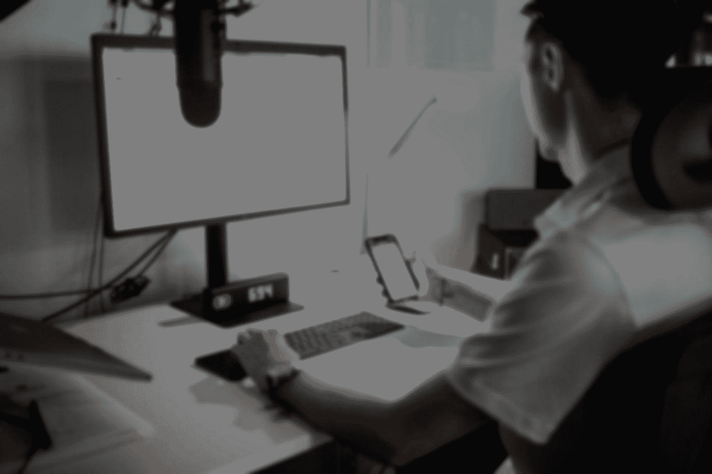

# 如何使用 Augly 库进行数据扩充

> 原文：<https://medium.com/geekculture/how-to-perform-data-augmentation-with-augly-library-e32279916b14?source=collection_archive---------15----------------------->

## 来自脸书的一个新的开源 python 库



[Augly Github Page](https://github.com/facebookresearch/AugLy/blob/main/logo.svg)

在机器学习和深度学习中，拥有更多的数据对于帮助你从模型中获得良好的性能非常重要。你可以通过使用一种叫做**数据扩充的技术来创建更多的数据。**数据[扩充](https://hackernoon.com/increase-the-size-of-your-datasets-through-data-augmentation-ex1x3t3j)是从业者使用的一种技术，通过从现有数据创建修改的数据来增加数据。

> “我们没有更好的算法。我们只是有更多的数据。”彼得[诺威格](https://research.google/people/author205/)

如果您的项目有一个小数据集，或者您希望减少 ML 或深度学习(DL)模型中的过度拟合，使用数据扩充技术是一个好的做法。

在本文中，您将学习如何通过使用脸书的一个名为 Augly**的新开源库来执行数据扩充。**

# 什么是 Augly？

AugLy 是一个数据扩充库，可以帮助您评估和提高模型的健壮性。该库支持四种模态(音频、视频、图像和文本),包含 100 多种执行数据扩充的方法。

如果您正在处理使用音频、视频、图像或文本数据集的机器学习或深度学习项目，您可以使用此库来增加数据并提高模型性能。



该库由脸书人工智能公司的软件工程师乔安娜·比顿、费尔公司的研究工程师佐伊·帕帕基波斯以及脸书公司的其他研究人员和工程师开发。

该库已用于不同的项目，例如:

*   **图像相似性挑战**——由脸书·艾举办的 NeurIPS 2021 竞赛，奖金为 20 万美元。它已经制作了 DISC21 数据集，将在挑战赛结束后公之于众！
*   **DeepFake 检测挑战赛**——2020 年由脸书·艾举办的 Kaggle 比赛，奖金 100 万美元；还制作了 DFDC 数据集。
*   **SimSearchNet** —脸书人工智能开发的近似重复检测模型，用于识别平台上的侵权内容。

# 如何安装 Augly

AugLy 是一个 Python 3.6+库。它可以与以下设备一起安装:

```
pip install augly
```

**注意:**上述命令仅安装使用图像和文本设备的基本要求。对于音频和视频设备，您可以安装所需的额外依赖项

```
pip install augly[av]
```

在某些环境中，pip 不会像预期的那样安装 python-magic。在这种情况下，您需要额外运行:

```
conda install -c conda-forge python-magic
```

# 文本数据的数据扩充技术

第一步是导入包含文本数据增强技术的**文本模态**。

```
import augly.text as textaugs
```

然后创建一个简单的文本输入。

```
# Define input text
input_text = "Hello, world! Today we learn Data Augmentation techniques"
```

现在，我们可以应用如下各种增强:

## (一)模拟错别字

使用拼写错误、键盘距离和交换技术模拟每个文本中的拼写错误。

```
print(textaugs.simulate_typos(input_text))
```

“你好，世界！当今电子战 leanr Dtaa 增强技术

正如你所看到的，这种技术增加了一些拼写错误和文字的交换。

## (b)插入标点字符

您可以在每个输入文本中插入标点符号。

```
print(textaugs.insert_punctuation_chars(input_text))
```

['H，e，l，l，o，，，w，o，r，l，d，！，，T，o，D，A，y，，w，e，，l，e，A，r，n，，D，A，T，A，，A，u，g，m，e，n，T，A，T，I，o，n，，T，e，c，h，n，I，q，u，e，s']

## (c)更换双向

这种技术将每个输入文本中的每个单词(或单词的一部分)反转，并使用双向标记按文本的原始顺序呈现文本。它将每个单词分别颠倒，即使换行也能保持单词的顺序。

```
print(textaugs.replace_bidirectional(input_text))
```

[' \ u 202 eseuqinhcet no tatnemgua ataD nrael ew yadoT！dlrow，olleH\u202c']

## (d)替换相似字符

这会用相似的字符替换每个文本中的字母。

```
print(textaugs.replace_similar_chars(input_text))
```

“你好，wor7d！t()天我们学习数据 Augm3^tati[]n 技术”

如您所见，字符**“l”**被替换为数字 **7** ，字符**“o”**被替换为**“()”**，字符“e”被替换为数字 **3** ，然后字符**“o”**被替换为**“[]”。**

## (e)颠倒更换

这将根据粒度颠倒文本中的单词。

```
print(textaugs.replace_upside_down(input_text))
```

sǝnbᴉuɥɔǝʇuoᴉʇɐʇuǝɯɓnɐɐʇɐᗡuɹɐǝlǝʍʎɐpoꞱplɹoʍ'ollǝh

## (f)拆分单词

该函数将文本中的单词拆分成子单词。

```
print(textaugs.split_words(input_text))
```

“他洛，世界！今天，我们学习数据增强技术”

# 图像数据的数据扩充技术

第一步是导入**图像模态**及其包含图像数据增强技术的依赖项。

```
import os
import augly.image as imaugs
import augly.utils as utils
from IPython.display import display
```

现在，我们可以应用如下各种增强:

## (a)图像缩放

缩放功能可以帮助您改变图像的分辨率。您可以使用一个名为 **factor** 的参数来定义图像应该缩小或放大的比例。

```
input_img_path = "images/simple-image.jpg"# We can use the AugLy scale augmentationinput_img = imaugs.scale(input_img_path, factor=0.2)
display(input_img)
```



## (二)模糊形象

在这个函数中，半径越大，图像越模糊。

```
input_img = imaugs.blur(input_img, radius=5.0)
display(input_img)
```


## (c)改变图像的亮度

要改变亮度，您需要调整该函数中的**因子**参数。小于 1.0 的值使图像变暗，大于 1.0 的值使图像变亮。将因子设置为 1.0 不会改变图像的亮度。

让我们将因子的值设置为 1.5。

```
input_img = imaugs.brightness(input_img,factor=1.5)
display(input_img)
```


然后，让我们设置因子的值为 **0.5** ，使其更暗。

```
#make it darker 
input_img = imaugs.brightness(input_img,factor=0.5)
display(input_img)
```



## (d)更改图像的纵横比

在此功能中，纵横比是您想要创建的新图像的**宽度/高度**。

```
input_img = imaugs.change_aspect_ratio(input_img, ratio=0.8)
display(input_img)
```


## (e)改变图像的对比度

在这个函数中，**因子**参数处理一切，当你设置因子为零时，它给出一个灰度图像，低于 1.0 的值降低对比度，

因子 1.0 给出原始图像，大于 1.0 的因子增加对比度。

```
input_img = imaugs.contrast(input_img,factor=1.7)
display(input_img)
```


## (f)裁剪图像

要裁剪图像，您需要定义裁剪图像的左、右、上、下边缘的位置。

```
input_img = imaugs.crop(input_img,
                        x1=0.25,
                        x2=0.75,
                        y1=0.25,
                        y2=0.75
                        )
display(input_img
```


# 关于 Augly 库数据扩充的最后思考

在本文中，您已经了解了数据扩充在 ML 或 DL 项目中的重要性。此外，您还学习了如何使用 augly library 对图像和文本数据进行数据扩充。

正如我之前解释过的，这个库有超过 **100 种增强技术**，其中大部分都不在本文中。

如果您想了解如何对音频和视频数据进行数据增强，请阅读每种设备的**自述文件**！

*   [https://github . com/Facebook research/AugLy/tree/main/AugLy/audio](https://github.com/facebookresearch/AugLy/tree/main/augly/audio)
*   [https://github . com/Facebook research/AugLy/tree/main/AugLy/video](https://github.com/facebookresearch/AugLy/tree/main/augly/video)

如果你学到了新的东西或者喜欢阅读这篇文章，请分享给其他人看。在那之前，下期帖子再见！

你也可以在 Twitter @ [Davis_McDavid](https://twitter.com/Davis_McDavid) 上找到我。

*最后一件事:在以下链接中阅读更多类似的文章。*

[](https://medium.datadriveninvestor.com/23-common-data-science-interview-questions-for-beginners-59c2265a947e) [## 初学者常见的 23 个数据科学面试问题

### 回答常见面试问题的指南和资源。

medium.datadriveninvestor.com](https://medium.datadriveninvestor.com/23-common-data-science-interview-questions-for-beginners-59c2265a947e) [](https://medium.datadriveninvestor.com/automatic-feature-selection-in-python-an-essential-guide-448c7f2143bf) [## Python 中的自动特征选择:基本指南

### python 中的要素选择是自动或手动选择数据集中的要素的过程…

medium.datadriveninvestor.com](https://medium.datadriveninvestor.com/automatic-feature-selection-in-python-an-essential-guide-448c7f2143bf) [](/geekculture/5-best-machine-learning-books-for-ml-beginners-4e2fd3f0bd03) [## 最适合 ML 初学者的 5 本机器学习书籍

### 开始构建你的机器学习职业生涯的推荐书籍

medium.com](/geekculture/5-best-machine-learning-books-for-ml-beginners-4e2fd3f0bd03) 

*本文首发* [*此处*](https://hackernoon.com/how-to-perform-data-augmentation-with-augly-library-bn1f37y4) *。*