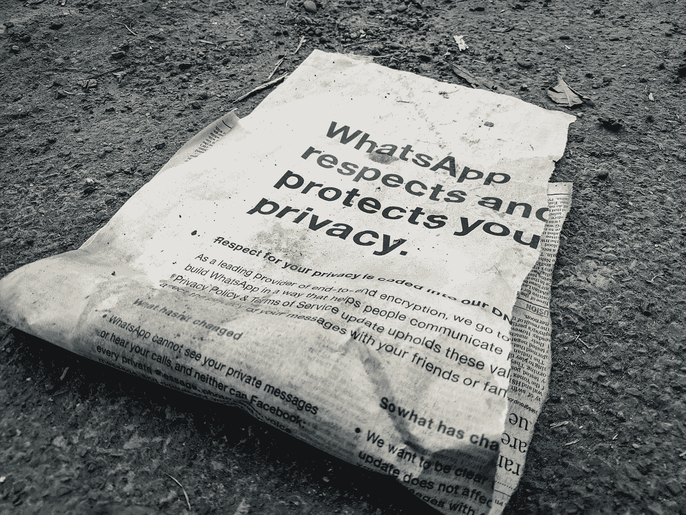

# 如何选择隐私友好的服务

> 原文：<https://medium.com/geekculture/how-to-pick-privacy-friendly-services-dde6227d00e9?source=collection_archive---------52----------------------->

## 收回隐私的简单步骤

今天，在一次关于为日志和其他写作等文档选择云存储的对话中，隐私话题被提了出来。鉴于服务可以识别手写，哪里是存储笔记的好地方？

更大的问题是，你如何选择隐私友好的服务？

Photo by [Tushar Mahajan](https://unsplash.com/@route2tushar?utm_source=medium&utm_medium=referral) on [Unsplash](https://unsplash.com?utm_source=medium&utm_medium=referral)

[在我的博客上阅读这篇文章](https://blog.ramiyer.me/how-to-pick-privacy-friendly-services/)以获得更好的阅读体验和隐私。

让我们从简单的开始:谷歌拥有 Google Drive，微软拥有微软 OneDrive。他们都对广告感兴趣，尽管微软不像谷歌那样咄咄逼人。Dropbox 只是一家云存储公司，与广告界没有任何已知的联系。Dropbox 在这里得分更高。尽管 Dropbox 存在安全问题，但我发现它很可靠。缺点是你开始时只有可怜的 2 GB 存储空间。当然，如果你打算存储文本文档，2 GB 也不错；如果您计划存储扫描的文档、图片等。，你必须去别处看看。

但是我们没有回答具体的替代方案；我们正在研究帮助您选择在线服务的原则。

# 加密

当你寻找存储或其他服务时，你会看到许多人谈论端到端加密，让你认为你的数据在他们手中是安全的。那是不必要的。

用非技术术语来说，加密就是以一种特定的方式将你的数据打乱的过程。例如，以短语`Hello, world!`为例，你有一个密钥`mykey`。如果你用你的密钥加密你的短语，你的数据可能看起来像:

`OntswB9A+64RgMuNu+Any2EC1o7RKa5wzArjwmQ=`

要解密这个，你可以使用同一个密钥(`mykey`，你会得到`Hello, world!`。加密可以确保第三方无法读取您的短语。我们看到的是一个*对称密钥加密*的例子:您使用相同的密钥进行加密和解密。我们还有*非对称密钥加密*，加密和解密使用不同的密钥。

不涉及技术细节，当一个服务加密你的数据时，其他人会把它视为乱码内容，并且无法理解它。这给你很大程度的保护免受窥探。

如果存储服务采用端到端加密，他们会在数据离开您的设备之前对数据进行加密。这为您的数据在传输过程中提供了极大的安全性。但这并不是全部。

大多数提供端到端加密的服务也持有解密密钥。这是一个严重的问题，因为，数据流的两端是你的设备和服务的云存储。端到端加密处理传输中的数据。但是静态数据呢？比如，云存储中的数据？这是加密的还是服务解密它从服务器上的用户那里收到的任何数据？有些服务还提供“静态加密”。

我们应该寻找的是*零知识加密*。

大多数提供端到端加密和静态加密的服务，*持有加密数据的密钥*。这意味着，如果或当他们决定读取您的数据，他们可以读取您的数据。在零知识加密的情况下，您持有解密密钥。您的服务提供商获取加密数据，存储加密数据，然后将加密数据发送给您。您的客户端(或应用程序)会为您解密数据。

这里需要注意的是，如果您丢失了密码，您的加密密钥也会随之丢失，并且您的数据通常会变得无法恢复。举个例子，Bitwarden(一个密码管理器)对你的密码保险箱使用零知识加密。在这种情况下，如果您丢失了主密码，就会丢失整个密码库。

就像他们说的，最安全的解决方案也是最不方便的。

存储提供商持有加密密钥并不一定等同于恶意，但你必须知道你正在进入什么。

# 核心业务

服务的下一个最重要的方面是服务提供商的核心业务。最简单的例子就是谷歌。谷歌提供过多的产品，包括移动操作系统。但谷歌的核心业务是广告。

你如何确定一个公司的核心业务？跟着钱走。关于[2020 年谷歌](https://www.statista.com/topics/1001/google/)全球收入的 80%来自广告。相比之下，微软 82%的收入来自软件销售(来自搜索广告的收入为 5.41%)。这并不是说微软不是数据经济的一部分；这仅仅意味着到目前为止，微软没有足够的动力去挖掘你的数据。

# 开源软件

人们普遍认为开源软件是危险的，因为每个人都可以看到代码，人们认为这使得攻击者很容易找到他们可以利用的漏洞。然而，事实恰恰相反。当一个大的社区能够看到代码时，他们将能够找到漏洞并提供修复。安全专家可以审计代码中的安全问题并报告它们，社区可以选择修复这些问题。

Linux 是开源的，Windows 不是。当您了解到严重的安全漏洞会影响您的计算机，而不考虑其操作系统时，您会发现 Linux 比 Windows 更快地获得了修复漏洞的更新。此外，也有公司不让他们产品的用户知道一个漏洞，直到他们可以修复它；一直以来，恶意实体都会利用该漏洞。这在开源世界中不会发生，除非:

# 不是真正的开源

不是所有的公司都开源他们的整个解决方案。例如，Signal 是开源的，但它[几乎一年没有共享其代码](https://www.androidpolice.com/2021/04/06/it-looks-like-signal-isnt-as-open-source-as-you-thought-it-was-anymore/)的更新。

为了确保我得到了正确的信息，Signal 是开源的，但是上面的文章让人觉得这个解决方案并不完全是社区驱动的。这意味着该公司有自己的开发团队，许多开发工作都在内部进行。偶尔，该公司会推出他们开源代码的更新。

社区驱动的开源项目工作方式不同:社区完全驱动项目。他们公开讨论所有的问题，所有的发展都是公开的。Linux 就是这样一个开源项目的例子。像 Signal 这样的项目仍然很好，但是发布的代码和公司在服务器上实际使用的代码之间可能会有差异。一般来说，社区驱动的开源项目更加透明。(当然，这并不是说非社区驱动的开源项目不可信。)

# 免费产品和服务

警惕免费服务。没有哪家企业是通过免费提供产品或服务来赚钱的。任何需要托管的东西都需要服务器来运行。服务器运行在硬件上，你需要钱去买硬件。服务器也有运行成本:电费、维护费、维护服务器的工程师的工资等等。云最终也是在硬件上运行的——像亚马逊、谷歌和微软这样的公司拥有占地数公顷的大型数据中心。他们拥有数百万台服务器，为你提供云服务。经营这些要花钱。

再次，它归结到核心业务。例如，微软的核心业务是软件和企业解决方案。托管几十亿家庭用户对他们来说并不重要，因为他们的大部分资金来自企业。他们为您提供的免费存储仅仅是他们主要用于企业的大规模存储池中未使用的存储，更像是备用容量。

苹果不一样；他们的核心业务是硬件。它们提供 5 GB 的存储空间来备份您的设备内容和设置。他们对超过 5 GB 限制的照片和文档存储收费。苹果没有动力去挖掘你的数据(截至目前)。当然，我们不能肯定地说微软或苹果不会挖掘数据。

对于精通技术的人来说，解决这些问题很容易，因为精通技术的人甚至可以在上传开始之前加密他们的数据。在此之后，服务是否加密加密数据就无关紧要了。但这并不是每个人都喜欢的。对于不精通技术的人来说，最简单的方法是在实际的范围内遵循上述原则。你不可能控制你手机上的每一个应用程序，你使用的每一项服务，或者为此开发你自己的应用程序。

# 设备上和点对点替代方案

大多数提供商将内容上传到他们的服务器，并在那里进行处理。比如 Google Assistant，Siri，Cortana，Alexa，都是把你的语音查询上传到各自的服务器上进行处理。或者，Adobe Scan 将您扫描的文档上传到它的云中，以检测文本并处理它们。或者 Zoom 通过其服务器路由电话会议。这意味着用户数据到达服务拥有的服务器。

一些应用程序在设备上执行所有处理，而不将数据发送到服务器。这种方法的问题是应用程序必须有这样的能力。这并不总是可能的，因为语音处理等功能需要自己的代码库，这将占用您设备上的大量空间。即使这些应用程序的更新是增量的，您仍然会看到数百兆字节的二进制文件被传输。此外，这些功能中的一些可能会使用大量的计算能力；不是所有的设备都有。

第三种应用是点对点应用。例如，四个人试图通过对等视频会议解决方案进行视频会议，除了初始路由之外，他们可以直接连接到彼此的电话，而不需要服务器的参与。这极大地增加了隐私并降低了成本，因为服务不需要处理除连接元数据之外的任何信息，用户也不需要与服务共享包括他们的语音在内的个人数据。

# 隐私友好的选择

隐私是要付出代价的。我们都习惯了互联网的这种免费模式，在这种模式下，我们可以免费获得一切。我们已经学会不欣赏私人数据的概念。你在这篇文章中的观点会让我吃惊。但是隐私很重要。你的数据和关于你的数据不关任何人的事。我不想介入政府的数据窥探；这是下一个层次。我说的是控制你的数据，这样就没有人会把你的私人数据当成他们的生意。为此，让我列出我使用的一些服务(我以前已经列出过，但这是一个更外行的列表)。这份清单并不详尽，这些建议也不详尽。除了你，没有人能判断什么对你是好的。这也不是一个赞助的帖子。

# Linux 操作系统

Linux 素有技术通操作系统的美誉，你需要记住使用 Linux 的命令。这种观点几乎和 Y2K 问题一样过时了。事实上，超过 70%的手机用户使用 Linux (Linux 是 Android 的基础)。

Linux 有数百个“发行版”。其中一些是初学者友好的，以至于你可以不用打开终端模拟器就可以使用它们。[初等 OS](https://elementary.io/) ，[流行！_OS](https://pop.system76.com/) 和 [Ubuntu](https://ubuntu.com/download) 是一些对初学者最友好的 Linux 发行版，拥有很棒的用户界面和充满活力的社区。Elementary 和 Ubuntu 采用的是按需付费的模式，而 Pop 的制作者！_OS 通过销售出色的硬件赚钱。如果你愿意，你可以付钱。我鼓励您这样做，因为开发这些发行版需要花费大量的时间和精力。每一美元都有所不同。

# 质子邮件

ProtonMail 受到了批评，但最终，你可以放心，Proton 不会挖掘你的数据来出售广告或与其他公司共享你的数据。他们的产品与电子邮件领域的顶尖高手展开了激烈的竞争。ProtonMail 可以免费使用，但对免费帐户有一些限制。有了付费账户，你可以使用更多的功能和存储空间。同样，如果你想付费，或者继续使用免费版本。

有了这个免费账户，在我写这篇文章的时候，你可以获得 500 MB 的邮箱空间，每天只能接收 150 封邮件。这对大多数人来说应该是可行的。我用了一个免费的 ProtonMail 邮箱三四年，直到我决定我喜欢它，并希望更多的功能，如别名电子邮件地址，更多的文件夹和标签等。，并认为我应该支付服务。我从电子邮件的 Plus 计划开始，费用为 79.5 美元/年。

# 信号

信号已经存在了一段时间，自从 2021 年 WhatsApp 惨败以来，它获得了更多的用户和牵引力。虽然我对他们的代码没有完全开源(或者至少开源代码不是最新的)持保留意见，但我仍然认为 Signal 是一个非常棒的应用程序。该应用程序具有完整的端到端加密。但我也在评估[会议](https://getsession.org/)。

Signal 仍然很棒，因为它不会把你的数据存储在它的服务器上。它的目标是“尽可能零知识”，包括接触发现是零知识。安全专家和隐私监管机构都支持 Signal。信号可能有其局限性，但实际上仍然是一个伟大的私人解决方案。

# 火狐浏览器

火狐浏览器并不陌生。当然，它没有谷歌 Chrome 那样光滑的用户界面，但是*是一个强大的主力*。Firefox 速度快，完全开源(并且由社区驱动)，在我看来，比其他浏览器对用户更透明，更注重隐私。另外，从网页排版的角度来看，Firefox 更好。

# 隐窝

写日志是一项私人活动。你的日记可以揭示很多关于你的事。在线日志服务可能会利用所有这些数据来确定目标和做广告。

我不太会记笔记。我很少用纸和笔写字。我更喜欢键盘。为此， [Cryptee](https://crypt.ee/) 运行良好。Cryptee 给你 100 MB 的空间来存储你的笔记和图片。(顺便说一下，它可以创建优雅的相册。)如果您愿意，可以购买更多储物空间。

我有一个不同的照片存储策略(对大多数人来说太“高科技”了；我想保持简单)，但我使用 Cryptee 笔记。如果你是一个键盘爱好者，你也可以用它来写日志。它使用零知识加密，使您的数据隐私和安全。

# 达克达克戈

是的， [DuckDuckGo](https://duckduckgo.com/) 还没有完全开源。但是，这也是隐私社区所信奉的东西。DuckDuckGo 处理隐私的方式有点不同。虽然它不是一个拥有自己索引页面的搜索引擎，但它以一种匿名的方式聚合搜索结果。

DuckDuckGo 提供广告服务(这是它赚钱的方式)，但不使用你的个人资料；相反，它使用你输入的关键词，向你显示相关的广告(很像谷歌在开始它的“不要作恶”的说辞之前的工作方式)。

# 最后

隐私是复杂的。没有人完全“理解”它。免费服务压倒了私人服务。就像我一直说的，生活在森林里，户外不需要花钱。建造一个家，给自己一个房间。网上隐私也差不多。你必须为你使用的服务付费，以激励服务提供商保护你的数据。

当你不付钱的时候，要明白免费给你东西的服务实际上是把东西卖给别人让你免费使用它的服务。在微软的例子中，某样东西是软件和企业服务，某个人是企业；在谷歌的例子中，这个东西就是你的眼球和注意力，这个人就是广告商。公司必须这样做，因为他们的开发商需要一个屋顶，他们的桌子上有食物。错的是使用不属于他们的东西；你的数据是你的。选择预先收费的服务。

当然，这并不是说每个向你收费的服务都不会使用你的数据。人们必须睁大眼睛。

我错过什么了吗？请在 Twitter @ iaramiyer 上告诉我。

*原载于*[*https://blog . ramiyer . me*](https://blog.ramiyer.me/how-to-pick-privacy-friendly-services/)*。*