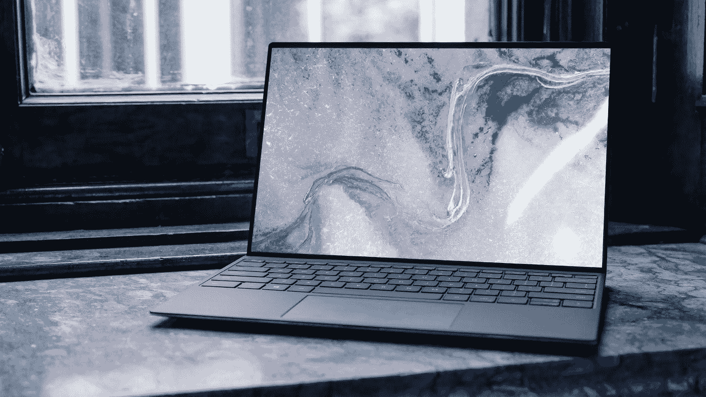

# 如何用 Javascript 在上传前预览图片

> 原文：<https://medium.com/geekculture/how-to-preview-images-before-upload-with-javascript-3420e3cd2f1c?source=collection_archive---------15----------------------->



Photo by [XPS](https://unsplash.com/@xps?utm_source=medium&utm_medium=referral) on [Unsplash](https://unsplash.com?utm_source=medium&utm_medium=referral)

您有一个输入类型文件，并希望在选择图像后动态预览它。

在本文中，我们将探讨如何借助普通 JavaScript 实现这一点。

首先，让我们仔细看看必要的 HTML 标记。

```
<input type=”**file**” **accept**=”.jpg, .jpeg, .png” id="file-upload"> 
```

正如您所注意到的，输入类型必须设置为 file。最好也设置*接受*属性的值。插入值以接受属性的其他有效方法是:`image/jpg, image/gif`或简单的`image/*`。后者允许带有任何图像扩展名的文件上传到页面上。

img 标签中的`*file-preview*`的 Id 属性将被用于获取 Javascript 元素，以便我们在其中加载图像。

有了这些之后，我们可以过渡到 JavaScript 部分，在这里我们需要首先获得输入元素，然后向它添加一个事件监听器。

```
const input = document.getElementById(‘file-upload’);input.addEventListener('**change**', previewPhoto);
```

*更改*每次用户选择图像时，事件监听器都会触发。这正是我们希望我们的图像在页面上可见的时候。正是为了这个目的，将调用名为**预览照片**的函数表达式。

```
const **previewPhoto** = () => {
    const file = input.files;
    if (file) {
        const fileReader = **new FileReader**();
        const preview = document.getElementById('file-preview'); fileReader.onload = event => {
            preview.setAttribute('src', **event.target.result**);
        }
        fileReader.**readAsDataURL**(file[0]);
    }
}
```

在这个函数表达式中，我们创建了一个`new FileReader`对象，它使我们能够读取存储在用户机器上的文件，这些文件是用户通过输入类型文件选择的。

一旦对象被加载，`*event.target.result*`将包含作为被调用的`readAsDataURL`方法的结果的可加载 url。这个 url 又可以作为所需对象的`setAttribute`方法中的第二个参数传递。

最后，我们可以期望我们的 JavaScript 看起来像这样:

```
**const** input = document.getElementById('file-input');**const** previewPhoto = () => {
    const file = input.files;
    **if** (file) {
        **const** fileReader = new FileReader();
        **const** preview = document.getElementById('file-preview');fileReader.onload = function (event) {
            preview.setAttribute('src', event.target.result);
        }
        fileReader.readAsDataURL(file[0]);
    }
}input.addEventListener("change", previewPhoto);
```

假设我们在发生*改变*事件后调用函数表达式而不是函数。因为提升在 JavaScript 中是如何工作的，所以在初始化的表达式下面有我们的事件监听器是很重要的。

现在您可以成功地预览屏幕上的图像后，它已被选中。