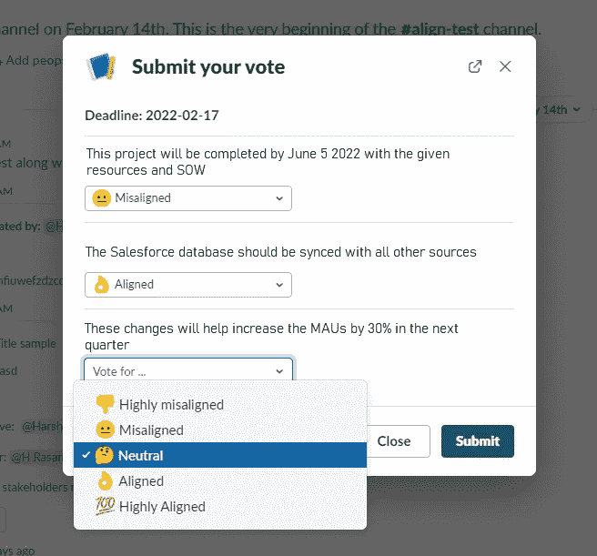
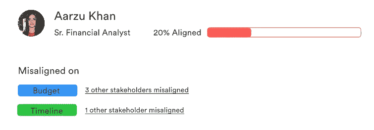
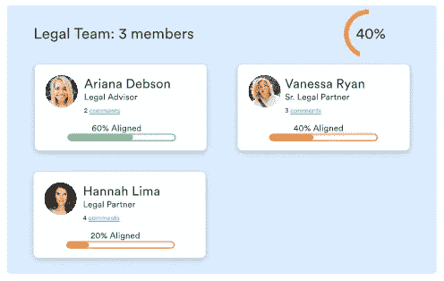

# 如何跑‘对齐冲刺’？

> 原文：<https://medium.com/geekculture/how-to-run-alignment-sprints-64aa2091dbb8?source=collection_archive---------10----------------------->

## “混合团队和远程团队的协调”系列的第 2 部分

在[上一篇文章](https://bootcamp.uxdesign.cc/how-alignment-sprints-can-help-remote-teams-stay-in-sync-f64aa8347ec9)中，我们看了一下团队之间的不一致是如何导致跨职能团队项目的生产力损失的。我们简要讨论了“对齐冲刺”如何帮助同事更快达成共识。在远程/混合工作场景中，随着每个人日历上会议数量的增加，找出一个系统来帮助解决离线设置中的不协调是至关重要的。这个可以被产品、营销、销售、设计——几乎一个企业的所有团队(甚至创业公司)使用。

“协调冲刺”可以分为 3 个部分:

1.  **提案文档和团队脉搏**(本文重点)
2.  角色和职责检查([将在下一篇文章](/geekculture/team-alignment-sessions-should-focus-more-on-clarifying-less-on-convincing-3d0de7eeab2d)中介绍)
3.  决策日志([将在下一篇文章](/geekculture/team-alignment-sessions-should-focus-more-on-clarifying-less-on-convincing-3d0de7eeab2d)中介绍)

在这篇文章中，我们将简要地谈到标记不一致，维护决策积压和整个团队的一致性健康。然后，我们将深入探讨如何创建和推广您的提案，以捕捉跨职能团队的脉搏/一致性。到本文结束时，您应该能够通过以下过程创建简短的异步对齐建议。

Steps to capture in an Alignment Sprint

# 校准运行状况积压

在我们开始实际的提案创建之前，让我们花点时间来设置流程。sprint 领导者(可以是领导 Sprint 的任何人——产品/项目经理、设计经理、营销经理)首先创建一个协作文档(Google Doc、Box Note、Confluence page 等)。)并与相关利益相关方分享。

*   请利益相关者标记出他们目前认为不一致的或需要跨职能团队做出决策的所有项目。
*   一旦列表生成，sprint leader 将相似的项目聚集起来，看看是否有任何主题出现。这应该是 1 天的离线练习。该列表基本上捕获了团队的一致性健康状况。
*   从当前 sprint 的列表中集体确定 4 个项目的优先级，并指派负责人创建“协调提案”。所有者可以是自我提名的，也可以是由 sprint 领导者指定的。

Sample Misalignment Log

# 创建并推广协调提案

获得最大利益相关者参与的诀窍是提供一个简短的背景，并特别指出你需要调整或决策的地方。如果你想从主管/高级主管级别的人那里获得脉搏，这就变得更加重要。他们每天都会收到对多项计划发表意见的请求，并且可能需要与您的提案相关的背景信息。

1.  在您选择的工具(Google Docs、Confluence、Slack 等)中生成标准提案模板。)当你的团队养成进行直线冲刺的习惯时，这会让你的眼睛看起来更舒服。
2.  模板应该将所有相关的上下文或简短的问题放在顶部，然后是要协调的主题列表或要做出的决策。
3.  尝试将调整或决策的主题保持在 3-5 个之间。
4.  如有必要，允许人们匿名提交他们的回答。
5.  结盟和决策并不总是非黑即白的——它们通常落在一个光谱上。以允许细微差别的方式设计响应机制。5 分制(高度不一致、不一致、中性、一致、高度一致)通常效果最佳。
6.  确保提案有时间限制。截止日期的设置应该让每个人都有机会做出回应，但同时也向利益相关者发出紧急信号。

Sample template built in Slack. Similar templates can be created anywhere (Google Docs, Confluence etc.)

[这里](https://coda.io/@lshackleton/two-way-writeups-coda-s-secret-to-shipping-fast#:~:text=I%20believe%20the%20next%20phase,a%20structured%20and%20interactive%20conversation.)是 Coda 如何创新了双向写作的过程，这是他们取代单向幻灯片的系统。

采用低接触校准提案的目标有三点:

1.  了解你的提案中最不一致的点/主题。如果你准备做一个更广泛的陈述，这有助于你在这些方面改进你的提议。

Sample misaligned themes to address

2.了解哪些利益相关者的偏差更大。为这些特定的问题安排后续工作可能会有所帮助。

Example of an individual stakeholder’s pulse

3.帮助创建团队会议的具体议程或定期起立讨论不一致。

Example of a low-touch team pulse

# 成功完成校准冲刺的其他技巧

## 保持调整建议的低调

任何类型的异步决策都有三个参与层次:把脉、写评论、详谈。提案应允许参与者以脉冲或评论的形式提供反馈。保持低接触鼓励跨职能团队的更多参与。

## 允许匿名回复

当利益相关者在公共场合(缩放电话或协作文档)被问及他们的意见时，他们有时可能只是随波逐流，或者倾向于同意房间里最响亮的声音。**偏好伪造**是一种在感知到的社会压力下歪曲自己需求的行为，例如，当我们告诉晚宴的主人我们很喜欢食物，但实际上我们发现它很淡。

为了减轻这一点，允许匿名回应，这样你的利益相关者就有了提供真实反馈和表达矛盾的心理安全感。

## 轮换 sprint leader 职责

标记不一致、创建提案和获取利益相关者脉搏的过程确实需要一些监控。因为它被设计成一个低接触的过程，所以管理是最小的。为了确保“对齐冲刺”实践融入更广泛的团队文化，可以指派一个人轮流负责整个冲刺。

# 未完待续…

在本文中，我们研究了收集不对齐并生成“对齐建议”的最佳实践。如果你觉得你的团队没有对齐，试着和团队一起进行一次对齐冲刺。在我的[上一篇文章](https://bootcamp.uxdesign.cc/how-alignment-sprints-can-help-remote-teams-stay-in-sync-f64aa8347ec9)中，查看“校准冲刺”过程的简要概述。

在[的下一篇文章](/geekculture/team-alignment-sessions-should-focus-more-on-clarifying-less-on-convincing-3d0de7eeab2d)(调整系列的第 3 部分)中，我们将通过为您的利益相关者分配某些反映[快速框架](https://www.bain.com/insights/rapid-tool-to-clarify-decision-accountability/)的角色来使调整冲刺更加有效。我们将通过讨论决策日志以及它们如何有助于跟踪某个决策中的因素来结束这个由 3 部分组成的系列。

欢迎在 LinkedIn 上与我联系，讨论什么有助于保持你的团队一致，以及你如何解决不一致的问题。