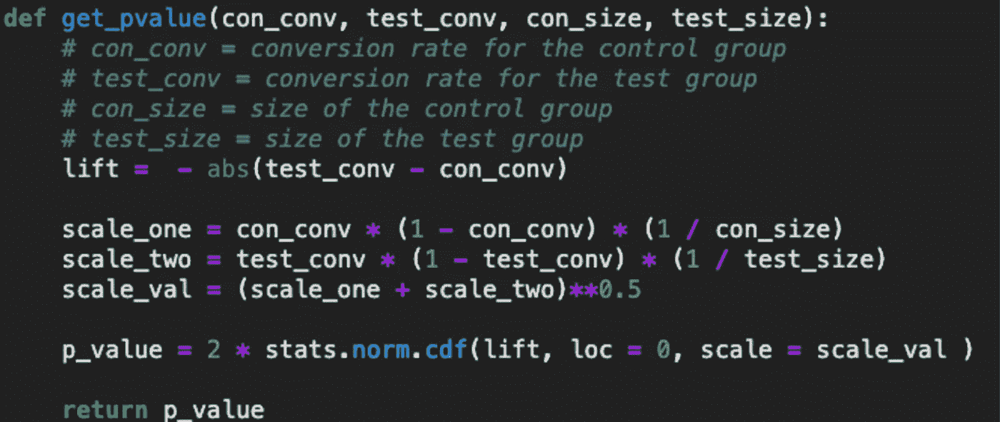

# 如何运行 A/B 测试？

> 原文：<https://medium.com/geekculture/how-to-run-an-a-b-test-3b581afe2eb9?source=collection_archive---------33----------------------->

Source: [https://www.optimizely.com/optimization-glossary/ab-testing/](https://www.optimizely.com/optimization-glossary/ab-testing/)

在必应，一名员工提出的一个小标题变化被认为是低优先级的，并被搁置了几个月，直到一名工程师决定做一个快速的在线控制实验——A/B 测试——来测试它。测试显示，这一变化使收入增加了惊人的 12%。这最终成为必应有史以来最好的创收创意，价值 1 亿美元。微软分析与实验团队的负责人 Kohavi 和哈佛商学院教授 Thomke 说，这一经历说明了为什么采取“一切都要实验”的方法是至关重要的。

让我们了解一下 A/B 测试是如何工作的。A/B 测试是一种比较某个东西的两个版本以找出哪一个表现更好的方法。A/B 测试可用于测试各种场景，例如:

1.哪个版本的网页导致更高的转化率？

2.哪封营销电子邮件能提高用户参与度？

3.这种药对治疗某种疾病有效吗？

还有更多！

对于 A/B 测试来说，只有那些用户受到单独影响的场景才是好问题。如果用户之间存在网络效应，很难理解测试的影响。一个例子是对约会应用的用户进行 A/B 测试，因为他们的行为涉及与其他用户的匹配和互动。

运行一个成功的 A/B 测试需要仔细考虑和选择一个响应变量，这将有助于理解被测试的变化的影响。理想情况下，响应变量应该是 KPI 或另一个易于测量的相关指标。

让我们考虑一个应用程序的例子。请参见下面两个应用程序的数据示例。第一个是列出所有应用程序用户的人口统计数据。第二个显示的是那些看到付费墙的用户。“购买”列指示用户是否进行了购买。并非所有应用程序用户都会看到付费墙，因为他们可能只使用了基本功能，或者没有充分使用该应用程序。

Demographic Data²

Paywall Data²

合并这两个数据集将为我们提供一个看到付费墙的所有用户的列表。购买栏表明他们是否购买。

应用团队正在考虑消费者付费墙的两种不同的消息选项，以了解哪种选项会产生更多收入。

**当前付费墙:**“我们希望您喜欢使用我们的应用。考虑成为优先会员以访问所有功能。”

**提议的付费墙**:“要访问应用程序的所有功能，请成为优先会员。”

在运行 A/B 测试之前，他们需要决定测试的 KPI。运行 A/B 测试的主要目标是增加收入。根据服务类型、季节性和不同的价格点，总收入可能会有很大差异。当收入变化很大或取决于多个因素时，建议选择一个比总收入粒度更细但又能很好地代表收入的指标。在应用程序示例中，我们将考虑“付费墙视图到购买转化率”作为评估我们的 A/B 测试的指标。测试中还可以考虑其他指标。重要的是选择一个粒度小且在一段时间内相对稳定的指标。

app 数据中，基线转化率为 3.47%。

每日购买量= 3181.8

每日付费墙浏览量= 91731.9

**转化率** =每日购买量/每日付费墙浏览量= 0.0347

既然我们知道了基线转换率，我们需要决定测试灵敏度，即转换率的增加量被认为是有意义的。敏感度值的选择取决于业务环境、提议变更的类型以及所选 KPI 的历史变化。对于应用程序来说，充分了解每日购买和每日付费墙视图的历史变化有助于确定敏感度。我们可以计算不同敏感度值的每日购买量的增加。

与推出带有促销活动的新服务相比，应用程序的小变化(如付费墙信息的变化)可能会给我们带来较小的提升。出于本练习的目的，我们将选择 10%的敏感度值。

一旦我们选择了灵敏度值，我们就需要计算测试的控制和测试组所需的样本量。样本大小取决于各种参数，如置信度、统计功效和测试的灵敏度。置信水平是当零假设为真时不拒绝零假设的概率。置信区间的常用值是 0.90 和 0.95。统计功效是当零假设为假时，找到具有统计意义的结果的概率。我们将使用 0.80 的统计功效。详细解释置信水平和统计能力超出了这篇文章的范围。

我们可以使用 python 函数来计算样本大小。见下面用 python 实现的函数。

Sample size function in python²

Power function in python²

置信水平为 0.95，统计功效为 0.80，基线转换率为 3.47%，提升转换率为 3.81%，我们得到的样本量为 45，788。当不可能有这样的样本量时，将会有实验。有一些方法可以减少测试所需的样本量。

1.选择可变性较低的观察单位。在这个例子中，如果我们选择收入而不是转换率，我们的样本量会更大。

2.排除与流程/变更无关的用户。在这种情况下，我们排除了从未见过付费墙的用户。包括它们会带来更多的可变性，并需要更大的测试样本量。

3.选择较低的置信水平和统计功效值。这样做会减少样本量。

下一步，我们需要挑选在规模和随机性上具有可比性的对照组和测试组。可以通过比较用户特征来检查随机性，例如两组之间的人口统计、用户行为。当选择的组不是随机的时，不可能将 KPI 中的变化归因于被测试的变化。一旦我们检查了控制组和测试组的随机性，我们就可以运行 A/B 测试。

运行 A/B 测试后，让我们看看两组的转化率，以比较结果。

Source: DataCamp. V refers to the test group. Conv is the conversion rate.

测试组的转换率较高，但我们希望检查观察到的差异是否具有统计学意义。为了检查统计显著性，我们从零假设开始，即对照组和测试组之间没有差异。为了接受或拒绝零假设，我们计算 p 值。

不用说太多细节，我们可以记住，如果 p 值小于 0.05，我们可以拒绝零假设，得出两组不同的结论。计算这个 A/B 测试的 p 值，我们得到的值是 4.25e-10。因此，我们可以拒绝零假设，并得出结论，与对照组相比，试验组的转化率有显著提高。可以使用下面的函数计算 p 值。

p-value function in python²

A/B 测试结果可总结如下。

A/B test results

我们也可以考虑一些情节来形象化你的结果。一些有用的图:

1.显示两组转化率的图

2.显示估计升力和置信区间的图。

一旦我们确定观察到的提升具有统计学意义，我们就可以继续在整个用户群中实施变更。实施变更后，监控 KPI 以确保我们观察到预期的 KPI 变更是一个很好的做法。KPI 中的异常变化可能表明在如何为一组用户实施变化方面存在问题。

运行 A/B 测试是快速获得业务问题答案的好方法。一个很大的优势是，如果我们运行测试，它不工作，只有一小部分用户受到影响，我们可以迅速恢复到旧的策略。

**参考文献**

1.https://www.hbs.edu/faculty/Pages/item.aspx?num=53201

2.数据营 python 课程中的客户分析和 A/B 测试。[https://learn . data camp . com/courses/customer-analytics-and-ab-testing-in-python](https://learn.datacamp.com/courses/customer-analytics-and-ab-testing-in-python)

3.https://hbr.org/2017/06/a-refresher-on-ab-testing

4.[https://www . optimize ly . com/optimization-glossary/a b-testing/](https://www.optimizely.com/optimization-glossary/ab-testing/)