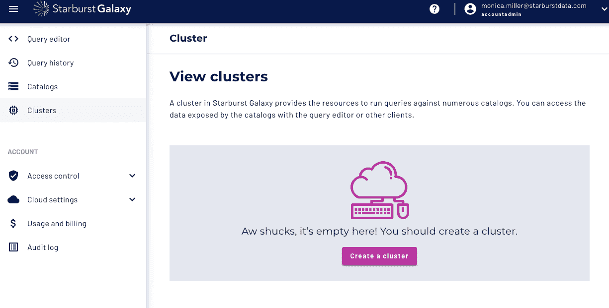
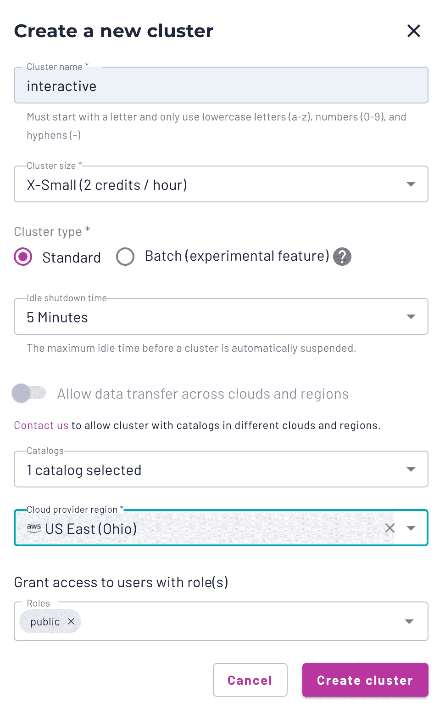
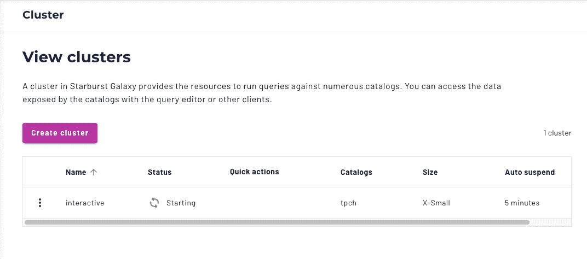
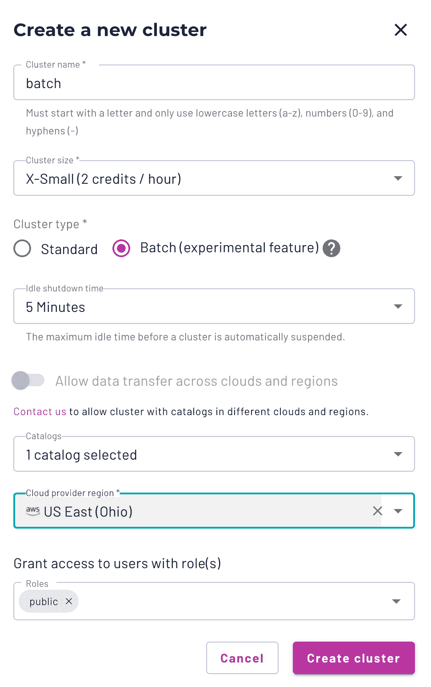
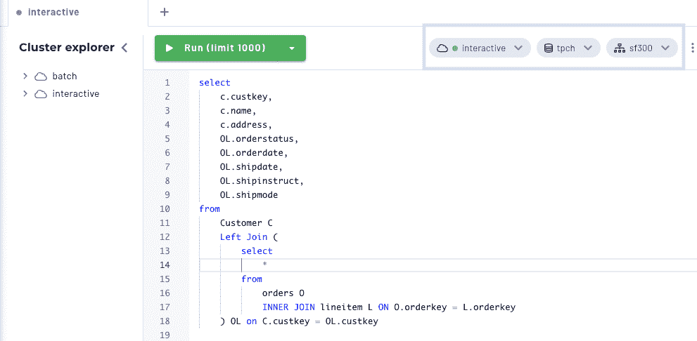
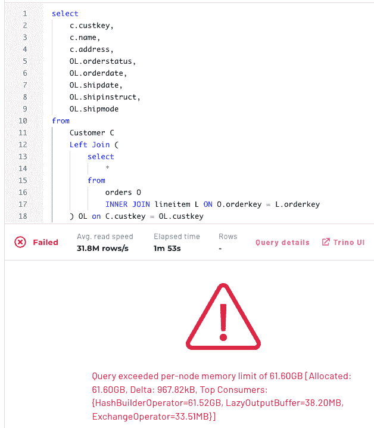
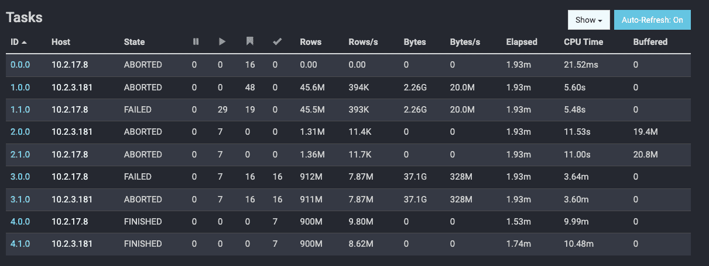
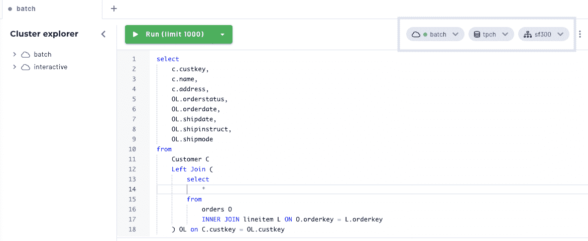

# 如何使用星爆星系运行批处理

> 原文：<https://medium.com/geekculture/how-to-run-batch-processes-using-starburst-galaxy-e4594ae456e?source=collection_archive---------18----------------------->

这是关于 Trino 如何支持交互式和批处理用例的 2 部分博客的第 2 部分。在 [*第 1 部分*](/geekculture/etl-vs-interactive-queries-the-case-for-both-9966e5c14073) *中，我们探讨了为什么一个组织需要交互和批处理能力，以及为什么 Starburst 是使用同一平台运行这两者的最简单方式。在第 2 部分中，我们将详细讲解如何使用 Trino 和 Starburst Galaxy 设置批处理作业。*

我非常鄙视惊喜。不是“我给你买了只小狗！”惊喜，但“等等，这不是应该失败”的惊喜，引发了困惑和心碎的特殊组合。我讨厌我身体的反应方式，我讨厌心跳加速，我讨厌手出汗，我讨厌胃里的压力结，它奇迹般地出现在我的大脑开始浏览咒骂的同时。有些开发人员为了刺激肾上腺素而活，但我不是。我喜欢我的数据管道，就像我喜欢我的吐司一样:简单且没有错误。

唉，一个没有失败的世界不是数据工程师生活的世界。事情总会发生，有时作业会失败，而且绝对没有事后分析的原因来解释为什么作业在一次运行中有效，而在下一次运行中无效。有时，我们比其他人更不幸，失败的工作可能是支持每天早上都会被仔细检查的管理层欺诈趋势仪表板。这种失败是痛苦的。别问我是怎么知道的。

Trino 是我最喜欢的交互式查询引擎，因为它速度快、基于成本的优化和 ANSI SQL 支持。但是，历史上没有查询失败恢复，因此如果欺诈趋势管理级别仪表板有任务失败，第二天早上就会出现空仪表板。虽然从统计上看，使用适当的 Trino 设置不太可能出现故障，但是查询和任务级别上的容错性的历史性缺失使得赌注有点像玩火。

好消息！由于最近实施了新的容错执行架构和粒度任务重试，特别是针对 ETL/ELT 工作负载，所以添加了 guardrails，以便您可以轻松地利用 Trino 进行长时间运行或批处理查询。如果你想了解更多关于 Trino 实现的知识，我强烈建议你去看看这个 trino-tastic [博客](https://trino.io/blog/2022/05/05/tardigrade-launch.html)。作者深入研究了 Trino 在启用和禁用容错时的一些测试结果，结果令人震惊。

我知道我们都想知道，Starburst Galaxy 是否也获得了一些关于 ETL/ETL 工作负载的功能，以使我们的生活更加轻松？**剧透警告**:是的*的确如此，而且很棒*。在这篇博客中，我想展示在 Starburst 的完全托管云产品中实现批量集群的革命性新功能。

# 星暴星系

作为一个好奇的人，基于我在 Trino 博客上读到的信息，我使用 [TCP-H](https://www.tpc.org/tpch/) 数据集进行了一次实验，特别是预加载到 Starburst Galaxy 中的 SF300 模式。我利用我 7 年级时的科学展知识(和谷歌)来确保我准确地表达了科学方法，并因此得出了下面的问题陈述。

**问题陈述:** *当资源受限时，交互式集群上的 TPC-H 查询与批处理集群(X-Small 集群)上运行的相同查询相比，性能如何？本质上，以批处理模式运行有什么好处？*

我想正确的“术语”是问题陈述，但是你知道，语义。为了分析我们的最终结果，我们将在 Starburst Galaxy 中创建两个集群，并在环境中运行一些查询。如果你愿意跟我一起做，唯一需要的实验前设置就是[创建一个星爆银河账号](https://www.starburst.io/platform/starburst-galaxy/?metadata_cid=742067&utm_campaign=galaxy2.0&utm_medium=cpc&utm_source=google&utm_type=brand-awareness&utm_term=starburst%20galaxy&utm_campaign=MD_GA_starburstgalaxy_LP_Starburst-Galaxy_LP_AMER-Galaxy-BRAND-1a_20220329172526&utm_source=adwords&utm_medium=ppc&hsa_acc=5176009545&hsa_cam=16704063502&hsa_grp=135728202180&hsa_ad=590041757929&hsa_src=g&hsa_tgt=kwd-352912418347&hsa_kw=starburst%20galaxy&hsa_mt=p&hsa_net=adwords&hsa_ver=3&gclid=Cj0KCQjwma6TBhDIARIsAOKuANxVdaJZfKuEC0x509xB2mCQOLQYW5rs83RYTW6h2cRjyChBE6JejQ0aAor5EALw_wcB)。

# 在星爆星系中创造星团

为了完成我们的实验，我们将首先在星爆星系中创建一个交互式集群和一个批处理集群。两个集群都将使用 TPC-H 目录(这是为我们预定义的),并将针对美国东部(俄亥俄州)AWS 地区进行定义。我将在下面向您介绍集群创建的步骤，并且我还会以视频格式演示我自己的集群创建。

## 如何创建交互式集群

首先，登录。如果这是你的第一次，哇哦！恭喜你，我很高兴能和你一起踏上这个旅程。登录后，您应该会看到查询编辑器。要创建集群，请转到左侧面板上的**集群**窗格。这将把你带到一个页面，在顶部有一个 ***创建集群*** 按钮。你猜对了，这就是我们创建集群的地方。

我们的第一个集群应该被命名为可识别的交互式查询，我将我的集群命名为 *interactive* 。虽然我们将使用 X-Small 集群，但不用担心，因为它们只有 2 个信用点/小时，而《星爆银河试玩》有价值 500 美元的信用点，所以还有很多剩余的信用点可供更多探索。其他配置如下。

**集群大小:** *X-Small (2 信用点/小时)* **集群类型** : *标准* **空闲关闭时间** : *5 分钟* **目录** : *tpch* **云提供商地区:** *美国东部(俄亥俄州)*

点击创建集群按钮，然后*瞧*！第一个被创建。您还将看到集群正在启动，以便能够被查询。

## 如何创建批处理集群

创建批处理集群与创建交互式集群非常相似。我们将从再次单击左上角的“create cluster”按钮开始。用某种用于批处理的标识符来命名这个集群，我将 mine *命名为 batch* 。我们希望集群配置与交互式集群相同，除了集群类型，它将是批处理。

***集群大小:*** *X-Small (2 信用点/小时)*
*集群类型:* *批量* ***空闲关机时间:*** *5 分钟* ***目录:****tpch*

*双 Voila！*我们现在已经创建了两个集群，可以继续前进了。

## 查询创建

我现在想使用这些 X-Small 集群来运行一个标准查询并查看结果。我以非常交互的方式创建了这个查询，因为我开始摆弄星爆星系中已经可用的数据，并为我的假设场景开发一个用例。同样为了标准化，我在两个不同的集群上使用相同的目录运行相同的查询。集群之间的唯一区别是集群类型，交互式集群是标准集群，而批处理集群是批处理集群。

我制作了一个视频，展示了我的实验过程，如果你喜欢直观地跟随(并彻底感到惊讶)的话。

## 交互式聚类结果

我将首先在交互式集群上运行这个查询，并查看结果。为此，我导航到查询编辑器，并在右上角选择以下下拉菜单。

***集群:*** *互动*
***目录****:tpch*
***模式:*** *sf300*

接下来，点击运行。

失败！Oof。我们遇到了一个任务级失败，最终导致我们的查询失败。查看 Trino UI 链接，它显示了查询失败的阶段、堆栈跟踪错误消息和每个任务。我真的很喜欢 Trino UI，我强烈建议探索它所提供的所有有益信息。

*错误信息*应该不会让我们感到惊讶，因为它与我们在 Galaxy Query Editor 中提到的相匹配。

**错误类型:资源不足**

**错误代码:超出 _ 本地 _ 内存 _ 限制(131079)**

向下滚动到概述的底部，找到特定于任务的信息，这是我看到的内容。

请注意，所有任务 ID 都有一个 X.X.0 配置。任务标识符的格式为:*阶段 id .任务 id .重试 id。*由于 *retry-id 的*都是 0，失败任务状态下没有重试发生，这中止了整个查询。

## 批量聚类结果

使用右上角的集群选项，从查询编辑器中将集群从交互式切换到批处理，现在我将运行相同的查询，并查看我们会得到什么结果。

***集群:*** *批次* ***目录****:tpch* ***模式:*** *sf300*

请敲鼓…..

嗯，嗯，嗯……看那漂亮的查询信息。虽然花费了相当多的时间，但是我们可以看到查询成功地回答了我们的问题。那么，交易是什么？让我们再次查看我们的 Trino UI，并将失败查询的结果与现在进行比较。

在打开 Trino UI 并向下滚动到 tasks 之后，有一些明显失败的任务，但是由于 task retry 实现，查询可以继续。下面是为完成查询而执行的一些任务的一个小节。如果我们看 1.0.0，说明原来的尝试失败了。然后，1.0.1，在 1.0.0 失败后恢复的任务重试，完成了。这再次归功于专门实现的出色功能，这些功能使批处理集群的实现变得更加容易。

## 你如何选择批处理还是交互式集群？

希望在和我一起完成这个实验后，我们已经确定这个新功能非常棒，并且可以在执行 ETL/ELT 工作负载时开辟新的可能性。但是，您如何知道极限是什么，或者何时选择正确的集群类型呢？秘诀在于了解您的数据并理解其中的利弊。它归结为四个主要因素，在决定哪一个适合你时必须考虑:速度、自动化、成本和可信度。如果你想了解更多关于这些因素的信息，我邀请你去[看看我的文章](https://blog.starburst.io/etl-vs-interactive-queries-the-case-for-both)权衡每一点的利弊。

秘密在这里！如果您不小心选择了错误的选项，集群可以很容易地更新，这加强了可选性的重要性以及拥有一种可以在交互式查询和批处理查询之间轻松交换的技术的好处。

## 星爆星系:

在数据管理方面，还有许多其他功能增强了 Starburst Galaxy 改变生活的能力。我最喜欢的包括:

*   提高开发人员的效率
*   专家支持和领域专业知识
*   查询历史/日志记录功能
*   通过怠速停机功能控制成本

如果你想分享你的星爆银河体验，或者你自己的实验结果，请在 Trino 论坛上与我们联系。我们希望听到您的反馈。您可以用高达 500 美元的免费积分免费试用 Galaxy。