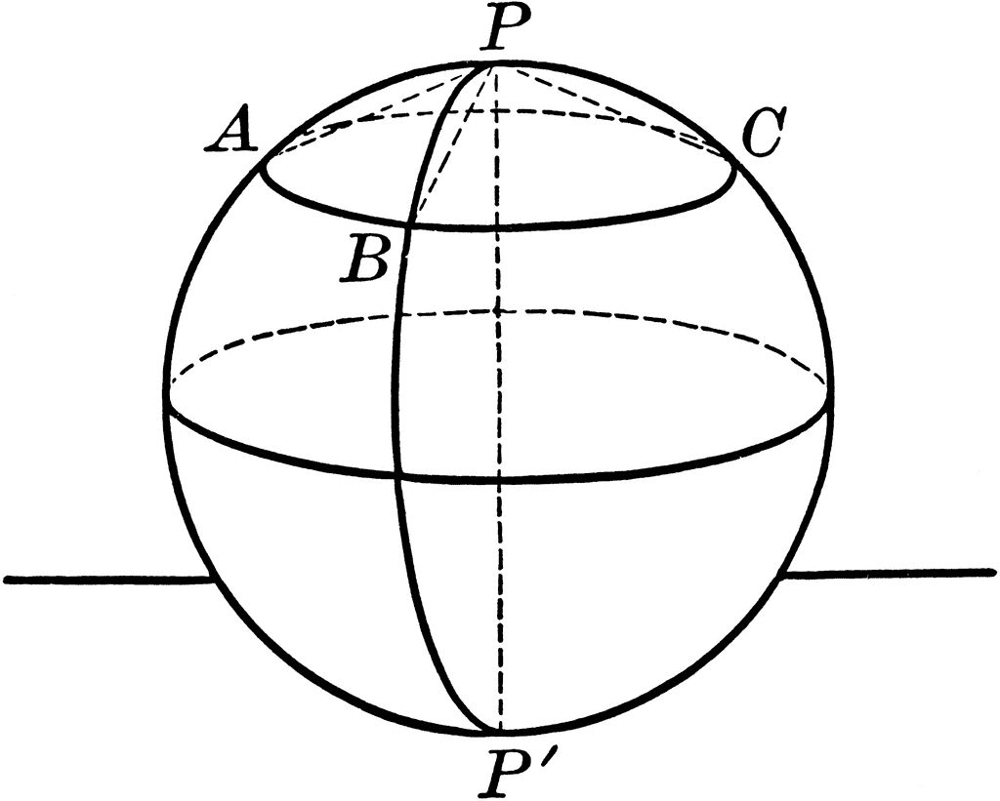
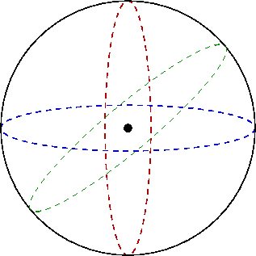

# 如何用球面几何运行世界

> 原文：<https://medium.com/geekculture/how-to-run-the-world-with-spherical-geometry-3365482e5ad0?source=collection_archive---------9----------------------->

## 茎中的宝石:球形几何学导论

谁掌管世界？女生们！(如碧昂斯所言。)但是，我个人并不擅长跑步，所以我想知道“跑”完世界所需的最短距离。特别是，给定地球上的任意两点(为了简单起见，我们假设是一个球体)，我需要知道它们之间的最短路径是什么，这样我就不必跑太长时间。(是啊，是啊，我应该增强我的耐力，*不管怎样*，我不参加奥运会。)

虽然乍一看这个问题似乎并不那么难，但它比看起来要难一点！不幸的是，我们不能在任何两点之间画一条平坦的直线，因为我们在一个球体上(我肯定不能从一点挖到下一点)。那么，我们如何着手回答这个问题呢？

幸运的是，我们有一些帮助！你可能猜到了，我们不是第一个问这个问题的人。这是导航和探索中的一个重要概念，并且位于**球面几何**的区域，这个领域现在已经被研究了几千年(所以我们远远落后)。球面几何就像它听起来的那样:一个球体的二维表面的几何形状(意味着我们现在并不真正关心球体内部有什么)。这种几何学为探险家提供了成功绘制地球地图的工具，也为天文学家提供了精确追踪恒星和行星路径的工具。你的假期也要感谢球面几何学——它是每天规划飞机航线的关键！

为了开始回答这个最短距离的问题，我们需要从头开始。现在，传统几何(又名欧几里得几何)是围绕两个基本对象建立的:点和线。所以，和其他几何一样，我们要问几个核心问题！

## **设置**

首先，在球面几何中，点的定义是什么？仍然是一个正常的点——只是球体表面上的一个地方。别担心！那么，几何中的直线是什么？原来没有这回事！请记住，我们是在球面上操作，因此曲面上的任何线都将遵循球面的曲线。但是，在欧几里得几何中，我们使用直线段来计算任意两条直线之间的最短距离。如果我们没有直线，我们该怎么办？！

耐心点，小蚱蜢。我们可以解决这个问题。为此，让我们在一个球体上随机选取两个点。让我们快速定义一条**测地线**为两点间最短的路径，也就是我们想要找到的。(我们这样定义只是为了方便，不要被这个词吓跑了！)现在，我们可以旋转我们的球体，使得其中一个点是北极(下图中的点 P)。请注意，这种旋转不会改变*任何*距离——我们所做的只是从不同的角度看球体。

Diagram of points and poles on a sphere

那么，如果另一个点不是南极点(点 P’)，很明显最短路径只是从 P 到第二个点的向南的弧线。例如，如果上图中的第二个点是 A、B 或 C，您可以看到如何简单地沿着球体的曲线获得从第一个点 P 到第二个点的最短路径。

但是为什么南极 P '不在此列呢？想一分钟。如果你愿意，这里有个提示:P 和 P '之间有多少个测地线？

对提示的回答:无限多！你可以从顶点 P 向任何方向走，到 P '的路径都是一样长的，所以从技术上来说它们都是最短的路径。(特别地，每个路径长度等于与球体半径相同的圆的一半周长。)既然有无穷多个方向，就有无穷多个测地线！我们称这两对完全相反的点为**对跖点**。从现在开始，我们将忽略这些对，因为，正如你所看到的，它们之间的最短距离路径的问题不是非常有趣。

排除这种情况，我们可以看到球面上任意两点都有唯一的测地线！但是，我们还没有给出一条直线的精确模拟。好吧，如果我们回头看看我们的示例路径，我们可以看到每个弧形路径都位于与球体半径相同的圆上，其中圆的方向取决于第二个点相对于北极(第一个点)的位置。这些圈被称为**大圈**(而且确实很棒！).你也可以把它们想象成可以围绕一个球体画出的最大的圆。一个著名的大圆的例子是赤道！这是其他大圈的一个很好的形象化的例子:

Three great circles

让我们回顾一下:我们已经知道点是相同的，欧几里得几何中的直线的等价物是球面几何中的大圆！所以，要找到球体上两点之间的最短距离路径，首先画出这两点所在的大圆。那么，最短距离路径是连接两点的最小曲线(位于这个大圆上)。因此，通过定义基本工具，我们已经在球面几何中涵盖了所有的内容。但是其他物体呢？角度？形状？哎呀，对于这些问题，我将留给你一个悬念，这将在下一篇专栏文章中解决(抱歉不抱歉)！与此同时——尽管有悬念——你现在可以有效地运行世界！如果你跑得够快，也许你可以偷偷在奥运会上拿到一枚奖牌。祝你好运！

下次见！如果您对此感兴趣，请务必查看下一篇专栏文章！如果你有任何问题或意见，请发电子邮件到 apoorvapwrites@gmail.com 给我。

要成为第一个听到我所有新文章、最近事件和最新项目的人，请务必订阅我的简讯: [**信？我几乎不认识她！**](http://apoorvapanidapu.substack.com/)

*这个* [*专栏*](https://apoorvapanidapu.medium.com/list/gems-in-stem-e5f24767d315) *，STEM 中的宝石，是一个了解各种 STEM 主题的地方，我发现这些主题令人兴奋，我希望也会让您兴奋！它总是会被写得相当容易理解，所以你不必担心没有背景知识。然而，它偶尔会在接近尾声时变得更高级。感谢阅读！*