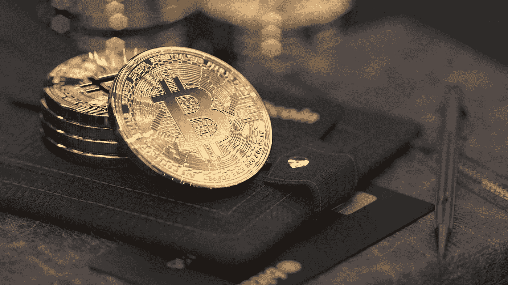

# 如何设置加密钱包？一个关于建立加密钱包的博客想法

> 原文：<https://medium.com/geekculture/how-to-setup-a-crypto-wallet-a-blog-idea-on-setting-up-a-crypto-wallet-cdd0309509f5?source=collection_archive---------17----------------------->

刚接触加密货币，想设置一个钱包？看下面！

当你第一次开始投资加密货币时，你可能做的第一件事就是在交易所购买它们。然而，设置自己的钱包很重要，这不仅是出于安全目的，也是因为一些交易所不允许你转出(也不能在某些交易所将你的加密货币兑换成法定货币)。如果你决定设置自己的钱包，你需要确保你这样做是安全的。

Photo by [Executium](https://unsplash.com/@executium?utm_source=medium&utm_medium=referral) on [Unsplash](https://unsplash.com?utm_source=medium&utm_medium=referral)

# 如何设置加密钱包的基础知识

你最近发现加密货币了吗？也许你听说过比特币，但你并不完全确定它是如何工作的。也许你已经涉足加密货币领域，但你正在寻找一个新的钱包，让它更容易管理你的资金。如果您不确定如何设置加密货币钱包，那么您来对地方了！在本文中，我将讨论如何设置加密货币钱包的基础知识。

您设置加密钱包的方式因您使用的钱包而异，但基本原则对所有钱包都是一样的。第一步是注册您想要使用的钱包，或者如果您的设备上已经有钱包，则进行安装。接下来，您需要输入您的个人信息，包括您的 ID、姓名和电子邮件地址。有些钱包还会要求你上传一张身份证或脸部照片。接下来的步骤取决于您的钱包提供商。按照屏幕上的说明完成钱包设置。

很多人对如何设置加密钱包感到非常困惑。你怎么能有一个甚至不是实物形式的钱包，而只是几行代码呢？嗯，实际上很简单，但是可能有点技术性。让我们来看一下如何设置加密钱包的步骤，以及在开始之前需要了解的内容。第一步是选择一个符合你需求的钱包。有一些是为几乎任何情况下，而其他人是为特定用途。例如，如果你想存放 ETH，你需要一个为 ETH 打造的钱包。第二步，下载安装钱包。该钱包将在该公司的网站上提供，您需要将它下载到您的计算机上。您可以在 Mac、PC 或 Linux 上这样做。现在您已经安装了钱包，您需要选择一个位置来存放您的钱包。我们强烈建议您将加密货币存储在硬件钱包中。硬件钱包是存储加密货币的物理设备，允许您使用只有您自己知道的 PIN 码来访问加密货币。所以，去拿起一个硬件钱包，把你的加密货币存储在上面。

Photo by [Jievani Weerasinghe](https://unsplash.com/@jievani?utm_source=medium&utm_medium=referral) on [Unsplash](https://unsplash.com?utm_source=medium&utm_medium=referral)

# 获取加密钱包的步骤

加密货币是当前的时尚。他们在每个人的脑海里，每个人都想知道如何才能得到他们。设置加密钱包不像设置普通钱包那么简单。有不同种类的钱包可供选择，有些是免费的，有些是你需要付费的，但有一点是所有钱包都通用的，那就是你需要极其小心地设置你的钱包。您需要您的私钥、密码、种子词等。来设置你的钱包。有很多钱包可用，Jaxx，Exodus，Coinomi 等。基于你的需求，你可以选择一个。你需要在一个可靠的交易所开一个账户，在那里你可以把你的常规货币换成你选择的加密货币。以下是获取加密钱包的步骤。

随着加密世界变得越来越受欢迎，新手们对投资加密越来越感兴趣。这太棒了。但主要问题是:如何入门？加密钱包实际上是一个软件程序，它在你的计算机上存储私人和公共密钥。这个钱包将用于存储、发送和接收数字货币。有两种类型的加密钱包:在线钱包和离线钱包。软件钱包是由第三方托管的在线钱包，因此可以从任何位置访问。硬件钱包是比在线钱包更安全的离线钱包。你可以用它来储存你的货币。热门钱包是连接到互联网的软件。它

当你打算开始投资加密货币时，第一步是建立一个钱包。我们将带您了解如何设置比特币钱包，但请记住，这一过程与任何其他加密货币都相似。最简单的开始方式是使用像比特币基地这样的在线钱包(如下所示)。比特币基地是网上最大的比特币交易所之一，你可以链接到你的银行账户或信用卡来购买比特币。一旦你建立了一个账户，你就可以通过链接你的银行账户来购买比特币。

Photo by [Executium](https://unsplash.com/@executium?utm_source=medium&utm_medium=referral) on [Unsplash](https://unsplash.com?utm_source=medium&utm_medium=referral)

# 备份您的加密钱包

像普通钱包一样，加密钱包在某种意义上没有什么不同，你需要备份它们来保护你的钱。由于加密是数字货币，如果保护不当，您可能会在一瞬间失去它。保护密码最常见的方法之一是通过备份。备份您的钱包是一个简单的过程。你所需要做的就是按照下面的步骤创建一个备份。

钱包是一种软件程序，它存储私钥和公钥，并与各种区块链交互，使用户能够发送和接收数字货币并监控其余额。钱包一词是口袋或小袋的隐喻。钱包提供了一个用户界面来管理用户的加密资产，最流行的是比特币、以太坊和莱特币。

备份您的加密钱包不像备份您的计算机文件那么简单。但是，加密备份钱包还是很重要的。有几件事你应该记住:备份你的钱包:经常备份，并使用一个安全的位置。你可以使用外置硬盘、闪存盘、u 盘，甚至 CD。不要忘记备份您的公钥和私钥。如果你丢了钱包，你的加密货币就永远消失了。加密你的钱包:在备份你的钱包文件之前，用强密码加密它们。使用线下钱包:如果你持有大量加密货币，最好使用线下钱包。离线钱包是一个冷存储设备，离线存储你的私钥。如果您丢失了私钥，您的加密货币就永远消失了。你可以用纸质钱包和 u 盘创建一个离线钱包。

比特币和其他加密货币一直在创历史新高，人们对开始使用比特币和其他加密货币很感兴趣。很多人问:我的比特币钱包怎么备份？有几种方法可以备份比特币和其他加密货币:比特币钱包备份是最简单的比特币钱包软件。你可以将比特币钱包软件备份到电脑或 u 盘上。比特币纸质钱包是比特币的另一种备份方式。比特币纸质钱包可以打印在纸上作为备份。比特币硬件钱包是备份比特币最安全的方式。比特币硬件钱包可以免受恶意软件的攻击，并且可以离线存储。

Photo by [DrawKit Illustrations](https://unsplash.com/@drawkit?utm_source=medium&utm_medium=referral) on [Unsplash](https://unsplash.com?utm_source=medium&utm_medium=referral)

# 加密钱包的最佳实践

设置加密钱包很像设置银行账户。如果你通读说明书，就没那么难了。但是在你这样做之前，你需要选择一个最适合你需要的加密钱包。以下是设置加密钱包时应该考虑的一些事项:

## 1.位置

你打算在哪里使用你的钱包？你是想要台式电脑的本地钱包，平板电脑或手机的网络钱包，还是笔记本电脑的硬件钱包？

## 2.隐私

你在乎保密你的身份吗？如果是这样，找一个匿名的钱包。

## 3.安全性

你需要你的钱包有多安全？如果你只是存储少量的加密货币，你不需要世界上最安全的钱包。但是，如果你有很多加密货币，你需要确保你的钱包不会被黑客攻击。

## 4.费用

你打算用你的钱包多少钱？如果你很少进行交易，你就不需要一个有很多费用的钱包。但是如果你打算进行大量交易，你需要一个低费用的钱包。

你可能听说过在互联网上流传的术语“钱包”和“加密货币”。新闻里到处都是，但它们真正的意思是什么？事实证明，钱包除了用来存放现金之外，还有其他用途——它们是用来存放加密货币的。没有钱包，你就不能储存或消费硬币。钱包有很多选择，但要知道，即使你可以用一个钱包来存储多个硬币，但你不能用一个钱包来存储多个硬币。所有的硬币都有自己独特的钱包。如果你希望持有大量的加密货币，那么为不同的硬币准备多个钱包是个好主意。这样，如果你被黑客攻击，损失将仅限于你存储在钱包中的加密货币。如果你有一个装有所有硬币的钱包，如果这个钱包被黑客攻击，你可能会失去所有的硬币。

Photo by [Alexas_Fotos](https://unsplash.com/@alexas_fotos?utm_source=medium&utm_medium=referral) on [Unsplash](https://unsplash.com?utm_source=medium&utm_medium=referral)

> **结论:**

我们希望你喜欢这个博客，并且能够用更多的知识了解加密货币。如果您有任何问题，请随时联系我们。

谢谢你