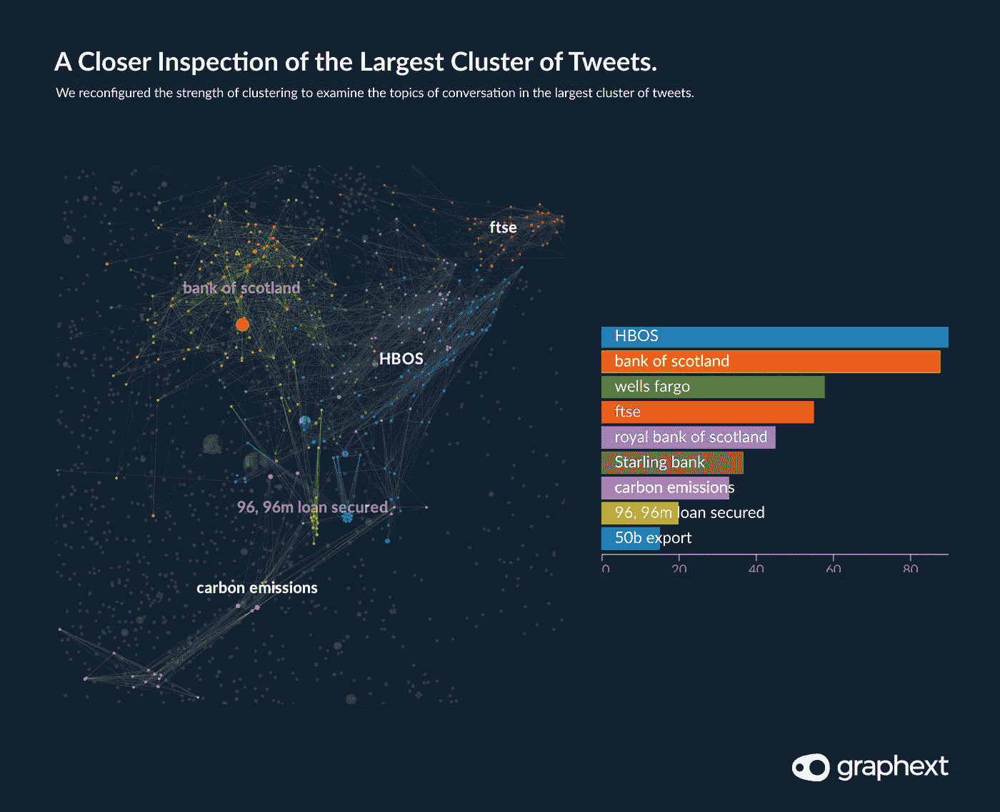
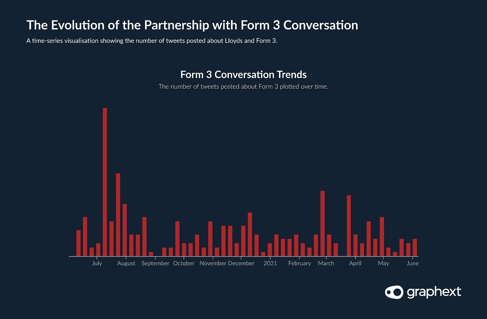
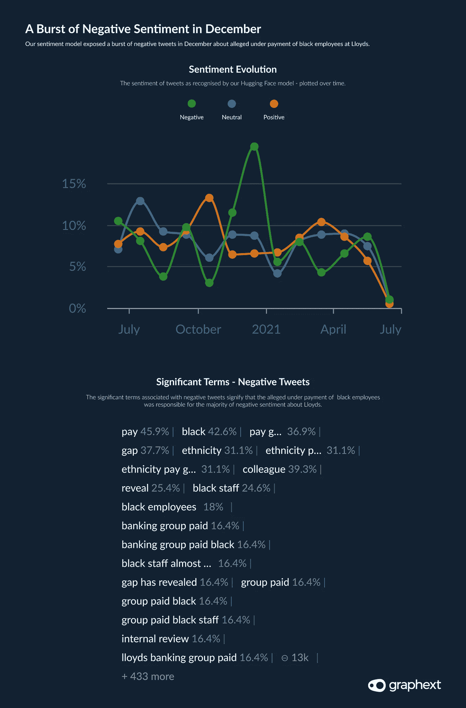
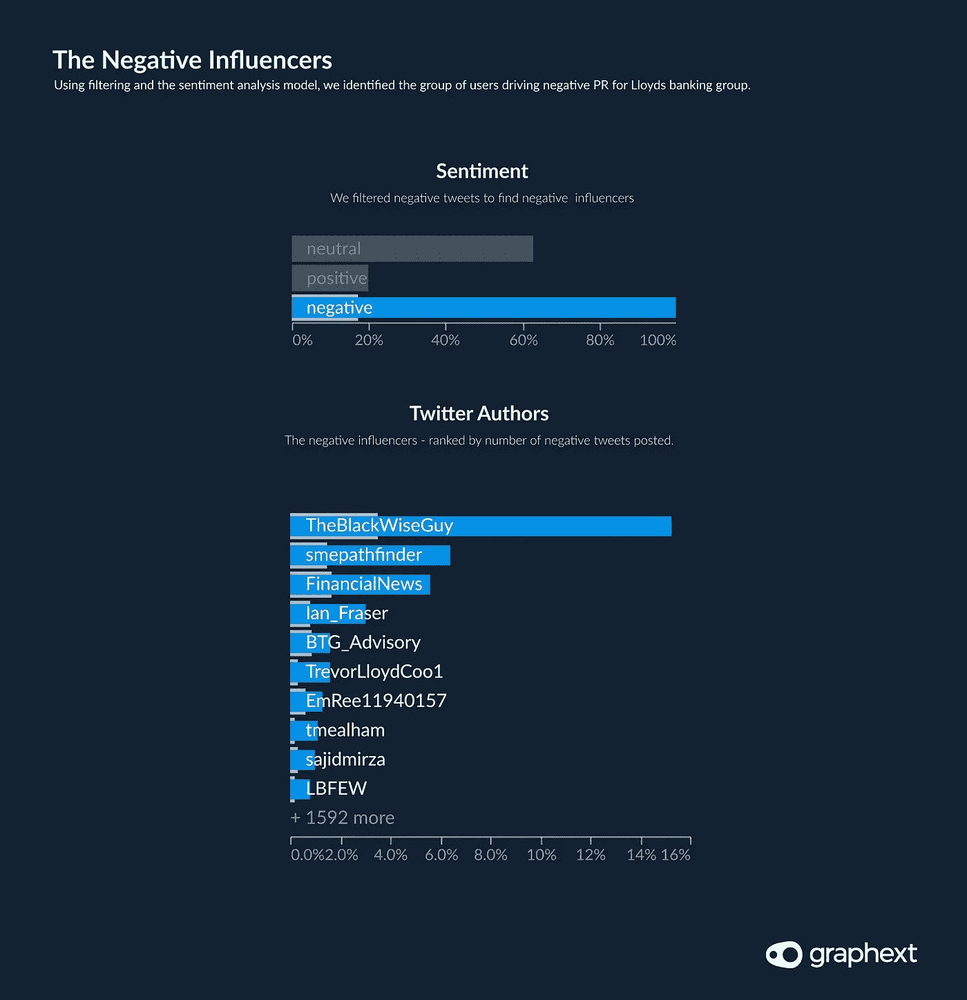

# 如何用高级文本分析研究品牌对话？

> 原文：<https://medium.com/geekculture/how-to-study-brand-conversations-with-advanced-text-analysis-42519f168f79?source=collection_archive---------26----------------------->

社交媒体从未像今天这样重要。花在社交媒体上的平均时间是 145 分钟，也就是每天 2 小时 25 分钟。正确的**帖子**可以提升**品牌的**形象，也可以毁掉它，而**影响者**现在可以比肥皂剧明星更有名。众所周知，获取这些数据的能力让企业获得了巨大的营销优势。‍

> “事实证明，仅凭推特数据，我们就能在很大程度上了解一个人的性格。”
> 
> *-安东尼·戈德布鲁姆，‍kaggle*公司首席执行官

Twitter 拥有丰富的定性数据，经常被研究人员使用，因为我们可以使用 Twitter 的 API 收集推文。推特作者可能会固执己见，留下评论，并在面对产品、服务和公司时表达快乐或不快乐。那么，我们如何收集这些数据并进行 Twitter 分析，以便通过驱动市场的客户的想法和感受来创造有用的见解，从而了解我们的市场呢？‍

# 从 Twitter 抓取数据

文本分析总是从数据开始。在这里，我的第一步是从 Twitter 上收集数据，并使用它来清理、准备和构建一个特定背景的 tweets 数据集。

为此，我使用了 Graphext 的数据科学家和工程师团队开发的刮擦工具— [**拖拉机**](https://www.graphext.com/docs/scraping-with-tractor) 。我想了解更多关于我的银行的话题——劳埃德银行。为了在这里收集上下文相关的推文，我使用了 **Twitter 查询**:“劳埃德银行”或“#Lloydsbank”，并设置 scraper 来抓取**所有关于银行的回复推文和引用**。‍

> 我收集了过去一年中所有关于劳埃德银行的推文，以监测和分析 Twitter 上关于该公司的全部对话。‍

意识到公司的规模，并希望使用可管理的数据集规模，我将 Tractor 设置为抓取 2020 年 6 月 1 日至 2021 年 6 月 1 日之间发布的推文。这个 twitter 查询给了我 3610 行数据，拖拉机将这些数据转换成可用的 CSV 文件，我可以直接拖放到 Graphext 中。‍

# 为 Twitter 数据的文本分析设定意图

现在我已经准备好了数据集，我开始思考如何进行分析。Twitter 数据有各种各样的用例；**竞争对手分析**、**推特网络分析**或**对话监控**等等。值得记住的是，有许多专门构建的社交媒体和 Twitter 分析工具可以执行这些类型的数据分析项目。

但由于 Graphext 可以部署**高级 NLP 算法**并自动**在网络可视化中聚集推文**——我将使用 Graphext 的**社交媒体——主题**分析类型构建分析。通过这种方式，我不必用 Python 或 R 编写代码，并且可以访问现成的数据丰富和机器学习模型，如专门针对 Twitter 数据训练的**情感分析**。

从头开始社交媒体分析项目过去很费力，包括在营销和数据团队之间来回移动，但无代码工具让不知道如何编程的人能够自己进行分析。不到五分钟，我就有了下图。‍

*Graph: Clusters of tweets revealing the topics of conversations about Lloyds Banking Group.*

‍After 在 Graphext 创建的推文网络中，我做的第一件事是试图了解为什么我们的聚类分析将推文分组在一起；**哪种推文与另一种推文紧密相关**以形成我们聚类中的对话主题？‍

# 分析 Twitter 上的对话:一组关于竞争对手和子公司的推文

在这项特殊的研究中，最大的集群集中在银行集团本身、其竞争对手及其子公司。我们的算法将推文分组在一起，因为它们通常指的是相同的企业、银行或实体。我发现自动识别的主题没有提供任何有意义的见解。

为了纠正这一点，我创建了一个自动分段，将集群分成 9 个更小的子集群。通过这种方式，我能够更深入地检查围绕该银行竞争对手的话题，并发现在该集群中发布最多的话题是劳埃德 HBOS 子公司涉嫌欺诈。

Graph: We auto-segmented tweets in our largest cluster to inspect the topics in more detail.‍

# 分析推特上的对话:对商业新闻的反应

在这个特定的数据集中，我发现了许多有趣的聚类，它们对分析很有价值。但我注意到的一组推文立即将关于与金融科技公司 Form3 合并的对话视为。激起了我的兴趣，我决定用 Graphext 的**趋势**小组对此进行分析，以调查合并的参与度是如何随着时间的推移而演变的。

对这一特定 Twitter 对话的时间序列分析显示，大部分讨论发生在新闻披露的 7 月份(25%)。之后，整个一年中，人们的兴趣都有短暂的爆发。

Trends: How the conversation about the partnership between Lloyds and Form3 evolved over time.‍

# 分析推特上的对话:人们对裁员的感受

对文本数据进行聚类的好处之一是能够发现 excel 表或数据透视表中可能会丢失的模式。例如，只有 1%的数据集提到了提到裁员的推文。然而，通过使用交互式网络可视化过滤这些推文，我们可以立即开始分析它们的特征和内容。我们可以看到，裁员在全年只被提及了 51 次，其中大部分是在 11 月发布的。

这应该被视为公关损害控制的巨大成功——因为 1000 名冗余人员**可能会引起更大的轰动。‍**

****

**Trends: How the conversation about job cuts at Lloyds evolved over time.‍**

# **分析 Twitter 上的对话:情感分析**

****情绪分析**是一种强大的自然语言处理技术，用于测量人们说话或写作方式中包含的积极或消极情绪。Graphext 提供了许多集成的情绪分析模型，这些模型根据特定于上下文的社交媒体数据进行训练，并可以快速轻松地部署。**

**其中一个是用于情感分析的拥抱脸模型，由卡迪夫大学的数据科学家构建，并已集成到 Graphext 中。使用这种情绪分析机器学习模型，我们可以很容易地看到哪些推文是负面的、中性的或正面的，甚至可以识别出对话情绪如何随着时间的推移而演变。‍**

****

**Compare & Significant Terms: Negative tweets about Lloyds burst through in December because of alleged under payment of black employees.‍**

**在 Graphext 的**比较**面板中分析这一点，我们可以看到大多数推文是中性或正面的，只有 17%的推文是负面的。然而，我在 2020 年 12 月发现了一个负面推文的峰值，这促使我更深入地研究这个推文片段。仔细观察发现，这段关于劳埃德银行的负面推文指的是黑人员工和他们的同事之间的薪酬差距问题。‍**

# **分析 Twitter 上的对话:寻找影响者**

**社交媒体分析中越来越受关注的另一个领域是寻找影响者的重要性。**

**当我们想到有影响力的人时，许多人会直接想到赞助和销售产品的年轻漂亮的人。但是影响者也会对公关产生负面影响。像劳合社这样的公司，其产品并不那么有形，使用社交媒体网络分析来寻找驱动品牌负面信息的影响者是执行根本原因分析以阻止负面公关的重要方式。‍**

****

**Variable Charts: The negative influencers driving bad PR for Lloyds Banking Group.‍**

**使用拥抱脸情绪分析模型的结果，我们可以隔离图表中的所有负面推文，并破译谁是主要的影响者。在这个社交媒体分析项目中，我们可以看到，**主要负面影响者**是三个特定用户； **@TheBlackWiseGuy** 与 **15.29%** 的负面推文， **@smepathfinder (6.37%)** 、 **@FinancialNews at (5.57%)** 。Lloyd's marketing & PR 团队将能够使用 Graphext 生成的主题分析来找出这些用户发布负面消息的内容，并做出相应的反应。‍**

**这只是对 Twitter 数据主题分析的潜在用例的皮毛。企业可以遵循相同的分析结构来执行竞争对手分析，比较您的公司和您的竞争对手之间的提及量，或者确定哪个企业在谈论他们的推文中具有更积极的情绪。此外，营销团队可以利用对 Twitter 数据进行文本分析获得的见解做出明智的决策，通过跟踪标签并确保一些帖子包含对特定上下文趋势主题的引用，来提高社交媒体的参与率。理解 twitter 指标可以真正让社交媒体管理团队受益，并扩大公司的影响力。**