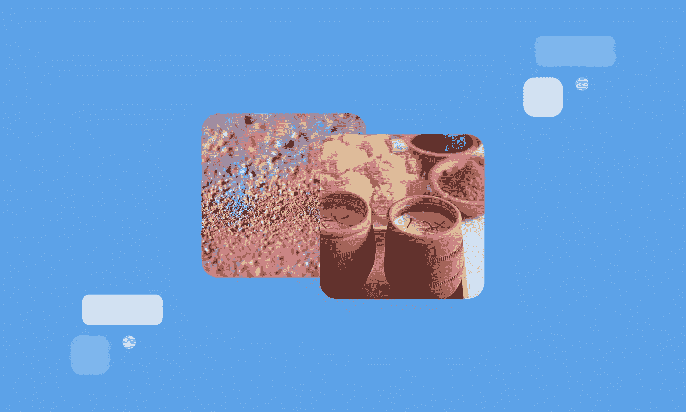
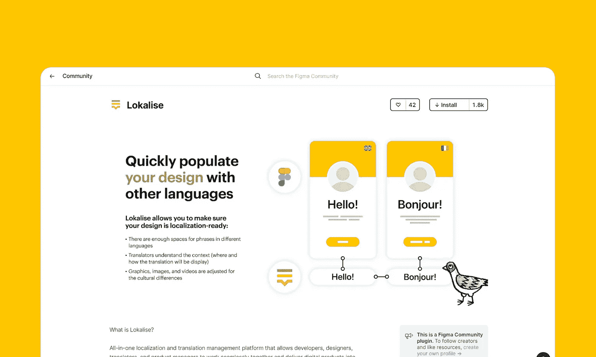
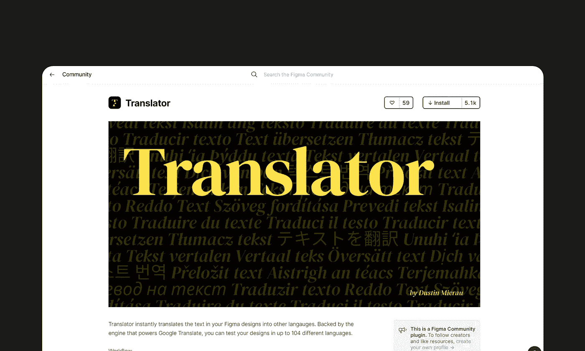

# 如何将你的设计翻译成不同的语言

> 原文：<https://medium.com/geekculture/how-to-translate-your-design-to-a-different-language-a570f82f3ece?source=collection_archive---------18----------------------->

Localising content to improve usability

你一定已经注意到有些应用程序会改变货币类型、日期和时间格式，甚至是当地的语言。这就是本地化。在设计过程中支持本地化是一项复杂的任务，但从过程的初始阶段就考虑它是很重要的。当你的应用得到不同地区和国家的支持时，你可以获得巨大的成功。当本地化与您的设计相结合时，您拥有的受众会大大增加。

# **什么是本地化？**

本地化是使您的产品或服务适应当地语言、格式和其他属性以满足当地需求的过程。除此之外，本地化还会考虑该地区的文化。当你考虑到用户的本地文化时，这使得用户对应用程序感到舒适。当您这样做时，请确保考虑以下几点:

*   确保使用的照片和插图符合文化习俗。
*   计量单位与当地的计量单位相同。
*   日期、时间和货币格式是精确的。
*   翻译的信息清晰易懂。

***来源*** *:* [*什么是本地化？*](https://www.spectra-agency.com/blog/what-is-localisation) *由* [*光谱*](https://www.spectra-agency.com/blog)

# **动态宽度和高度**

您必须确保从设计开始就将所有资产置于自动布局模式。当您以后将本地化功能集成到设计中时，这将为您节省大量时间和精力。当您根据区域翻译文本时，此功能会自动调整文本的容器。

# **全局字体**

在设计的初始阶段，你总会想到的一件事就是排版。用户不一定会检查您使用的字体类型，但他们肯定会注意到他们的首选语言中是否缺少某个特殊字符。因此，在为您的产品选择字体时，最好选择将提供多语言支持的字体。您可以参考 [Google Noto Fonts](https://www.google.com/get/noto/) 获得多语言字体支持的帮助。您还必须记住，每种语言的字体大小可能不同。克服这个问题的一个方法是为不同的语言定义不同的样式表。

# **日期和时间格式**

日期和时间格式对任何人来说似乎都不重要，因为我们从来不考虑每个国家使用什么格式。但是这个小小的事实可以给用户带来巨大的不同。在当地，用户习惯于他们遵循的格式。但是，如果他/她使用的产品有不同的格式，他们使用起来仍然会感到困惑。以日期选择器为例，美国遵循格式； [MM-DD-YYYY](https://docs.oracle.com/cd/E19455-01/806-0169/6j9hsml2h/index.html) 而在欧洲则是； [DD-MM-YYYY](https://docs.oracle.com/cd/E19455-01/806-0169/6j9hsml2h/index.html) 。乍一看，这似乎并不重要，但从长远来看，思考这些最小的细节会产生巨大的影响。

***来源*** *:* [*日期、时间和货币格式的本地化*](https://www.verbatimsolutions.com/localization-of-date-time-and-currency-formats/) *通过逐字逐句、* [*使用区域设置类别进行本地化*](https://docs.oracle.com/cd/E19455-01/806-0169/6j9hsml2h/index.html) *通过甲骨文*

# **RTL 支持(布局)**

另一个你必须考虑的重要事实是用户阅读内容的布局。大多数语言都是从左往右读，但在阿拉伯语、希伯来语或乌尔都语中，情况完全相反。如果你直接翻译其中一种语言的内容，那就没用了。因此，您的整个布局和内容必须重新设计，以支持从右向左阅读的语言。

***来源*** *:* [*由右向左书写*](https://en.wikipedia.org/wiki/Right-to-left_script) *由维基、* [*双向性*](https://material.io/design/usability/bidirectionality.html) *由材料设计*

# **文化**

您可以设计一个在设计上保持一致的应用程序。但是想想这个设计，如果我们为了用户的文化相关性而本地化它？这不仅会提升用户体验，还会提升市场价值。您可以根据用户所在地区的节日季节提供漂亮的插图和图像，这将使用户对应用程序的使用感到舒适。

你设计中的每一个小细节都会对用户产生很大的影响。这可以被认为是一个好的和坏的方式。本地化时也要考虑手势和肢体语言。一个手势在一个地区可能是无害的，但在另一个地区却有完全相反的意思。因此当使用图形内容时，你必须考虑所有可能的因素。

来源:[文化在本土化中的重要性](https://www.binarysemantics.com/blog/index.php/importance-culture-localization/)作者[二元语义学](https://www.binarysemantics.com/blog/)

People enjoying the Holi Festival

# **翻译 vs 本地化**

你可能认为翻译和本地化是一样的。虽然看起来应该是一样的，其实不是！。翻译是将文本从一种语言转换成另一种语言，这比本地化更容易，因为这不需要任何个人干预。本地化远不止于此。这就要求设计师在添加内容时，甚至要记住特定地区的当地文化。你必须尊重你的目标地区。

***来源*** *:* [*翻译 vs 本地化:有区别吗？斯蒂芬妮·哈里斯*](https://www.vengaglobal.com/blog/translation-localization-difference/)

# **可用于 Figma 的插件**

[**洛卡利斯—插件**](https://www.figma.com/community/plugin/818840482503404814/Lokalise)

Plugin for Figma: Lokalise

[**翻译器—插件**](https://www.figma.com/community/plugin/743218037112142643/Translator)

Plugin for Figma: Translator

# **结论**

你可能会忽略产品本地化的努力，但这是你必须考虑的一个重要事实。当你在设计的时候，你在你的头脑中设计用户。那么如果这个用户来自不同的地区呢？你必须根据他/她的当地需求来设计你的产品，对吗？这一过程可能会非常耗时和复杂，但当你完成后，知道你包括了全球的用户是值得的。你的用户必须是你最优先考虑的，而不是你的产品。

# 参考资料和一些对你有用的资源！

什么是本地化？通过[光谱](https://www.spectra-agency.com/blog)

[翻译与本地化:有区别吗？斯蒂芬妮·哈里斯](https://www.vengaglobal.com/blog/translation-localization-difference/)

[逐字本地化日期、时间和货币格式](https://www.verbatimsolutions.com/localization-of-date-time-and-currency-formats/)

[材料设计的双向性](https://material.io/design/usability/bidirectionality.html)