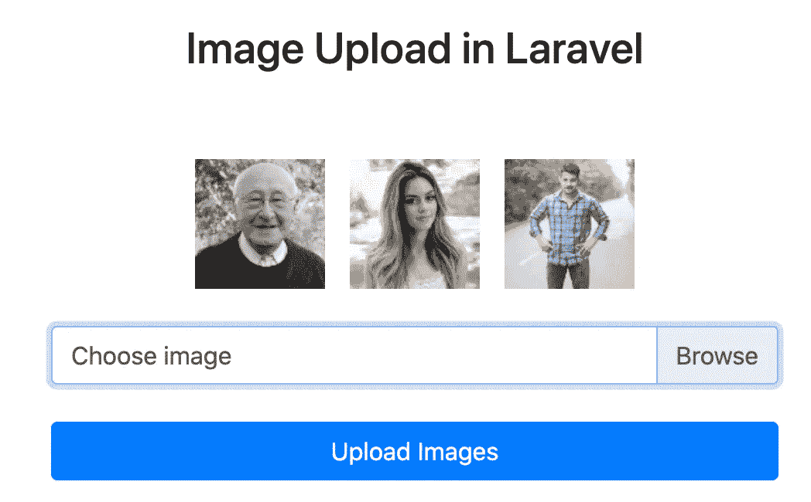

# 如何在 Laravel 中上传多张图片

> 原文：<https://medium.com/geekculture/how-to-upload-multiple-images-in-laravel-b98c95324594?source=collection_archive---------0----------------------->



Image by [positronx.io](https://www.positronx.io/laravel-multiple-images-upload-with-validation-example/)

很多网站要求用户上传一个产品的多张图片。这尤其适用于电子商务网站。多张图片被用来提供销售产品的大量细节。

对于许多开发人员来说，实现多个图像上传已经被证明是困难的。在本文中，我将一步一步地向您展示如何使用 laravel 上传多个图像。

**步骤 1:** 使用 composer 创建一个新的 Laravel 项目。你可以给它起任何名字，但在这种情况下，我们将它命名为多重图像*应用*。

```
composer create-project --prefer-dist laravel/laravel muiltipleImagesApp
```

**步骤 2:** 在 multipleImage *App* 项目中创建一个迁移来创建一个产品表。

```
cd multipleImagesApp
php artisan make:migration create_products_table --create=products
```

**第三步:**在迁移中添加*名称*和*字段*和*描述*字段*。*

```
<?phpuse Illuminate\Support\Facades\Schema;
use Illuminate\Database\Schema\Blueprint;
use Illuminate\Database\Migrations\Migration;*class* CreateProductsTable *extends* *Migration* {
  *public* *function* up()
  {
    Schema::create('products', *function* (Blueprint $table) {
      $table->bigIncrements('id');
      $table->string('name');
      $table->string('description');  
      $table->timestamps();
  });
  }*public* *function* down()
  {
    Schema::dropIfExists('products');
  }
}
```

**步骤 4:** 创建另一个迁移，该迁移将创建映像。

```
php artisan make:migration create_images_table --create=images
```

**步骤 5:** 在迁移中添加字段 url 和 product_id *。*

```
<?phpuse Illuminate\Support\Facades\Schema;use Illuminate\Database\Schema\Blueprint;use Illuminate\Database\Migrations\Migration;*class* CreateImagesTable *extends* *Migration
{**public* *function* up(){
  Schema::create('images', *function* (Blueprint $table) {
    $table->bigIncrements('id');
    $table->string('url');
    $table->unsignedBigInteger('product_id');
    $table->timestamps();
});
}*public* *function* down(){
   Schema::dropIfExists('images');
}}
```

**第六步:**接下来，创建两个模型。一个将被称为*产品*，另一个将被称为*图像。*

```
php artisan make:model Product
php artisan make:model Image
```

**第 7 步:**在产品模型中添加可填充数组中的*标题*和*内容*字段。接下来，创建一个与*图像*模型的一对多关系。

```
<?phpnamespace App;use Illuminate\Database\Eloquent\Model;*class* Product *extends* *Model* {
  *protected* $table = 'products'; *protected* $fillable = [
      'name', 'discription'
  ];
  *public* *function* images()
  {
   return *$this*->hasMany('App\Image', 'product_id');
  }
}
```

**第 8 步:**在图像模型中添加可填充数组中的 *url* 和 *product_id* 字段。接下来，创建与产品模型的一对多关系。

```
<?phpnamespace App;use Illuminate\Database\Eloquent\Model;*class* Image *extends* *Model* {
  *protected* $table = 'images'; *protected* $fillable = [
   'url', 'product_id'
  ];*public* *function* product()
{
  return *$this*->belongsTo('App\Product', 'product_id');
}}
```

**第九步:**在 ***config/*** 文件夹中，在一个名为*filesystems.php 的文件中添加一个名为 *my_files* 的新盘。*

```
'disks' => [
   'local' => [
      'driver' => 'local',
      'root' => storage_path('app'),
   ],'public' => [
      'driver' => 'local',
      'root' => storage_path('app/public'),
      'url' => env('APP_URL').'/storage',
      'visibility' => 'public',
   ],'s3' => [
      'driver' => 's3',
      'key' => env('AWS_ACCESS_KEY_ID'),
      'secret' => env('AWS_SECRET_ACCESS_KEY'),
      'region' => env('AWS_DEFAULT_REGION'),
      'bucket' => env('AWS_BUCKET'),
      'url' => env('AWS_URL'),
   ],'my_files' => [
      'driver' => 'local',
      'root'   => public_path() . '/'
   ]
],
```

**第十步:**接下来，创建一个控制器，命名为 *ProductController* 。

```
php artisan make:controller ProductController
```

**步骤 11:** 给 *ProductController* 添加一个名为 *uploadImages 的函数。*

```
<?phpnamespace App\Http\Controllers\Admin;use Illuminate\Http\Request;use App\Http\Controllers\Controller;
use Illuminate\Support\Facades\DB;
use App\Product;
use Image;
use Storage;*class* ProductController *extends* *Controller* {
   *public* *function* addProduct(Request $request)
   {
      *$this*->validate($request, [
         'name' => 'required|string|max:255',
         'description' => 'required|string|max:855',
   ]); $product = new Product;
   $product->name = $request->name;
   $product->description = $request->description;
   $product->save(); foreach ($request->file('images') as $imagefile) { $image = new Image;
     $path = $imagefile->store('/images/resource', ['disk' =>   'my_files']);
     $image->url = $path;
     $image->product_id = $product->id;
     $image->save();
   }}}
```

**第 12 步:**最后在*web.php*文件的路径文件夹中

```
<?phpuse Illuminate\Http\Request;Route::post('addProduct', 'ProductController@addProduct')->name('products.uploadproduct');
```

第十三步:创建一个名为*uploadImages.blade.php 的文件。*

```
<!DOCTYPE *html*>
<html>
<head>
 <meta *charset*="utf-8">
 <meta *name*="viewport" *content*="width=device-width, initial-scale=1,   shrink-to-fit=no">
<title>Multiple Image upload</title>
</head><body><div>
<h3>Upload a Images</h3>
<hr><form *method*="POST" *action*="{{ route('products.uploadproducts') }}" *enctype*="multipart/form-data" >
{{ csrf_field() }}
<div >
<label>Name</label>
<input *type*="text" *name*="name" *placeholder*="Enter Product Name"><label>Discription</label>
<textarea name="description" rows="4" >
</textarea></div><div >
<label>Choose Images</label>
<input *type*="file"  *name*="images" multiple>
</div><hr><button *type*="submit" >Submit</button></form></div></body></html>
```

现在我们有了。我希望你已经发现这是有用的。我会带着更多有趣的文章回来。感谢您的阅读。