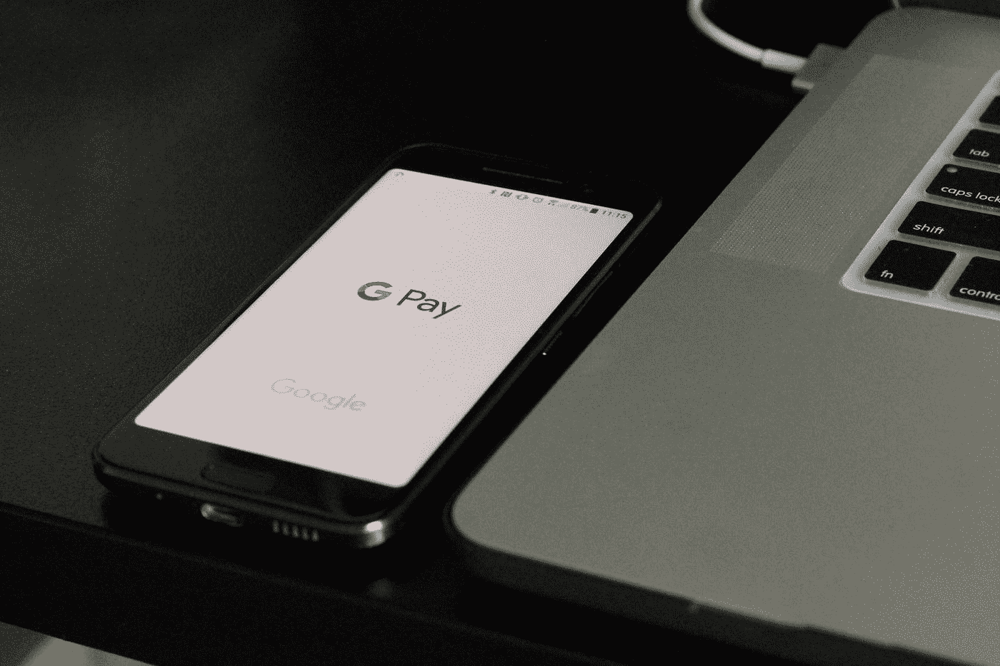

# 如何在 Android 上使用 Braintree 插件、Google Pay 和 ThreeDSecure

> 原文：<https://medium.com/geekculture/how-to-use-braintree-drop-in-google-pay-and-threedsecure-on-android-2f8c710abb5f?source=collection_archive---------21----------------------->

Photo by [Matthew Kwong](https://unsplash.com/@mattykwong1?utm_source=medium&utm_medium=referral) on [Unsplash](https://unsplash.com?utm_source=medium&utm_medium=referral)

将 Google Pay 和 ThreeDSecure 与 Braintree 插件 UI 一起使用会返回 CardNonce，而不是 GooglePaymentCardNonce。这是解决办法

我们最近接受了一项任务，在我们的一个应用程序上使用 Braintree 插件 UI 实现新的支付集成。然而，我们在使用 Google Pay 请求 ThreeDSecure 时遇到了一个问题。

ThreeDSecure 为在线信用卡和借记卡交易提供了额外的安全层，如果您正在处理卡支付，这是一个基本的协议。Braintree 提供了一种简单的方法来实现卡支付以及与 ThreeDSecure 的集成。它还提供了一种同样简单的方式来实现 Google Pay。

# Google Pay 需要三重安全吗？

有两种类型的卡可以与 Google Pay 一起使用，PAN 卡(非网络令牌化的标准信用卡)和 DPAN 卡(网络令牌化的卡，具有生成的带有设备特定账号的虚拟卡)。ThreeDSecure 不适用于 DPAN 卡，因为它们已经被认为是安全的。但是，当使用 PAN 卡时，您需要实现它。Braintree 插件 UI 会检测卡的类型，如果它检测到 PAN 卡并且您已经请求了 ThreeDSecure，它会自动处理这个实现。您可以使用下面的 Kotlin 代码来实现这一点:

强烈建议您将 ThreeDSecure 与 PAN 卡一起使用，以提高它们的安全性。

# 我们做了什么？

我们选择了用户明确填写他们的详细信息(如电子邮件和地址)的场景，然后我们可以使用这些信息来授权支付。我们以此为契机，衡量了在 iOS 上使用 Apple Pay 的“快速结账”转换率(因为 Apple Pay 不需要三次安全支付)，以了解摆脱嵌入式用户界面是否值得。我们预计转化率将会提高，而且我们也预测转化率会提高。

总而言之，Braintree 插件 UI 使用起来极其简单。但是，您可能必须在解决方案的灵活性上做出妥协。希望这篇博文能帮助面临类似情况的人，并在实施 ThreeDSecure 和 GooglePay 时节省他们的时间。

# 哪里出了问题？

不幸的是，我们遇到了一个问题，在使用 Google Pay 完成 ThreeDSecure 后，返回类型。通常情况下，使用 Google pay 完成支付后的返回类型是 GooglePaymentCardNonce。这不是我们所期望的；当使用 GooglePay 完成支付并请求 ThreeDSecure 时，这是一个正常的卡顿事件。这意味着我们丢失了授权购买所需的账单信息。

我们联系了 Braintree，发现在完成 ThreeDSecure 之后，插件 UI 当前无法返回一个 GooglePaymentCardNonce。我们要么明确地让用户提供他们的账单细节(去掉“快速结账”的选项)，要么转到 Braintree 的托管字段(为了摆脱插件 UI，有必要进行重大的重组)。

*最初发表于*[*【https://www.brightec.co.uk】*](https://www.brightec.co.uk/blog/how-to-use-braintree-drop-in-google-pay-and-threedsecure-on-android)*。*