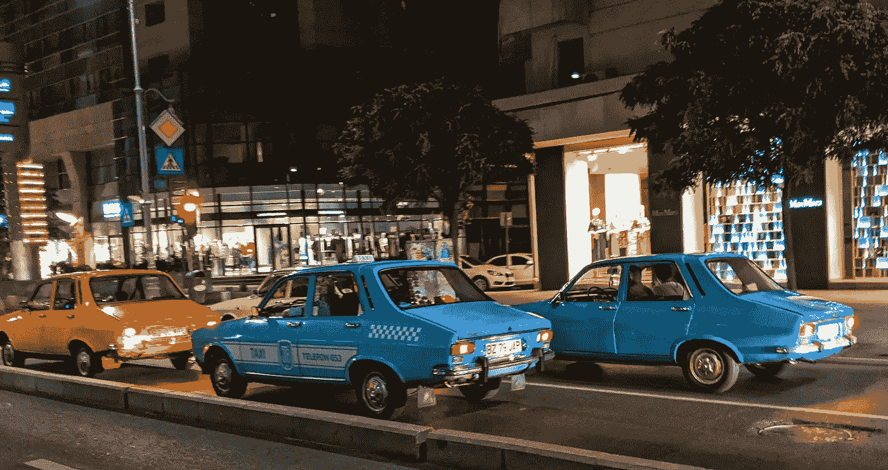

# 如何使用 CarProjectionManager

> 原文：<https://medium.com/geekculture/how-to-use-carprojectionmanager-36a44658dca?source=collection_archive---------17----------------------->



每个人，无论你要去哪里，都可以通过使用 Android Auto、苹果 CarPlay 或其他软件带上副驾驶。Android 汽车操作系统能够帮助您集成任何镜像应用程序。

CarProjectionManager 允许实现投影的应用程序向投影管理器注册/注销自己，并监听语音通知。

在 [CarProjectionManager](https://cs.android.com/android/platform/superproject/+/master:packages/services/Car/car-lib/src/android/car/CarProjectionManager.java) 中，我们有 ProjectionStatusListener，只要有新设备连接到系统并且支持投影，我们就会接收数据。

# 看起来是这样的:

## 什么是投影状态:

根据其可用性，预测状态可能有 4 种状态:

```
/** This state indicates that projection is not actively running and no compatible mobile
* devices available. *    
public static final int **PROJECTION_STATE_INACTIVE** = 0;/** At least one phone connected and ready to project. */
public static final int **PROJECTION_STATE_READY_TO_PROJECT** = 1;/** Projecting in the foreground */
public static final int **PROJECTION_STATE_ACTIVE_FOREGROUND** = 2;/** Projection is running in the background */
public static final int **PROJECTION_STATE_ACTIVE_BACKGROUND** = 3;
```

关于投影状态对象的更多细节你可以在这里找到[。](https://cs.android.com/android/platform/superproject/+/master:packages/services/Car/car-lib/src/android/car/projection/ProjectionStatus.java)

您可能必须根据预测状态考虑可能的可用运输方式:

```
public static final int **PROJECTION_TRANSPORT_NONE** = 0;
public static final int **PROJECTION_TRANSPORT_USB** = 1;
public static final int **PROJECTION_TRANSPORT_WIFI** = 2;
```

# 它是如何工作的

考虑到上面显示的代码(AOSP 平台的一部分)，我将描述以下步骤，我们这样做是为了能够充分解释预测状态监听器的整个功能:

*   在没有连接任何设备的情况下启动系统->空列表
*   通过 USB ->单元素列表插入 Android 设备
*   通过蓝牙连接(进行配对过程)->列出两个元素
*   在其中一个连接的设备上启动无线投影
*   将投影放在背景中
*   停止投射

## 没有连接设备

```
**state**: 0**package**: null**details**: []
```

投影**状态**为**无效**并且**列表**为**空**，因为我们没有连接设备。这和**空包**是一个道理。

## 一台通过 USB 连接的设备

```
**state**: 1**package**: com.google.android.embedded.projection**details**: [ProjectionStatus{mPackageName='com.google.android.embedded.projection', mState=1, mTransport=0, mConnectedMobileDevices=[MobileDevice{mId=0, mName='Google Pixel', mAvailableTransports=[1], mProjecting=false, (has extras)}]}]
```

**连接的设备**准备好**投影**并且**包**的目的是突出显示连接设备的类型是**安卓**设备。唯一可用的**传输**是 **USB** ，mAvailableTransports 列表只有一个元素(1 = PROJECTION_TRANSPORT_USB)。如果实际设备连接了 USB 和蓝牙两个选项，则列表将包含 2 个元素，例如:

```
[ProjectionStatus{mPackageName='com.google.android.embedded.projection', mState=1, mTransport=0, mConnectedMobileDevices=[MobileDevice{mId=0, mName='Google Pixel', mAvailableTransports=[1, 2], mProjecting=false, (has extras)}]}]
```

## 一台设备已经连接，并通过蓝牙添加新设备

```
**state**: 1**package**: com.google.android.embedded.projection**details**: [ProjectionStatus{mPackageName='com.google.android.embedded.projection', mState=1, mTransport=0, mConnectedMobileDevices=[MobileDevice{mId=1, mName='Nexus 5X', mAvailableTransports=[2], mProjecting=false, (has extras)}, MobileDevice{mId=0, mName='Google Pixel', mAvailableTransports=[1], mProjecting=false, (has extras)}]}]
```

至少一个连接的设备**准备投射**，状态为 1 (READY_TO_PROJECT)的原因。因为我们有 2 个连接的设备，详细信息列表包含 2 个元素， **Nexus 5X 和谷歌像素**。详细列表的内容显示，Nexus 5X 通过蓝牙连接，谷歌 Pixel 通过 USB 连接。

mTransport = 0 表示 PROJECTION_TRANSPORT_NONE，并且当投影没有有效运行时接收该值。

## 开始投射

```
**state**: 2**package**: com.google.android.embedded.projection**details**: [ProjectionStatus{mPackageName='com.google.android.embedded.projection',mState=2, mTransport=2, mConnectedMobileDevices=[MobileDevice{mId=1, mName='Nexus 5X',mAvailableTransports=[2], mProjecting=true, (has extras)}, MobileDevice{mId=0,mName='Google Pixel', mAvailableTransports=[1], mProjecting=false, (has extras)}]}]
```

**投影**已经在 **Nexus 5X** 上**开始**，因此当前状态为**2 = PROJECTION _ STATE _ ACTIVE _ FOREGROUND**，因为详细信息列表中的一个设备的属性 **mProjecting** 设置为 **TRUE** 。

**mTransport = 2 表示 PROJECTION_TRANSPORT_WIFI** ,当投影在 WIFI 上运行时，会收到此消息。

## 将投影状态从前景更改为背景

```
**state**: 3**package**: com.google.android.embedded.projection**details**: [ProjectionStatus{mPackageName='com.google.android.embedded.projection', mState=3, mTransport=2, mConnectedMobileDevices=[MobileDevice{mId=1, mName='Nexus 5X', mAvailableTransports=[2], mProjecting=true, (has extras)}, MobileDevice{mId=0, mName='Google Pixel', mAvailableTransports=[1], mProjecting=false, (has extras)}]}]
```

我们有一个**正在进行的投影**已经移到了**背景**。此时的**状态**为 **3 =投影 _ 状态 _ 活动 _ 背景**。**投影**标志仍然设置为**真**，并且**m 传输**值不变(**投影 _ 传输 _WIFI** )。

## 停止投射

```
**state**: 1**package**: com.google.android.embedded.projection**details**: [ProjectionStatus{mPackageName='com.google.android.embedded.projection', mState=1, mTransport=0, mConnectedMobileDevices=[MobileDevice{mId=1, mName='Nexus 5X', mAvailableTransports=[2], mProjecting=false, (has extras)}, MobileDevice{mId=0, mName='Google Pixel', mAvailableTransports=[1], mProjecting=false, (has extras)}]}]
```

状态已从 PROJECTION _ STATE _ ACTIVE _ FOREGROUND/PROJECTION _ STATE _ ACTIVE _ BACKGROUND 更改为 PROJECTION _ STATE _ READY _ TO _ PROJECT，因为不再有标记为 mProjecting = TRUE 的设备。

## 当我们有多个产品包可用时的期望

```
[ProjectionStatus{mPackageName='com.google.android.embedded.projection', mState=1, mTransport=0, mConnectedMobileDevices=[MobileDevice{mId=0, mName='LGE Nexus 5X', mAvailableTransports=[1], mProjecting=false, (has extras)}]}, ProjectionStatus{mPackageName='***another.projection.package***', mState=1, mTransport=1, mConnectedMobileDevices=[MobileDevice{mId=1007, mName='Marcel's Device, mAvailableTransports=[1], mProjecting=false, (has extras)}]}]
```

基于包，连接设备的状态、传输和列表将为**。**

## 注意:

*如果设备被拔出或断开，详细信息列表将不再包含该设备。在只有一个设备连接的情况下，我们将得到一个空列表。*

# 创建新的投影状态对象

通过在列表中添加新的投影状态对象，您唯一要做的事情是

创建一个投影状态对象。使用 Java 代码创建空列表的一个简单示例是:

```
pivate ProjectionStatus createProjectionStatus(int event) {
    return ProjectionStatus
            .builder(*PACKAGE_NAME*, event)
            .setProjectionTransport(
               ProjectionStatus.PROJECTION_TRANSPORT_NONE
             )
            .build();
}
```

# 如何处理不同的蓝牙约束

对于不同的技术或 OEM 约束，您可能需要在投影进行时应用一些蓝牙策略，并在投影停止时返回到之前的状态。

对于这种类型的约束，我们已经由 CarProjectionManager 提供了一个权力机制来执行，当我们想要**断开**一个**配置文件**时**抑制配置文件**，当我们想要回到先前的状态时**释放抑制**。让我们来看看这些方法:

使用 Kotlin 代码禁用由 MAC 地址标识的设备的 HFP 配置文件的示例:

```
private fun disableHfpDevices(macAddress: String?) {
    *logDebug*("disableHfp for device: ${macAddress}")
    try {
        val device =   BluetoothAdapter.getDefaultAdapter().getRemoteDevice(macAddress) carProjectionManager.requestBluetoothProfileInhibit(device, 16) // 16 = HFP
    } catch (e: IllegalArgumentException) {
        *logDebug*("disableHfp for $macAddress --- ERROR --- $e")
    }
}
```

为了能够首先集成任何镜像应用程序，您必须与框架提供商签订合同。对于 Android Auto，您必须与谷歌签订合同才能获得 Android Auto apk，对于 Apple CarPlay，您必须有一个正在进行的合作才能访问他们的框架。一旦签订合同，您将收到关于实施细节和期望的详细文档，以便通过谷歌和苹果的认证。

**直接码吧！**