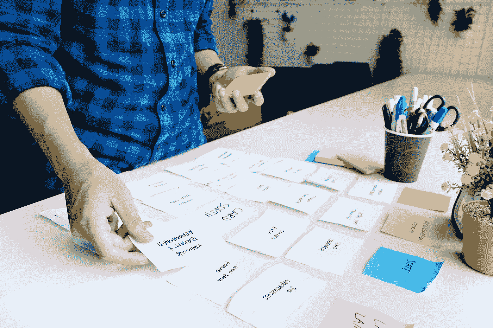

# 如何使用 SwiftUI 中的核心数据作为 macOS Ventura 应用程序的持久存储

> 原文：<https://medium.com/geekculture/how-to-use-core-data-in-swiftui-as-a-persistent-storage-for-our-macos-ventura-app-b5bc7e5ae470?source=collection_archive---------1----------------------->

Photo by [UX Indonesia](https://unsplash.com/@uxindo?utm_source=medium&utm_medium=referral) on [Unsplash](https://unsplash.com?utm_source=medium&utm_medium=referral)

在我之前的故事中，[在 macOS Ventura (13)](https://crystalminds.medium.com/programmatically-open-a-new-window-in-swiftui-on-macos-ventura-13-804ab6de20a9) 上以编程方式在 SwiftUI 中打开一个新窗口，我写了一个简单的笔记应用程序，名为 *Scribble* ，演示如何用新的`WindowGroup` `init(for:content:)`初始化器打开新窗口。

这些涂鸦存储在内存中，我已经提到过，实现它会更明智…