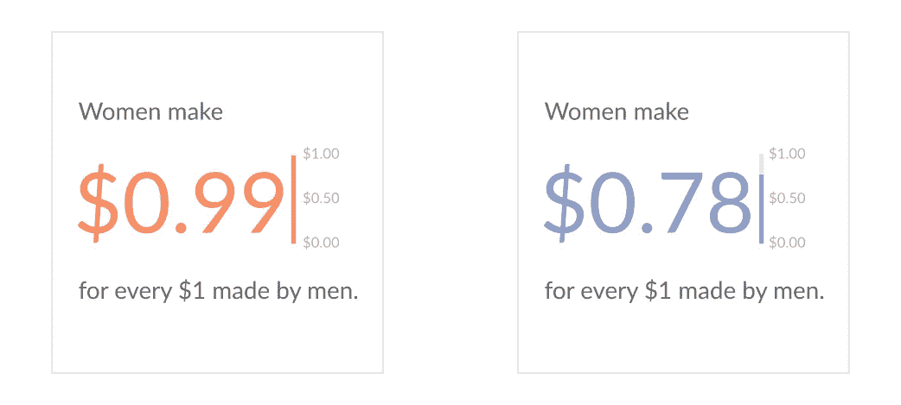

# 数据可视化中的寻路如何实现更深入的探索

> 原文：<https://medium.com/geekculture/how-wayfinding-in-data-visualization-enables-deeper-exploration-552444a87a8b?source=collection_archive---------7----------------------->

帮助用户探索复杂的数据可能很困难。例如，想象一下为薪酬不平等建立一个仪表板。考虑到数据中涉及的所有必须考虑的方面，不同的善意研究在试图总结男性和女性之间的差距时可能会报告非常不同的结果[ [1](https://www.epi.org/blog/equal-pay-day-there-has-been-little-progress-in-closing-the-gender-wage-gap/) ][ [2](https://www.payscale.com/research-and-insights/gender-pay-gap/) 。

Both of these charts are “correct” under different assumptions but neither tell the whole story of gender income inequality in the US [[1](https://www.epi.org/blog/equal-pay-day-there-has-been-little-progress-in-closing-the-gender-wage-gap/)][[2](https://www.payscale.com/research-and-insights/gender-pay-gap/)]. Note source studies often use binary gender definitions.