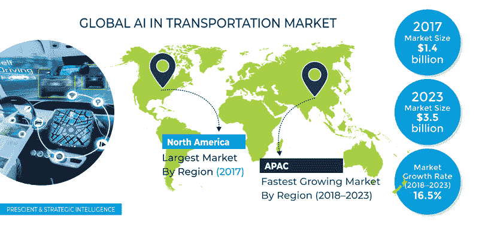
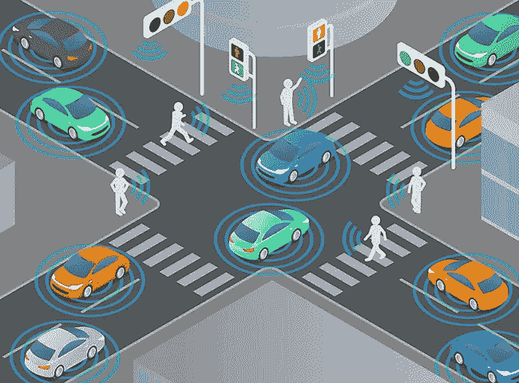
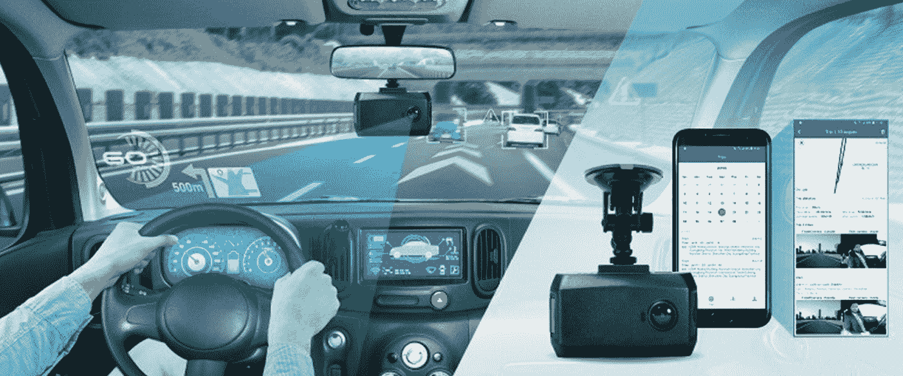
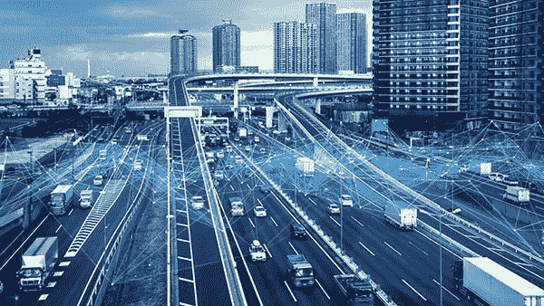
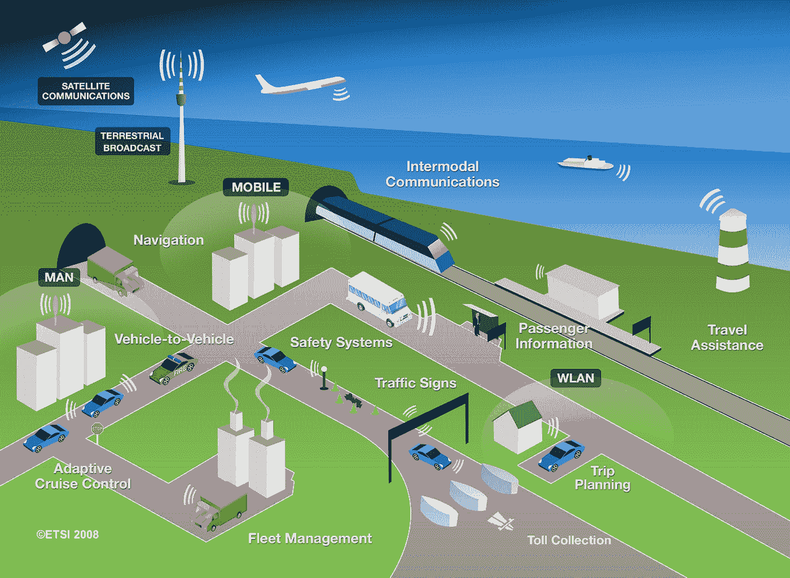

# 人工智能将如何影响未来的交通运输？

> 原文：<https://medium.com/geekculture/how-will-ai-impact-transportation-to-move-faster-in-future-495849fe4504?source=collection_archive---------11----------------------->

人工智能已经彻底改变了从医疗保健到制造业的一切，但有一个领域尚未看到人工智能的影响——“交通”。然而，你可以在车辆上看到一些明显的变化。

第一辆自动驾驶 semi 卡车已经经过测试，人工智能技术已经用于自动驾驶汽车，以确保你的驾驶尽可能平稳。

[Image source](https://www.psmarketresearch.com/market-analysis/ai-in-transportation-market)

随着越来越多的人在未来几年转向人工智能，你可以放心，你的出行方式将比以往任何时候都更好，事故更少，通勤时间更快。但是这项技术是如何工作的呢？它如何应用于您的车辆或运输业务？

**什么是人工智能？**

人工智能是计算机科学的一个领域，专注于开发能够感知环境并采取行动以最大化成功机会的智能机器。

这些机器通常通过输入大量数据来训练。(这些数据称为训练集或训练数据集)。为了训练一个人工智能模型，你首先需要大量关于你的特定问题的训练数据。

例如，如果你正在建造一辆自动驾驶汽车，并试图让它在红灯时停下来，你需要向它提供交通灯的照片以及这些照片在哪里拍摄的信息(位置)，以及当它看到这些图像时应该发生的事情。

[Image source](https://www.phoneweek.co.uk/artificial-intelligence-in-transportation-market-share-growth-rate-2019-to-2025/)

给出足够多的这些潜在障碍物的照片以及它们的正确标签(自行车/非自行车；人/不是人；汽车/不是汽车)，我们可以训练我们的人工智能准确地告诉我们在其路径上是否有任何物体。

此外，人工智能(AI)正在迅速改变地球上几乎所有的交通方式。事实上，人工智能的最佳应用将出现在交通领域。

目前，每个**人工智能开发公司**都在从事测试这项技术改善交通的潜力。以下是人工智能可以永远改变交通的几种方式。

**将人工智能应用于交通解决方案的五种方式**

如果你有兴趣将人工智能应用到你的运输业务或想法中，这里有五个例子可以说明你如何将它融入到你的解决方案中。

请注意，这些例子存在于不同的运输方式和行业中；有些比其他应用更广泛，但它们都代表着技术进步提供的新机会。请继续阅读，了解每种方法的更多信息，以及如何将它们融入到您自己的交通相关业务或想法中。

**1。推荐/偏好管理:**通过机器学习算法随着时间的推移跟踪用户偏好，企业将能够根据消费者之前的行为为他们创建个性化的解决方案。

例如，亚马逊使用由机器学习算法驱动的自动推荐系统来推荐客户可能喜欢的产品——基于他们之前购买和评价较高的产品——以便增加重复购买和拼车，为消费者提供更多便利。

**2。拣选&交付:**目前，仓库机器人在拣选订单和快速廉价地将产品交付给客户两方面都取得了长足的进步。像 Zume Pizza 这样的公司从头到尾都使用机器人来准备饭菜。

Ocado 开发了一款名为 Tug 的自主送货机器人，专门用于杂货送货；去年，Starship Technologies 试验了一个小型自主送货机器人，它可以在新加坡各地成功处理价值 50 磅的货物，持续六个月，然后返回家园。

[Image source](https://www.viatech.com/en/tag/transportation/page/6/)

**3。点对点导航:**随着自动驾驶汽车变得越来越普遍，对额外自动化功能和交通服务的需求也在增长；随之而来的是自动驾驶技术的持续创新。

最终，需要在两个地点之间快速旅行而不需要额外停靠的人可能会更好地使用全自动机器人出租车，而不是乘坐公共交通。

**4。实时数据收集&分析:**从无人机收集的天气数据到通过车辆上的传感器收集的交通信息，公司已经在收集大量实时数据并与世界各地的城市分享。

虽然不一定提供与交通运输服务直接相关的信息，但数据收集方面的进步有可能转化为在应对灾害和其他事件时的更快反应时间，以及在维护现有基础设施(如道路)时的更高效率。

**5。新时代交通的整合:**当优步、Lyft 和传统出租车司机就人工智能或人类司机是否应该控制前进的运输车辆进行争论时，其他公司正在通过结合司机技能和机器智能来为出租车车队提供动力，从而找到一个中间点。

一个例子是 Drive.ai，它正致力于开发计算机程序，教车辆如何安全地在道路上导航；据预测，10 年内，美国城市一半的运输服务将采用类似的方式。

人工智能正在彻底改变交通运输，它对我们的行业产生持久影响只是时间问题。如果你想通过实施人工智能来增强你的运输业务流程，你必须咨询创新的**人工智能开发公司。**

此外，这是一项值得在 2012 年及以后关注的技术。你准备好了吗？

**人工智能将如何影响未来的交通？**

[Image source](https://www.drivespark.com/off-beat/artificial-intelligence-ai-making-transport-safer-cleaner-reliable-should-india-adopt-ai-034736.html)

潜伏在我们的小玩意和小发明中的智能技术开始占据主导地位。相当一段时间以来，人工智能已经超越了其在研究中心内的理论存在，进入了我们今天生活的现实世界，因为它变得比以往任何时候都更加真实。

此外，随着每一天的过去，大多数人甚至没有直接意识到发生了什么，因为这些技术迄今为止已经取得了成功——最肯定的是，为只有创新才能实现的美好未来铺平了道路。

交通运输的未来就在眼前，既令人兴奋又充满争议。自动驾驶一直是一个热门话题，因为我们在探索人工智能如何不仅仅用于让交通变得更容易——一些人认为这种技术可能会带来灾难。

如果操作不当，而其他人对其安全性感到放心，因为过去几十年来汽车工程领域的最新进展使他们走上了创新之路(以及潜在的新收入来源)。

德勤(Deloitte)最近进行的一项研究揭示了公众对自动驾驶汽车的两种截然不同的观点:三分之一的人对其能力持怀疑态度，而另一半人认为这些车辆最终会成为一部分

[Image source](https://www.pinterest.com/pin/577586720931626743/)

如今道路上有超过 12 亿辆汽车，致命事故居高不下并不奇怪——人工智能也可以帮助改变这一统计数据！汽车制造商和技术公司已经与监管机构合作，使用机器学习来获得更好的交通安全结果。

很快，世界将会看到他们的努力很快得到回报:根据汽车贸易杂志沃德汽车，到 2035 年可能会有多达 20 亿辆汽车(很可能被跨越)。

**智能无人驾驶汽车的未来**

布鲁金斯学会(Brookings Institution)最近的一份报告发现，自动驾驶汽车将在五年内上路。预计全球燃料成本将节省 5660 亿美元，预计到 2025 年，无人驾驶汽车每年将节省高达 1.3 万亿美元。你的生活会受到怎样的影响？

今天的新交通技术——如无人机和人工智能——正在快速涌现。这些技术有望通过效率、成本节约或纯粹的便利让我们的生活变得更加轻松。

然而，我们需要问自己:我们应该如此轻易地信任这些技术吗？如果他们像《终结者》中的天网或者天网本身对其创造者所做的那样，带领我们走上自我毁灭的黑暗之路，我们还有时间回去尝试别的吗？

对于这样的技术，我最担心的不是机器会在某个时候变得邪恶(尽管我猜测这可能会发生)。主要担心的是，控制这些机器的人变得太强大，纯粹基于逻辑推理而非人类情感做出决定。

例如，假设一辆智能汽车决定它想在道路的哪一边行驶。它会考虑有多少条车道和每条车道的交通量。人类通常选择在道路的右侧行驶，因为如果有人从后面来，我们可以看得更远，因为我们坐在座位上时是面向前方的。

此外，少一条车道可以鼓励人们在右转或超车时不要超车。相比之下，靠左行驶给直行而不是转弯的人带来了这些优势。

如果一台机器在不考虑情感决策的情况下选择向哪边行驶，那么它可能只会在空间更大的地方行驶，而不会考虑其他任何事情。

# **结束**

虽然有许多不同的方式来应用人工智能，但我们概述的五个交通解决方案应该会给你一个很好的起点，来探索这项技术如何帮助你的业务。

如果你想了解更多信息，或者想讨论如何将人工智能融入你的特定交通需求， [**聘请人工智能开发人员**](https://www.valuecoders.com/hire-developers/hire-machine-learning-experts) 打造有竞争力的解决方案。

我们提供云咨询服务，可以帮助您确定使用人工智能和其他新兴技术的最佳方式，以便在竞争中保持领先地位。