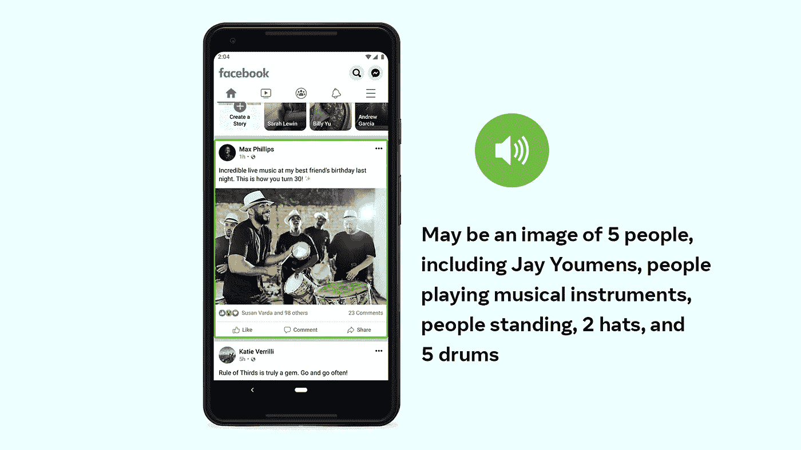

# 你最喜欢的品牌如何使用计算机视觉

> 原文：<https://medium.com/geekculture/how-your-favorite-brands-are-using-computer-vision-26c46b549365?source=collection_archive---------45----------------------->

如果你曾经试图向你的朋友、家人或同事解释计算机视觉是如何工作的，你可能知道这很难做到。如果你开始使用常用术语(例如神经网络、超参数、机器学习)，这一点尤其如此，因为这些术语有时可能会适得其反。它们不但没有增加清晰度，反而使问题更加复杂。

然而，我们知道，计算机视觉已经触及到我们所有的生活，从社交媒体到交通，从网上购物到存储在云端的照片。信不信由你，我们大多数人每天都在与机器学习算法进行交互。

我们并不总是感知到身边计算机视觉的引入，这是可以理解的。这(部分)是由于各地的技术都在进化，以更接近地模仿人类行为:它变得越好，我们就越不会注意到它被我们最喜欢的工具和在线资源所采用。计算机视觉是人类视觉的自动化，人类视觉是我们最基本的、与生俱来的感官之一。

如果你很难说服你的主管将计算机视觉作为一种简化工作流程或提高生产力的手段，或者向你的朋友和家人解释你在一家计算机视觉初创公司的新工作，请跟随。我将举例说明一些知名品牌今天是如何使用计算机视觉的。

# 苹果

*苹果如何使用计算机视觉*

如果你在 iPhone(苹果 Face ID)上激活了面部识别功能，那么每次解锁手机时，你都在本地(在你的设备上)运行一个计算机视觉模型。生物识别认证首次在 2016 年发布的 iOS 10 上推出——该功能真正引人注目的方面是苹果如何成功解决在 iPhone 上运行深度学习算法[的挑战，而不是通过云。](https://machinelearning.apple.com/research/face-detection)

这项技术使用关键点检测或实例分割(计算机视觉中两种常见的模型格式)来识别面部的独特特征。

*Keypoint detection (left) is a core technique in how products like Apple’s FaceID function. Image Credit: Vox*

# 脸谱网

*脸书如何使用计算机视觉*

脸书是计算机视觉领域的领先公司，并在其产品中嵌入了计算机视觉的应用。例如，脸书使用计算机视觉来改善无障碍环境。如果用户失明或视觉受损，脸书能够识别照片中发生的事情，并提供该场景的听觉描述。

一个额外的例子是当脸书帮助你在照片中找到合适的人。通过识别您(或您的朋友)，脸书还可以在欺诈帐户使用您的照片时通知用户。

Facebook uses computer vision to describe images (using audio) for the visually impaired.

# 优步

*优步如何使用计算机视觉*

当疫情袭击时，优步试图找到确保其司机和骑手遵守新制定的健康和安全准则的方法。该公司[创造了一个面具检测模型](https://thenextweb.com/news/uber-introduces-ai-to-make-sure-its-drivers-wear-face-masks)，要求司机在每班开始时给自己拍一张照片。这些自拍照被输入一个计算机视觉模型，该模型被训练来检测面具的存在。

你可以用我们的[公共遮罩数据集](https://public.roboflow.com/object-detection/mask-wearing)创建你自己的遮罩检测器。

# 爱彼迎（美国短租平台）

*Airbnb 如何使用计算机视觉*

Airbnb 每年都会托管其用户上传的数百万张照片。虽然平台上的每个列表可能包括也可能不包括提供的每个便利设施的*，但由 [AirBnb 工程](/airbnb-engineering/amenity-detection-and-beyond-new-frontiers-of-computer-vision-at-airbnb-144a4441b72e)团队在 2019 年开发的机器学习算法旨在弥补这些差距。*

房产照片中的可见物品——包括浴室里的吹风机、厨房柜台上的高压锅，以及室外/室内游泳池——都会在网上列表中注明，即使主人忘了勾选相应的方框。这项工作需要对 40 个班级的 50，000 多张图片进行注释。在我的书里那可是五星好评！

*Computer vision models can help identify features in an Airbnb listing that a host may not otherwise explicitly place in the listing. Image credit:* [*Airbnb*](/airbnb-engineering/amenity-detection-and-beyond-new-frontiers-of-computer-vision-at-airbnb-144a4441b72e)

# 照片墙

*insta gram 如何使用计算机视觉*

流行的照片共享应用 Instagram 是视觉技术的沃土，特别是在更高效(和有效)地管理发布到平台上的内容方面。毕竟，将产品上的垃圾邮件保持在最低水平是确保用户获得良好体验的关键。[研究人员发现了一种被证明特别成功的技术](https://www.tandfonline.com/doi/full/10.1080/00913367.2020.1843091):将图像的标题与计算机视觉模型产生的预测进行比较。如果两者明显不匹配，该照片可能是垃圾邮件。

Instagram 也是更前沿技术的家园，比如生成模型。也就是可以创建完全有机图像的机器学习模型。虚拟时装模特(被称为数字男女)正在出版物、网站、广告甚至社交媒体上慢慢取代现实生活中的模特。

例如，假模特伊马在 Instagram 上有 [5 万名粉丝。她第一次出现在凯特化妆品的广告中，旁边是在日本](https://www.instagram.com/imma.gram/) [*Vice 的* i-D 网站](https://i-d.vice.com/jp/article/j57yqx/virtual-model-imma-tori-kate)的两个(真实)模特。她外表的每一个细节都是由东京的 CGI 公司 ModelingCafe 设计的——从她脸上的灯光到透过她亮粉色(大概是彩色)头发的深色发根。

*Can you guess which of these models is Imma (the “digital girl”) and which is real?*

# 麦迪逊·里德

*麦迪逊·里德如何使用计算机视觉*

网上购物的世界将很快被计算机视觉模型所饱和，这些模型将帮助我们做一切事情，从“试穿”新衣服和鞋子到评估新沙发是否与我们客厅的装饰相配。像麦迪逊·里德这样的公司已经在这方面利用计算机视觉，用它来帮助女性克服选择新发色时最常见的异议:*这个好看吗？*

麦迪逊·里德在 2016 年推出了一个名为[马迪人](https://www.madison-reed.com/blog/meet-madi)的人工智能机器人，这是一个注入了计算机视觉的聊天机器人，可以识别女性的头发颜色，并根据她独特的肤色和肤色推荐搭配。你可以在 Facebook Messenger 应用程序上找到她。这项技术可以与女性向专业造型师/染发师咨询相媲美，而且如果消费者想要那种人情味，还可以根据命令加入第三方。

# 拼趣

*Pinterest 如何使用计算机视觉*

就连 Pinterest 也开始涉足计算机视觉领域。使用新的 [Lens Your Look](https://newsroom.pinterest.com/en/post/introducing-the-next-wave-of-visual-search-and-shopping) 应用程序，Pinterest 用户可以上传自己的照片、他们最喜欢的蓝色牛仔夹克、他们卧室的照片或珍贵的古董花瓶，Pinterest 将预测性地推荐别针或类似的板子，以获得更多灵感。这项技术的与众不同之处在于它的相似物品、风格和装饰理念的主题分组。

*Through the lens: Pinterest helps you find inspiration to match the styles you already love.*

# 谷歌

*谷歌如何使用计算机视觉*

在这一点上，我们大多数人都有跨越几年甚至几十年生活的个人照片库。在所有这些我们宠物的照片和美味佳肴之间，几乎肯定有一些珍宝——如果你曾经经历过无休止地滚动自己的图书馆来找到那张照片的沮丧，你会很高兴地知道计算机视觉已经拯救了这一天。

你现在可以使用搜索栏中的文本提示来搜索你自己的谷歌图书馆；这可能包括寻找你在 Bonnaroo 参加的一场音乐会或你堂兄的高中毕业典礼的照片。就在今天，我在自己的照片库中用它来寻找海滩的照片。

[在这里自己试试。](https://www.google.com/photos/about/)

Google photos allows easy text-to-search for a wide array of features.

# 下一步是什么？

计算机视觉、人工智能和机器学习的进步将推动下一波科技革命。这些工具将继续影响和改善我们生活的方方面面，从医药到零售，从制造到供应链物流。世界各地都有创业公司涌现，准备以各种方式和功能利用这一强大的技术。

> “计算机视觉的应用如此广泛，很难想象有哪家企业会不从中受益。”——[伯纳德·马尔](https://twitter.com/bernardmarr)，[福布斯](https://www.forbes.com/sites/bernardmarr/2019/09/16/what-is-computer-vision-and-the-amazing-ways-its-used-in-business/?sh=8f8945336e17)

这些只是一些轻松的例子，说明计算机视觉已经被我们最喜欢的品牌所使用，当然，我们知道计算机视觉比我们想象的要大得多。[医疗保健](https://blog.roboflow.com/cancer-research-computer-vision/)和[野生动物保护](https://blog.roboflow.com/using-computer-vision-to-count-fish-populations/)、[全球变暖](https://blog.roboflow.com/fighting-wildfires/)和[石油和天然气精炼厂](https://blog.roboflow.com/computer-vision-satellite-imagery-energy/)的领域专家正在努力工作，以创造一个更美好、更安全、更清洁的世界。

**保持领先**

计算机视觉不仅仅是大型科技公司的专利。借助 Roboflow，所有行业的团队都可以部署最先进的视觉技术。[联系我](https://roboflow.com/sales)详细了解这项技术如何用于简化工作流程、降低风险或推动行业发展。