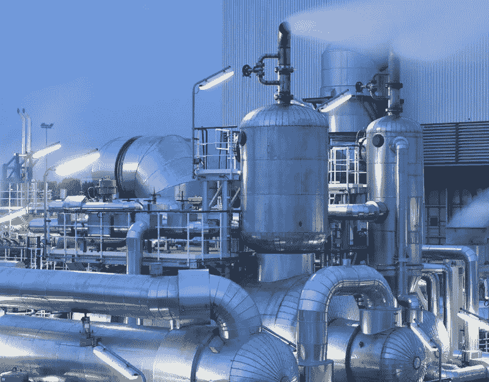
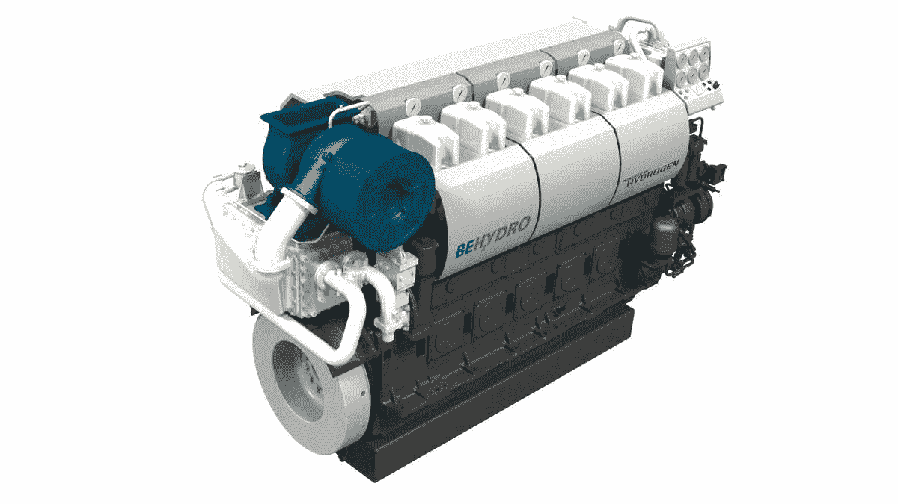
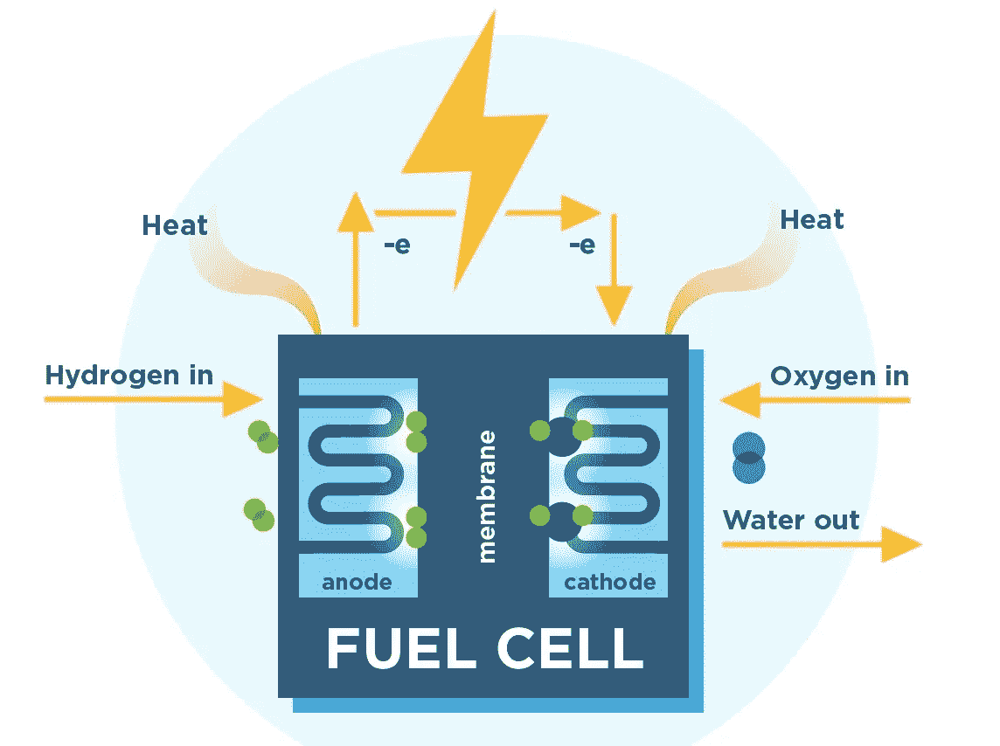

# 氢燃料:但是它是如何工作的呢？

> 原文：<https://medium.com/geekculture/hydrogen-fuel-but-how-does-it-even-work-bcd1fe012ab8?source=collection_archive---------7----------------------->

## 我们来解释一下氢燃料的底层技术。用简单的英语。

氢一直被吹捧为未来的清洁能源，虽然许多人对基于氢的未来的实际可行性持有强烈的意见，但我认为我们都应该欣赏科学家试图使梦想成为现实的创新方法。让我们用简单的英语解释一下。

在我们进入科学之前，让我们后退一步，明确区分你在新闻中看到的关于氢燃料的不同类型的标题。其中之一是氢燃料在内燃机中的应用。以这种方式使用氢燃料与我们目前的汽油动力汽车文化没有太大的不同。我们将不得不在氢气站给我们的汽车加油，这个氢气站将来某个时候会在城市里出现。另一方面，我们有氢燃料电池，它通过氢和氧之间的化学反应储存能量，并直接产生电流，可用于许多应用。虽然这两种方法在生产能源的方式上有所不同，但它们都有相同的结果，即清洁能源。反应的唯一副产品是水。

所以让我们跳进科学。首先，我们必须生产和收集氢气。氢燃料的两种用途都是如此。然后让我们谈谈氢是如何用于工业内燃机的，并解释它与燃料电池的应用有何不同。

# 生产氢气

我们有许多生产氢气的方法。目前，我们生产的大部分氢气是由化石燃料通过蒸汽重整产生的。我知道，我知道…但是事情没有听起来那么糟。其他更清洁的制氢方法包括电解和生物质气化。

## 蒸汽重整

蒸汽重整或甲烷重整将甲烷(CH4，天然气的主要成分)转化为二氧化碳和氢气。虽然这一过程确实会释放二氧化碳，但由于效率提高，与传统的化石燃料燃烧相比，它产生的排放更少。尽管如此，这一过程不是低碳或零碳的，这就是为什么这一过程被称为“灰色氢”而不是“绿色氢”。

## 电解

电解是通过施加强电流将水分子(H2O)分解成氢气和氧气的过程。该过程可以由可再生或不可再生能源提供动力。

## 生物质气化

生物质气化是一种将有机物转化为氢气和其他产品的清洁方法。这些过程中的大多数是在两步非催化过程中完成的，该过程气化固体有机物，然后使其反应以产生合成气，在许多情况下，合成气是主要由氢气、一氧化碳和一些二氧化碳组成的混合物。将甲烷包括在此列表中并不表明这种气体在排放方面有问题，因为它是从天然气中生产的。生物质资源不会将甲烷释放到大气中，因为甲烷在发生任何化学变化之前就储存在有机材料中。生物质气化中使用的有机物包括废料、农业副产品和林业。

## 海藻？

氢气采集方面的一个更具创新性的发展是从藻类中采集氢气。这个想法在 20 世纪 80 年代末首次提出，现在由一家名为绿色燃料技术的公司开发。他们开发了一个藻类农场，利用阳光和大气中的二氧化碳从生长的藻类中获取氢气。然后藻类利用光合作用过程生长，产生富含能量的生物质，可用于燃料生产或肥料。

# 将氢转化为动力

## 氢燃料冰

氢气是一种含有大量化学能的气体。如果你点燃它，它会与空气中的氧气发生反应，并以爆炸的形式释放能量。就像传统内燃机中汽油驱动的爆炸一样，
氢燃料内燃机中高压气体的膨胀直接向活塞等发动机部件施加压力，将化学能转化为功。然而，与汽油动力冰不同的是，氢和氧的反应产生的副产品只有水。

## 氢燃料电池

这是我需要一点技术的地方。氢燃料电池的构造与传统电池非常相似。像传统电池一样，氢燃料电池有一个阴极(含氢)和一个阳极(含氧)。阴极和阳极被催化剂和电解质隔开。氢气想要到达阴极，与氧气反应生成 H2O(水)。但是，电解液只允许正离子通过。这就是催化剂发挥作用的地方。它将电子从氢质子中分离出来，将带中性电荷的氢原子转化为带正电荷的氢离子，氢离子通过电解质流向阴极(储存氧气的地方)。但是它们还不能与氧反应，因为它们失去了电子，从技术上讲，它们不再是氢原子，只是质子。为了促进反应，必须通过一根外部导线，以便电子绕过电解质流向阴极。这种电子流(由于阴极带相反电荷的质子的吸引和阳极带相同电荷的电子的排斥)产生了电流，可以用来为从电动汽车到手机的任何东西提供动力。最酷的部分是什么？只要有燃料和氧气供应，这种电池就能持续发电，不需要充电。如果你没有得到它，这个视频会解释得更好。

## 结论

氢燃料电池清洁、安静，可以为许多东西提供动力。它是车用汽油的绝佳替代品。不幸的是，氢燃料的普及有两个障碍:氢本身的生产(其成本远高于传统汽油)以及缺乏生产和储存氢的基础设施。汽油已经在世界各地建立了基础设施。氢不会。也就是说，我们正在这个领域取得真正的进展，另一篇文章可以专门列出公司克服这些障碍的创新方法。

你怎么想呢?氢气会是未来的发展方向吗？不管你是否相信，不可否认，它背后的科学是迷人的。我希望这能给这个主题带来更多的光亮，让你更加欣赏氢燃料！