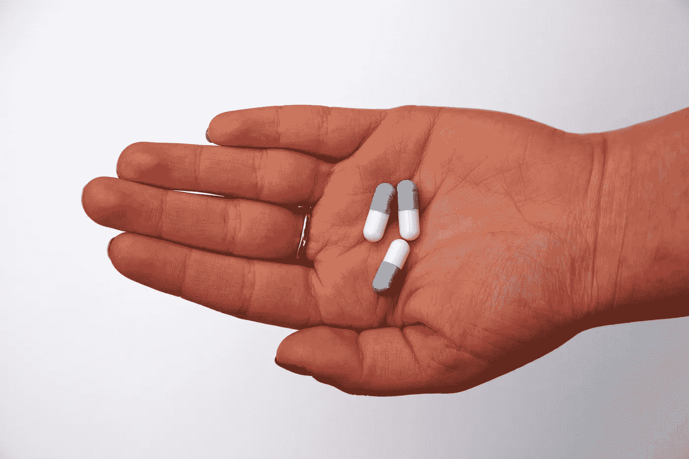

# 假设检验是必须的，除非你有时间机器。

> 原文：<https://medium.com/geekculture/hypothesis-testing-is-a-must-unless-you-got-a-time-machine-103120339bd4?source=collection_archive---------19----------------------->

Photo by [Mark Fletcher-Brown](https://unsplash.com/@markfb?utm_source=unsplash&utm_medium=referral&utm_content=creditCopyText) on [Unsplash](https://unsplash.com/s/photos/which-medicine-is-better?utm_source=unsplash&utm_medium=referral&utm_content=creditCopyText)

# 为什么我们需要假设检验？

假设有某种疾病和药物，比如说药物 A，是人们通常用来治愈疾病的药物。你，某个在医疗部门工作的人，发明了一种新药，比如说 B 药，它有望在恢复时间方面超过原来的药。因此，需要进行实验来判断药物 B 是否比药物 A 更好。

最简单的方法是找到患有该疾病的某一组人(假设 1000 人)，将他们分成两半，并将每组分配给每种类型的药物:使用药物 A 的组 1 和使用药物 b 的组 2。记录每种药物类型的每个患者服药后的恢复时间。

结果发现，服用药物 A 的 500 名患者的平均恢复时间是 20 小时，而服用药物 B 的另外 500 名患者的平均恢复时间是 18 小时。

我们能马上得出 B 药比 A 药好的结论吗？

答案是否定的！

这是因为绝对确定每种药物的性能的唯一方法是让地球上每个患病的人服用药物 A，计算地球上所有患病人群的药物 A 的平均康复时间，这可能需要很长时间，回到过去，对药物 B 进行同样的操作，以获得地球上所有患病人群的药物 B 的平均康复时间，然后进行比较。

换句话说，我们需要将服用药物 A 的患者的总体平均康复时间与服用药物 B 的患者的总体平均康复时间进行比较，以便绝对确定每种药物的性能。相反，与第一个不切实际的情况相比，我们仅获得了服用药物 A 的患者的样本平均恢复时间和服用药物 B 的患者的样本平均恢复时间，样本量相对较小，为 1000 名患者。

因此，如果您没有时间机器来得出绝对正确的结论，至少您有假设检验来判断是否有足够的统计证据来支持服用药物 B 的患者的总体平均康复时间小于服用药物 A 的患者的总体平均康复时间。

# 假设怎么设定？

在假设检验中，首先要做的是你需要设定假设。在这种情况下，如果我们想证明药物 B 是否优于药物 A。零假设应该是服药患者 A 的总体平均康复时间等于服药患者 B 的总体平均康复时间，而备择假设是服药患者 A 的总体平均康复时间高于服药患者 B 的总体平均康复时间(零假设应该包含等号，而备择假设不包含)。你想找到反对零假设的统计证据，来拒绝零假设。

# 什么是类型 1 和类型 2 错误？

根据我们在实验结果中观察到的药物 B 的平均恢复时间比药物 A 短，我们不能马上得出药物 B 比药物 A 好的结论。这是因为它会导致第一种错误，即当我们认为药物 B 比药物 A 好，但实际上药物 A 更好时会出现错误(通常是当假设零假设为真，而拒绝零假设时出现错误)。

此外，由于两种药物的性能之间只有很小的差异，我们仍然不能断定药物 B 和 A 具有相同的性能，因为这可能导致第 2 类错误，即当我们认为药物 A 和 B 具有相同的性能，但实际上药物 B 比药物 A 性能更好时发生的错误(通常是当假设零假设为假，而您未能拒绝零假设时发生的错误)。

# 什么是 P 值？

因为当你从一些实验中得出一些结论时会出现两种类型的误差，所以你需要计算 P 值，它可以从试验统计中确定，包括实验结果和假设的值。

P 值是假设零假设为真时，您观察到实验结果的概率。

在我们的例子中，P 值是我们观察到药物 B 的样本平均恢复时间比药物 A 的样本平均恢复时间少 2 小时的概率，这是因为两种药物实际上具有相同的总体平均恢复时间。

换句话说，P 值指的是我们在药物 B 优于药物 A 的结果中观察到的情况并非来自于药物 B 优于药物 A 这一事实的概率。在 1000 名患者样本量中，药物 B 优于药物 A 的原因可能是多种原因，如随机性或服用药物 B 的患者比服用药物 A 的患者更健康。

因此，我们希望 P 值尽可能的低，以便我们观察到的现象来自随机的可能性低。P 值越低，支持替代假设的证据越多，反对零假设的证据越多。

# P 值应该有多低？

如果 P 值小于显著性水平，我们可以拒绝零假设，其中显著性水平是第一类错误的概率(通常人们使用 5%的显著性水平，这意味着我们有 5%的机会拒绝零假设，但事实上这是真的)。换句话说，如果你观察到的药物 B 比药物 A 表现更好的概率(P 值)来自于随机性，而你认为药物 B 比药物 A 表现更好的概率(假设两者表现相同(显著水平)，你可以拒绝零假设。

一旦你可以拒绝零假设，你不能说药物 B 比药物 a 更好。你只能说，有足够的统计证据在一定的显著水平上拒绝零假设。