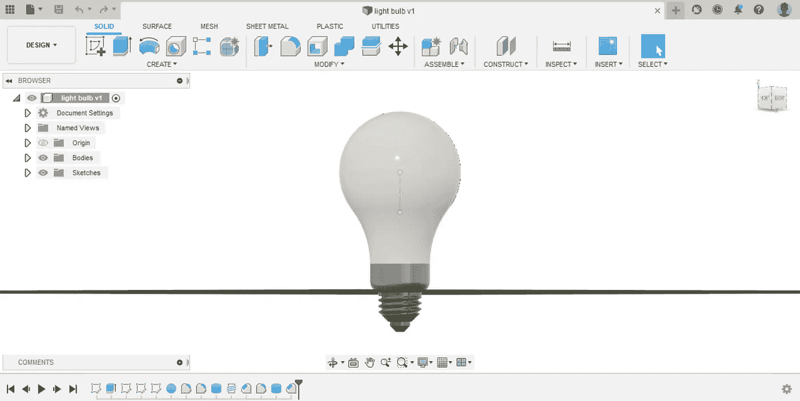
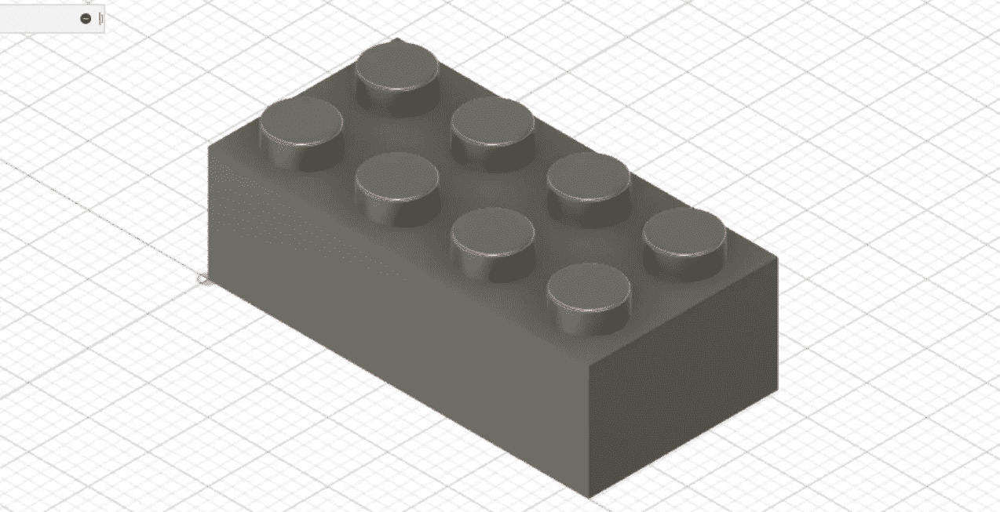
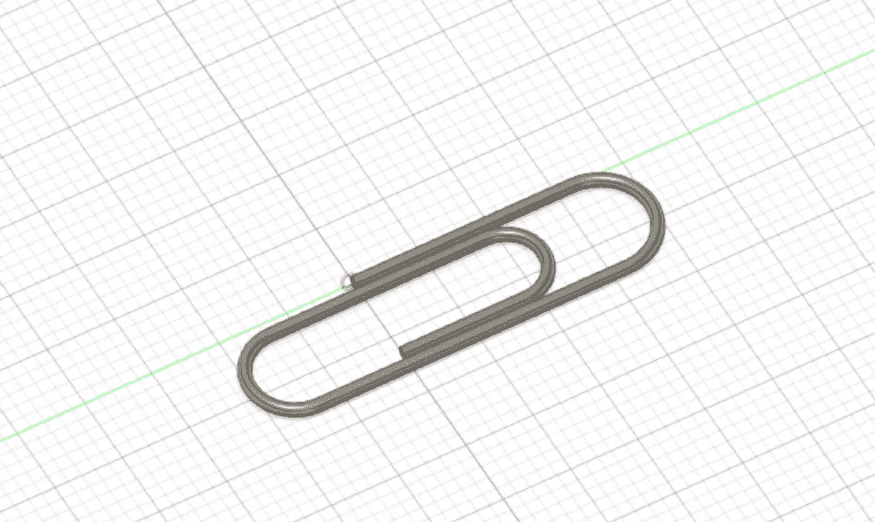
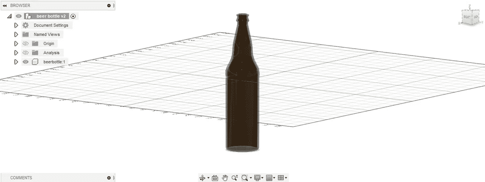
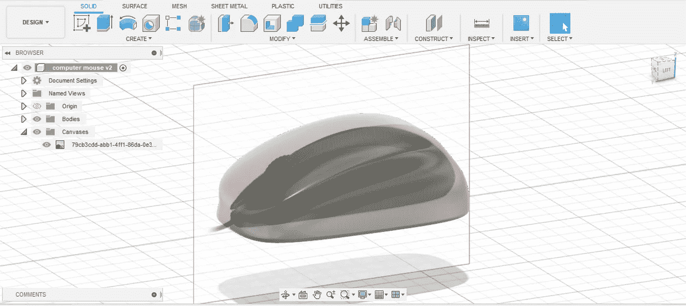
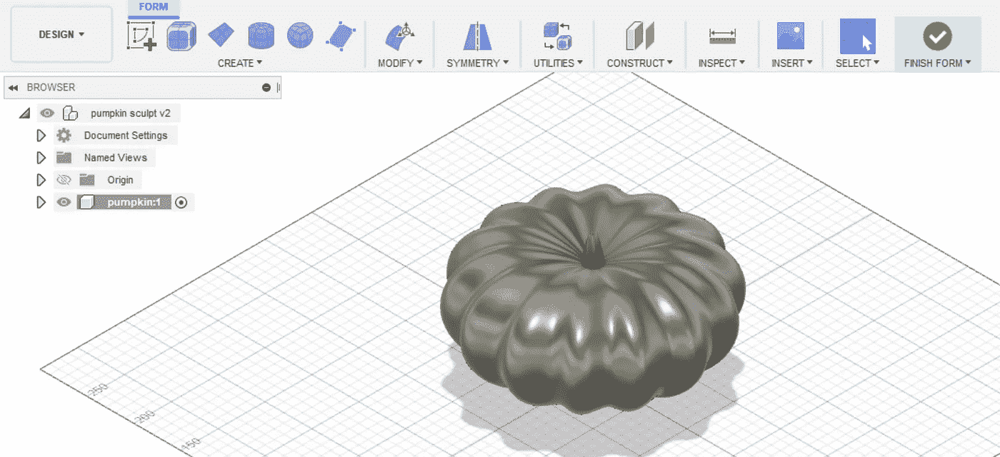
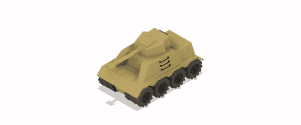
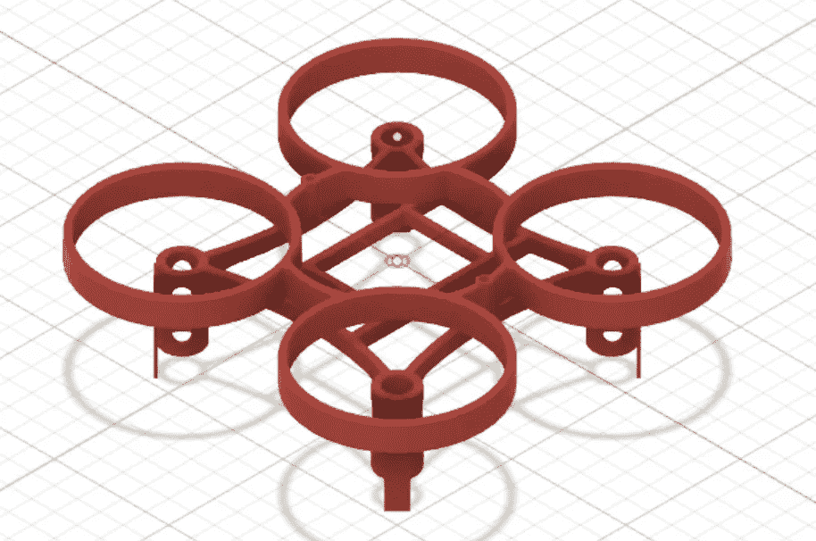
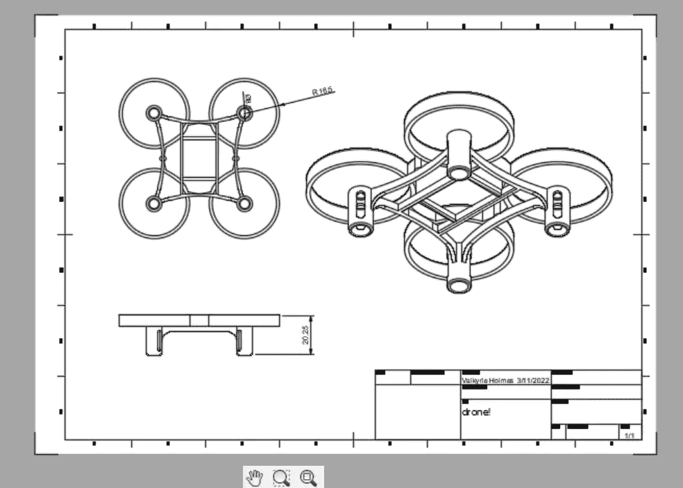
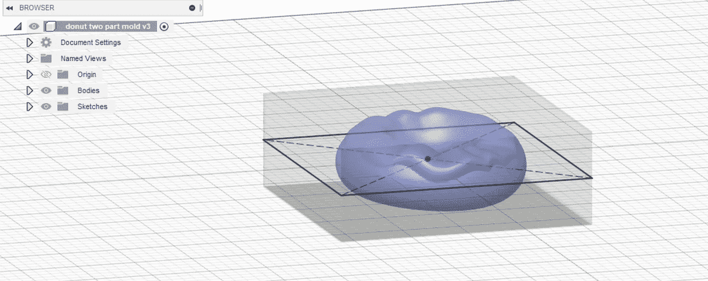

# 我尝试了 30 天的 CAD 建模

> 原文：<https://medium.com/geekculture/i-tried-cad-modeling-for-30-days-c79e509bd7ad?source=collection_archive---------5----------------------->

## 了解 Fusion360 的来龙去脉

> 作者瓦尔基里·霍尔姆斯

如果你关注我有一段时间了，你会知道我过去曾为**做了一个 **30 天的挑战，我非常喜欢这个过程，以及它给我的音乐品味、能力和对艺术的普遍兴趣带来的反思。****

**很长时间以来，我一直想变得更好，我只知道如何从零开始创造东西的非常非常基本的步骤。我从来没有真正研究过技术，除非它是专门针对我正在做的事情，因此，我认为我从来没有学到任何东西或有机会练习。嗯，这肯定改变了过去 30 天！**

**挑战很简单:**每天制作一个 CAD 模型，持续 30 天。不管它有多简单，花了多少时间，只要整整一个月每天都做一个就行了。每天，我都想用它来练习或学习一项新技术，或者探索软件的一部分。只要我让自己接触到新的东西，我就不会太在意我学东西的速度或速度。****

**对于技术建模爱好者和 CAD 爱好者，甚至是任何对我的学习过程感兴趣的人来说，下面是我的学习过程:**

# **开始**

**我从凯文·肯尼迪的[技能分享课程](https://www.skillshare.com/classes/Learn-Fusion-360-in-30-Days-for-Complete-Beginners-2019/1650486259/projects?via=search-layout-grid)开始，凯文·肯尼迪是一位在 3D 建模方面有多年经验的产品设计师。我对 Autodesk Fusion360 更加熟悉，所以我决定下个月重点学习如何掌握 Fusion。他设置了 30 天的课程，但每当他们设置得过于完美时，我总是偏离一点。；)**

**在开始这个挑战之前，我对如何在 3d 空间中创建线条、挤出物体和创建真正不可靠的 2d 草图有一个模糊的想法(这与模型融合没有什么关系，但我离题了)。所以我从第一个演示开始:一个乐高积木。**

**立刻，我知道我会喜欢我的老师。向学生展示一些熟悉和怀旧的东西，一些他们实际上可能首先想要构建的东西，然后再推出所有困难的概念。我看到你在那里做了什么，该死的，成功了。**

****

**第一个模型相对简单。Kennedy 首先解释了我第一次开始使用 Fusion 时错过的所有小事情，例如:**你可以在左侧栏**上单击一下来改变整个模型的单位，以及如何为模型的各个部分创建单独的组件，以便更容易长期跟踪。我以前怎么没用这东西真是疯了。**

**我们开始使用建筑工具，这是我以前从未用过的东西。我们画出了矩形的草图，他开始介绍键盘快捷键，30 天后，我的生活变得简单多了。我们挤出块状物(对于新手来说，**的意思是向外延伸成一个固体形状**，并继续在特定的位置为小块画圆圈。**

**我以前绝对不熟悉的一件事是维度工具。无论您的绘图在模型上的什么位置，如果您想要相对于另一个对象移动它，您可以测量出所需的距离，它就会自动移动。它本质上**省去了你不得不一直重画的麻烦。****

****

**I used a ton of dimensions for this piece :)**

**然后我们开始使用一些其他的工具，肯尼迪区分了剥壳和“洞”的功能。剥壳一个 3D 物体意味着**挖空整个组件，达到你预先勾画的特定厚度。**“孔”功能**创建一个实际的圆形“切割”部分，您可以将它放置在任何地方，以某一深度切割身体。**因此，主要区别在于，孔更多地是针对单个部件，而外壳则是针对更坚固的车身。**

**到教程结束时，我已经可以在多个平面上轻松地绘制，在曲面上进行挤压，使用构造线绘制对称区域，并使用圆角工具几次，使乐高积木在踩踏时不那么疼了(我说了一点点，可惜不足以产生影响。你最终只会得到一个斑点，这一点也不好玩)。**

**第二天，我醒来时对学习有了更大的热情，就像我通常专注于这些挑战时所做的那样。不过，这个很棒。我不得不第一次使用草图点和导入的画布来绘制模型！我下载了一个啤酒瓶的 png 图像，并将其加载到程序中，**开始绘制点，并观察曲线滑动到位，所有这些都是在拟合点样条**的帮助下完成的(也是新东西)。**

****

**Cool glass appearance feature!**

**一旦我想通了，我可以使用旋转工具围绕 Z 轴 360 度旋转 2d 草图，给出一个挖空的瓶子。有一些东西需要修理，一个是必须打开的瓶子的顶部，还有一些鱼片。最后，我们给瓶子一个不同的外观，棕色的彩色玻璃。我对给我的模型一个不同的外观的能力感到很困惑，事实上我可以定制它周围的环境和灯光，这让我很惊讶！**

# **一般流程**

**我不会把我做过的每一个模型都过一遍，那会非常辛苦，我不能让你过一遍。然而，我将讲述我开始一个模型的一般过程和我学到的一些新东西，这些东西本身很酷(当你把它们放在一起时会变得更酷！)**

**在这 30 天里，我学会了如何使用 Fusion360 提供的几乎所有工具。第三天致力于利用扫描功能，它允许您沿着您创建的任何路径绘制 2d 形状。我还使用了比我想象中更多的对称性，制作了许多 2d 模型，然后将它们映射到轴的另一侧。**

****

**Symmetry used for this sculpt (more on sculpting later!)**

**我使用了大量的样本图像来绘制草图，并使用它们来了解某些部分在我的主模型中的位置。也有一些时候，我**导入一张图片作为作品中的模板，我可以挤压它并留下印记。****

**有些设计比其他的更简单，比如灯泡的基本形状(想想球形、圆角、挤压，你基本上就有了整个形状)。有些还可以，但在中途造成了一些麻烦，比如画家的三角。手动添加约束是一件痛苦的事情，但是有时当你掌握了它的窍门，并且理解了为什么需要将它们放在它们应该放的地方，从长远来看，这将使工作变得容易得多。其他的很难，就像处理雕刻的教程一样。**

***天哪，雕刻真是一团糟。***

**我开始雕刻的第一天，我甚至无法向你解释我有多兴奋。他们就是这样做人脸模型和其他东西的！我记得当时在想。但愿我知道这是一门艺术，需要多少年的练习。最初的几分钟让我和我的电脑吵得不可开交，想知道为什么我的脸没有排好，想知道为什么耳塞看起来像一根吃了一半的香肠。**极难控制和预测模特对新手的反应。****

****

**Third attempt!**

**第二天稍微好一点，因为我有了一个模型，我确保完全按照教程进行，这样我就可以看到每次推拉的效果。最后我用雕刻工具做了三个模型(实际上我做了四个，但是其中一个太糟糕了，以至于我们再也不提她了):一个耳塞，一个电脑鼠标，和一个南瓜。第三天的南瓜最成功，给了我对未来的一些希望。**

**在本教程快结束时，我们也开始了解融合的一些更有趣的方面。我不知道有草图绘制功能，你可以标注尺寸，并从多个角度给出你的 3D 模型。还有一个动画功能，你可以制作模型不同部分的动画！我在这个坦克的样本文件上练习过，但是它实际上可以在任何东西上工作。**

****

**在过去的几天里，我的目标是在我的房子里找到随机的物体来建模，测试我的新技能。我尝试的第一个是我的 Tribit pill 扬声器，这是一个绝对可怕的雕刻尝试。真的很可怕。我试图用一些新的塑料外观来掩盖它，使它成为扬声器阵列，但它最终引发了我室友的恐锥症。**

****

**Looks more like a VR headset than a speaker and what on earth is coming out of the side??**

**其余的进行得相当顺利，有些就像电灯开关一样简单，有些则需要更多的工作，比如我必须为其创建七千万个孔的试验板(我不知道为什么我认为这是一个好主意，它几乎使我的整个系统崩溃)。**

**然后，是我最后一件作品的时候了:一个模型无人机框架。**

**我知道我想让无人机成为我的最后一件作品，因为这是我和我的朋友杰西·庞德一起工作了一段时间的一个主要项目。你可以在这里(不要脸的插:)查看我们为萤火虫项目[所做的工作。](https://www.notion.so/PROJECT-FIREFLY-bc33e8f3a82241eb8a3bea7bbe655b1c)**

**我决定按照[航空工程师](https://www.youtube.com/watch?v=R8AOWhn0G3Q)的指导学习他们的微型无人机，然后根据我们的需要进行改进。正是这些事情让我意识到在设计方面我还有很多东西要学。它设置得如此顺利，让一切都联系起来，并测试体重管理和压力，这一切都完美地工作。我渴望像那样从零开始创造一些东西。**

**一旦我完成了设计，我就用三个不同的视图和几个维度制作了原理图。这让我感觉完成了所有的事情，并且能够看到无人机完整的荣耀。**我换了物理材质，换了颜色，把所有部件组合成一体**，最后，*挑战完成！***

********

# **最终外卖**

**这是有史以来最酷的挑战之一。我不仅觉得我对这个项目有了更全面的了解，而且我觉得我可以回顾我做过的所有模型，并对我所取得的进步印象深刻。我从不能使用键盘快捷键发展到现在用 10 多个组件制作动画和组装模型。如果你问我的话，我会觉得这很变态。**

****

**Donut mold I made on the 22nd day!**

**看到一些基本形状有多复杂很有趣。例如，冰块托盘包含的步骤比我最初想象的要多得多。咄，这只是橡胶容器里的一堆方块，有什么复杂的？嗯，你想在需要的时候很容易地把方块取出来，对吗？**里脊里脊里脊。**哦，你不想在从冰箱里拿出塑料时不小心擦到手时被它割伤吧？**把那狗屎切成片。**此外，再切深两倍，你真的想要杯垫那么厚的冰块吗？**

**我对设计和建立设计有更多的了解，我有一项技能，可以无限期地用于我认为合适的任何项目。这是我从未真正想过会像现在这样有用的东西，就像去年 11 月 beat challenge 的结尾一样，我以如此不同的方式看待日常物品和设计过程。就好像我的世界观上覆盖了一层新的理解，这太棒了！**

**现在，我敦促你接受一个 30 天的挑战。你会惊讶于你在这段时间里学到了多少，毕竟，一致性是关键。即使你每天只学一点点，它也会随着时间的推移而积累，到月底，你会比你想象的走得更远。尝试做一些你一直推迟或认为没有时间做的事情，然后去做。也不要等到月初！*越早开始越好。***

# **我的更多信息:**

** [## 小鸟日记

### 与朋友、家人和全世界分享您的视频

www.youtube.com](https://www.youtube.com/channel/UCxHqb3VePs3ABnuPRkgIE9A)  [## @valkyrieholmes | Linktree

### 链接树。让你的链接做得更多。

linktr.ee](https://linktr.ee/valkyrieholmes)**