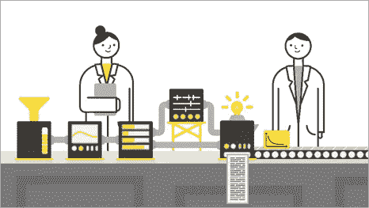

# 我想成为一名数据科学家

> 原文：<https://medium.com/geekculture/i-want-to-be-a-data-scientist-402804fd98fc?source=collection_archive---------15----------------------->

*作者:罗莎丽亚·西里波*

Image produced and authorized by KNIME

我经常从年轻的有抱负的数据科学家那里收到这样的问题:“*我需要什么才能成为一名数据科学家？我在 Coursera 上的三个月课程够吗？我需要学习如何编码吗？我需要学习 Python 吗？我需要多少年的实践经验？*”等许多类似的问题。

数据科学在过去几年中成为最受欢迎的技能之一。数据科学家很受欢迎，报酬也很高。显然，兴趣也增加了。成为一名数据科学家需要什么？你能随机应变成为其中一员吗？转行需要多长时间？

我在 [KNIME](http://www.knime.com) 担任布道负责人。我在 KNIME 做了 7 年的布道者，10 年的数据科学家，和数据打交道超过 25 年。在 KNIME，我已经成功地雇佣了我团队中的大多数数据科学家。尽管所需的经验和背景随着时间的推移已经发生了变化，但在这篇文章中，我描述了我在雇用初级数据科学家时所寻求的基本技能。

**要成为数据科学家，我需要做些什么？**

这个问题是不适定的。数据科学家是一个宽泛的术语，其专业知识涵盖从数据访问和数据存储到机器学习，从仪表板构建和诱人的可视化技巧到 IT 管理，从生产解决方案的部署到维护。几年前,“数据科学家”一词用来表示这些技能，所有这些技能都属于同一个专业领域。现在不是这样的了。随着所需技术数量的增长，数据科学实验室中的专业人员也开始增多:数据工程师、数据分析师、IT 专家，当然还有数据科学家。

**数据工程师。**数据科学实验室活动的很大一部分包括管理数据:存储、访问、更新、版本控制、集成和混合。数据工程师需要熟悉受保护的云资源、免费或付费的 web 服务、大数据存储库、多种类型的数据库以及本地和远程文件。此外，他们必须保证数据的一些基本质量，清除不一致和重复，并为该业务领域实现通用的 KPI。他们还必须定期自动更新和版本化数据集。

**数据分析师**。这个术语收集了在特定领域具有深厚专业知识的所有专业人士，例如金融、医疗保健、物联网或汽车行业。从 IT 或机器学习的角度来看，数据分析师不一定是数据专家，但他们对自己的数据了如指掌:收集流程、业务案例、数据准备技术以及最适合描述具体见解的 KPI。他们通常精通数据可视化技术，因为他们在数据科学实验室中的主要角色是解释问题、监控过程和解释结果。他们是算法、数据、IT 专家和业务涉众之间的必要纽带。

**IT 专家**。数据科学生命周期由两个子周期组成:创建周期，创建多个模型并选择最佳模型；生产周期，将模型应用于生产应用程序(部署应用程序)中的真实数据。除了访问数据存储库和外部服务的权限之外，第一部分不需要太多的 IT 帮助。相反，第二部分，生产周期，需要一定程度的 IT 监管，以建立生产环境，允许部署应用程序访问生产数据存储库，监控模型质量，触发再培训过程，为审计会话和其他类似任务建立日志文件。在大多数公司中，IT 团队中的一个团队致力于数据科学生产领域。

**数据科学家**。最终，实际的数据科学家并没有那么多，也不需要那么多。数据科学家概述整个数据科学流程，实施数据准备阶段，选择、训练和评估机器学习算法，并将 champion 模型打包到部署应用程序中。数据科学家必须掌握构建数据科学管道的艺术，以获得可靠、高效的训练有素的模型，采用数据科学领域的最新最佳实践。他/她必须对机器学习算法以及与每种算法相关的陷阱和警告有广泛的了解。

那么，你到底想成为什么样的人？不同的数据科学角色需要不同数据相关技术的不同专业。

我需要参加特定的课程吗？

记住你选择的职业角色，第二个最常被问到的问题是:“*我有一些数学或数据分析背景。要成为一名数据专家，我需要学习更多的东西吗？一个月的深度学习在线课程够吗？或者我应该参加一个完整的数据科学硕士项目？*”

这很大程度上取决于数据分析和数学背景的深度。了解 Excel 表格和 SQL 指令可能已经不够了。因此，如果你觉得你的背景缺乏现代的数据和数据科学的方法，无论如何你应该参加一些额外的课程。多学点东西从来不会降低成为更好的专业人士的可能性。然而，在一夜之间涌现的大量教育机会中选择哪门课程是另一个问题。

一门完整的数据科学硕士课程可能涵盖数据科学实验室中数据任务的大多数方面。然而，硕士课程时间长，费用高。在各种电子学习平台上，可以获得更短的解决方案，从一周至三个月，有教师指导或自学(例如，参见 KNIME 提供的关于“[深度学习](https://www.knime.com/about/events/introduction-deep-learning-online-apr-2021)”、“[时间序列分析](https://www.knime.com/about/events/l4-ts-introduction-time-series-analysis-online-jun-2021)”和“[机器学习](https://www.knime.com/events/introduction-machine-learning-2107)”的入门课程)。

然而，当你选择这门课程时，要确保它为你的背景增加了一些真正的价值，通过解决你教育中的实际漏洞，同时通过充分深入地探索提议的主题。如果你已经知道机器学习，参加一个关于大数据或部署的课程。反之亦然如果你已经是一个 IT 生产专家，也许你应该多学学机器学习和统计学。如果你两者都不知道，那就先选择你想成为什么样的人，然后再选择第一门课程。

太多时候，候选人在面试时对不同的机器学习算法做了什么，是否有不同于深度学习的机器学习算法，甚至认为深度学习是成为一名完整的数据科学家唯一需要知道的事情。

我需要学习如何编码吗？

第三个问题。"*我知道我想成为什么样的人，我有必要的数据和数学背景。我需要学习如何编码吗？*”

围绕这一点有很多争论。有些人说这是绝对必要的，有些人说他们是活生生的证明，你不需要编码成为一个数据科学家。有许多可靠的开源和闭源数据科学工具。也有很多可靠的无编码或低代码工具。

在我看来，许多这类无编码工具，如开源的 KNIME 分析平台已经被证明是可靠的，并且广泛覆盖了数据科学中所需的数据操作和算法。所以，不。你不需要编码成为一个数据科学家。

然而，没有一个数据科学实验室仅仅依赖于一种工具。通常，采用各种不同的工具。一些工具专门用于某些操作，另一些工具用于其他操作。如果一个工具不够用，那么另一个工具可能会有所欠缺。因此，作为一名数据工程师或数据科学家，不能保证你永远不会在职业生涯中编写代码，但是很有可能你只会在特定的情况下使用代码。

我需要多少年的经验？

*“这都是理论。动手体验呢？我需要有多少年的实践经验？”*

棘手的问题。我们领域的知识和经验很快就会成熟和过时。在分析数据、使用机器学习、生产应用程序方面的两年经验已经非常宝贵，因为大多数新技术、新算法、新工艺和最佳实践可能都不会超过两年。也就是说，以前的一些实践经验总是值得赞赏的。

如果你正在申请一份数据科学的工作，试着在黑客马拉松、免费项目或竞赛中获得一些经验。这已经是一段可以在简历中展示的宝贵经历了。

**接下来最重要的步骤**

到目前为止，我们所写的都是在数据领域建立职业生涯的经典建议。这还不是全部。在我多年管理数据科学家的经验中，我注意到其他一些技能在团队中数据科学家的成功发展中发挥了重要作用。

好学和好奇的态度可以带你走很长的路。在数据科学中，知识不断发展，您的经验很快就会过时。一种倾向于学习的态度，除了让人耳目一新之外，还能让你在游戏发生变化时保持领先。请记住，你可以在任何地方从任何人那里学习新技能和新技术:在课程上，在网络研讨会上，从同事那里，从老师那里，从似乎与你当前业务无关的领域，从媒体，从博客，等等。预留一些时间定期学习一些最新的技术是一个很好的做法。

经验也是在工作中成熟的。学习更多新兴技术的时间也必须来自工作。你的第一份数据科学工作中最令人向往的特征之一是一个好老板。明智地选择你的第一份工作，因为这是你职业生涯未来的起点。一个充当导师的老板是一个技术进步和塑造你职业角色的绝佳机会。所以，明智地选择吧。