# 使用 ReactJS、Unsplash API 和 cloudflare worker 的图像搜索应用程序

> 原文：<https://medium.com/geekculture/image-search-application-using-reactjs-unsplash-api-and-cloudflare-worker-6c152245310d?source=collection_archive---------23----------------------->


Photo by [Alienware](https://unsplash.com/@alienwaregaming?utm_source=unsplash&utm_medium=referral&utm_content=creditCopyText) on [Unsplash](https://unsplash.com/s/photos/desktop?utm_source=unsplash&utm_medium=referral&utm_content=creditCopyText)

在这篇文章中，我们将构建一个图像搜索的应用程序。我们将从 Unsplash API 获取图像，前端将在 ReactJS 中，我们将使用 cloudflare 的无服务器功能作为后端。

这些称为 Cloudflare worker，它们允许您创建应用程序并将其部署在 it 的边缘网络上。

设置 cloudflare 帐户和安装 wrangler 的过程在我之前的帖子[这里](https://nabendu82.medium.com/build-a-serverless-application-using-cloudflare-worker-f71017093b86)中提到过。

我们将使用**牧马人生成**命令创建一个新项目，如下所示。

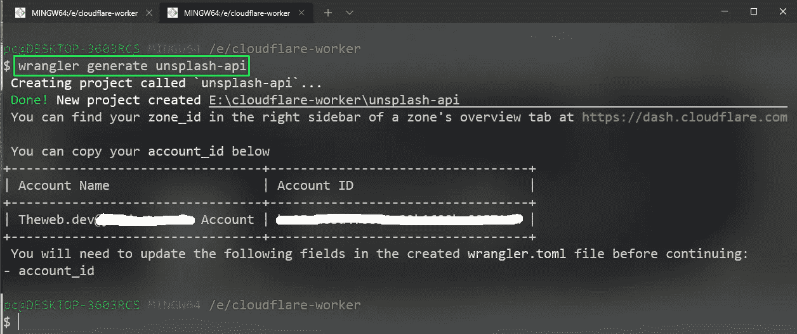

wrangler generate

现在，导航到文件夹并在 VS 代码中打开项目。打开 **index.js** 文件。文件的细节在我之前的文章[中再次提到。](https://nabendu82.medium.com/build-a-serverless-application-using-cloudflare-worker-f71017093b86)

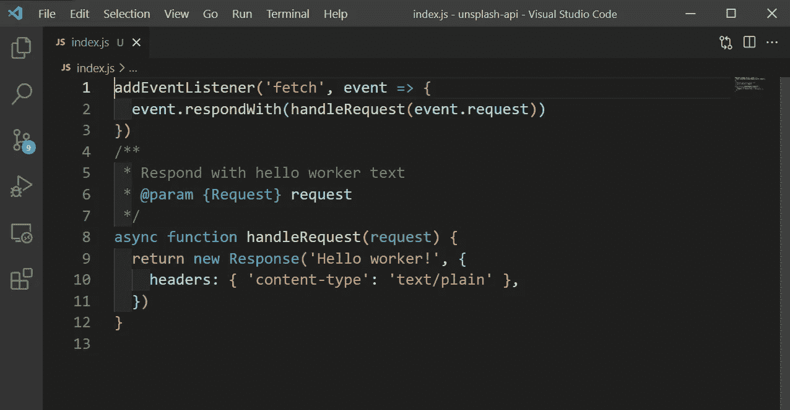

index.js

现在，我们将我们的项目发布到 Cloudflare CDN 网络，但需要在配置文件中设置帐户 id。因此，再次运行 **wrangler whoami** 并获取帐户 id。


wrangler whoami

将帐户 id 放在 **wrangler.toml** 文件中，这是我们的 wrangler 项目的配置文件。


wrangler.toml

现在，让我们通过 **wrangler 发布**命令来发布项目。


wrangler publish

上面的命令给了我们一个链接，当我们在浏览器中打开它时，我们会看到 **Hello worker！**文本，来自 **index.js** 文件。


Hello Worker

现在，我们将把请求方法改为返回 json。各种请求方法可以在[这里](https://developers.cloudflare.com/workers/runtime-apis/request#methods)从官方文件中找到。


json

现在，在 **index.js** 中，我们将修改我们的 handleRequest 函数来返回一个 json。


index.js

我们现在将在本地测试它，为此打开终端并运行 **wrangler dev** 。它构成了在本地主机 url 运行的应用程序。


wrangler dev

现在，打开另一个终端并运行下面的命令。您可以看到它返回了查询体:tech。

因此，它从我们的请求中获取数据，解析它并作为响应返回。


curl

只是为了确保它像我们期望的那样工作，我们将在我们的身体之外析构 query。然后在查询字符串中将它作为响应返回。

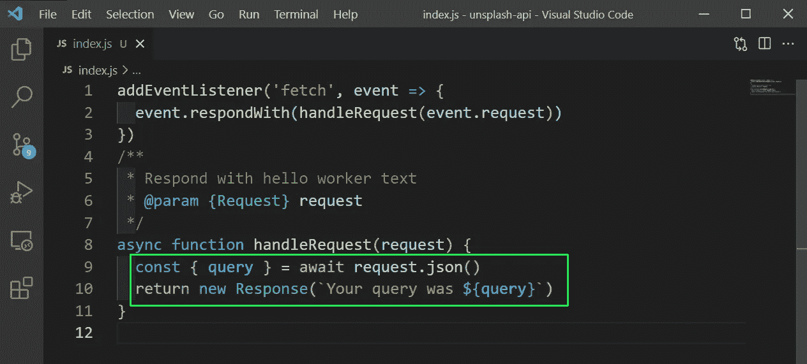

query string

现在，再次运行 curl 命令，我们将返回查询。


query back

fetch API 允许我们在工作函数内部向其他服务器和 API 端点发出请求。

我们将在我们的项目中使用 unsplash API。因此，转到[https://unsplash.com/oauth/applications](https://unsplash.com/oauth/applications)并点击**新应用**。

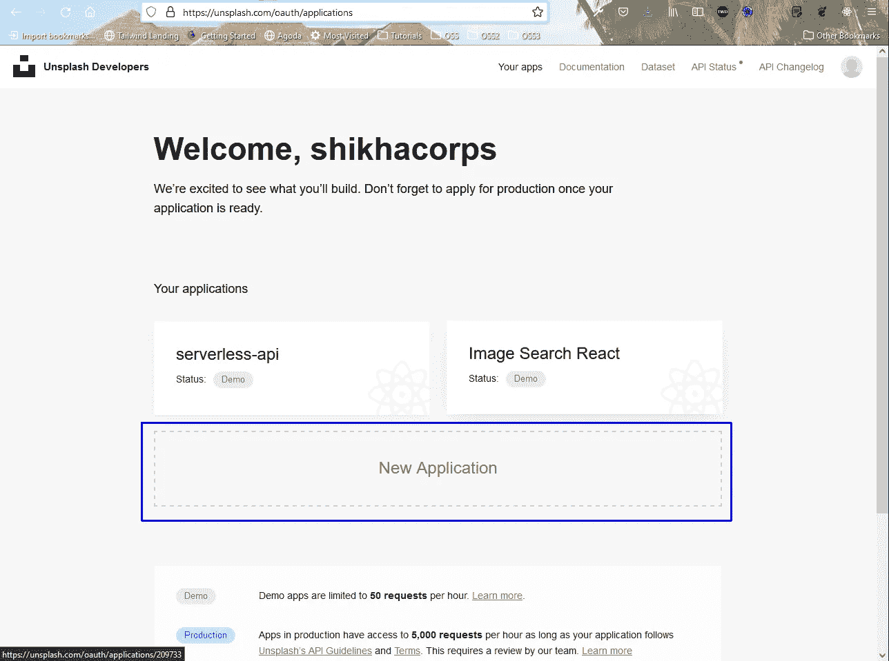

New application

在下一页中，点击复选框，然后点击**接受条款**。

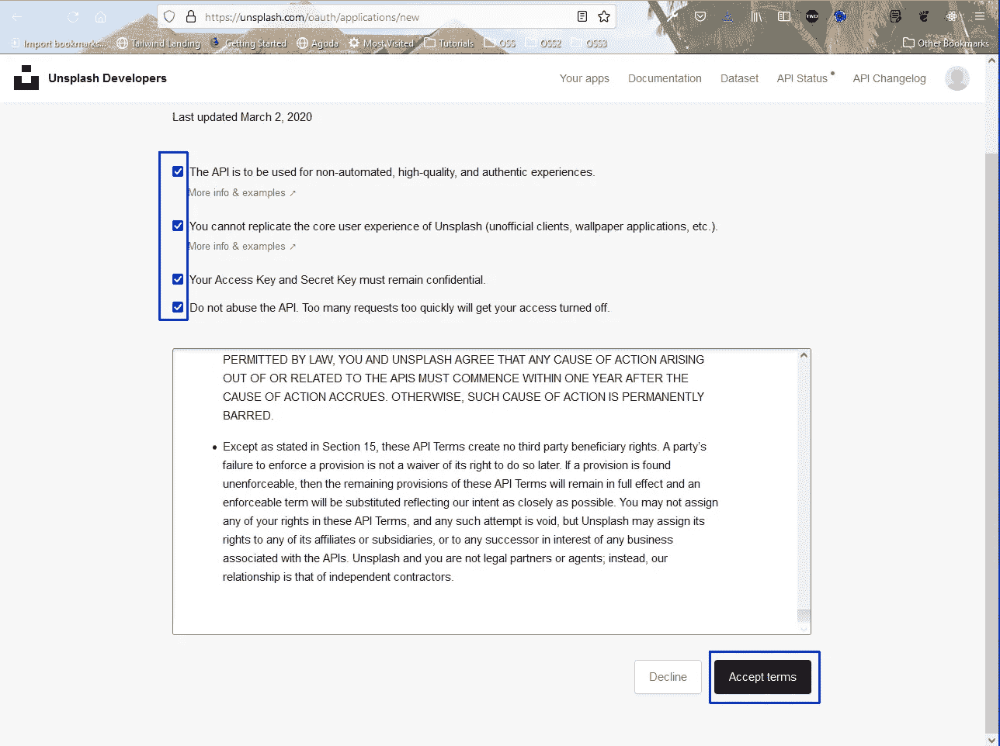

Accept terms

接受条款后，会出现一个弹出窗口，给出应用程序的名称和描述。


Name and description

它给了我一个错误，因为我们不能使用 unsplash 名称。


Unsplash error

所以，我给它起了个名字 **images-cloudflare-worker** ，然后点击创建应用程序。

在下一个屏幕中，向下滚动一点以获得**访问密钥**和**秘密密钥**。

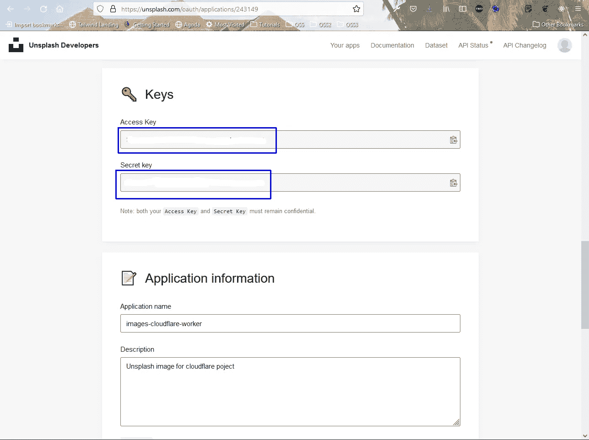

Access and Secret Key

现在，回到 **index.js** 使用内置的 fetch api 对 unsplash api 进行 api 请求，其中我们需要传递 Client-ID。

这里，我们在 CLIENT_ID 中对上一步中的访问密钥进行了硬编码。我们很快将改变它，使用牧马人的秘密。

一旦我们得到数据，我们只是返回一个响应。

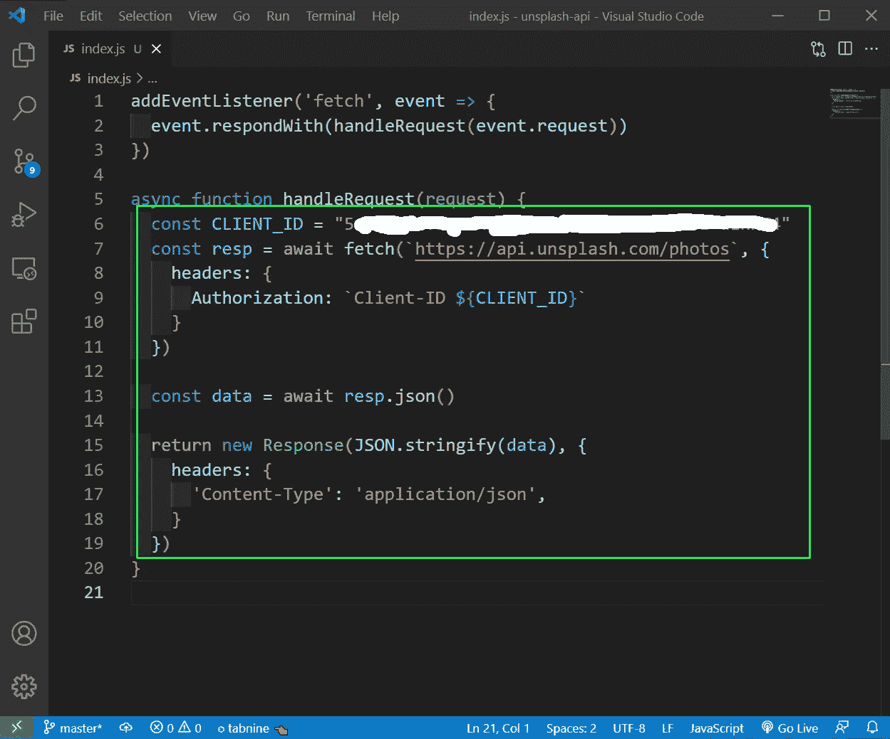

API call

现在，回到终端并运行 curl[http://127 . 0 . 0 . 1:8787](http://127.0.0.1:8787)命令，它将从 unsplash api 返回数据。

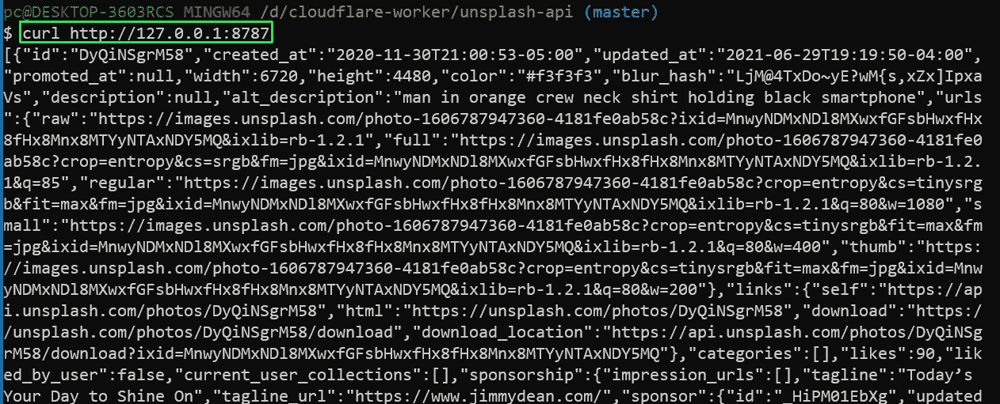

curl

现在，读起来有点吃力。所以，我安装了一个在线 json 处理器工具，名为 jq。它以更好的格式向我们展示数据。

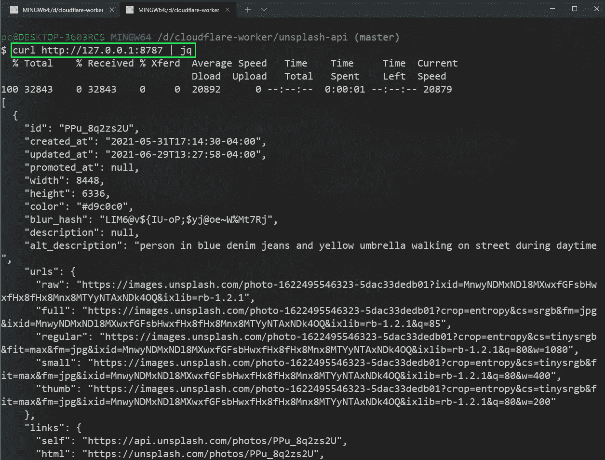

jq tool

如前所述，将秘密放在 **index.js** 文件中并不是好的做法。因此，我们将删除硬编码值。

之后，在终端运行 **wrangler secret，输入 CLIENT_ID** ，然后在其中输入访问密钥。

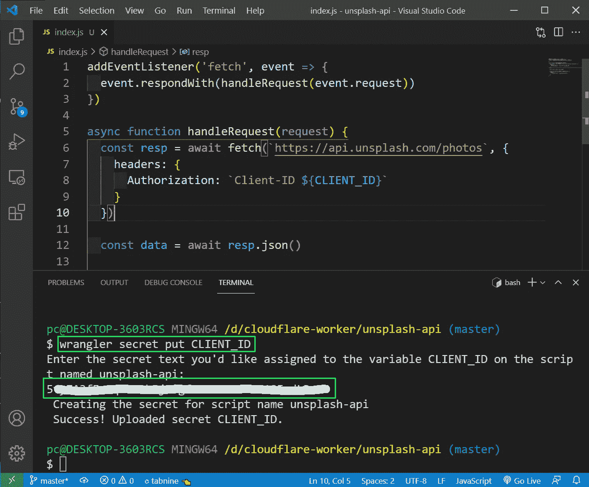

Secret

之后，牧马人发布并访问已部署的 url，我们将看到 unsplash 的响应。

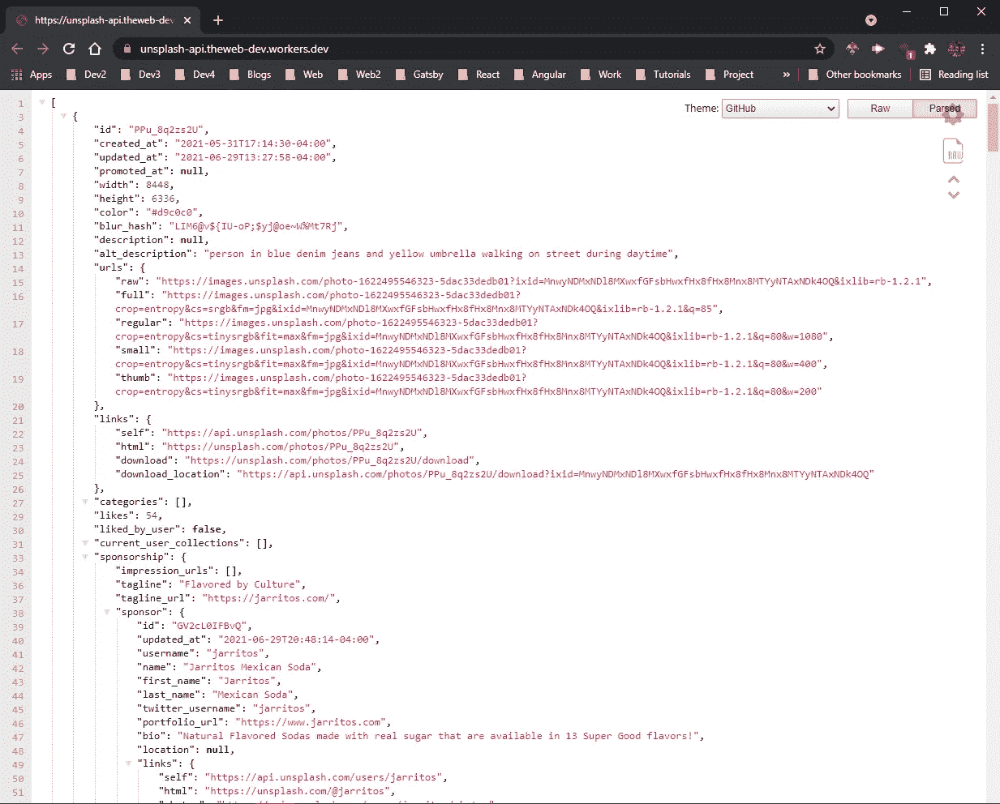

Response

现在，由于我们要创建一个搜索应用程序，我们将使用 unsplash 的搜索 api。我们再次获取查询并将其传递给 api。

之后，我们也从数据中获得所需的 id，图像和链接。然后作为响应返回图像。

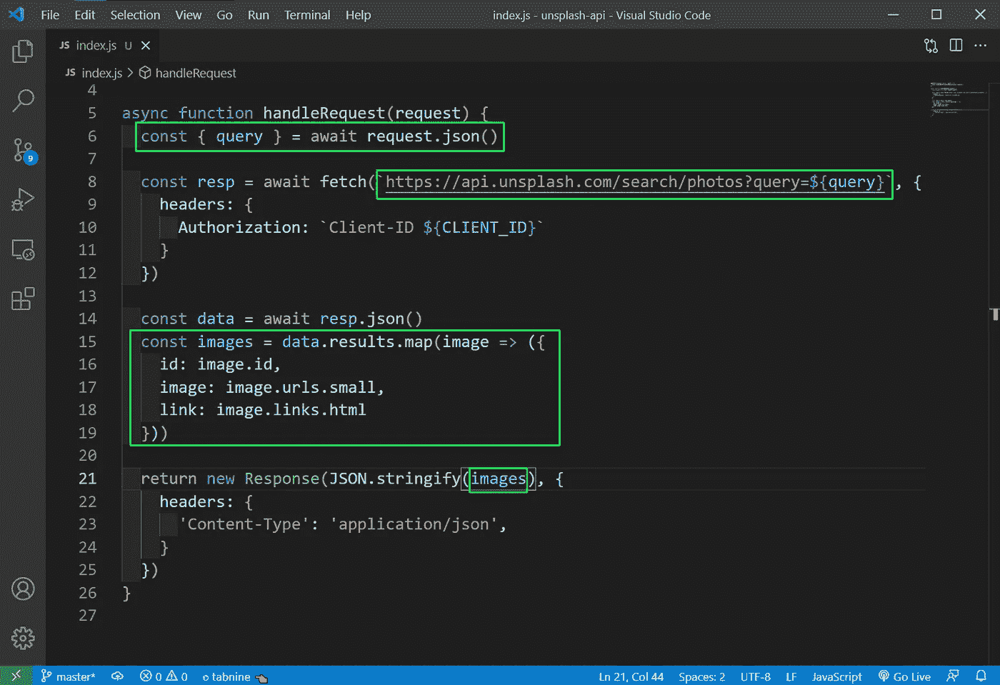

Returning images

现在，在终端中运行 curl 命令，类似于我们之前运行的命令，我们将获得 id、图像和链接作为响应。

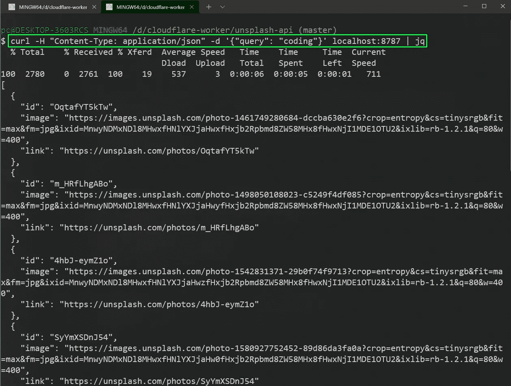

Response

现在，API 端点已经完成，是时候创建我们的前端 React 应用程序了。所以，打开你的终端，通过**npx create-react-app unsplash-viewer-react**创建一个新的 react 应用


create-react-app

react 应用程序创建完成后，在 VS 代码中打开它，用 npm start 启动它。

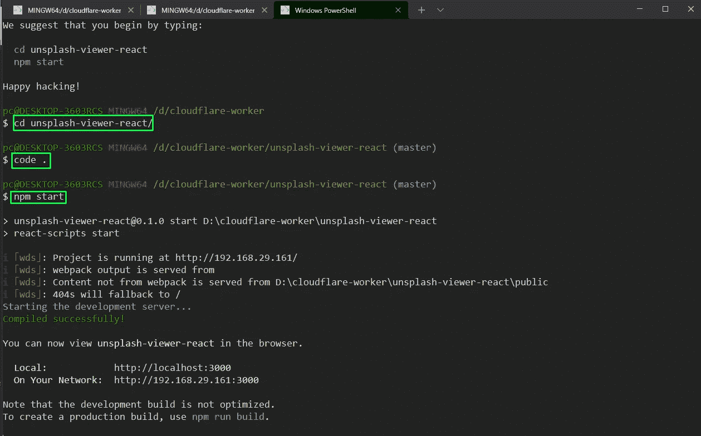

React app

一个 react 应用程序带有大量的模板代码。选择它们，右键单击并删除它们。

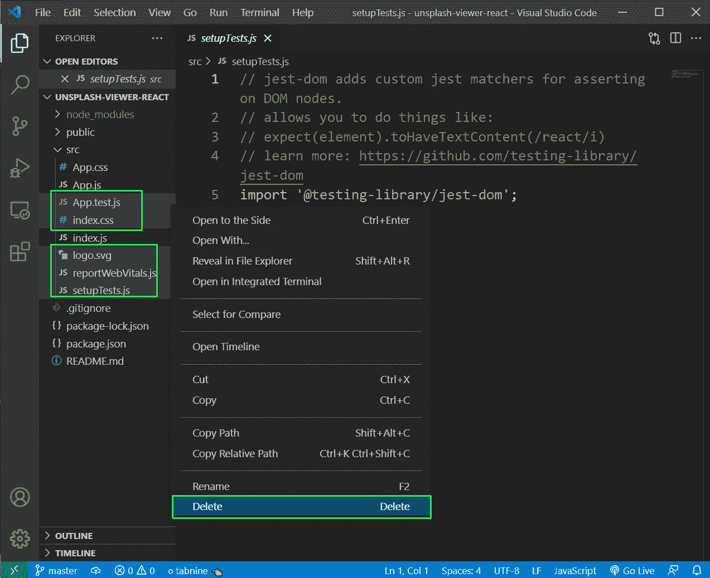

Delete

现在，我们的 **index.js** 也会包含更少的代码。该文件将如下所示。


index.js

现在，在 **App.js** 文件中，我们将首先拥有一个函数 **getImages** 。这个函数发送一个 POST 请求。到我们用于 worker 的 API。

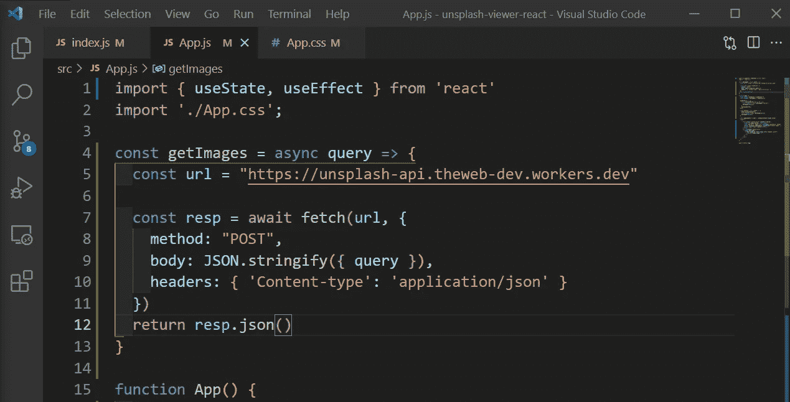

getImages

接下来，我们将设置查询和图像两种状态。我们还有一个 useEffect，它用编码查询调用 getImages。同样，在 setImages()中设置结果。

之后，我们有一个搜索功能。它使用用户输入的查询来调用 getImages 函数。同样，在 setImages()中设置结果。

此外，还有一个 updateQuery 函数，它将查询设置为用户输入的值。


query

在 return 语句中，我们有一个表单，它的 onSubmit 调用搜索函数。然后输入框调用 updateQuery 函数。

在表单之后，我们有一个 imgContainer div，映射所有图像并显示它们。


Form

在 **App.css** 中放置项目的样式。用以下内容替换之前的内容。

```
.flexContainer {
  display: flex;
  justify-content: center;
  align-items: center;
  border: 1px solid black;
}.inputStyle{
  font-size: 1.5em;
  padding: 3px;
  display: inline-block;
  margin-left: 5px;
  width: 30%;
}button {
  cursor: pointer;
  margin-left: 5px;
  background-color: #4CAF50; /* Green */
  border: none;
  color: white;
  padding: 10px 32px;
  text-align: center;
  text-decoration: none;
  display: inline-block;
  font-size: 16px;
  box-shadow: 0 8px 16px 0 rgba(0,0,0,0.2), 0 6px 20px 0 rgba(0,0,0,0.19);
}img {
  height: 300px;
  object-fit: cover;
  width: 400px;
}.imgContainer {
  display: flex;
  justify-content: center;
  align-items: center;
  flex-wrap: wrap;
  margin-top: 5px;
}
```

现在，我们在 localhost 上运行的 react 项目将显示这个漂亮的搜索栏。


Nice Search

现在，搜索任何术语，但不会显示任何内容。在检查网络选项卡时，我们看到了 CORS 错误。当鼠标悬停在错误上时，显示“跨原点资源共享错误”。


CORS error

为了解决这个问题，我们需要在我们的无服务 API 中提供一个 Access-Control-Allow-Origin 头。它告诉允许从提到的来源访问。

在我们的 worker **index.js** 文件中，首先添加一个 cors 头，允许通过 POST 方法和所有 origins 进行访问。


index.js

接下来在 **handleRequest** 函数中，我们首先检查请求方法是否为 OPTIONS。在这种情况下，我们将发送 corsHeader。

如果方法是 POST，那么我们前面的所有逻辑都会失效。响应也随 corsHeader 一起更新。

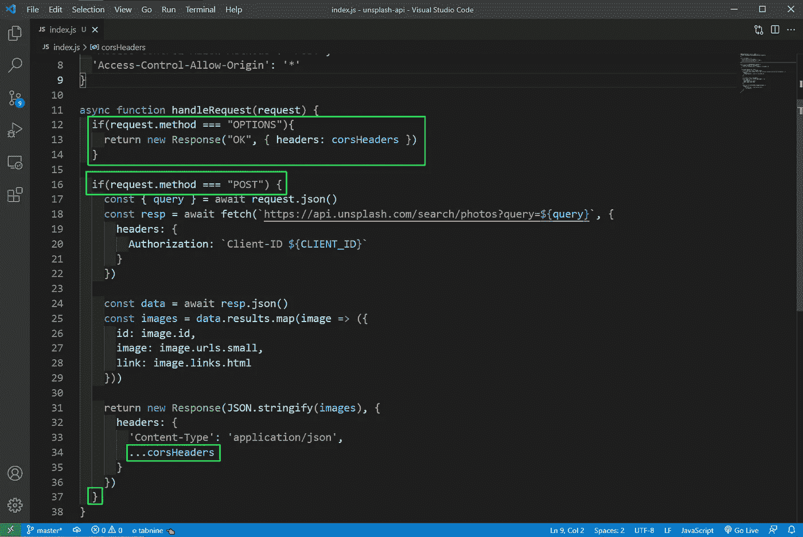

index.js

之后做**牧马人发布**。接下来，如果我们进入我们的应用程序，我们将看到来自 unsplash 的图像，搜索也将正常工作。


Working Great

现在，我们将使用 Cloudflare 页面部署 React 应用程序。为此，我们需要首先将我们的 React 应用程序推送到 github。

之后，转到您的 cloudflare 控制面板并单击页面。点击**创建项目**按钮。

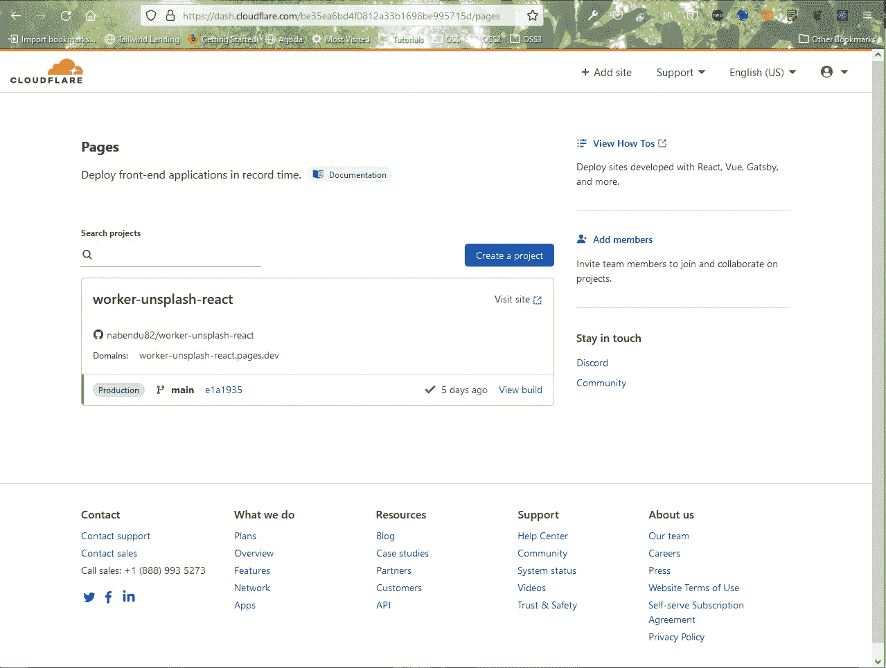

Pages

在下一页中，点击**添加账户**按钮。


Add account

它将打开 Github 帐户。选择 github 存储库并保存。


Github repository

它将带我们回到 cloudflare，在那里我们可以看到新的存储库。点击储存库并按下**开始设置**。

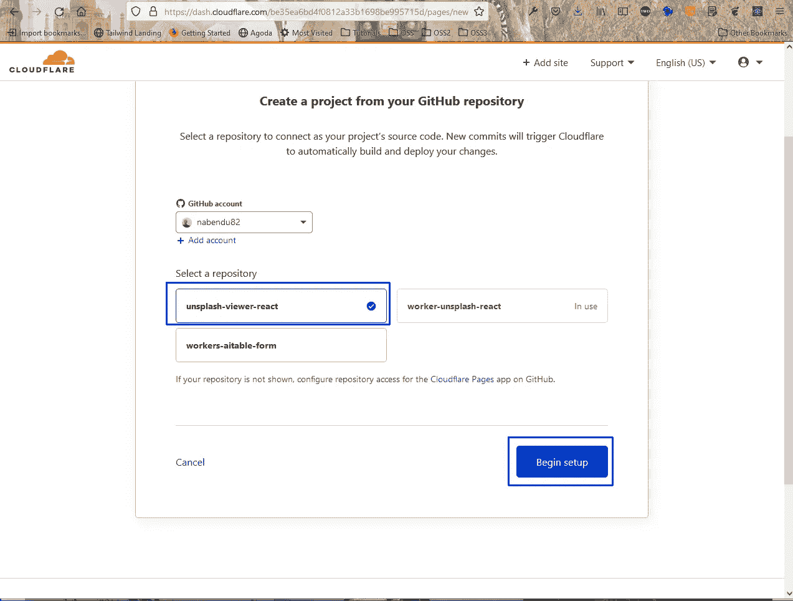

Begin Setup

在下一页，我们需要选择框架预置为 **Create React App** 。它将填充所需的命令。

之后点击**保存和部署**按钮。

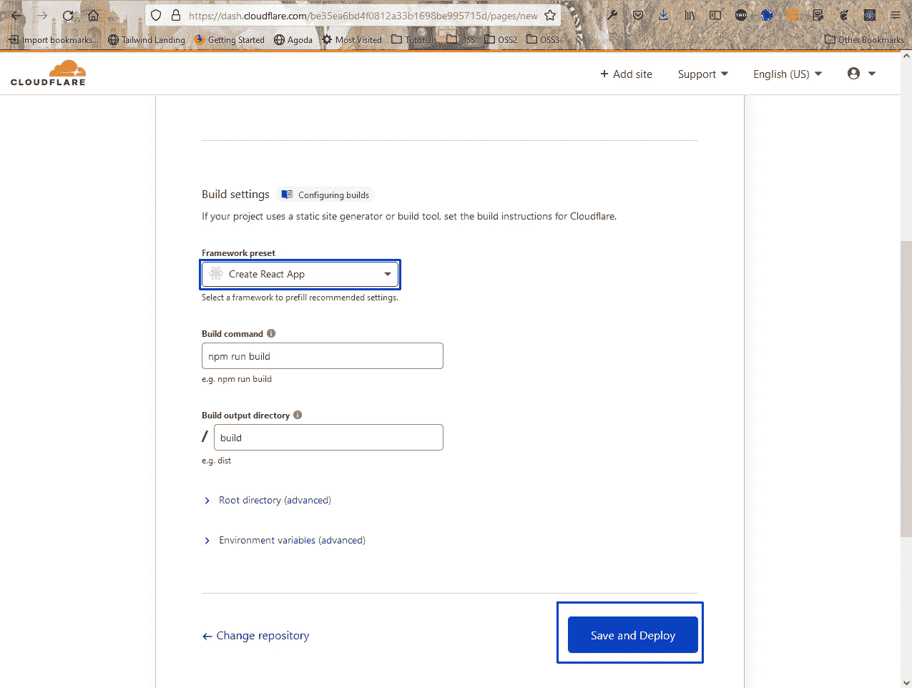

Save and Deploy

我们将在一段时间后收到成功消息。向下滚动并点击**继续投影**按钮。

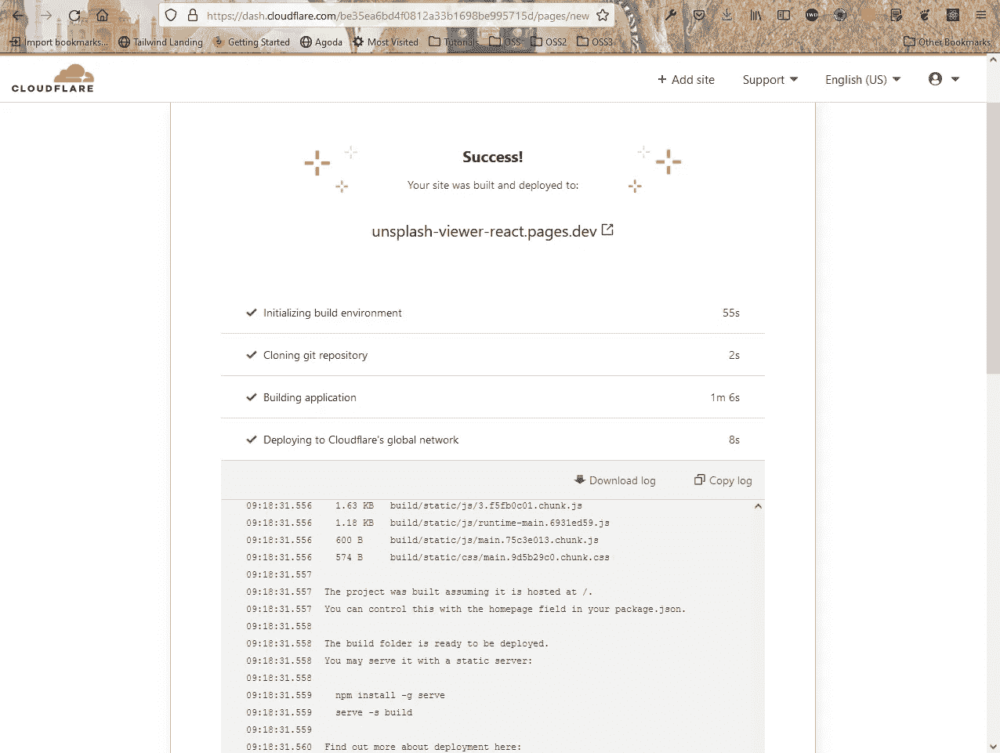

Sucess

我们将在下一页获得我们应用程序的链接。点击它，我们的应用程序从部署的网站工作正常。


Deployed

这个项目的 github repos

[https://github.com/nabendu82/unsplash-viewer-react](https://github.com/nabendu82/unsplash-viewer-react)T22[https://github.com/nabendu82/unsplash-api-cloudflare](https://github.com/nabendu82/unsplash-api-cloudflare)