# 在 Swift 中实施 OAuth2 PKCE

> 原文：<https://medium.com/geekculture/implement-oauth2-pkce-in-swift-9bdb58873957?source=collection_archive---------2----------------------->

在这篇博文中，我将教授并分享一个用 Swift 编写的 OAuth2 PKCE 实现。这个实现可以用一个利用 Auth0 免费服务的 iOS 应用程序来测试。我将解释如何注册您自己的帐户，并修改测试应用程序以使用您的帐户。

注意:我写这篇博文是出于研究目的。我鼓励你根据你所使用的服务来使用现有的 SDK。

# PKCE

OAuth 框架为不同的用例指定了几种授权类型。常见的有

*   授权码:机密客户端和公共客户端使用授权码来交换访问令牌。
*   客户端凭据:由客户端用来获取上下文之外的访问令牌

但是还有很多，包括 OAuth 公共客户端的**P**roof**K**ey for**C**ode**E**xchange。

PKCE ( [RFC 7636](https://tools.ietf.org/html/rfc7636) )是对授权代码流的扩展，用于防止跨站点请求伪造(CSRF)和授权代码注入攻击。

该技术包括客户端首先创建一个秘密，然后在用授权码交换访问令牌时再次使用该秘密。如果代码被截获，它就没有用了，因为令牌请求依赖于初始秘密。

更熟悉相关步骤的一个好方法是使用 OAuth 2.0 平台上的 [PKCE 示例](https://www.oauth.com/playground/authorization-code-with-pkce.html)。

下面是 Auth0 公布的的序列图[直观说明。](https://auth0.com/docs/authorization/flows/authorization-code-flow-with-proof-key-for-code-exchange-pkce)

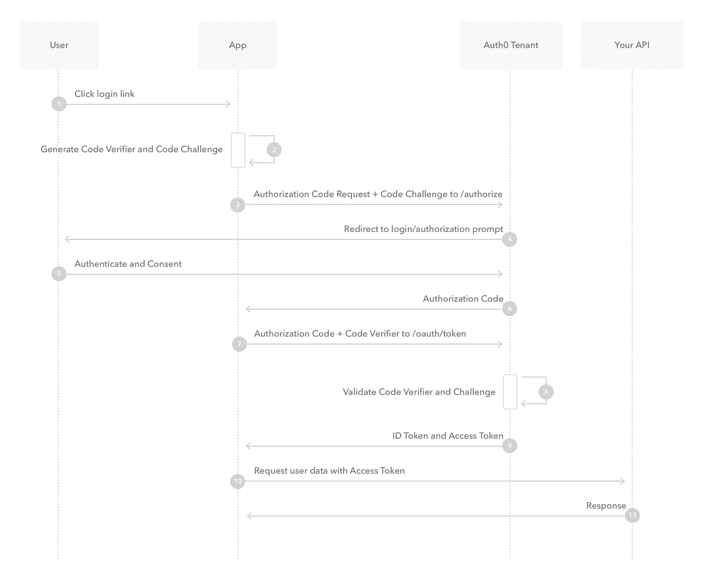

Auth0 还创建了一个关于构建您自己的解决方案的有用指南，作为使用 PKCE 的授权代码流添加登录指南的一部分。

# 快速实施

我将在一个类中实现所有必要的步骤。

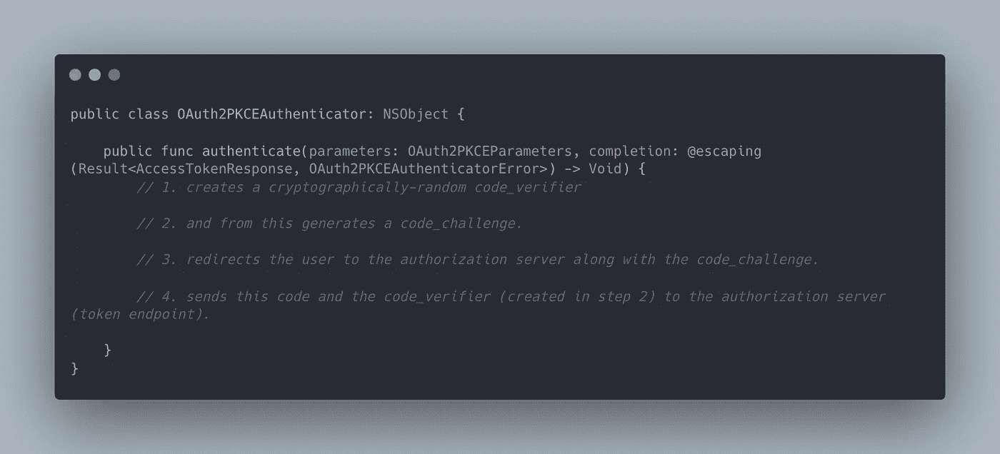

Encapsulate OAuth 2.0 PKCE client handling in a single class

所有需要的参数都将作为结构传递给该类。

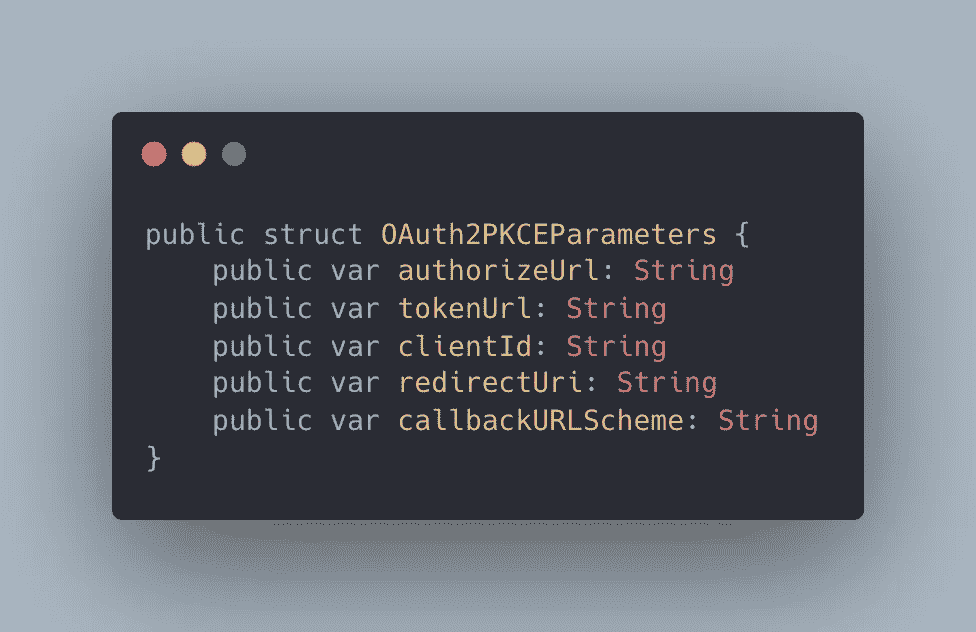

Encapsulate parameters in a struct

该函数应异步返回来自授权服务器的访问令牌响应或错误。

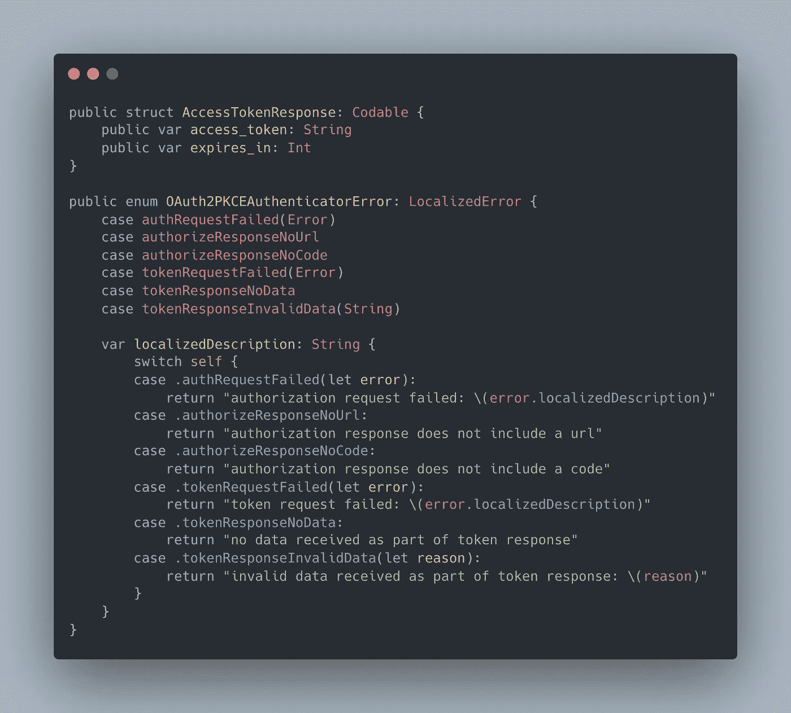

Return types

为了将用户和`code_challenge.`一起重定向到授权服务器，我将使用苹果`AuthenticationServices`的`ASWebAuthenticationSession`。

完整的实现可以在[这里](https://github.com/MarcoEidinger/pkce-ios-swift-auth0server/blob/main/AppUsingPKCE/OAuth2PKCEAuthenticator.swift)找到。

# iOS 测试应用

我创建了一个 iOS 测试应用程序来验证 PKCE 实现。为了开始流动，用户将触摸一个按钮。然后将执行下面的代码。

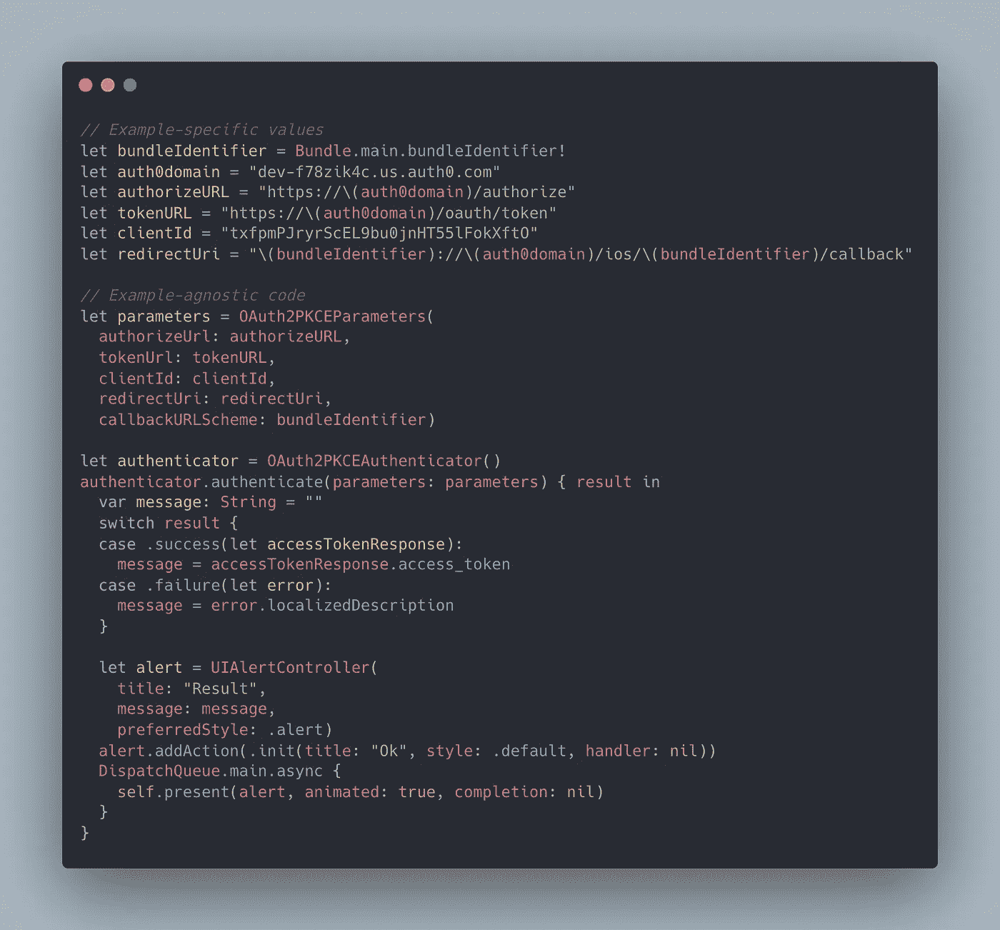

测试应用程序的完整代码可以在我的 GitHub 仓库中找到。

 [## GitHub-MarcoEidinger/pkce-IOs-swift-auth 0 server…

### 此时您不能执行该操作。您已使用另一个标签页或窗口登录。您已在另一个选项卡中注销，或者…

github.com](https://github.com/MarcoEidinger/pkce-ios-swift-auth0server) 

应用程序用于测试的授权服务器来自 Auth0。我将在下一章解释如何创建自己的账户。不用担心，这很简单，而且是免费的。

# 使用 Auth0 测试环境

使用您现有的 GitHub 帐户注册 Auth0(免费启动计划)既快速又简单

Sign Up for Auth0 account. It’s free

然后，您可以选择一个地区并创建您的 Auth0 帐户。

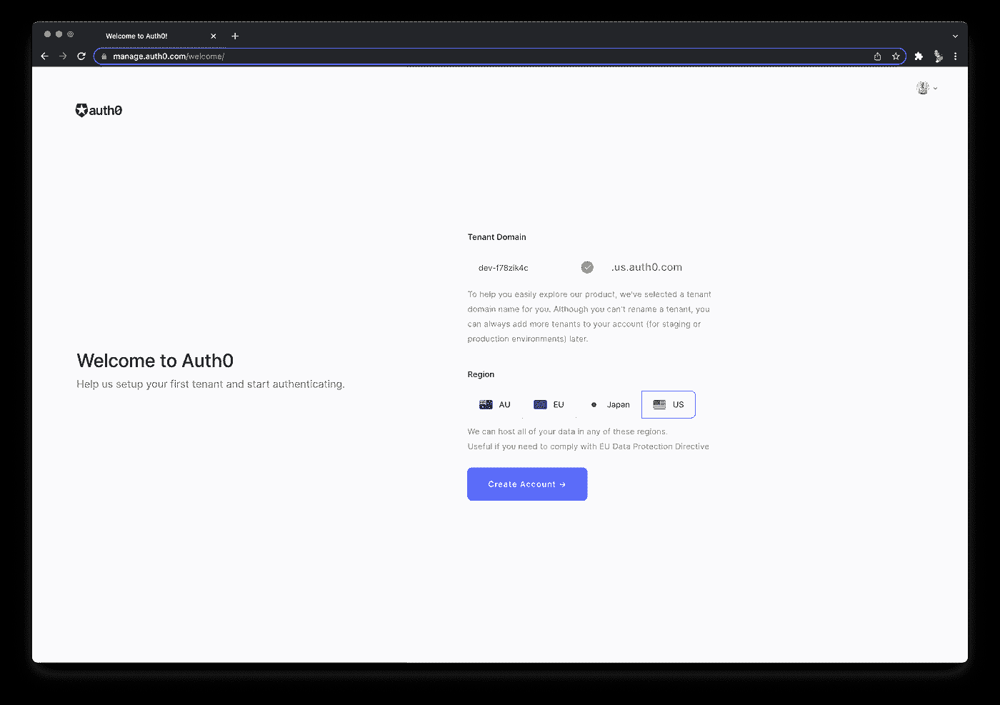

Choose a region for your tenant

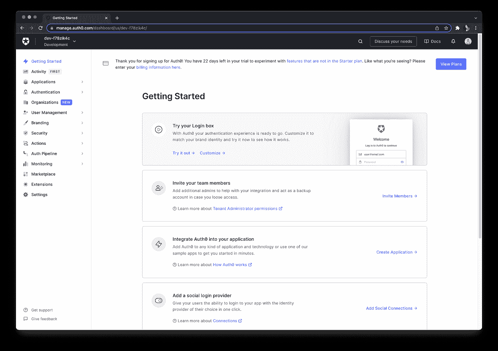

Let’s get started in Auth0 cockpit

让我们创建一个用户进行测试。

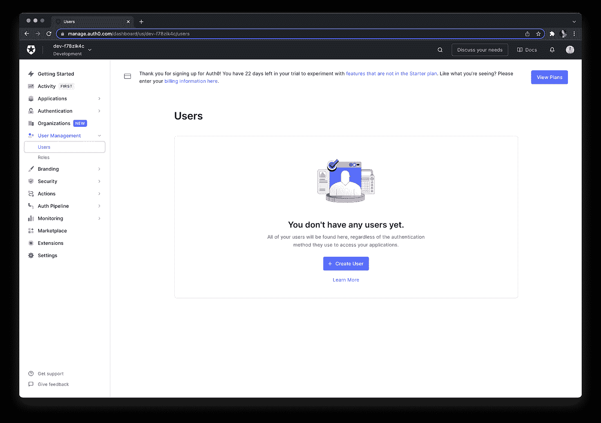

You don’t have any users yet

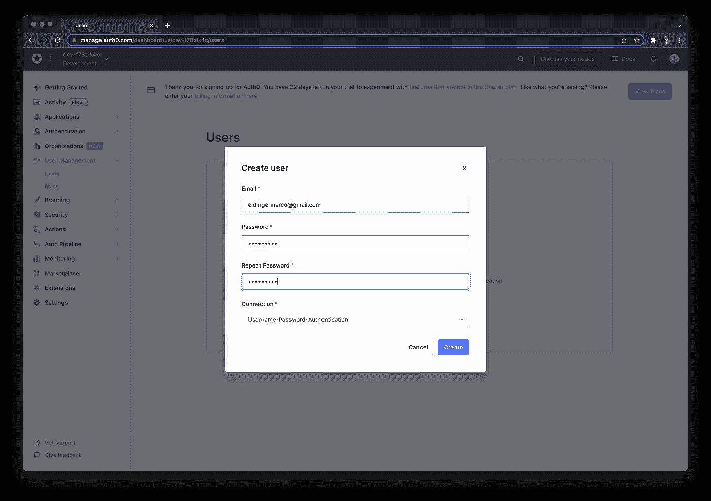

Create the first user

让我们创建一个新的本机应用程序。

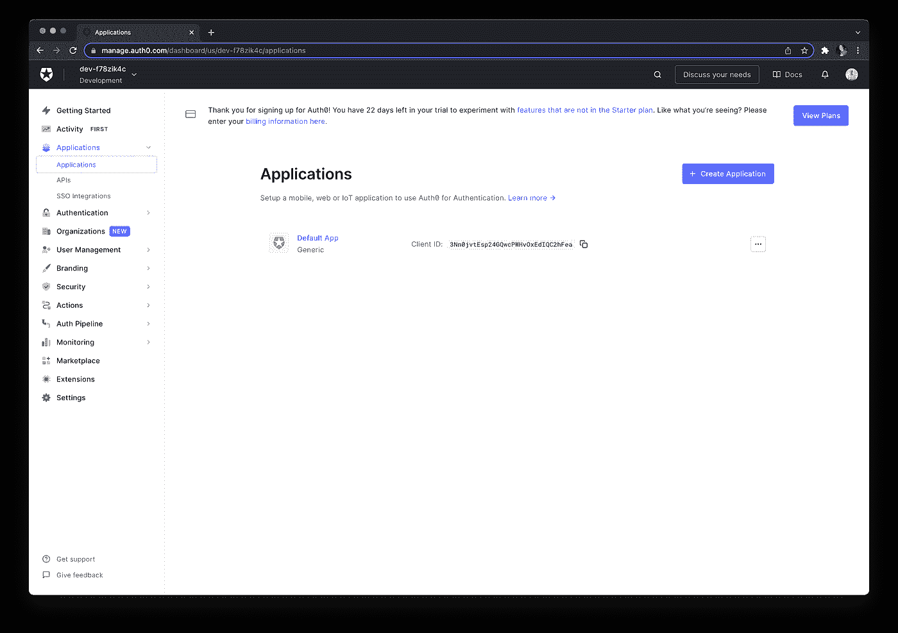

A default app exist but we want our own!

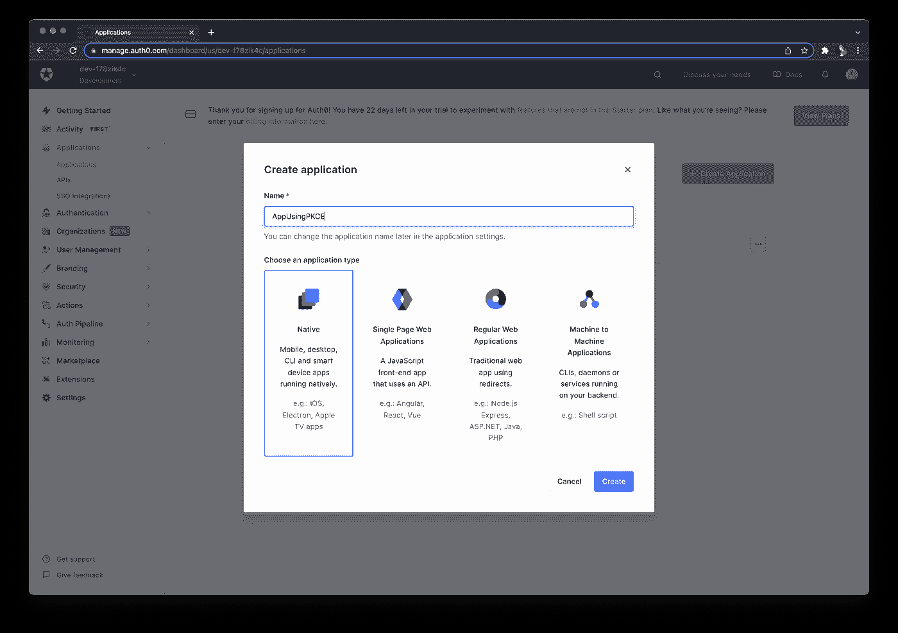

Create a native application

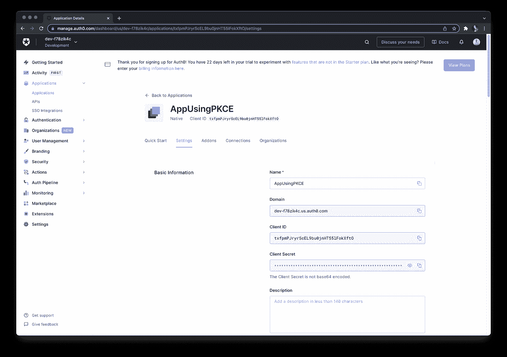

The app with its domain and client id

稍后您将需要在 Swift 中使用`Domain`和`Client ID`。

您必须根据 iOS 应用捆绑包标识符指定允许的回拨和注销 URL(测试应用使用的是`us.eidinger.AppUsingPKCE`)。

Add Allowed Callback URLs

让我们仔细检查一下是否设置了`Authorization Code` Grant(应该是默认设置),并保存更改。

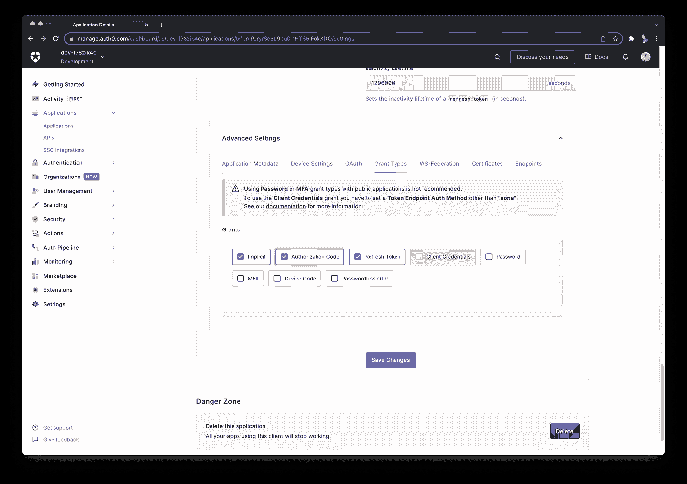

Authorization Code needs to be selected

# 运行测试应用程序

使用客户端 id 和域，我们可以检测演示应用程序

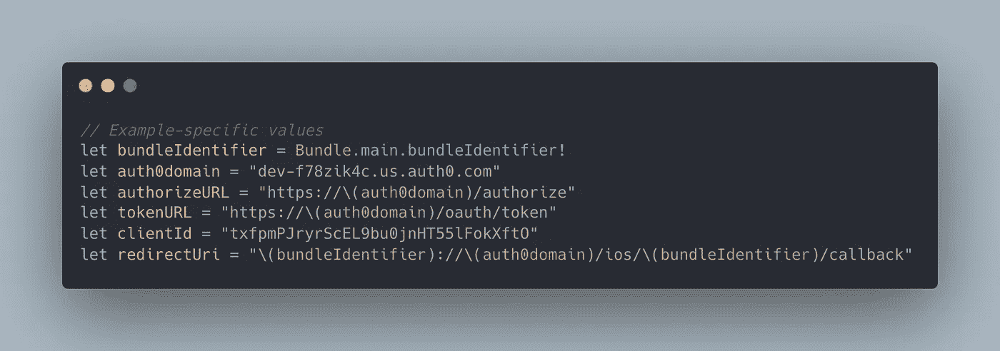

Replace values with your own account / app information

并在 iOS 模拟器上运行。

Touch “Sign In” to start the flow

触摸 Sing In 按钮将触发`ASWebAuthenticationSession`将用户重定向到授权服务器。

User gets redirected. So far so good

让我们使用在 Auth0 中创建的用户凭证。

Do you remember the password you set for the user you created earlier?

触摸继续按钮将控制返回到测试应用程序。流程将继续(即，利用从授权服务器和`code_verifier`接收到的代码获得访问令牌，并最终显示接收到的访问令牌。

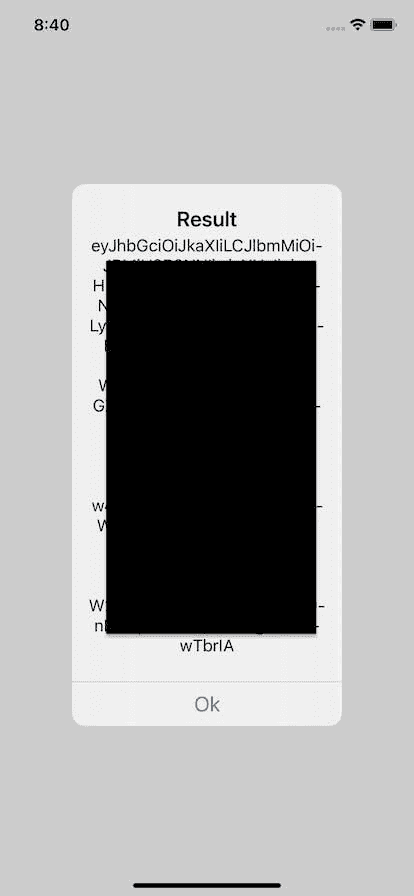

Yeah, it works :)

我希望本指南有助于您熟悉 PKCE，并让您了解如何在 Swift 客户端上实施它。

*最初发布于*[*https://blog . ei dinger . info*](https://blog.eidinger.info/implement-oauth2-pkce-in-swift-and-test-with-auth0-authorization-server)*。*