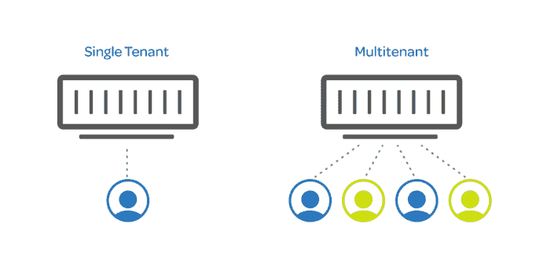

# 为您的 SaaS 应用程序实现关键功能

> 原文：<https://medium.com/geekculture/implementing-critical-features-for-your-saas-application-c1e678424ec5?source=collection_archive---------13----------------------->

Photo by [Austin Distel](https://unsplash.com/@austindistel?utm_source=unsplash&utm_medium=referral&utm_content=creditCopyText) on [Unsplash](https://unsplash.com/s/photos/saas?utm_source=unsplash&utm_medium=referral&utm_content=creditCopyText)

对软件即服务(SaaS)应用的需求很大，许多公司正在创建 SaaS 解决方案来满足这种需求。从大型企业到中小型企业，基于云的软件是 2021 年几乎每种公司技术的默认部署选项。无论您是消费者还是 SaaS 供应商，了解一个 SaaS 应用程序需要具备的基本特性是非常重要的。本文深入研究了需要添加到现有应用程序中或需要注意的特性。

# 什么是软件即服务(SaaS)？

SaaS 是一种软件交付模式，使客户能够从任何具有互联网连接和网络浏览器的设备访问数据。在这种基于 web 的方法下，软件提供商托管和管理组成应用程序的服务器、数据库和代码。

[SaaS](https://azure.microsoft.com/en-us/overview/what-is-saas/) ，与基础设施即服务(IaaS)和平台即服务(PaaS)一起，是云计算的三大类别之一。在商业环境中，SaaS 是传统软件安装的替代品，在传统软件安装中，用户可以访问服务器来构建、安装和配置应用程序。在 SaaS 下，用户不为程序本身付费。相反，它的功能是出租。他们有权在一段时间内使用它，只要他们为他们正在使用的程序支付订阅费。

# SaaS 的关键特征

为了更好地理解 SaaS 模式，请考虑一家社交媒体公司，它在大规模提供可靠、安全的服务的同时保护每个客户的隐私。社交媒体公司的客户可以利用公司的系统和技术，而不用担心未经授权访问他们的个人信息。

# 多租户架构

[Source](https://www.datamation.com/cloud/what-is-multi-tenant-architecture/)

在多租户架构中，所有用户和应用共享一个集中维护的基础设施和代码库。每个客户端被称为一个租户。租户可以被授权定制程序的某些方面。

如今，应用程序的结构使得每个租户的存储区域通过在单个数据库或具有鉴别器的相同数据库中具有单独的数据库或不同的模式而被隔离。因为所有 SaaS 供应商客户共享相同的基础设施和代码库，供应商可以更快地创新并节省开发工作，否则这些工作将花费在支持旧代码的几个版本上。

# 自动化供应

用户应该能够轻松访问 SaaS 应用程序，这就需要自动化为用户提供服务的流程。企业对企业(B2B)和企业对企业(B2C)客户经常使用 SaaS 应用。要做到这一点，您只需调用在线服务，并提供您的凭据，以建立您的公司/用户。

微软的 [CREST API](https://developer.vmware.com/apis/crest/latest/crest/api/all/post/) 是提供这一重要功能的 SaaS 应用程序的一个很好的例子。云服务中介(CSB)等平台简化了这一过程，并实现了对 SaaS 应用的按需访问。另一个重要特性是，如果客户选择不使用 SaaS 应用程序，可以随时撤销用户或组织的访问权限。

# 应用的安全性

需要保护 SaaS 应用程序免受漏洞的影响。一般来说，应该保护它们免受 OWASP/SAN 识别的漏洞的影响。SaaS 应用程序还需要支持强大的身份和访问控制控制。

任何 SaaS 设置最重要的一个方面是保护应用程序的访问。为此，如果你想用最少的开发工作量实现最高级别的应用程序安全性，像 Frontegg 的**免费** [登录框生成器](https://docs.frontegg.com/docs/using-login-box-builder)这样的工具对你来说是非常有价值的。

Frontegg 提供了针对现代应用的复杂用户管理基础设施的快速集成。它为用户和身份管理提供尖端的安全解决方案，同时提供一致的消费者体验。

该平台包括面向最终用户的可配置管理门户层，以及完整的用户管理体验。将它们的配置文件管理层和管理门户层集成在一起，为您的项目提供了一个多租户安全后端基础设施，该基础设施得到了全面的管理和细化。

有助于 SaaS 应用程序安全性的其他因素是强大的会话管理和反劫持保护、检测未授权会话、多会话保护、不保存敏感数据的 cookie 使用、cookie 跟踪、增强的身份验证以及防止 DoS/DDoS 攻击。

# 基础设施的弹性

SaaS 应用的使用量很少是固定的，每月的使用量会有很大波动。因此，应用程序所在的基础设施必须能够扩大或缩小后台使用的资源。

目前，SaaS 应用的构建是为了识别基础设施的行为。置于供应资源内的监控代理通知适当的管理服务器关于资源可用性。

策略和流程通常嵌入到核心架构中，以扩展/缩减基础架构资源。典型的例子是基于微架构的 SaaS 应用。为了管理 SaaS 服务的弹性，使用了像 Kubernetes 这样的工具。另一种选择是创建一个策略引擎，它可以接收事件并对事件做出反应，例如基础设施资源的扩展或收缩。

# 数据安全

在当今的环境中，确保数据和公司信息免受破坏和不必要的访问至关重要。由于软件即服务应用程序旨在由多个租户共享，因此了解数据的安全性至关重要。

对于特定租户，某些类型的数据必须以加密形式存储，并且其他租户不能访问。因此，拥有强大的密钥管理框架或与其他密钥管理框架集成/连接的能力已成为 SaaS 服务的一个重要特征。为了保护数据，必须实现非常强的基于角色的权限。像 [SiteLock](https://www.sitelock.com/) 这样的工具加强了数据安全性。

# 结论

SaaS 允许轻松添加新用户、功能和新的定制业务解决方案。在您的 SaaS 应用程序中实现强大的功能是非常好的一步。服务提供商负责后端和基础设施。对于组织和客户来说，一旦好的功能到位，SaaS 解决方案可以轻松扩展。