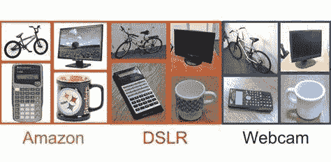

# 在 Office31 数据集上实现基于梯度的类激活图(Grad-CAMs)

> 原文：<https://medium.com/geekculture/implementing-gradient-based-class-activation-maps-grad-cams-on-office31-dataset-d7de6347443c?source=collection_archive---------13----------------------->



Office31 Dataset

[类别激活图](http://cnnlocalization.csail.mit.edu/)是一种简单的技术，用于获取 CNN 用来识别图像中特定类别的区别性图像区域。换句话说，类激活图(CAM)让我们看到图像中的哪些区域与这个类相关。

Grad-CAM 是一种用于可视化卷积神经网络模型的流行技术。Grad-CAM 是特定于类别的，这意味着它可以为图像中出现的每个类别生成单独的可视化效果。

在这项工作中，我们倾向于探索 Grad-CAM 在 Office31 数据集上的实现。

# 关于数据集

Office31 数据集包含三个领域的 31 个对象类别:亚马逊、DSLR 和网络摄像头。数据集中的 31 个类别由办公环境中常见的对象组成，如键盘、文件柜和笔记本电脑。亚马逊域平均每类包含 90 张图片，总共包含 2817 张图片。DSLR 域包含 498 幅低噪声高分辨率图像。每个类别有 5 个对象。对于网络摄像头，低分辨率的 795 图像表现出明显的噪声和色彩以及白平衡伪影。

数据集可以从下面的链接下载。

```
[office31.7z - Google Drive](https://drive.google.com/file/d/1GdbY8GJ-HCp-YrDhDaLC-7BCZ0oxY6G9/view)
```

# 使用 Keras 实现 Grad-CAMs

在上面的实现中，我们特别使用了 Keras 库。人们甚至可以使用 Pytorch 或 Tensorflow 来实现。下面给出的代码是使用 Keras 特别实现的。

**导入需要的库**

让我们从导入所需的库和包开始。

**选择一个特定的文件夹来实现 Grad-CAM**

现在，我们将从 Office31 数据集的一个类中选择一个特定的文件夹，对其应用 Grad-CAM。

我们将代码放在 try except 块中，以处理任何意外的回溯。

**定义模型**

现在我们用 Keras 来定义我们的模型。您可以根据自己的需要将它们换成另一种型号。要获得`last_conv_layer_name`的值，使用`model.summary()`查看模型中所有层的名称。

**将图像转换为数组**

现在，我们将属于我们在上面选择的文件夹的图像转换成数组，以便输入到下一段代码中。

**制作热图并将其与图像结合**

接下来，我们继续创建热图，并将它们与各自的图像相结合。首先，我们创建一个模型，将输入图像映射到最后一个 conv 层的激活
以及输出预测。然后，我们针对最后一个 conv 层的激活，为我们的输入图像计算顶部预测类的梯度。我们还将特征映射阵列中的每个通道乘以关于顶部预测类别的“该通道有多重要”,然后对所有通道求和以获得热图类别激活。出于可视化目的，我们还将标准化 0 & 1 之间的热图。

生成热图后，我们将它们与各自的图像结合起来，以获得最终输出。

**最终输出**

最后，让我们制作模型并调用上面的函数来查看 Grad-CAMs 在特别选择的文件夹上的动作。

请注意， *model_builder()* 方法使用 Imagenet 作为权重

# 结论

这里给出包含以上所有代码的笔记本:[https://drive . Google . com/file/d/1 AVR MC 26 gpz w1 tkc _ ygtyhzynsg 484 kxx/view？usp=drivesdk](https://drive.google.com/file/d/1avRmC26Gpzw1TkC_ygTYhzyNsG484kxx/view?usp=drivesdk)

我们在 Office31 数据集上成功实现了 Grad-CAMs。使用梯度摄像头的技术有其自身的优势，因为它有助于确定图像中相关的区域，从而丢弃不需要的信息。通常这种方法需要改变模型结构，然后重新训练它。上述工作概括了 grad-CAM，使其能够应用于现有模型。

虽然 Grad-CAM 应该能够解释模型用于预测的图像区域，但事实证明 Grad-CAM 并不能保证做到这一点！简而言之，由于梯度平均步骤，Grad-CAM 的热图不能反映模型的计算，因此经常会突出显示不用于预测的无关区域。为了克服这个问题，应使用 HiResCAM 代替 Grad-CAM。

# **参考文献**

[Keras 中的类激活图，用于可视化深度学习网络关注的地方(jacobgil.github.io)](https://jacobgil.github.io/deeplearning/class-activation-maps#:~:text=Class%20activation%20maps%20are%20a,were%20relevant%20to%20this%20class)

[Grad-CAM 类激活可视化(keras.io)](https://keras.io/examples/vision/grad_cam/)

[Office-31 数据集|带代码的论文](https://paperswithcode.com/dataset/office-31)

Grad-CAM。深度网络的视觉解释| Rachel drae los 博士|走向数据科学