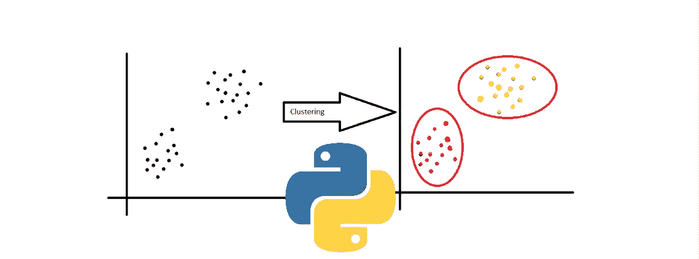
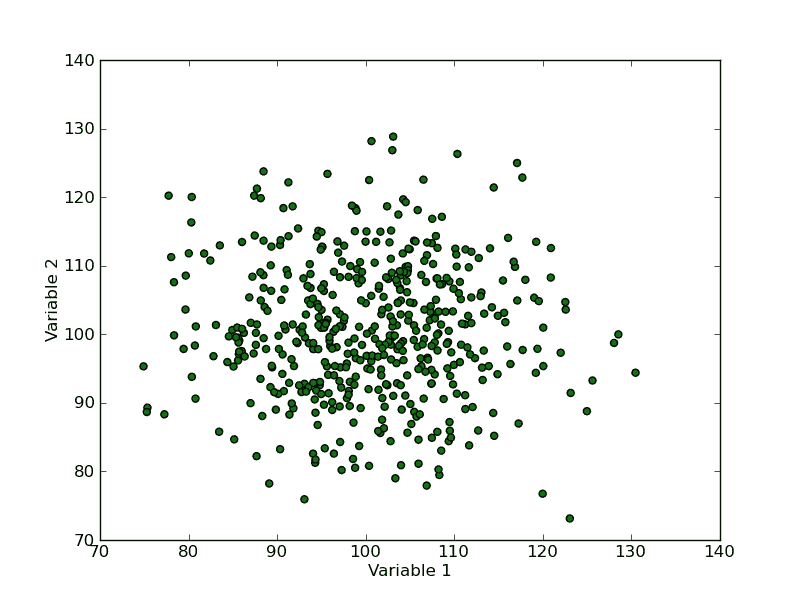
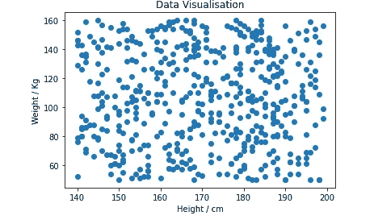
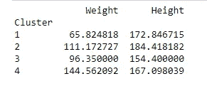
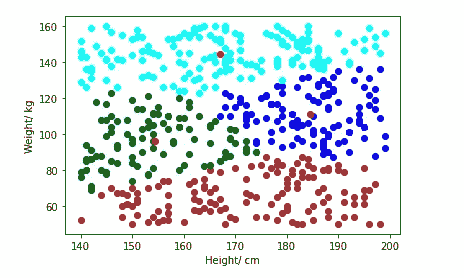
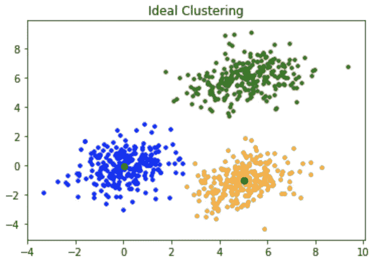
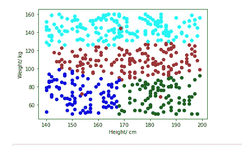

# 用 Python 中的 K-Means++初始化实现 K-Means 聚类。

> 原文：<https://medium.com/geekculture/implementing-k-means-clustering-with-k-means-initialization-in-python-7ca5a859d63a?source=collection_archive---------1----------------------->



**K-Means 聚类**是一种*无监督机器学习*算法。无监督意味着它不需要被观察数据的标签或类别。如果你对**监督算法**感兴趣，那么你可以从这里开始[。](https://writersbyte.com/datascience/implementing-multi-variable-linear-regression-algorithm-in-python/)

[](https://writersbyte.com/datascience/implementing-multi-variable-linear-regression-algorithm-in-python/) [## 用 Python 实现“多元线性回归”算法。- WritersByte

### 机器学习算法在过去十年中获得了巨大的普及。今天，这些算法被用于…

writersbyte.com](https://writersbyte.com/datascience/implementing-multi-variable-linear-regression-algorithm-in-python/) 

K-means 聚类是一种非常简单的算法，它在我们的整个数据集中创建相似数据点的组(聚类)。在 ***寻找零散数据中的隐藏模式时，这个算法被证明是一个非常方便的工具。***

[](https://writersbyte.com) [## ▤作家字节

### 思想，故事和想法。

writersbyte.com](https://writersbyte.com) 

本教程中使用的全部代码可以在[这里](https://github.com/Moosa-Ali/K-means-Implementation.git)找到。

本教程将涵盖以下内容:

**k-means 算法的简要概述。**

**用随机初始化实现 k-means。**

**最优质心初始化的重要性概述。**

**实现 K-means++的** **进行智能质心初始化。**

[](https://writersbyte.com/datascience/ai-for-beginners-3/) [## 面向初学者的人工智能:计算机视觉和自然语言处理

### 我们已经谈了很多关于人工智能的一般意义以及它对我们世界的影响。在以前的文章中，我们…

writersbyte.com](https://writersbyte.com/datascience/ai-for-beginners-3/) 

在你前进之前，请考虑在科菲问题上支持我。点击下面的图片。

[](http://ko-fi.com/moosaali9906)

让我们开始吧:

# 1.理解算法:

假设我们有一些随机的数据，如下图所示。我们希望在数据中创建分组，这样看起来更有条理一些。但是，用肉眼来看，很难决定将哪些点关联在一起。K-means 会帮我们做的。



image source :[http://sungsoo.github.com/images/scatter1.png](http://sungsoo.github.com/images/scatter1.png)

K-means 算法的一个缺点是你需要从数据中指定你需要多少个聚类。如果您想要分离数据，但不确定应该有多少个类别是最佳的，这可能会是一个问题。

*   像 elbow 方法这样的方法可以用来找到一个最佳的集群数量，但是在本文中没有讨论。*

K-means 算法遵循以下步骤:

1.选择 n 个数据点作为初始质心。

2.从步骤 1 中选择的每个质心点计算每个数据点的欧几里德距离。

3.通过将每个数据点分配到距离其最近的质心来形成数据聚类。

4.取每个形成的集群的平均值。中点是我们新的质心。

***重复步骤 2 到 4，直到质心*** 不再变化。

其他算法的实现；

[](https://writersbyte.com/datascience/implementing-multi-variable-linear-regression-algorithm-in-python/) [## 用 Python 实现“多元线性回归”算法。- WritersByte

### 机器学习算法在过去十年中获得了巨大的普及。今天，这些算法被用于…

writersbyte.com](https://writersbyte.com/datascience/implementing-multi-variable-linear-regression-algorithm-in-python/) 

# 2.履行

足够的理论让我们开始编码。

首先，我们将看看我们的数据集。出于本教程的目的，我们将使用人体身高体重指数的数据集。数据集是免费的，可以从[这里](https://www.kaggle.com/yersever/500-person-gender-height-weight-bodymassindex)下载。

```
*#loading up the libraries*

**import** **pandas** **as** **pd**
**import** **numpy** **as** **np**
**import** **random** **as** **rd**
**import** **matplotlib.pyplot** **as** **plt** *#loading data*
data = pd.read_csv("500_Person_Gender_Height_Weight_Index.csv")
```



Visualizing our data

从散点图中，我们可以看到数据具有相当随机的分布，没有清晰的聚类。看看我们的算法执行什么样的分组会很有趣。

让我们快速写下一个函数来得到随机点。

让我们看看它是否有效。


Random centroids initialized

这些随机的质心…嗯…相当随机😵。

让我们编写程序到达合适的质心并创建相应的集群。

让我们运行这个例程来定位数据中的 4 个集群。



Final Centroids found

全部完成！

让我们看看我们得到了什么。



Red dot: Centroid, Remaining Points: Dataset

看起来我们的分组都完成了，✌️.现在是时候看看初始化不同的质心是否会有所不同。

先说 K-means++初始化算法。

# 3.最佳质心初始化。

初始化形心时，最初选择的点相距较远是很重要的。如果这些点靠得太近，这些点很可能会在它们的局部区域中找到一个聚类，而实际的聚类将与另一个聚类混合。

当随机初始化质心时，我们无法控制它们的初始位置。


Image Source: [https://media.geeksforgeeks.org/wp-content/uploads/20190812011808/Screenshot-2019-08-12-at-1.13.15-AM.png](https://media.geeksforgeeks.org/wp-content/uploads/20190812011808/Screenshot-2019-08-12-at-1.13.15-AM.png)



Image Source: [https://media.geeksforgeeks.org/wp-content/uploads/20190812011831/Screenshot-2019-08-12-at-1.09.42-AM.png](https://media.geeksforgeeks.org/wp-content/uploads/20190812011831/Screenshot-2019-08-12-at-1.09.42-AM.png)

K-means++是解决这个问题的一个聪明的方法。

就像 K-Means 本身一样，K-Means++也是一个非常简单的算法。

1.随机选择第一个质心。

2.计算质心和数据集中每隔一个数据点之间的欧几里德距离。最远的点将成为我们的下一个质心。

3.通过将每个点与其最近的质心相关联，围绕这些质心创建簇。

4.距离质心最远的点将是我们的下一个质心。

5.重复步骤 3 和 4，直到找到 n 个质心。

# **4。K-Means++的实现**

让我们编码我们的算法。

写下算法后，让我们在上面构建的 K-Means 算法上测试它。



Clusters after applying k-means++

我们可以看到这次我们发现了不同的集群。这显示了初始质心可以产生的差异。

# 5.**结论**

总之，K-Means 是一个简单而强大的算法。它可用于在当前数据中创建聚类。这些分类有助于您更好地了解当前数据，并且分类可用于分析任何未来数据。如果你试图分析你的业务的客户基础，这可能是有帮助的。将客户分组可以帮助您为每个集群创建个性化的策略，当新客户加入时，他们可以很容易地与已经形成的集群相关联，可能性是无限的。

更多文章；

[](https://writersbyte.com) [## ▤作家字节

### 思想，故事和想法。

writersbyte.com](https://writersbyte.com) 

如果这对你有帮助，考虑支持我对科菲。点击下面的图片。

[](http://ko-fi.com/moosaali9906)