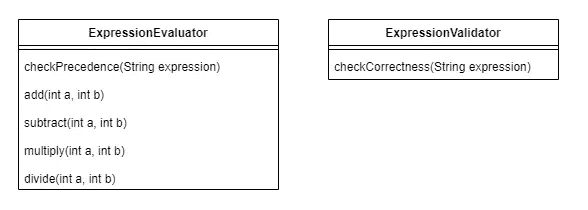
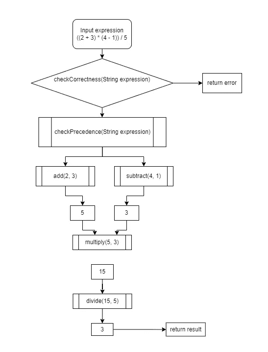
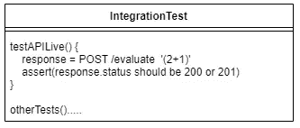

# 单元测试和集成测试的重要性

> 原文：<https://medium.com/geekculture/importance-of-unit-and-integration-tests-e3f8f0d9d892?source=collection_archive---------13----------------------->

在我职业生涯的早期，我接触到了术语“单元测试”。这是当时的一个流行词。作为一名开发新手，我发现为自己编写的代码编写单元测试非常乏味且低效。信不信由你，我得出的结论是，为自己的代码编写单元测试是浪费时间。如果我在开发或测试环境中进行手工测试，为什么我要编写单元测试并质疑我自己的代码？如果测试团队要测试你的功能，那么为什么要为你自己的代码写测试呢？即使在这之后，我听说了 TDD(测试驱动开发),我被这样一个事实激怒了:首先，你必须写测试，然后开发你的代码。我认为这完全是浪费时间。

但那时我错了！

当我更擅长编程的时候，我真正理解了单元测试和集成测试的重要性。我不打算讨论测试的策略和更好的框架，也不是关于任何特定的编程语言，但是我认为理解单元测试和集成测试的重要性是很重要的。

首先，我们将了解什么是单元测试，什么是集成测试。

单元测试是我们为代码编写的一组测试用例，确保我们在产品中推出的代码在单元级别得到良好的测试。单元可以是一个特定的类，或者一个包，或者一个模块，但是一般来说，我认为一个类是一个好的开始单元。

另一方面，集成测试是指我们编写测试用例来检查模块或项目的功能，而不是代码。我们马上就能看到。

假设您必须开发一个简单的 API '/evaluate '，其中 API 将输入作为一个数学表达式，如-(2–1)+2，并产生作为该表达式结果的输出。如果表达式有效，那么它将返回有效的数字，否则如果表达式无效，那么它将发送一些错误代码。

让我们考虑用表达式=((2+3)*(4–1))/5 调用这个 API '/evaluate '。预期的结果是 5。

一般来说，我更喜欢编写如下代码。

Class Diagram

流程如下所示。

Process Flow

如果我认为自己是一个开发新手，几年前我就是这样，那么我会用一些表达式检查 API，然后将我的代码投入生产。在这里，从逻辑上讲，我同意我的团队和我的客户认为 API 工作正常，但是代码呢？我检查我的代码了吗？我能检查我的代码吗？我验证了我的代码吗？

答案是否定的，因为我们没有为我的代码编写任何测试。单元测试证明您的代码在特定条件下工作。这就像做汉堡一样。你不会盲目地做汉堡然后吃掉它。这样你就不能保证你所用的原料足够好吃或者味道会更好。所以更好的方法是，你先检查小圆面包、肉饼、油和蔬菜。如果一切看起来都很好，然后你准备你的汉堡，那么很有可能你的汉堡味道会更好，吃起来也更卫生。没有对所有成分进行适当检查就吃汉堡是有风险的。

同样的基本原理也可以应用到我们的代码中。我们可以自下而上地认证我们的代码。我们可以先测试单个方法，如 add()、subtract()、multiply()和 division()，然后再测试其他方法，如 checkCorrectness()和 checkPrecedence()。如果我们这样做，我们就确保了 checkPrecedence()方法下面的所有内容都经过了测试，并且我们可以依赖它，可以更专注于开发 checkPrecedence()方法。同样，如果我们为 checkPrecedence()方法编写所有单元测试，那么 checkCorrectness()方法就不需要担心流程的其余部分。

现在我们理解了自底向上方法中测试的重要性。每次我们为一个函数或类编写测试用例时，我们都向那个方法/类的调用者承诺，他不需要担心你正在使用或引用的代码，那些代码已经通过了单元测试。但是你如何证明一些事情呢？有些东西需要经过检验才能证明自己，对吗？我们需要对你的函数做同样的事情。

让我们以 add()函数为例。add 函数将接受两个参数(数字),并且应该返回这两个参数之和的数字。因此，我有几个应该由 add()方法满足的标准，例如—

1.  如果两个输入数字都是正数，它应该返回一个正数。
2.  如果其中一个数字是负数并且大于另一个输入的数字，它应该返回一个负数。
3.  如果其中一个数字是正数并且大于另一个输入的数字，它应该返回一个正数。
4.  如果两个输入数字都是负数，它应该返回一个负数
5.  如果两个输入数字都是 0，它应该返回 0。

我认为上面的测试足以证明 add()函数是准确的，并且在任何情况下都会提供准确的结果。测试用例看起来会像下面这样—

Test class with sample test cases

类似地，我们可以为其他方法编写测试用例，如 subtract()、multiply()、divide()等。编写测试用例就像是提供证据，证明你已经考虑了你的函数可能面临的所有场景，并且你的函数将完全按照预期的方式运行。以类似的方式，如果你为你所有的代码编写测试用例，那么这意味着你自我证明了你的代码库是一个经过良好测试的代码库，任何依赖的项目或客户在使用你的代码时都不会有任何问题。但这并不意味着你已经为你的功能编写了测试用例，那么它就是 100%可信的，因为你可能忘记了考虑所有的场景。例如，在 divide()函数中，如果您试图将一个数除以 0，那么很可能会出现异常，您的代码将会中断，因此您需要在函数中处理这种情况，或者您可以与被调用方方法签订合同，并且您还需要为这种情况编写一个测试用例。

这类测试的优点是，如果有人更改了 divide()方法的契约，或者试图抛出一些针对'**被零除**'场景的自定义异常，测试将会中断或失败。如果一个开发伙伴想要做这样的改变，那么他也需要修改测试并相应地更新他/她的新改变。因此，我们要确保我们的代码库封装良好。为了实现这个封装良好的代码库，我们总是需要覆盖来自我们测试用例的 100%的代码。我们不应该遗漏任何一行代码。但是有时候，在非常大的项目中很难达到 100%的覆盖率，所以许多团队接受 90%或 80%的覆盖率，但是覆盖率越高，封装得越好。

在这里，我们看到了一个非常简单的例子，它有一个简单的代码库，但是在复杂的项目中，有很大的类和函数，有时真的很难测试这些函数。但是在编写测试用例的时候，如果你觉得为函数编写测试是一项单调乏味的任务，那么这表明你的函数或者代码不是松散耦合的，现在是时候把你的函数分成更多的子函数或者更松散耦合的代码了。

假设您有一个函数 doProcessing()，它将更新数据库中的数据，创建一个文件，并向其他系统发送通知。如果你想为这样一个函数编写一个单元测试，这将是一个非常复杂的任务，但是相反，如果你进一步将你的代码分成三个子函数，比如 saveInDatabase()，generateFile()和 sendNotification()，那么你会认为编写测试会容易得多吗？这是我在编写单元测试用例时遇到的最大优势。从那以后，我写代码的角度已经改变了。如今，每当我写代码时，我总是试图更好地模块化我的代码，以便我能写更好的测试(或者用 TDD 方法，反之亦然)。编写测试用例让我有最好的机会将逻辑重新安排到更小的、松散耦合的、可以单独测试的单独功能或组件中。现在，当我读到更多关于酸或固体的设计原则时，我觉得更有意义了。

完事了吗？不。我们刚刚用单元测试认证了我们的代码，对吗？但是整体功能和与其他组件的集成如何呢？是的，我们仍然需要了解集成测试。

集成测试是功能测试用例，它检查您的功能并对结果做一些断言。它非常类似于单元测试用例，但是集成测试用例需要一个运行环境。要运行单元测试，你不需要一个特定的环境，你可以模拟大部分的依赖，在你的本地机器上运行所有的单元测试，这是最好的方法。单元测试应该独立于任何环境。但是集成测试的情况并非如此。您的参数可能会随着不同的环境而变化。

让我们看看我们的例子，我们正在开发一个 API '/evaluate '，它接受表达式并给我们结果。现在考虑用一些证据证明这个 API，是的，我们需要为这个 API 编写测试用例。怎么会？让我们看看。

我们可以编写以下测试—

1.  API 应该是活动的，这意味着响应状态应该是有效的 HTTP 代码，比如 200 或 201，或者其他任何标准或您的合同。
2.  API 应该是实时的，这意味着响应状态不应该是 5xx。
3.  如果您已经使用令牌或另一种身份验证方法保护了 API，那么 API 应该只使用有效的凭证给出响应。
4.  如果您使用令牌或另一种身份验证方法来保护 API，那么 API 应该以 4xx(或任何其他错误代码)的形式给出一个带有无效凭证的响应。
5.  如果用无效的表达式调用 API，它应该返回有效的错误代码。
6.  如果您使用有效的表达式调用 API，那么它应该返回有效的预期结果。

如果你想测试更多的东西(比如性能、可伸缩性等)并让你的 API 封装很多这样的场景，你可以考虑很多这样的测试。这里，我们已经确保 API 的被调用方不会面临任何问题，因为我们已经涵盖了所有积极和消极的场景。即使在将来，如果有人报告系统中的错误，我们也可以更正代码，并将该流程添加到我们的集成测试中。这样，我们还可以向 bug 报告者说明这个 bug 已经被修复了。

在集成测试中，我们不应该太担心你的代码库中有什么，我们应该担心的是功能。因此，集成测试用例很像黑盒测试，单元测试用例很像白盒测试。

所以，测试用例真的很重要，不管是单元测试用例还是集成测试用例，都能让你的代码封装得更好，测试得更好。现在所有的 IT 公司都实现了标准的实践来为他们的项目编写单元测试和集成测试。几乎所有的团队都将这些检查添加到他们的 CI-CD 管道中，应该有测试，覆盖率应该> 90%。最初，它可能看起来不是很有帮助，但实际上，它非常有帮助，非常需要，并且解决了你的许多问题，以避免将来出现任何问题。

编码快乐！！！