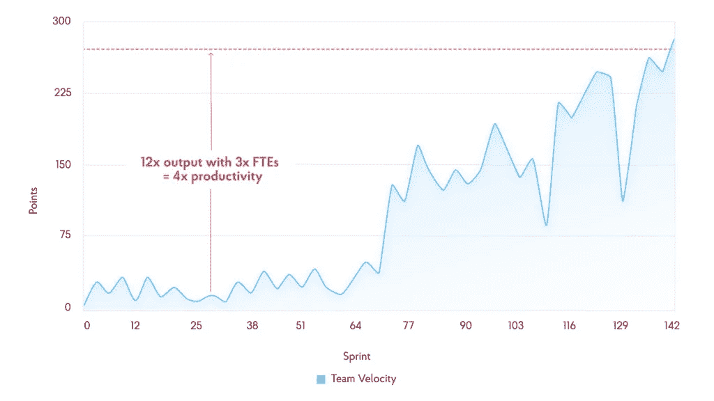
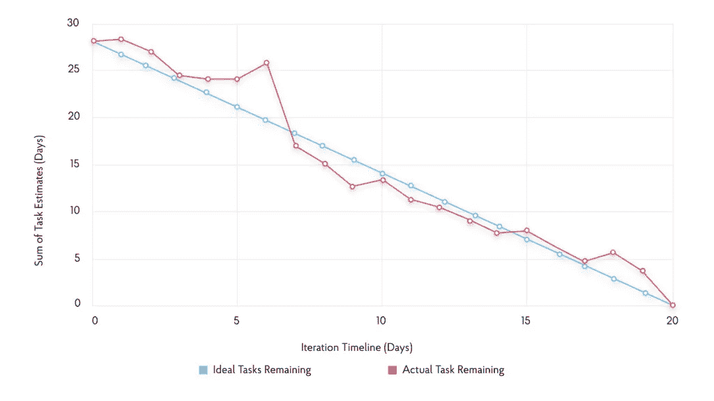
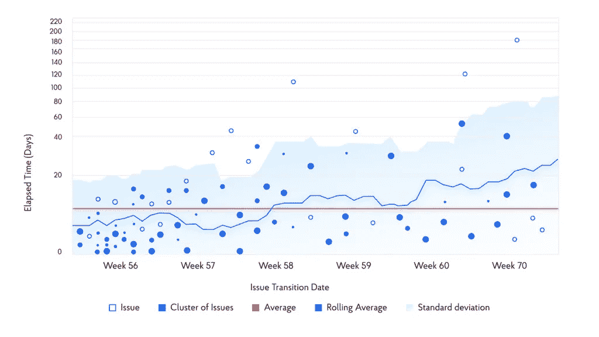
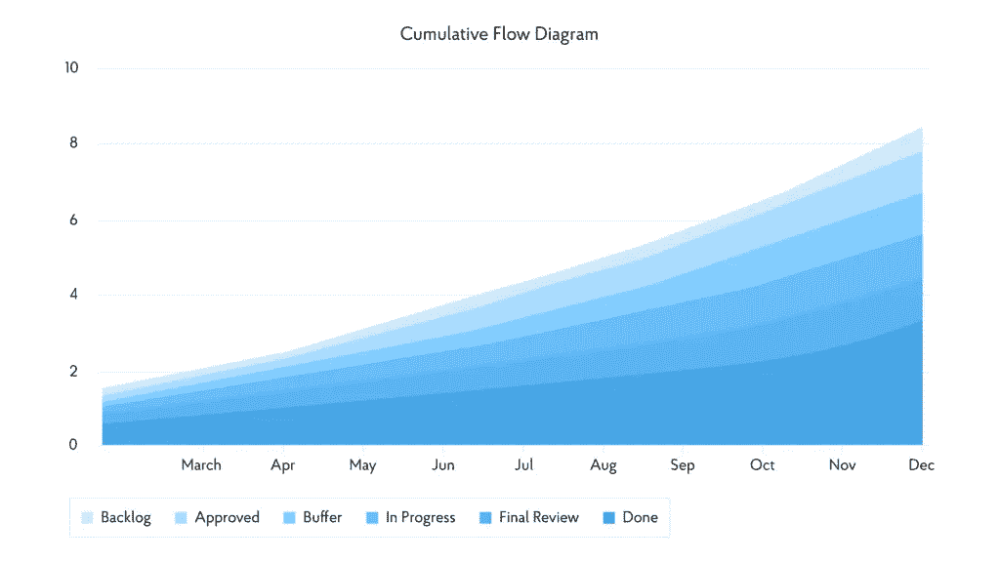
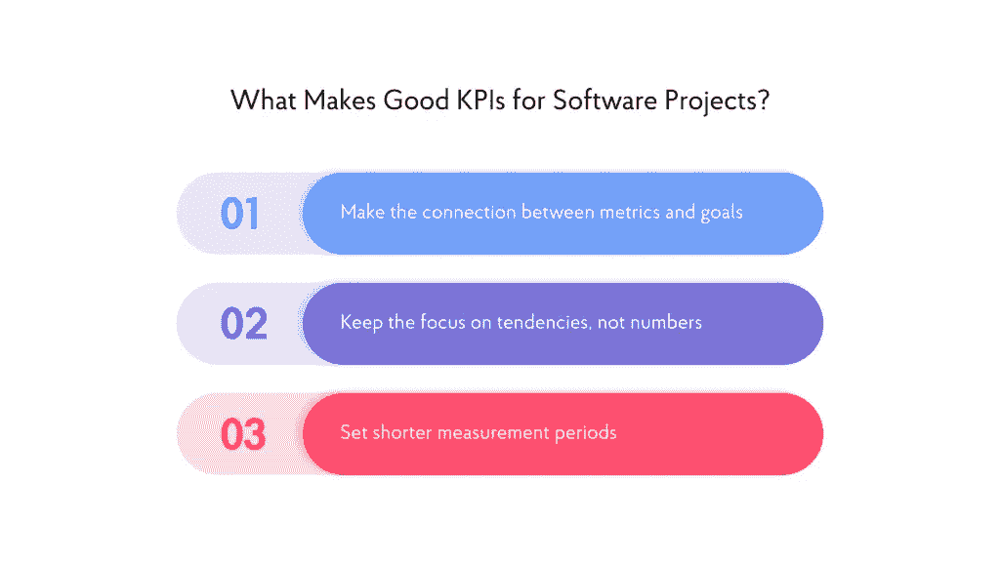

# 重要的敏捷项目管理 KPI 和指标— NIX United

> 原文：<https://medium.com/geekculture/important-agile-project-management-kpis-and-metrics-nix-united-847d0d526652?source=collection_archive---------20----------------------->

项目管理关键敏捷指标和项目管理关键绩效指标(KPI)对于快速跟踪项目进度至关重要。它们允许您快速地监控开发，测量性能，并设定目标——但是您如何知道每个项目到底什么是值得测量的呢？

下面我们将强调在软件开发的各个方面使用的最常见的项目管理度量。需要注意的是，下面列出的东西并不是你的项目所必需的——你可以选择那些非常适合于跟踪你的特定项目的发展，确定你的目标和成功因素的东西。

**目录**

1.  [什么是项目管理指标&KPI？](https://nix-united.com/blog/crucial-agile-project-management-metrics-and-kpis-nix-approach/#pm_metrics_kpi)
2.  [项目管理 KPI 类别](https://nix-united.com/blog/crucial-agile-project-management-metrics-and-kpis-nix-approach/#kpi_categories)
3.  [衡量项目进度的敏捷指标&优化交付](https://nix-united.com/blog/crucial-agile-project-management-metrics-and-kpis-nix-approach/#agile_metrics_project_progress_optimize_delivery)
4.  [评估流程效率的敏捷指标](https://nix-united.com/blog/crucial-agile-project-management-metrics-and-kpis-nix-approach/#agile_metrics_process_efficiency)
5.  [确保代码质量的敏捷指标](https://nix-united.com/blog/crucial-agile-project-management-metrics-and-kpis-nix-approach/#agile_metrics_code_quality)
6.  [对于软件项目来说，什么是好的 KPI？](https://nix-united.com/blog/crucial-agile-project-management-metrics-and-kpis-nix-approach/#good_kpis)
7.  [结论](https://nix-united.com/blog/crucial-agile-project-management-metrics-and-kpis-nix-approach/#conclusion)

# 什么是项目管理指标和 KPI

[项目管理指标向项目经理(PM)展示不同领域的表现如何，哪些领域可能需要改进，以及它们是否可以量化或计算。](https://nix-united.com/pm-whitepaper/)正如我们上面所说的，这些度量标准由于各种原因是重要的，即软件性能度量、工作项目计划、生产力管理等等。

在一个项目中，有大量的指标相互重叠，并且在管理功能中相互关联。监控和分析敏捷软件开发度量的目的是定义当前的产品状态，改进它，并最终在软件开发项目完成后提供质量。

# 项目管理 KPI 类别

从基础开始，让我们看看 4 类值得考虑的项目管理 KPI 管理功能——时间、预算、效率和质量。

# 时间 KPI

请注意，下面我们已经提供了所有可能的敏捷指标，供您全面理解。你不需要所有这些，但希望它们能帮助你理解管理和跟踪项目的最佳方式。

1.  **周期时间:**完成特定任务或活动的时间，对于项目中的重复性任务很重要。
2.  **提前期:**从收到请求到任务完成的时间。这个指标对于发现整个流程中的瓶颈非常重要。
3.  **资源能力:**参与项目的团队规模乘以他们必须参与项目的时间百分比。这种度量有助于资源的合理分配，从而有助于为项目的完成建立一个准确的时间表。
4.  **进度** **绩效** **指标**:相对于计划完成了多少工作。
5.  **按时完成百分比:**某项任务是否在一定期限内完成。
6.  **花费的时间:**每个团队成员或所有成员花费的时间。这个要看你想追踪多少时间。
7.  **计划的小时数与花费的时间:**如果这些比率有显著差异，则值得重新考虑资源分配或预算，因为这最终会影响计划。

# 预算 KPI

1.  **实际成本(AC):** 某个时间点花了多少钱。
2.  **挣值(EV):** 花费的预算与完成的工作相比。
3.  **成本绩效指数(CPI):** 计划工作成本与目前已花费金额的比率。如果这个比例的系数大于 1，你就是在预算内搬家；如果更低，你就超出预算了。

*公式:CPI = EV/AC；CPI = 1*

1.  **成本差异:**显示计划预算和已经支出之间的差异。
2.  **计划成本:**仍需完成的工作的计划成本。将此指标与实际成本进行比较，并在必要时调整预算。
3.  **计划值:**显示在某个时间点将花费多少预算。用于挣值管理。

# 有效性 KPI

1.  **按时完成并签署的项目里程碑数量:**项目各部分是否按时完成的指标。
2.  **变更请求的数量:**客户请求对已定义的工作范围进行变更的任务的数量。

# 质量 KPI

无论您选择哪种项目管理方法，您都可以使用上面提到的项目管理 KPI。但是当然，如果数据没有被收集和分析，这些都不重要。问题可能源于这样一个事实，即开发团队可能认为实际完成工作比度量进度更重要。在这种情况下，最好让[一个有经验的总理来处理问题。](https://nix-united.com/pm-whitepaper/)

# 衡量项目进度和优化交付的敏捷指标

以下敏捷项目管理指标有助于衡量完成的工作和交付给客户的价值。

# 速度

这显示了 sprint 中完成的工作量。这有助于估计团队在未来的 sprints 中可以完成的工作部分。当对速度进行长时间的跟踪时，可以看到承诺和成本之间更准确的匹配。

这个指标是独立的，每个团队都不一样。试图人为地提高速度会破坏信任，降低团队和管理层之间的透明度。

速度也决定了团队处理积压工作的能力。这可能会随着时间的推移而改变，应进行监控以确保一致的性能。如果流程的可预测性降低，开发问题和工作流中的变更需求将被清楚地跟踪。

## NIX 提示和示例

*   **使用关注因素**
    如果团队有外部/内部触发因素，最好在你的计划中使用关注因素。例如，如果您计划团队每个 sprint 完成 40 个 SP，但是有几个人已经离开去远程工作，并且沟通过程将在途中重新安排，那么您可以假设关注因素是 0.8，因此团队将能够完成 40*0.8 = 32 个 SP
*   **定期更改 sprint backlog**
    尽量避免定期更改 sprint backlog，因为人们会注意力不集中，他们需要沉浸在任务中，进行评估，了解依赖关系等。这导致速度的系统性下降。
*   **在三次冲刺后消除不一致性**
    如果你长时间跟踪不一致的速度，尝试评估可能干扰清晰评估的外部和内部因素。
*   **团队有变动时重新计算速度**
    有人离开项目或有人加入团队时，重新计算速度或完全恢复计算。
*   不要在 Scrum 团队之间比较表现
    一个团队的速度不能总是与另一个团队的速度相比较，因为每个团队都有自己评估和理解任务复杂性的方式，并且可能处理不同类型的任务。除了让一个团队士气低落，你什么也得不到。
*   **三次冲刺**足以对未来表现做出预测。

# 冲刺燃尽图

显示在 sprint 结束之前还有多少工作需要管理。这个标准是有价值的，因为它不是简单地列出完成的项目，而是显示朝着目标的进展。同样，sprint burndown 图对于识别在 sprint 开始时犯的计划错误是不可或缺的。

sprint burndown 图是 sprint 进度的传统表示。它给出了在 sprint 期间每天完成为当前 sprint 安排的任务的剩余时间。这个图表提供了团队是否按时完成冲刺的即时视图。

## NIX 提示和示例

*   **正确的任务分解和依赖计划**
    如果任务分解不正确，可能会出现这样的情况:一部分任务已经完成，而另一部分任务却因为团队忙于另一项任务而停滞不前。因此，可能会出现任务结束不均匀的情况，燃尽图上的图形会波动很大。比如一直到冲刺中期都没有进展，团队落后，然后可能就急剧向下崩溃了。
*   **任务工作流程应该一致**
    如果有任何隐藏的阶段，任务可能会停滞不前(例如代码审查)，这将在燃尽图上清晰可见，因为任务没有经过深思熟虑。要制定内部规则，管理瓶颈。例如，一个任务在代码评审中的时间不应该超过一个工作日。
*   **考虑未计划的任务**
    摘要图表有助于确定未跟踪任务的规模。如果工作规模越来越大，而不是越来越小，这可能是一个信号，表明项目中有许多未计划或低估的任务需要消除。

# 评估流程效率的敏捷指标

项目管理绩效指标是那些与过程效率相互联系的指标。让我们检查以下指标:

# 周期

从某个项目(故事、任务、错误等)开始所经过的时间的度量。)开始，直到准备交付为止。周期时间表示完成一项任务需要多少日历日。

可预测的结果由周期时间不变的团队展示。此外，周期时间短的团队具有高吞吐量。通过测量周期时间，您可以提高流程的灵活性。比如在有变化的情况下，可以瞬间知道结果。因此，团队成员可以进行必要的调整。总的来说，短而一致的周期时间是每个 sprint 都应该达到的目标。

## NIX 提示

周期时间不仅可以用来衡量开发团队做了什么——使用看板方法，我们将所有的工作分解成阶段，并衡量阶段的周期时间，例如

*   想法开发和需求写作
*   UX 作品
*   设计
*   发展
*   测试

# 流动效率

这表明了实际工作时间和等待时间之间的分配情况。出于某种原因，这个指标经常被忽略。

它用于了解您的流程阻止您在整个工作流程中从开始到发布推动任务。

**比如**，我们不能把任务交给测试环境，因为部署非常复杂，需要大量时间，所以不会经常发生。看看流程效率，每天考虑自动部署以提高效率是值得的。

# 累积流程图

提供团队工作流程的一致性。CFC 衡量正在进行的工作的状态。考虑到这一点，您可以采取措施来加快工作流程。

该标准由一个图表来描述，该图表显示了项目每个阶段各种类型任务的数量，其中 x 轴代表日期，y 轴代表图表上的点数。该图显示了明显的瓶颈。您可以首先分析瓶颈是如何形成的，然后团队可以采取措施来消除它们并进行改进。

重点是想象在项目的不同阶段任务是如何划分的。图表上带有“已完成”任务的条形应该不断增加。积压工作的增加总是突出那些过时或优先级太低的未解决的任务。

此外，这个图表有助于理解团队的平衡程度。**例如**，如果团队缺少 QAs,“准备测试”栏会稳步增加——这是一个明显的瓶颈。或者，如果团队没有足够的后端开发人员，我们将会看到前端任务由于等待来自后端的任务而被阻塞——再次出现瓶颈。

# 确保代码质量的敏捷指标

软件质量度量让我们更好地理解代码的可靠性和安全性。下面是敏捷软件开发度量中一些重要的度量。

# 代码覆盖率

这度量了单元测试覆盖的代码的百分比。这个度量标准以原始的形式表示代码覆盖率的百分比，并且给出了一个有价值的进度视角，但是它不包括其他类型的测试。因此，高代码覆盖率不一定意味着高质量。

# 代码变动

这可视化了代码库的趋势和变化，包括整个开发过程和发布前的一段时间。代码变动度量添加、删除或更改了多少行代码。

虽然这个度量标准看起来有点初级，但是它提供了在不同开发阶段代码稳定性的度量。您应该在开发的早期阶段预期最少的稳定性，在发布之前预期最大的稳定性，最少的变动。如果你的代码非常不稳定，发布日期就要到了，敲响警钟吧。

# McCabe 的圈复杂性

这衡量了代码的复杂性，通常被视为衡量程序复杂性的一个神奇数字。圈复杂度越低=代码越好。

它没有涵盖所有类型的程序复杂性，但是它允许您清楚地定义具有更多循环、select 语句和 switch/cases 的函数。

*公式:CYC = E — N + 2P*

# 对软件项目来说，什么是好的 KPI？

选择项目管理 KPI 和敏捷度量来监控和度量只是第一步。接下来，您需要定义 KPI，以便它们清晰且重点突出。您的 KPI 应该在项目开始前得到所有相关方的同意，然后作为项目期间的决策工具进行测量和监控。让我们来关注一下什么可以强化你的 KPI。

# 将指标和目标联系起来

通常，软件度量集作为目标被报告给软件开发团队。也就是说，重点是:减少代码行数，减少报告的 bug 数量等。结果，我们获得了更好的软件效用和更好的用户体验。

# 关注趋势，而不是数字

软件度量对管理层非常有吸引力，因为复杂的过程用简单的数字表示，这些数字很容易与其他数字进行比较，所以当软件度量目标达到时，很容易宣布成功。没有达到这个数字让软件开发团队知道他们仍然需要朝着这个目标努力。

这些简单的目标没有提供关于软件度量如何变化的太多信息，因为任何单个数据点都不如它所代表的趋势有意义。分析趋势线为什么向某个方向移动，或者以什么速度移动，会告诉你更多关于这个过程的信息，趋势也会显示过程中的任何变化对进度有什么影响。

如果目标没有实现，不幸的是，它会被认为是失败的，但是显示目标进展的趋势线提供了如何实现目标的鼓励和洞察力。

# 设置较短的测量周期

通过将测量周期分解成更小的时间段，软件团队可以检查软件度量——以及趋势线——以确定它们的进展情况。

是的，这是间歇性的，但是给软件团队更多的时间来分析进展，并在出现问题时改变策略是非常有效的。更短的度量周期提供了更多的数据点，这些数据点对于实现目标是有用的，而不仅仅是关于软件度量的数据。

如果你正在寻找一个强大的管理团队，或者对下一个项目的敏捷指标有任何疑问，请联系 NIX 专家。

# 结论

毫无疑问，您使用的软件度量越多，项目的结果就越好。有一个风险是，众多的评级、分数和敏捷指标只会让你不知所措。

仔细选择一些最合适的项目管理度量标准是值得的——取决于项目的目标并坚持下去。为了找出在你的项目中你应该测量什么，以及你不应该在哪些方面浪费资源，[联系我们的专家](https://nix-united.com/blog/crucial-agile-project-management-metrics-and-kpis-nix-approach/#contact-us)。

*原载于 2021 年 5 月 21 日 https://nix-united.com***。**