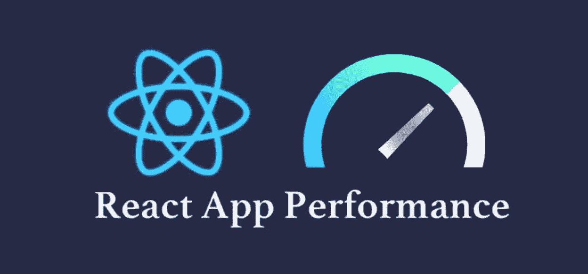

# 提高 Web 应用程序的性能— React JS

> 原文：<https://medium.com/geekculture/improve-performance-of-web-application-react-js-de5b5b0f5316?source=collection_archive---------20----------------------->



web 应用程序中与性能相关的问题并不新鲜。开发人员几乎在他们从事的每个项目中都遇到过这些问题。React 是这些语言中被认为在提供性能方面最好的一种。由于 react 的虚拟 DOM 在有效呈现组件方面很受欢迎，因此关注性能变得更加重要。

*这里有几个技巧，帮助我在提高 lighthouse 分数的同时提高了应用程序的性能*。

> ***删除所有内嵌功能***

在 React 组件的 render 方法内部定义和传递的函数称为内联函数。

让我们通过一个简单的例子来理解这一点，这个例子展示了一个内联函数在 React 应用程序中的样子。

```
import { useState } from "react";export default function App() {
    const [count, setCount] = useState(0);
    return (
        <div>
            <h1>Hello CodeSandbox</h1>
            <h1>{count}</h1>
            <button onClick={() => setCount(count + 1)}>
                Increment
            </button>
            <button onClick={() => setCount(count -1)}>
                Decrement
            </button>
        </div>
    );
}
```

在上面的例子中，onClick 属性作为调用 setCount 的内联函数被传递。该函数在 render 方法中定义，通常与 JSX 内嵌在一起。

在 React 应用程序的上下文中，我们经常看到这样的编码模式。这增加了应用程序的内存占用，即使道具没有改变，也总是会触发重新渲染。

这主要是因为方法传递总是通过引用传递，因此它将创建一个新的函数并在每个渲染周期改变它的引用。

**解决方案:**

最简单的方法是将所有内联函数移到 render 方法之外，这样它就不会在每个渲染周期被重新定义。这将减少内存占用。

```
import { useState } from "react";export default function App() {
    const [count, setCount] = useState(0); const increment = () => {
        setCount(count + 1);
    } const decrement = () => {
        setCount(count -1);
    } return (
        <div>
            <h1>Hello CodeSandbox</h1>
            <h1>{count}</h1>
            <button onClick={increment}>Increment</button>
            <button onClick={decrement}>Decrement</button>
        </div>
    );
}
```

> ***使用 Eslint-plugin-react***

几乎所有的 JavaScript 项目都推荐使用 ESLint 插件，React 也不例外。

使用 eslint-plugin-react，我们将迫使自己适应 react 编程中的许多规则，这些规则从长远来看可以使我们的代码受益，并避免许多由于编写糟糕的代码而出现的常见问题。

> ***依赖关系优化***

在考虑优化应用程序包大小时，检查我们实际上从依赖项中利用了多少代码是值得的。

让我们以开发人员广泛使用的 lodash 为例。它是一个 JavaScript 库，帮助程序员编写更简洁、更易维护的 JavaScript。假设我们只使用了 100 多个可用方法中的 20 个，那么在最终的包中包含所有额外的方法并不是最佳的。

为此，一种方法是只从组件的库中导入所需的方法。即

```
import orderBy from 'lodash/orderBy';
import filter from 'lodash/filter';orimport {filter, orderBy} from 'lodash';
```

**注意** -值得注意的是，混合这两种导入方式会导致净收益为负。基本上，这将导入整个 lodash +单个实用程序两次。

第二种方法是使用 lodash-webpack-plugin 来删除库中未使用的方法。

> ***使用代码拆分移除未使用的 JS——懒惰/悬念***

大型 react 应用程序通常由许多组件、库、实用方法等组成。这里，我们需要付出一点努力，尝试只在需要的时候加载应用程序的不同部分。如果不为此付出努力，一旦用户加载第一页，就会有一个单独的 JavaScript 包输出给他们。

所以我们可以分开捆绑包，以确保这种情况永远不会发生。React.lazy 方法使得使用动态导入在组件级别上拆分 React 应用程序中的代码变得容易。

```
import React, { lazy, Suspense } from 'react';
import LoadPage from './components/LoadPage';const GridComponent = lazy(() => import('./GridComponent'));const HomeComponent = () => (
    <div>
        <Suspense fallback={<LoadPage />}>
            <GridComponent />
        </Suspense>
    </div>
)export default HomeComponent;
```

React.lazy 函数提供了一种内置的方法来分离应用程序中的组件。然后，分离的组件以分离的 JavaScript 块的形式出现，不费吹灰之力。然后，当我们将它与悬念组件耦合时，我们可以考虑加载状态。

> **启用压缩-Gzip**

提高性能评分的最佳方法之一是在构建过程中进行压缩。使用这个，我们可以通过包 *gzipper* (npm install)压缩构建文件夹文件，并将其添加到 package.json 中。

```
"scripts": {
    ...
    "build": "node scripts/build.js && gzipper compress ./build",
}
```

使用 Gzip 压缩模块可以将您的包大小从 20%减少到 25%。

此外，我们还可以从服务器端进行压缩。如果我们使用 node.js 来服务构建文件夹，我们可以使用压缩包:

```
const compression = require('compression');
app.use(compression());
```

上面提到的技术确实帮助我提高了应用程序的性能分数。还有很多方法可以优化 React 应用的性能。例如，使用服务工作者来缓存应用程序状态，使用 useMemo，使用虚拟化长列表，避免不必要的渲染等等。

感谢阅读，希望这篇文章对你有所帮助。

*原载于*[*https://codersread.com*](https://codersread.com/improve-performance-of-web-application-react-js/)