# 在 Ubuntu 22.04 上安装 IntelliJ IDEA+Android SDK+Flutter SDK

> 原文：<https://medium.com/geekculture/install-intellij-idea-android-sdk-flutter-sdk-on-ubuntu-20-04-108a14068668?source=collection_archive---------4----------------------->

注:本帖于 2023/03/04
重访修改原文:在 Ubuntu 20.04
上安装 IntelliJ IDEA+Android SDK+Flutter SDK(内容大同小异，只是版本都升级了。)

IntelliJ IDEA 版本:版本:2022.3.2

在本教程中，我将展示如何安装所有的先决条件:IDE 和 SDK，让你开始在 Ubuntu 上构建你的 Flutter 移动项目。也就是说，它包括:

*   在 Ubuntu 上安装 **IntelliJ IDEA** IDE、 **Flutter SDK** 、 **Android SDK**
*   (可选)如何增加 IntelliJ IDEA 可以使用的内存分配。
*   (可选)如果主目录(默认)中的磁盘空间有限，如何配置 IntelliJ IDEA 数据缓存。
*   在 IntelliJ IDEA 中安装 Flutter 和 Dart 插件。
*   如何在 IntelliJ 项目中设置 Flutter SDK 和 Android SDK 配置？
*   **(非常有用)**当你的磁盘分区收到**磁盘空间不足**的错误信息时，如何更改**默认 AVD 仿真器路径**。

本教程旨在帮助**初学者**建立你开始使用 IntelliJ IDEA 开发 flutter 移动应用程序所需的整个流程。**中级用户**可能会发现最后一节“更改 AVD 路径”很有用，因为启动仿真器需要很大的空间(每次启动大约 7GB)，高级开发人员可能希望将这些仿真器隔离在一个有更多空间的不同磁盘分区中。现在，让我们开始吧！

# 安装 IntelliJ 理念

首先从他们的[官网](https://www.jetbrains.com/idea/download/#section=linux)下载 IntelliJ。下载 Linux 社区版(免费)。

注意:你也可以使用 GUI，这可能更容易些，但是我想指定安装的位置，所以我选择手动安装。

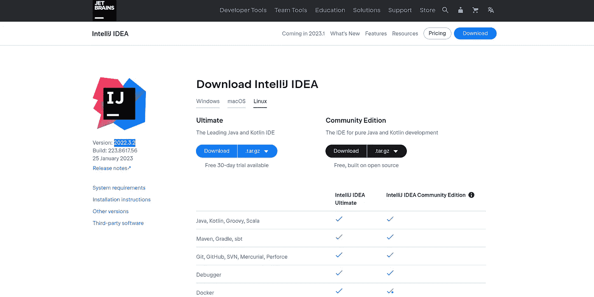

然后提取下载的。tar 到任何你想找到它的目录。

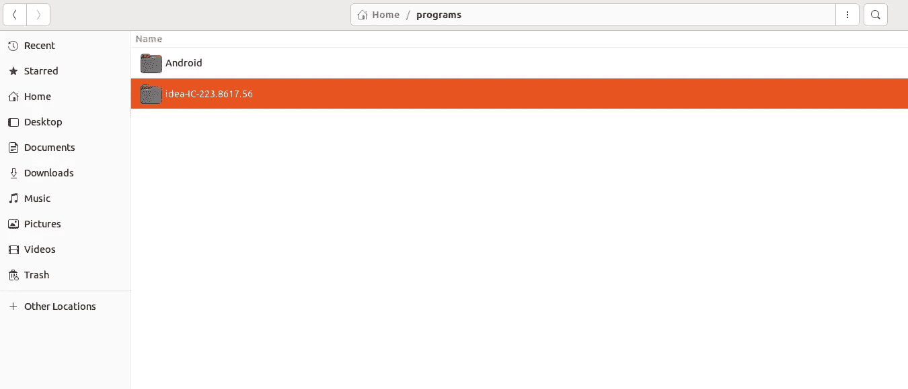

在文件夹中找到一个名为“install-Linux-tar.txt”的. txt 文件，阅读详细的安装说明，或者按照下面的教程进行操作:

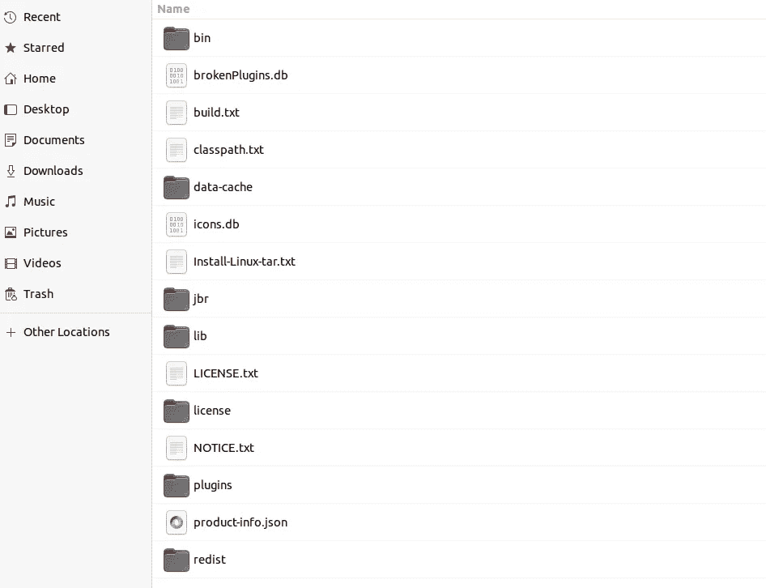

# **运行 IDE**

要运行 IntelliJ，请打开您的终端，并转到程序文件夹内的` *bin* `目录:


并执行此操作来启动智能

```
./idea.sh
```

# IntelliJ IDEA 配置

1.  **添加到系统** **路径** 这允许你从任何目录运行那个命令。
    为此，首先打开**。bashrc** 文件，然后在文件末尾添加“导出路径=<your-program-dir-PATH>:$ PATH”。

```
>> vim ~/.bashrc
```

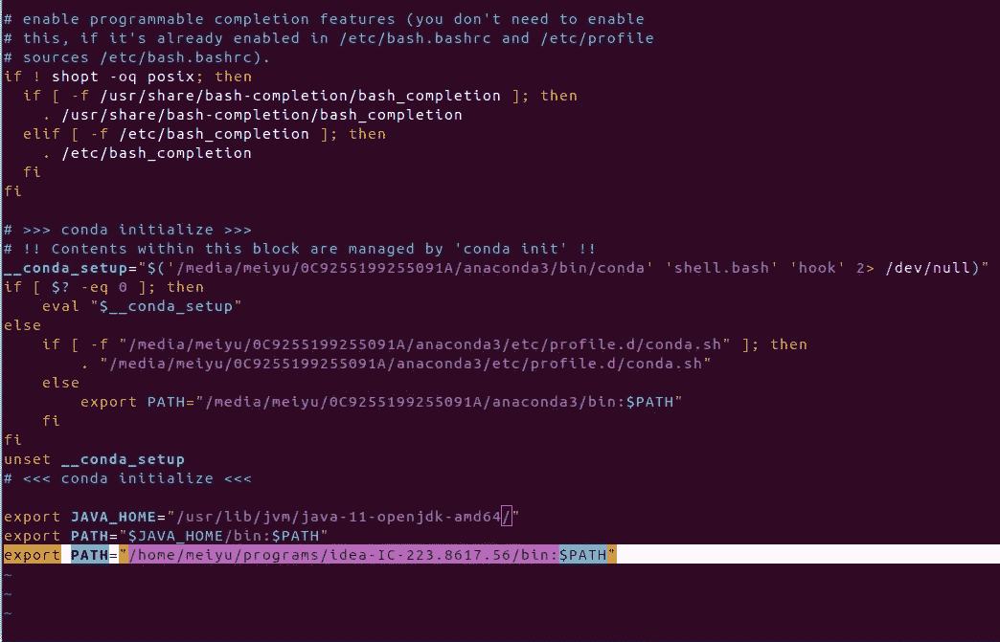

```
>> source ~/.bashrc
```

现在，由于程序目录路径被添加到您的系统路径中，当您在任何地方键入“ *idea.sh* ”时，系统将从您的系统路径中包含的目录中搜索该文件，您可以在任何地方启动它！

2.(可选)**增加内存** **IntelliJ 可以使用**

IntelliJ 数据缓存的默认内存是从 Xms(最小)128 MB 到 Xmx(最大)725 MB。比如说我们要把它从 1024 MB 设置到 2048 MB。

首先，将"< your-program-dir > /bin "中的"***idea 64 . VM options***"文件复制到 IntelliJ 配置目录中，默认位于" ~/"中。config/JetBrains/IdeaIC2021.1。

```
>> cp <your-program-dir>/bin/idea64.vmoptions~/.config/JetBrains/IdeaIC2022.3/idea64.vmoptions
```

注意:如果您的系统没有使用 JDK 64 位，那么也可以复制“***idea . VM options***”。您可以键入`java -version`，如果您看到包含`64-bit Server VM`，那么您将拥有 64 位 JDK。

转到您刚刚复制到的新配置文件，并将 Xms 和 Xmx 更改为您想要的值。

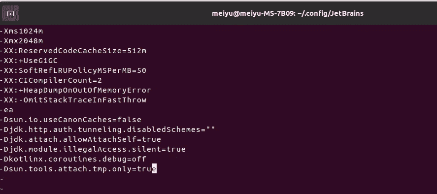

3.(可选)**改变数据缓存目录**

Xms 和 Xms 内存缓冲区将从默认的数据缓存目录中消耗:`~/.local/share/JetBrains/IdealIC2022.3`

如果你想换到另一个目录。首先，转到配置文件夹

```
>> cd ~/.config/JetBrains/IdeaIC2022.3
```

创建一个文件"***idea . properties***

```
>> vim idea.properties
```

并添加新数据缓存目录的三个新路径。或者，您可以添加第四行来配置插件的安装位置。

```
idea.system.path=<your-new-path>/system
idea.log.path==<your-new-path>/logs
idea.config.path=<your-new-path>/config
idea.plugins.path=<your-new-path>/plugins
```

看起来像这样:


# 接下来，安装 Flutter SDK

按照这个步骤安装 Flutter SDK。

简单的从云端 git 克隆到你想要安装 Flutter SDK 的目录或者使用 [snap 包安装](https://flutter.dev/docs/get-started/install/linux#next-step)(推荐)。

如果您决定手动安装，请阅读:

```
git clone [https://github.com/flutter/flutter.git](https://github.com/flutter/flutter.git) -b stable
```

接下来，将`/bin`添加到系统路径中:在`~/.bashrc`中，将这一行添加到文件的末尾，修改后不要忘记`source ~/.bashrc`。

```
export PATH="/home/meiyu/programs/flutter/bin:$PATH"
```

运行**颤振医生**看看你的安装是否完成:

```
flutter doctor
```

注意:flutter doctor 会告诉你找不到 Android toolchain，要求你安装`Android Studio`，里面包含 Android SDK。我们现在会忽略这条消息，取而代之的是，我们将从 IntelliJ IDEA 安装 Android SDK，而不需要下载 Android studio。


# 从 IntelliJ IDEA 安装 Android SDK

我们将首先在 IDEA 中创建一个新的`Android`项目，遵循[官方指令](https://www.jetbrains.com/help/idea/create-your-first-android-application.html#d8064557)，如下图所示，或者这个 [youtube](https://www.youtube.com/watch?v=ExDYQcswRCU) 视频是有帮助的。

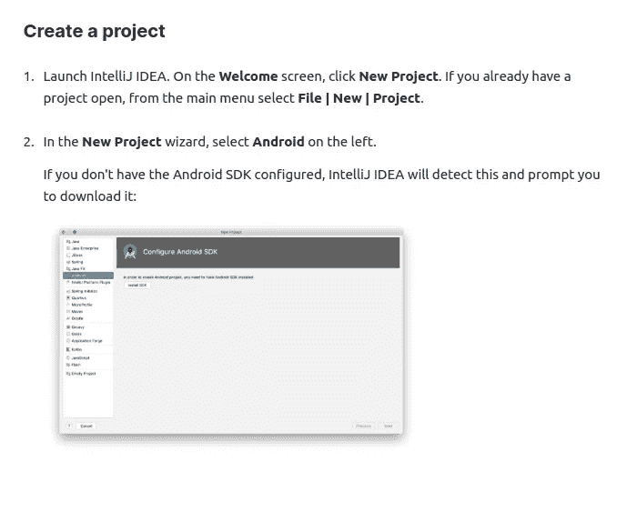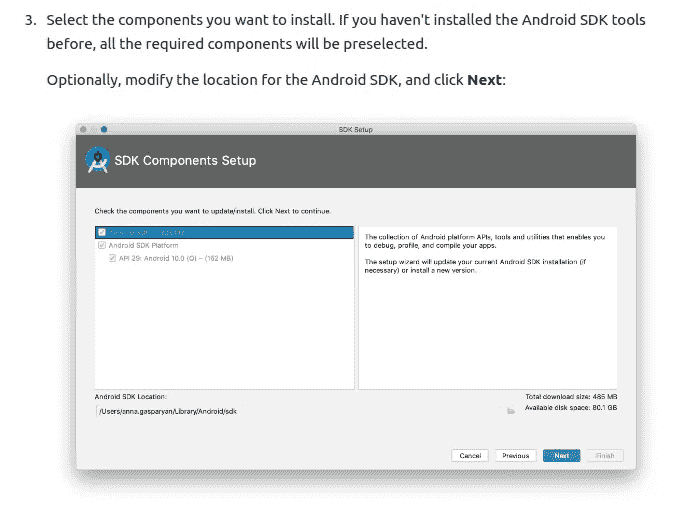

现在，您已经将 Android SDK 安装到了您定义的位置。另外，在您的终端中，要链接 flutter SDK 来识别 Android SDK:

```
>> flutter config --android-sdk </path/to/android/sdk>
```

**在 IDEA** 中安装颤振插件

为了使 IDEA IDE 支持 Flutter 项目框架和语法亮点等，在 IDEA 中从“`Settings/Preference` /Plugins”安装 Flutter 插件。


当你安装 Flutter 插件时，`Dart`插件将作为一个捆绑包被安装。

# 创建一个颤振项目

新建项目>选择“Flutter ”,看到这个提示设置 Flutter SDK 路径。

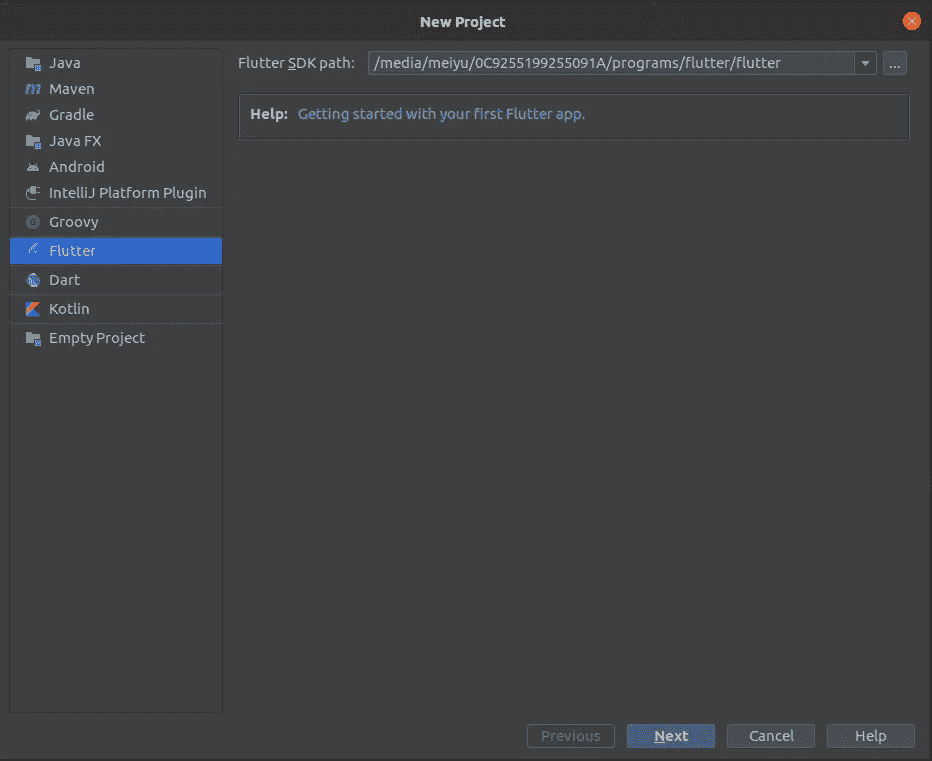

Flutter SDK 路径是您安装 Flutter 包的地方。

```
flutter doctor -v
```


在*颤振版本的第一行找到:<颤振 SDK 路径>*

项目创建完成后，您仍然可以通过:" ***文件>设置>语言&框架> Flutter*** "来检查或更改关联的 Flutter SDK 路径

# 为 Flutter 项目配置 Android SDK

创建了 Flutter 项目后，转到`File > Project Structure`。在项目 SDK 下拉菜单下，选择`Add SDK > Android SDK`。从之前下载的目录中选择 Android SDK。

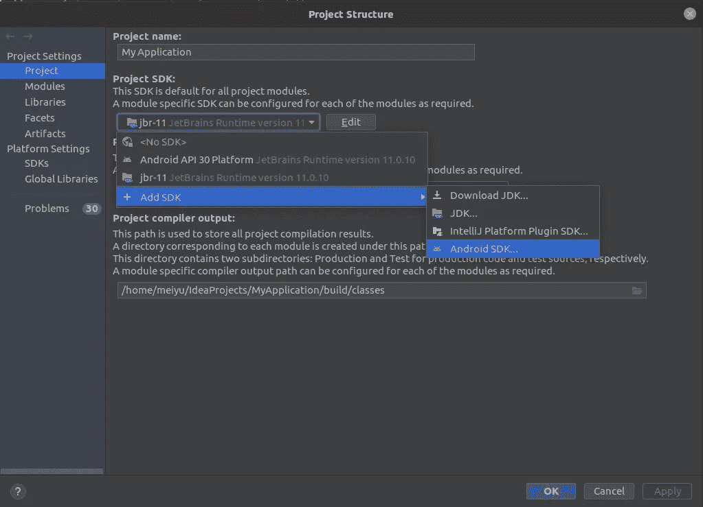

# 安装不同的 Android SDK 版本(可选)

如果在安装了某个 Android API 版本(SDK)后，您想要添加不同的版本，请转到`Settings/ Apperance & Behabivior/ System Settings/ Android SDK`并选择您想要使用的版本。

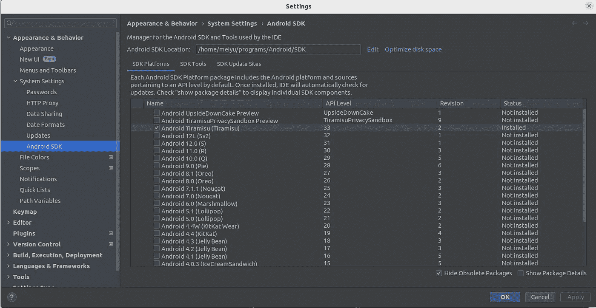

要在您的 Flutter 项目中使用新下载的 Android SDK 版本，请返回上一步为您的项目进行配置。

# 在 IDEA 中设置仿真器

**AVD 管理器**自带 Android SDK。这是为了管理虚拟设备，即运行 flutter 应用程序的虚拟手机或平板设备。按照步骤安装新的虚拟设备:选择“**工具>安卓>设备管理器**

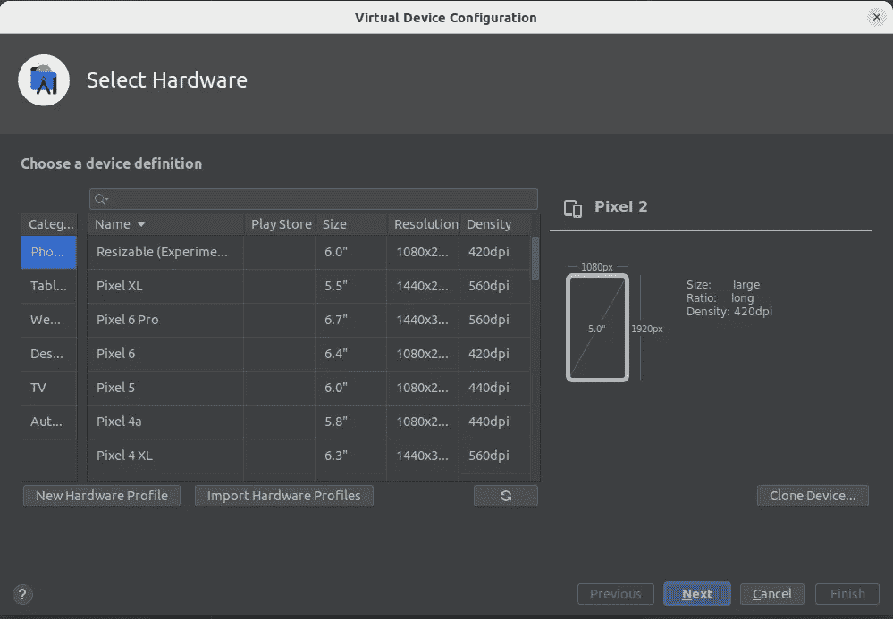

然后选择你选择的虚拟设备和你想要安装的 Android SDK 版本。接受条款并开始下载。

如果您在启动新的仿真器时遇到**磁盘空间问题**，您只需要以下几节。

# 更改 AVD 路径—用尽磁盘空间

这是一个棘手的部分，以改变默认的 AVD 路径存储所有的虚拟设备。虚拟设备在您的磁盘上运行需要很大的空间(大约 7G)。通过**默认**，它们被安装到`~/.android/avd/<virtual-device-version>`。如果它所在的磁盘分区内存不足，当您尝试启动虚拟设备时，将会看到以下错误。


如果您转到默认文件夹`~/.android/avd/`，您将看到所有虚拟设备都带有一个`.avd`文件夹和一个`.ini`文件。`.avd`文件夹有实际的虚拟设备映像，而`.ini`文件只是一个 init 文件，它存储了检索`.avd`的路径。

**你可能会在网上找到这个解决方案:(后面会有更好的解决方案)**

一种方法是将`.avd`文件夹移动到新的目录下，然后用`.avd`文件夹新路径的更新来原地修改对应的`.ini`。


Pixel_2_API_30.ini

*   `Pixel_2_API_30.avd`(文件夹)现在移动到新路径:"*/media/meiyu/0c 9255199255091 a/programs/Android _ AVD/Pixel _ 2 _ API _ 30 . AVD*"
*   `Pixel_2_API_30.ini`(文件)保持默认的“~/”。android/avd/"文件夹，但其值已更改为指向新的`.avd`路径。

但这是**不理想的**，因为每次当你初始化一个新的仿真器时，你需要**手动**反复做这件事。我们想改变 Android SDK 识别其 AVD home 路径的路径。

**更好的解决方案:只需改变** `**ANDROID_AVD_HOME**` **env 变量**

[Android Studio 文档](https://developer.android.com/studio/command-line/variables)

解决方案是更改环境变量`ANDROID_AVD_HOME`并将其设置为您想要为虚拟设备分配空间的路径。在您的终端中，进行一次性设置:

```
>> export $ANDROID_AVD_HOME=<your-new-path>
```

如果您想在每次启动终端时保留该变量，请在您的`~/.bashrc`中设置它

```
vim ~/.bashrc
```

将此行添加到文件末尾: ***导出 ANDROID _ AVD _ HOME = "<your-new-path>"***

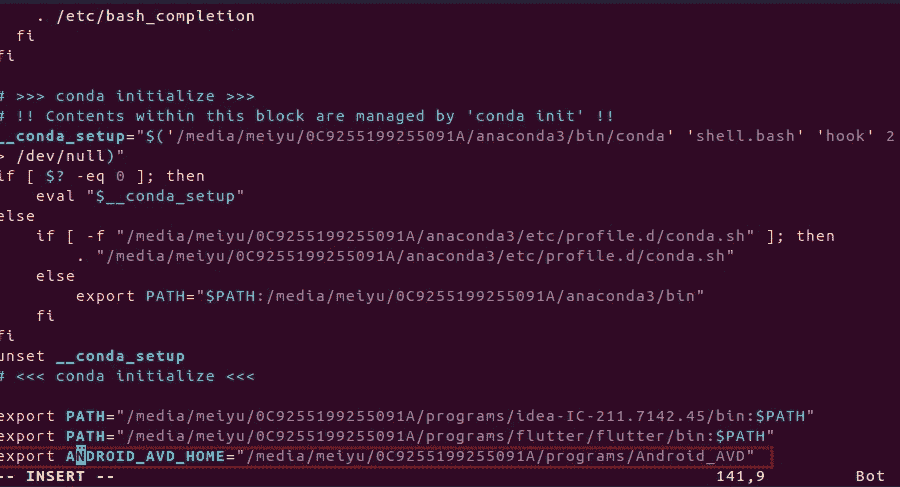

然后运行 source 命令刷新新配置。

```
>> source ~/.bashrc
```

# 更改 AVD 路径后—设置新的仿真器

现在我通过“工具> Android >设备管理器”创建一个 Pixel 6 虚拟设备:

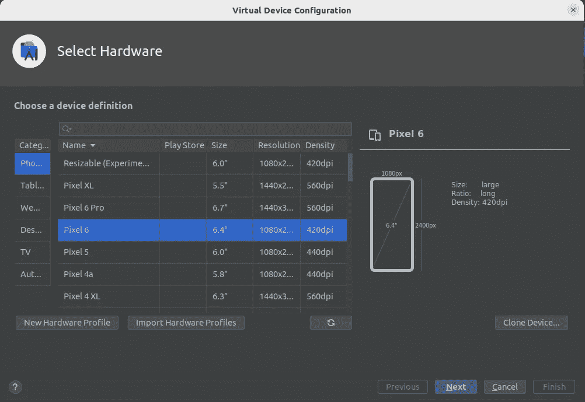

选择您之前安装的 Android API 版本，然后“下载”。在我的例子中，我之前安装了 Android API 30 (SDK)，所以我需要选择第一个:

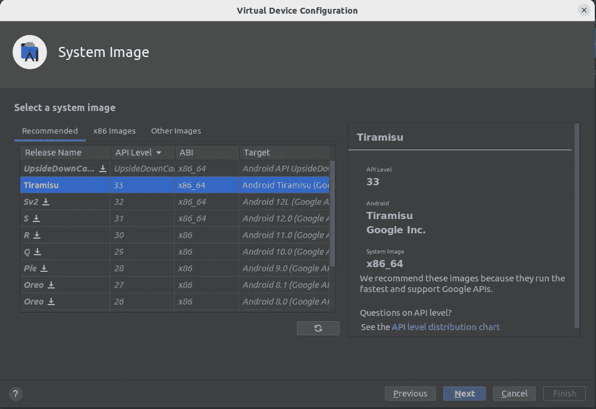

它开始下载到 Android SDK 目录:

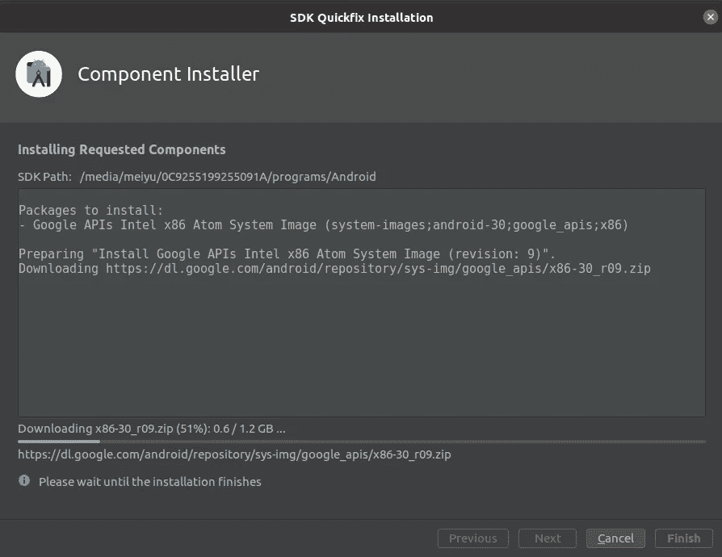

下载软件包后，单击“下一步”转到详细的设置页面。点击“完成”即可。


新设备出现在列表中。关闭窗口并返回工作区。

在设备管理器面板中，您可以看到所有的虚拟设备，并单击三角形来启动模拟器:


如果运行成功，您会看到虚拟设备出现在 Android 模拟器面板中:

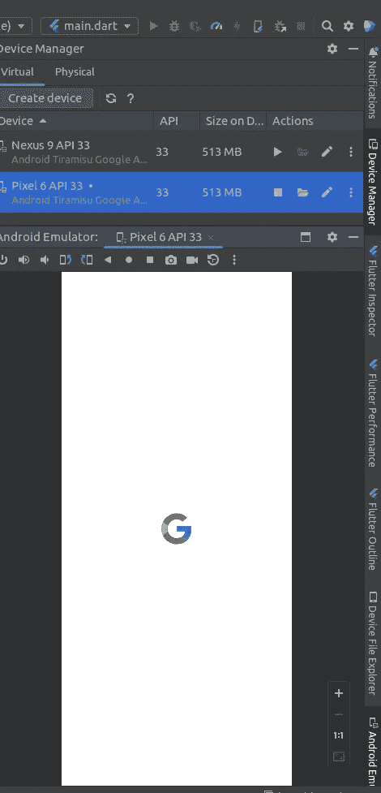

# 启动新仿真器后，检查新的 AVD 路径

现在，让我们导航到我设置`Android_AVD_HOME`指向的目录。我把它设置为“*/media/meiyu/0c 9255199255091 a/programs/Android _ AVD/”，*现在新的模拟器就存储在我想要的正确位置了。


# 摘要

恭喜您已经完成了漫长的设置，现在您已经为 IntelliJ IDEA 中的 Flutter 项目做好了一切准备！

欢迎你在这个帖子里留下评论来分享你的想法，如果你发现这个教程对你的设置有帮助，请给我留下好印象！感谢您的阅读和快乐编码！