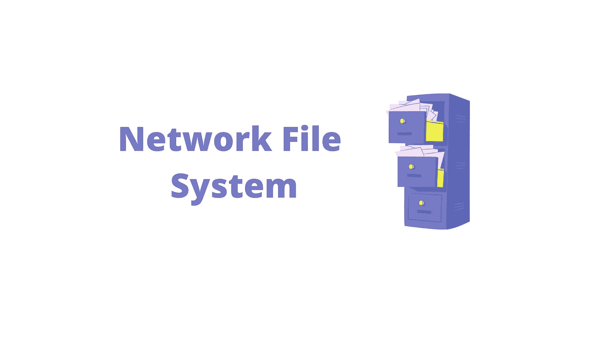

# 在 Ubuntu 20.04 服务器上安装 NFS

> 原文：<https://medium.com/geekculture/installing-nfs-on-ubuntu-20-04-server-3993bf9ac1b6?source=collection_archive---------8----------------------->

你好，我正在谈论 NFS 和 NFS 的安装。



NFS 是网络文件系统的缩写，是一种分布式文件系统
协议。通过网络与他人共享文件和目录。
可以帮你分享。远程系统上的程序
彼此共享信息，就像它们在机器上一样，并且
允许访问。

NFS 运行在客户机-服务器环境中。换句话说，如果您要设置 NFS 在两个系统之间共享文件，必须将一个系统配置为服务器，另一个系统配置为客户端。

服务器充当管理员，验证和授权客户端访问共享数据。几乎任何数量的客户端都可以像访问本地存储中的任何其他文件或目录一样简单地访问共享数据。

# 如何在 Ubuntu 服务器上安装 NFS 服务器

我准备了一个详细的分步指南，指导你如何在 Ubuntu 中安装和设置 NFS 服务器，这样你就可以开始与其他客户端系统共享数据了。在本教程中，我们将使用 Ubuntu 20.04 LTS。

## 配置主机服务器

要安装主服务器，您必须首先安装 NFS 内核服务器。
必须。完成后，与所有客户端系统共享
您可以创建和导出您想要的文件和目录。

让我们完成这件事。

## 步骤 1:为 NFS 内核服务器安装服务器

NFS 内核服务器到 Ubuntu 系统，首先作为服务器运行。我们需要安装这个软件包。但在此之前，下载系统软件包，以确保在此过程中不会出现任何问题。
更新一下吧。

为此，请在终端中键入以下命令:

```
sudo apt update
```

对于所有系统软件包更新，是时候使用以下命令安装软件包“nfs-kernel-server”了:

```
sudo apt install nfs-kernel-server
```

这也将在您的系统上安装一些额外的软件包，包括“nfs-common”和“rpcbind”，它们是设置文件共享所必需的。

## 步骤 2:创建 NFS 导出目录

在安装了“nfs-kernel-server”包之后，您现在可以创建一个 nfs 导出目录(简称为“导出目录”)，它将与所有客户机系统共享。为此，请在终端中键入以下命令。

```
sudo mkdir -p /mnt/nfs_share
```

您希望客户端可以访问的所有文件都必须在此目录中创建。因为我们希望客户端系统对这个共享目录拥有完全访问权，所以我们需要删除任何限制访问权的目录权限。

这可以通过以下命令完成:

```
sudo chown -R nobody:nogroup /mnt/nfs_share/
```

完成上述命令后，继续下一步。

## 步骤 3:为客户端系统分配 NFS 服务器访问权限

准备好导出目录后，您需要授予客户端系统对主服务器的访问权限。该权限在系统的/etc 文件夹中的“exports”文件中定义。

您将需要编辑这个文件，并添加一些额外的命令行，以使客户端能够访问其系统的导出目录。因此，通过在终端中输入以下命令，使用 Nano 编辑器打开它:

```
sudo nano /etc/exports
```

从这里，您可以为单个客户端、多个客户端或整个子网提供 NFS 服务器访问。在本次阅读中，我们将为所有子网提供对 NFS 共享的访问。

为此，您需要将这一行添加到“导出”文件中。

```
/mnt/nfs_share subnet(rw,sync,no_subtree_check)
```

在这里，您需要在提供的占位符中更改系统的子网。

另外，让我们看看命令的其他部分是什么意思:

**rw :** 读/写命令
**sync :** 更改在应用之前在磁盘上进行。
**no _ subtree _ check****:**取消子树检查。

但是，如果您只想向单个客户端授予访问权限，可以使用以下语法:

```
/mnt/nfs_share client_IP_1(rw,sync,no_subtree_check)
```

对于多个客户端关节，您必须一个接一个地这样做:

```
/mnt/nfs_share client_IP_1(rw,sync,no_subtree_check)/mnt/nfs_share client_IP_2(rw,sync,no_subtree_check)
```

由于客户端系统可以访问 NFS 服务器，现在是时候进入下一步了。

## 步骤 4:导出共享 NFS 目录

有了上面所有可用的配置，就可以导出共享的 NFS 目录并使其对客户端系统可用了。

这可以使用以下命令快速完成:

```
sudo exportfs -a
```

为 NFS 执行此操作，以确保所有配置都有效。
需要重启内核服务器。

```
sudo systemctl restart nfs-kernel-server
```

最后，是时候进入这个设置的最后一步了。

## 步骤 5:允许客户端通过防火墙

授予客户端对 NFS 服务器的访问权限并导出共享目录(即使在传输后)后，如果客户端被防火墙阻止，它们仍然无法访问文件。因此，您需要为您的客户端打开防火墙。你的 Ubuntu 电脑已经有了一个默认的防火墙——UFW(简单防火墙)。

您可以键入以下命令来检查它在您的系统上是否有效:

```
sudo ufw status
```

如果它显示为非活动，您必须使用以下命令将其重新打开:

```
sudo ufw enable
```

但是，如果由于某种原因它没有安装在您的系统上，您可以使用以下命令来安装它:

```
sudo apt install
```

在你的 Ubuntu 系统上安装并启用 UFW 后，你需要配置它来允许访问你的客户端。

由于我们为 NFS 提供了对整个子网的访问，因此我们需要使用以下命令:

```
sudo ufw allow from subnet to any port nfs
```

但是，如果您只允许基于每个客户端的 NFS 访问，则需要输入客户端 IP 作为。

```
sudo ufw allow from client_IP_1 to any port nfs
```

就是这样！您已经在服务器计算机上成功安装并配置了 NFS 服务。

# 配置客户端系统

接下来，我们需要在客户端系统上安装和设置 NFS 来访问共享目录。与上一个类似，这里有一个分步指南来帮助你。

## 步骤 1:安装 NFS 通用软件包

安装 NFS 共享的客户端系统时，请安装“nfs-common”软件包。我们需要设置。如前所述，您必须首先更新系统软件包，然后使用以下命令更新 NFS-common
您必须安装:

要更新软件包:

```
sudo apt update
```

要安装 nfs 通用软件包，请执行以下操作:

```
sudo apt install nfs-common
```

完成后，继续下一步。

## 步骤 2:让我们创建一个挂载点

接下来，您需要创建一个挂载点。它将用于从 NFS 服务器装载 NFS 共享文件。为此，请在终端中键入以下命令:

```
sudo mkdir -p /mnt/nfs_clientshare
```

## 步骤 3:将 NFS 共享目录挂载到客户端系统

您在上述步骤中创建的文件夹与系统中的任何其他文件夹一样。要从主服务器访问 NFS 共享目录，您需要将其挂载到新文件夹:

为此，您必须首先知道 NFS 服务器的 IP 地址。
必须。在服务器系统的终端中键入以下命令:

```
ifconfig
```

这将显示网络接口配置。服务器的 IP
是在“inet”下给出的 IP，在我们的例子中是 10.0.2.15。

使用此 IP，在 NFS 客户端的终端中键入以下命令，最终将 NFS 共享目录挂载到客户端系统:

```
sudo mount 10.0.2.15:/mnt/nfs_share /mnt/nfs_clientshare
```

## 第 4 步:链接看看是否一切正常测试它

通过按顺序执行以上步骤，您已经成功地创建了一个 NFS 服务器，用于在一个服务器系统和多个客户端系统之间共享文件和文件夹。

剩下的工作就是检查一切是否正常。

为此，请在服务器上的 NFS 共享目录中创建一个新文件。
创造。您可以使用以下命令来完成此操作:

```
cd /mnt/nfs_share/touch file1.txt file2.txt file3.txt
```

该过程完成后，使用以下命令检查客户端系统，查看这些文件是否出现在 NFS 共享目录中:

```
ls -l /mnt/nfs_clientshare/
```

如果您在列表中看到“file1.txt”、“file2.txt”和“file3.txt”文件，这意味着 NFS 服务器正在运行，您现在可以开始在客户端和服务器系统之间共享和接收文件。