# LVM 与 Hadoop 集群的集成，为 DataNode 存储提供了灵活性

> 原文：<https://medium.com/geekculture/integration-of-lvm-with-hadoop-cluster-and-providing-elasticity-to-datanode-storage-6beb70513f3?source=collection_archive---------33----------------------->


**在** [**Linux**](https://en.wikipedia.org/wiki/Linux) **中，逻辑卷管理器(LVM)是一个** [**设备映射器**](https://en.wikipedia.org/wiki/Device_mapper) **框架，为** [**Linux 内核**](https://en.wikipedia.org/wiki/Linux_kernel) **提供** [**逻辑卷管理**](https://en.wikipedia.org/wiki/Logical_volume_management) **。大多数现代的** [**Linux 发行版**](https://en.wikipedia.org/wiki/Linux_distribution) **都是 LVM 感知的，以至于能够将它们的** [**根文件系统**](https://en.wikipedia.org/wiki/Root_file_system) **放在一个** [**逻辑卷**](https://en.wikipedia.org/wiki/Logical_volume) **上。**

Heinz Mauelshagen 于 1998 年编写了最初的 LVM 代码，当时他在 Sistina Software 工作，从 HP-UX 的卷管理器那里获得了主要的设计指导方针。

**卷管理**在物理存储上创建 ***抽象层*** ，允许您创建逻辑存储卷。这在许多方面比直接使用物理存储提供了更大的灵活性。此外，硬件存储配置对软件是隐藏的，因此可以在不停止应用程序或卸载文件系统的情况下调整和移动它。这可以降低运营成本。

与直接使用物理存储相比，逻辑卷具有以下优势:

*   **灵活容量**

使用逻辑卷时，文件系统可以跨多个磁盘扩展，因为您可以将磁盘和分区聚合到单个逻辑卷中。

*   **可调整大小的存储池**

您可以使用简单的软件命令扩展逻辑卷或减少逻辑卷的大小，而无需对底层磁盘设备进行重新格式化和重新分区。

*   **在线数据重新定位**

要部署更新、更快或更有弹性的存储子系统，您可以在系统处于活动状态时移动数据。使用磁盘时，可以重新排列磁盘上的数据。例如，您可以在移除热插拔磁盘之前清空它。

*   **方便设备命名**

可以在用户定义和自定义命名的组中管理逻辑存储卷。

*   **磁盘分条**

您可以创建一个逻辑卷，在两个或多个磁盘上对数据进行条带化。这可以显著提高吞吐量。

*   **镜像卷**

逻辑卷提供了一种为数据配置镜像的便捷方式。

*   **卷快照**

使用逻辑卷，您可以拍摄设备快照以进行一致的备份，或者在不影响真实数据的情况下测试更改的效果。

*   **精简卷**

可以对逻辑卷进行精简配置。这允许您创建大于可用盘区的逻辑卷。

*   **缓存卷**

缓存逻辑卷使用由快速块设备(如 SSD 驱动器)组成的小型逻辑卷，通过将经常使用的块存储在更小、更快的逻辑卷上来提高更大、更慢的逻辑卷的性能。

# LVM 建筑概述

LVM 逻辑卷的底层物理存储单元是块设备，如分区或整个磁盘。该设备被初始化为 LVM 物理卷(PV)。

为了创建**一个 LVM 逻辑卷，物理卷**被组合成一个**卷组(VG)** 。这将创建一个磁盘空间池，从中可以分配 LVM 逻辑卷(LV)。这个过程类似于将磁盘划分为分区的方式。文件系统和应用程序(如数据库)使用逻辑卷。

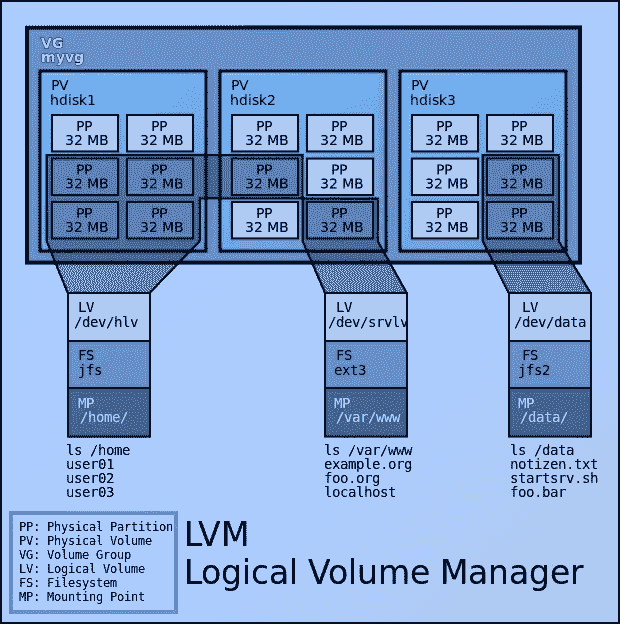

Source: Wikipedia

# APACHE HADOOP

[**Apache Hadoop 软件**](https://hadoop.apache.org/) **库是一个框架**，它允许使用简单的编程模型跨计算机集群对大型数据集进行**分布式处理。它被设计成从单个服务器扩展到数千台机器，每台机器提供本地计算和存储。该库本身不是依靠硬件来提供高可用性，而是被设计为检测和处理应用层的故障，因此在一个计算机集群上提供高可用性服务，而每个计算机都可能容易出现故障。**

在本文中，我使用了 **AWS cloud** ，在那里我启动了我的 Hadoop 集群，并创建了**一个 NameNode** 和**一个 DataNode** 。

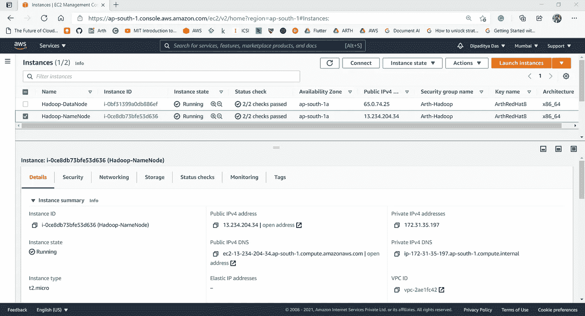

启动后，我们必须设置 Hadoop 集群的 **NameNode，并验证我们将使用`**jps**` 命令，该命令显示**当前 Java 进程** **正在**虚拟机(JVM)中运行**。****


类似地，在 DataNode 中，我们有**来配置和启动**在 **EC2 实例中的 DataNode 进程。**


在成功配置和初始化上述过程之后，它应该看起来像这样。

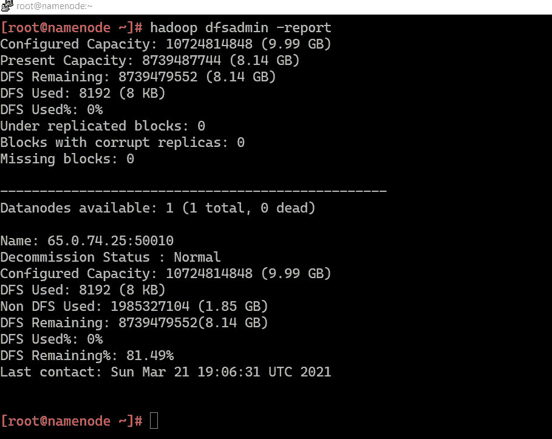

> `**hadoop dfsadmin -report**`

此命令在 CLI 中显示 Namenode 和 DataNode 的整个群集报告。

**在 Chrome、Firefox 等任何兼容浏览器中打开 provide URL，我们还可以看到上述集群的 Web 控制台 UI 报告。**

> `**http://<IPv4_of_NameNode>:50070/dfshealth.jps**`

**注意:附加到两个 EC2 实例的安全组应该允许端口号 50070，否则我们将看不到任何东西。**

这是我们需要的基本设置，以便详细见证实际情况。

## **步骤 1:创建并连接两个 EBS 卷**

我们将创建两个大小为 15GiB 的 EBS 通用 SSD 卷，在扩展我们的 DataNode 移动存储时用作附加存储。


正如我们在 **AWS 中看到的，标记为**物理驱动器 1** 和**物理驱动器 2 的两个卷**。**

但是在 DataNode 中，设备的**名称将被不同地映射**，比如 **/dev/xvdf** 和 **/dev/xvdg** ，这基本上模仿了 **/dev/sdf** 和 **/dev/sdg。**

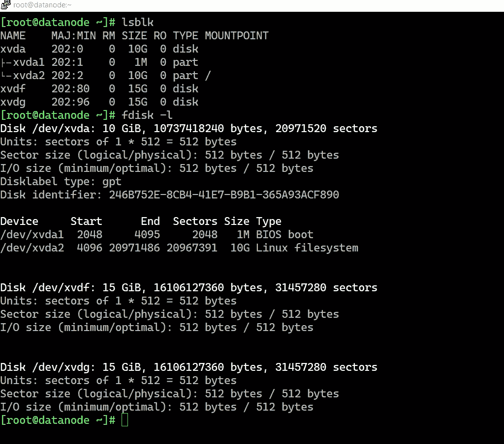

## **步骤 2:安装必要的软件包**

现在我们已经附加了卷，我们将在 DataNode 系统中下载 **lvm2** 包。DataNode 系统正在运行 **RHEL 8 云映像(AMI)。**

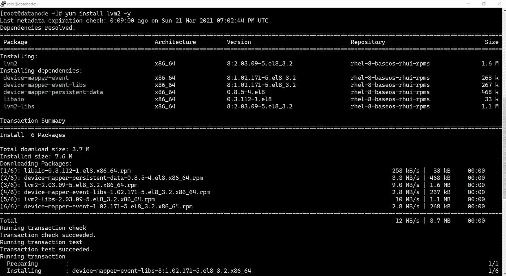

我们将使用 **yum package** 管理器来**安装 lvm2 包及其依赖项。**

## 步骤 3:从物理分区创建物理卷

**/dev/xvdf** 和 **/dev/xvdg** 是我们将使用`**pvcreate**`命令创建物理卷的物理分区。

```
**pvcreate /dev/xvdf /dev/xvdg**
```

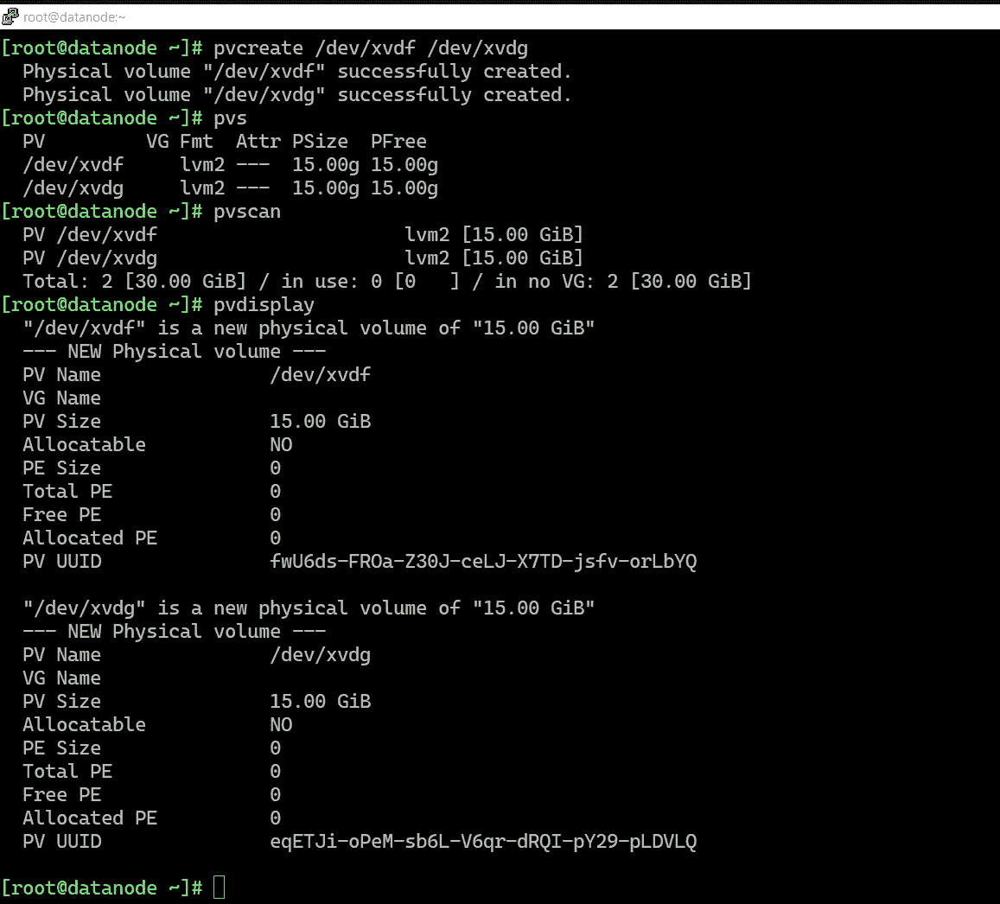

我们可以使用三个命令来显示 LVM 物理卷的属性:pvs、pvdisplay 和 pvscan。

```
**pvs**
```

***PVS 命令以可配置的形式提供物理卷信息，每个物理卷显示一行。pvs 命令提供了大量的格式控制，对于脚本编写非常有用。***

```
**pvscan**
```

***PVS can 命令扫描系统中所有支持的 LVM 块设备的物理卷。***

```
**pvdisplay**
```

***PV display 命令为每个物理卷提供详细的多行输出。它以固定格式显示物理属性(大小、数据区、卷组等)。***

## 步骤 4:创建物理卷的卷组

物理卷被组合成卷组(VG)。这将创建一个磁盘空间池，从中可以分配逻辑卷。

在卷组中，可用于分配的磁盘空间被划分为固定大小的单元，称为盘区。扩展区是可以分配的最小空间单位。在一个物理卷中，盘区被称为物理盘区。

逻辑卷被分配到与物理盘区大小相同的逻辑盘区中。因此，卷组中所有逻辑卷的盘区大小都是相同的。卷组将逻辑盘区映射到物理盘区。

要创建卷组，请使用以下命令:

```
**vgcreate hadoop /dev/xvdf /dev/xvdg**
```

这就创建了一个名为 ***hadoop*** 的 VG。PVs**/dev/xvdf***和 ***/dev/xvdg*** 是 VG **hadoop** 的基本存储级别。*

*以后可以用 PVs 扩展上述 VG。要扩展 VG，请使用以下命令:*

```
***vgextend hadoop /dev/xvdh***
```

*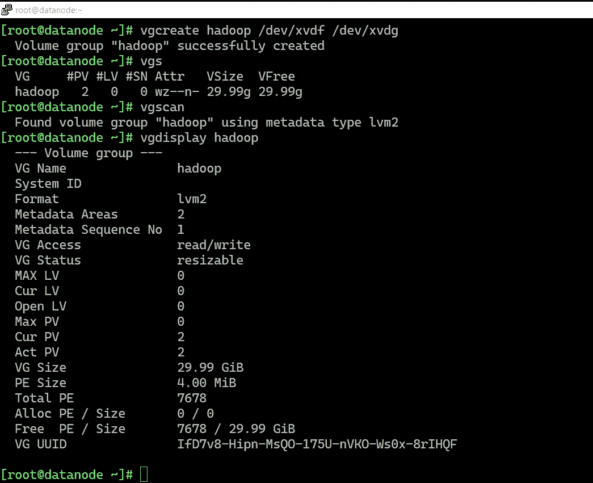*

*有两个命令可以用来显示 **LVM 卷组**的属性: **vgs** 和 **vgdisplay** 。*

```
***vgscan***
```

****vgscan 命令扫描系统中所有支持的 LVM 块设备以查找卷组，也可用于显示现有的卷组。****

```
***vgs***
```

****vgs 命令以可配置的形式提供卷组信息，每个卷组显示一行。vgs 命令提供了大量的格式控制，对于脚本编写非常有用。****

```
***vgdisplay***
```

****vgdisplay 命令以固定的形式显示卷组属性(如大小、盘区、物理卷的数量等)。****

## ***步骤— 5:从卷组创建逻辑卷***

*要创建逻辑卷，请使用以下命令:*

```
***lvcreate -L 12G -n Volume1 hadoop***
```

*`**-n**`选项允许用户将 LV 名称设置为 lv01。在本例中,`**-L**`选项允许用户以 Mb 为单位设置 LV 的大小，但是也可以使用任何其他单位。默认情况下，LV 类型是线性的，但是用户可以通过使用`**--type**`选项指定所需的类型。*

*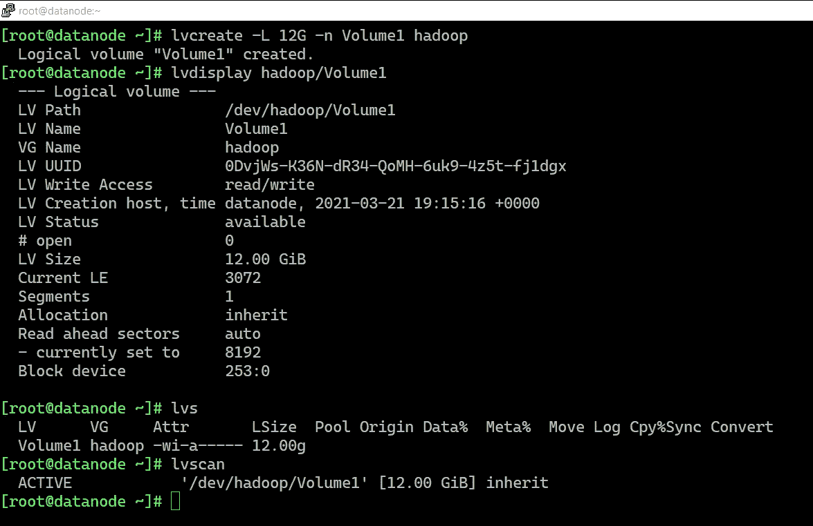*

*有三个命令可以用来显示 **LVM 逻辑卷的属性:lvs、lvdisplay 和 lvscan。***

```
***lvs***
```

****LVS 命令以可配置的形式提供逻辑卷信息，每个逻辑卷显示一行。lvs 命令提供了大量的格式控制，对于脚本编写非常有用。****

```
***lvdisplay***
```

****lvdisplay 命令以固定格式显示逻辑卷属性(如大小、布局和映射)。****

```
***lvscan***
```

****LVS can 命令扫描系统中的所有逻辑卷并列出它们。****

## ***步骤 6:格式化逻辑卷***

*现在，为了使用存储空间，我们必须格式化 ext4 文件系统中的逻辑卷一次。*

**

## *步骤 7:为卷 1 (LV)创建一个挂载点*

*格式化之后，现在我们将逻辑卷挂载到/dn1 目录，该目录是我们在配置 DataNode 系统时已经创建的。*

***注意，在挂载之前，我们需要停止 DataNode 进程。***

*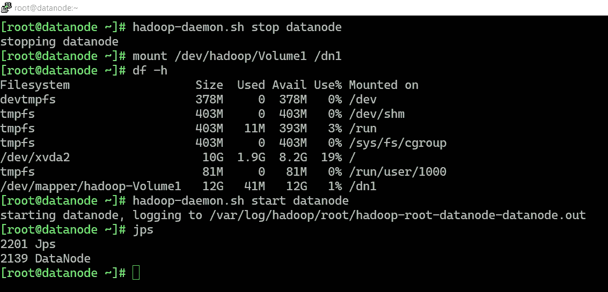*

```
***df -h***
```

***该命令显示卷 1 的 12GiB 空间被挂载到/dn1。***

*再次启动 DataNode 后，我们可以看到我们的 Hadoop DataNode 现在有 12GiB 的存储空间。*

*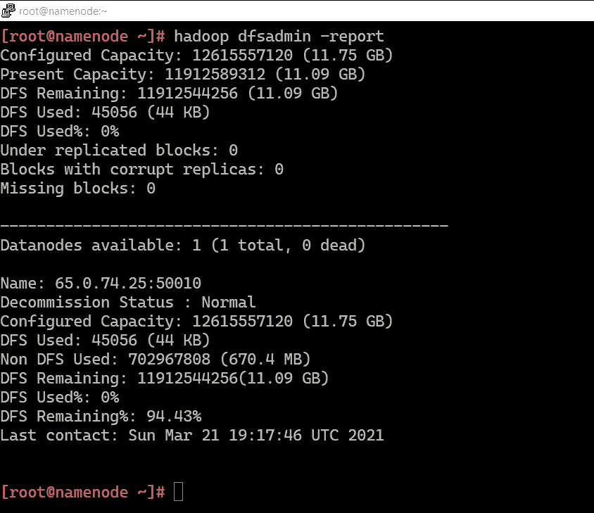***

# *增加逻辑卷*

*为了增加逻辑卷的大小，我们使用了 **lvextend** 命令。*

***当我们扩展逻辑卷时，我们可以指明我们想要扩展多少，或者在扩展之后我们想要它有多大。***

***在我们扩展了逻辑卷之后，有必要增加文件系统的大小来匹配。***

*默认情况下，大多数文件系统调整工具会将文件系统的大小增加到底层逻辑卷的大小，因此我们不需要担心为两个命令指定相同的大小。这也是我们在 lvextend 中使用 `**--resizefs**` **选项的原因。***

*以下命令将逻辑卷 **/dev/hadoop/Volume1** 扩展到 16 千兆字节(GiB)。*

*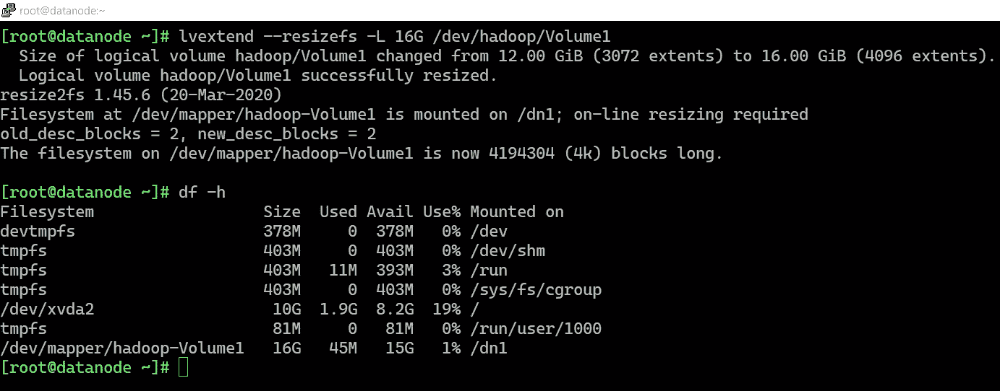**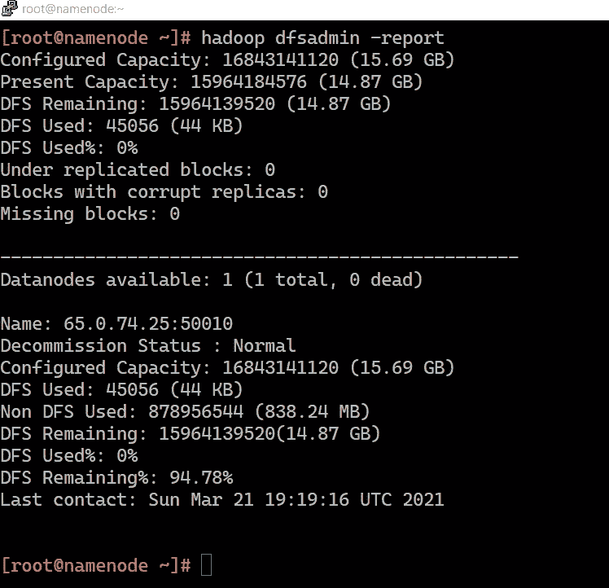***

*下面的命令将 **8 千兆字节(GiB)** 添加到逻辑卷 **/dev/hadoop/Volume1，该卷扩展到 24 千兆字节。***

*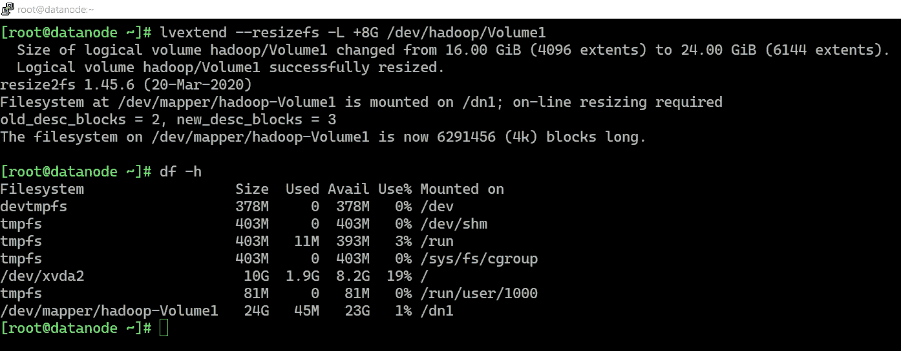**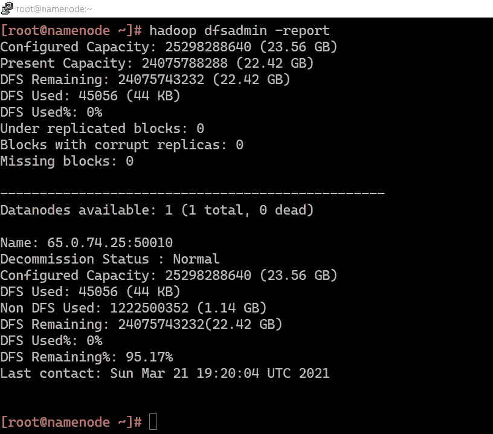***

# *缩小逻辑卷*

*我们可以使用 **lvreduce** 命令来减小逻辑卷的大小。*

*如果您正在减少的逻辑卷包含文件系统，为了防止数据丢失，我们必须确保文件系统没有使用正在减少的逻辑卷中的空间。因此，当逻辑卷包含文件系统时，建议您使用 lvreduce 命令的`**--resizefs**`选项。当我们使用此选项时，lvreduce 命令会在收缩逻辑卷之前尝试缩减文件系统。如果收缩文件系统失败(在文件系统已满或文件系统不支持收缩时会发生这种情况)，则 lvreduce 命令将失败，并且不会尝试收缩逻辑卷。*

***请注意，我们需要停止 DataNode，因为缩小或减少存储大小并不常见，我们需要停止 Datanode 进程，因为它将该操作视为数据丢失。***

*以下命令将逻辑卷 **/dev/hadoop/Volume1** 扩展到 7gb(GiB)*

*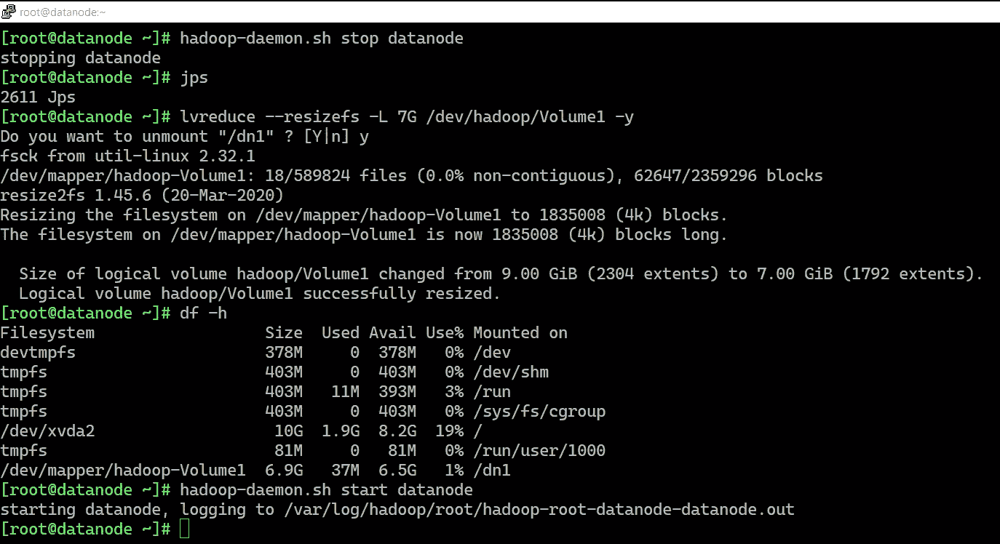**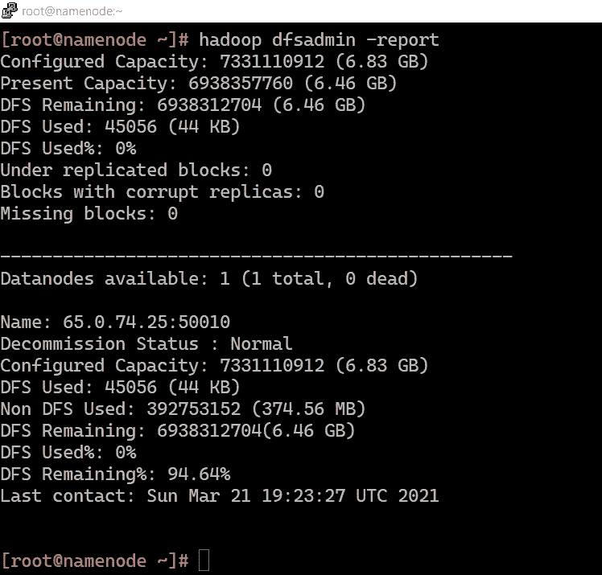**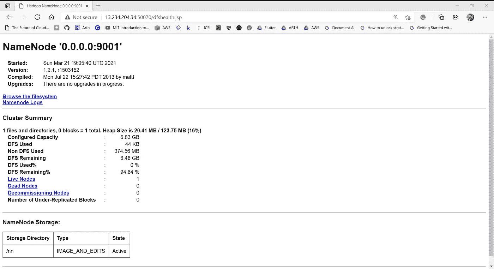*

*以下命令将 1 **gigibyte(GiB)** 删除到逻辑卷 **/dev/hadoop/Volume1。***

*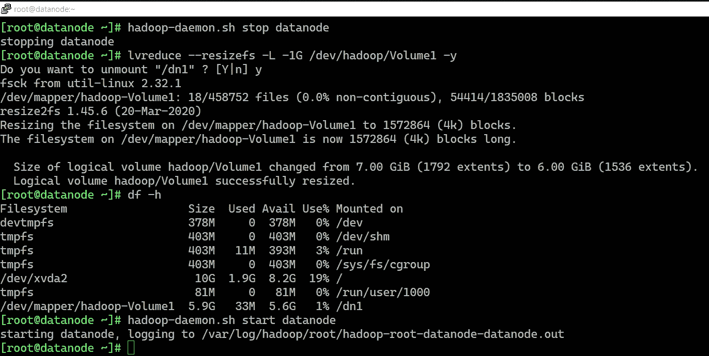**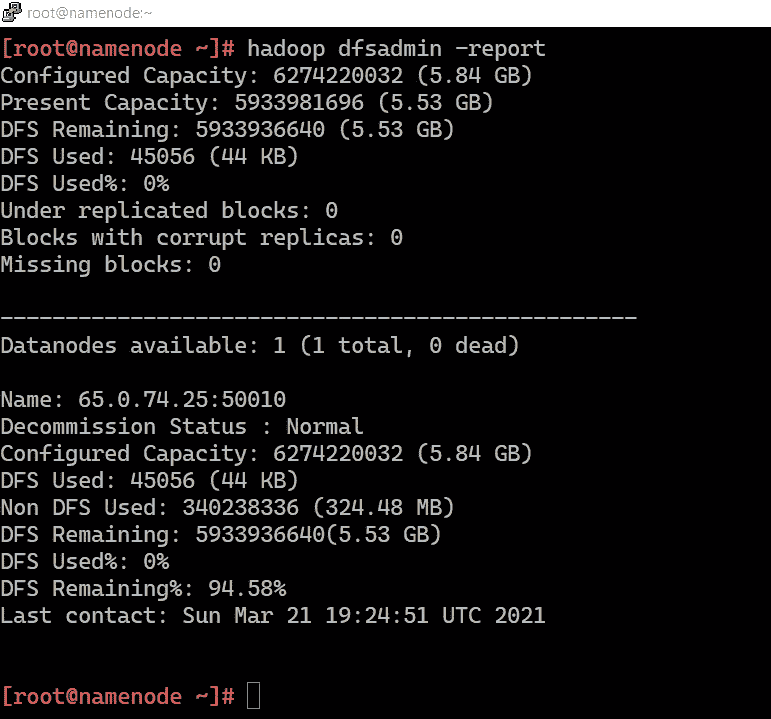**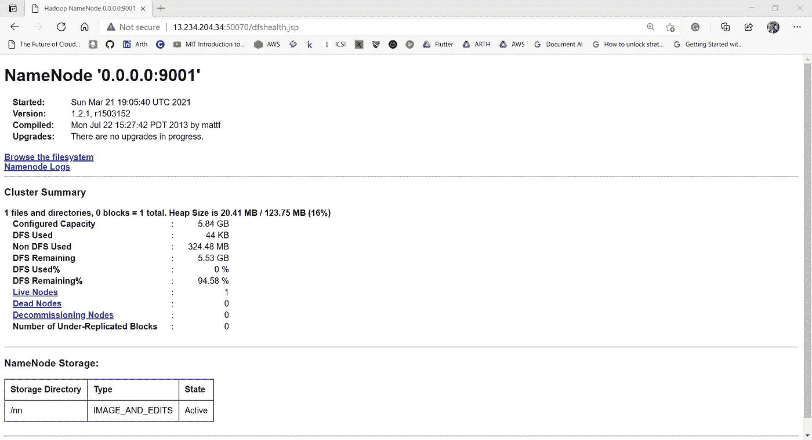*

*我要感谢维姆·达加先生提供了一个令人敬畏的研究课题；很有趣。*

> *“一个读者在他死之前经历了一千次生命，Jojen 说。从不读书的人只活一个。”
> ― **乔治·R·R·马丁，** [**与龙共舞**](https://g.co/kgs/C2KdG9)*