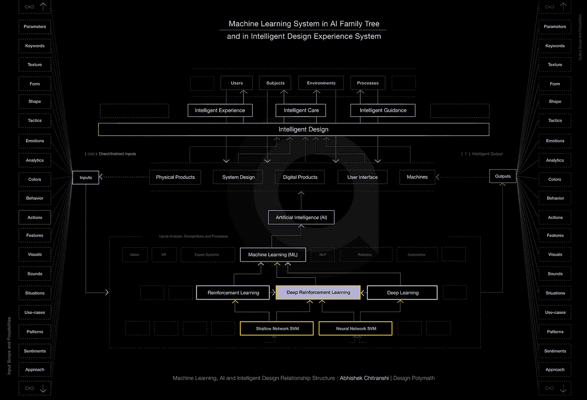
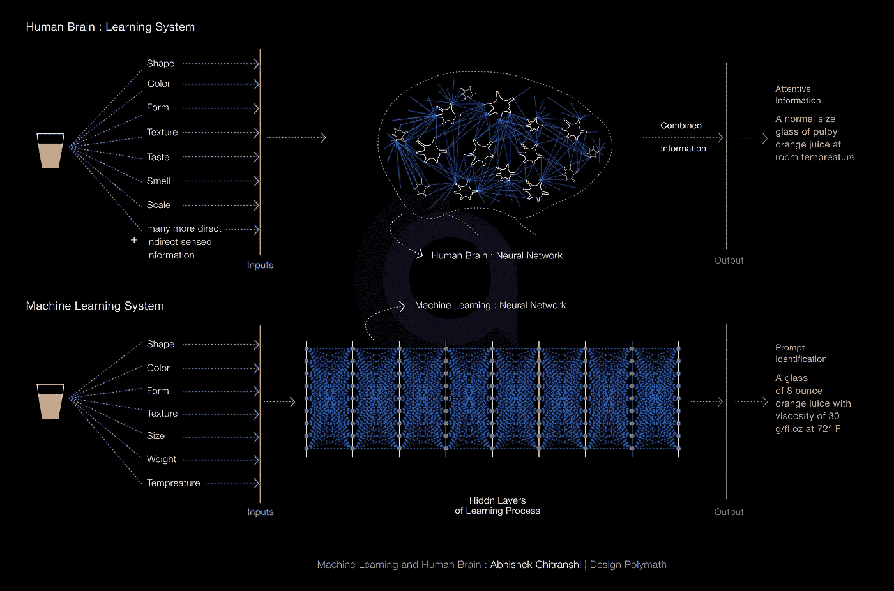
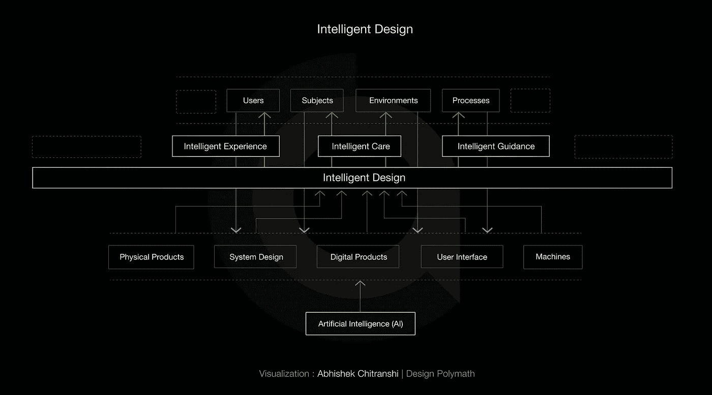
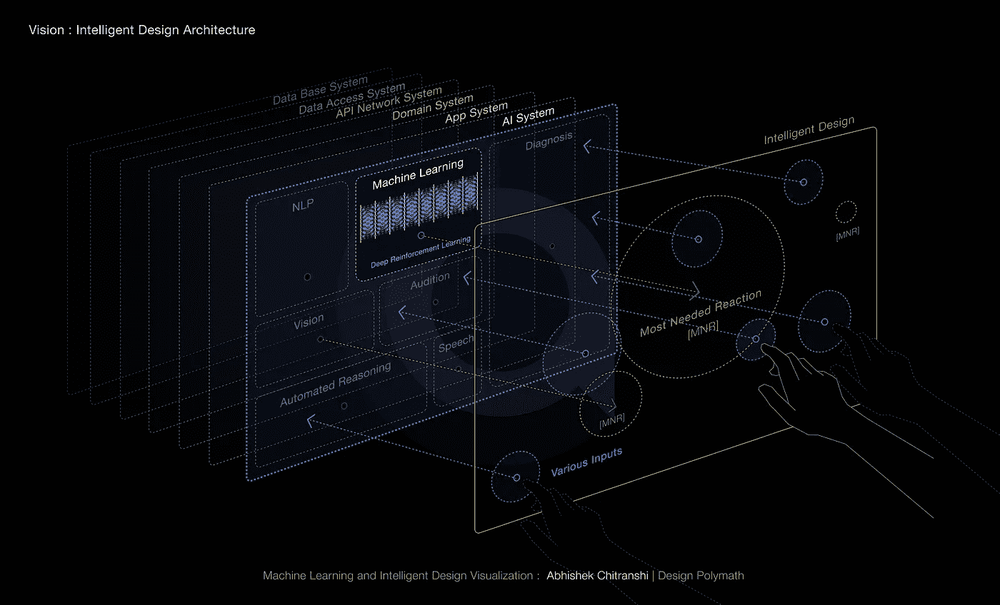

# 智能设计和机器学习

> 原文：<https://medium.com/geekculture/intelligent-design-and-machine-learning-f5235b479d7a?source=collection_archive---------48----------------------->

我一直在收获我关于机器学习和智能设计的思想的种子。从第一天开始，我就把它们记在日记里。在一个平常的日子里，当我按下电视遥控器的网飞按钮时，推荐引擎(AI)显示“人类:内在世界”有 92%的匹配率。在观看第一集“反应”时，我的大脑开始活跃机器学习和智能设计的思想。我的视觉神经元接受了命令，开始连接突触，并想象我们人类、我们的生态系统和地球上无限的自然过程是这个宇宙的超级智能设计系统的良好连接的智能设计，在这个宇宙中，数万亿 AI (ML NLP 视觉识别…)细胞引擎只在我们自己的身体中运行。

在这篇文章中，我分享了我对机器学习(ML)的高层次设计观点和愿景，以及这一人工智能技术过程如何成为设计世界中的一个绝佳补充。此外，设计师如何围绕这项技术来设计智能系统(iSD)、产品(iPD)和体验(iUX)。

因为我的右脑神经元更有激情，我的思维更大一部分在视觉上，所以为了有效的交流，将我的一些观点和视觉绘制成简单的视觉会很直观。在这篇文章中，我创建了几个这样的关于 ML 函数复杂性，它的 AI 关系和它在智能设计体验中的使用的可视化。

我建议你在阅读这篇文章的时候，也要密切关注观想图像，因为除了我在文章中表达的内容之外，我还在其中传达了一些额外的想法。

# 简单来说就是机器学习

机器学习是一组算法模型。这些模型旨在“收集、学习和反应”。

*   **收集** =输入
*   **学习** =分析输入，开发逻辑和规则
*   **基于开发的逻辑和规则做出反应** =输出/秒

# ML 系统、AI 家谱与智能设计

基于不断发展的 ML 技术的现状，我将它的功能、关系和 SOTA 可视化在 AI 系谱树中，以简化它对设计世界的理解。

Machine Learning, AI and Intelligent Design Relationship Structure

*   机器学习(ML)是人工智能家族中的一种学习模型。
*   强化学习(RL)是 ML 家族中的一种过程。
*   深度学习(DL)和深度 RL 是 ML 家族中高级过程的类型。
*   神经网络是 DL 和深度 RL 家族中的一种智能过程。

这些 AI 和 ML 家族算法模型，它们的流程和子流程都在推进。全球人工智能研究人员和科学家正在研究更多这样的过程模型。一旦这些创新的技术模型以一种有意义的解决问题的技术形成，它们就以功能命名，以方法/手段获得专利，并向全世界推出。

# 神经网络简单术语

受大脑神经网络功能的启发，ML 神经网络允许获取的输入信息通过多个信号处理层(如神经元)，并在层(如突触)之间共享数千个输入数据信号，作为机器学习的一个分析功能，以获得所需的输出

Machine Learning and Human Brain

# 简单来说，深度学习

更像是我们的大脑处理由我们的感觉器官接收的输入信号，以识别、学习、开发肌肉记忆并基于识别、经验、记忆和学习产生智能输出——深度学习过程旨在收集成千上万的输入，分析它们，开发逻辑，学习，接受训练并提供智能输出。

# 智能设计

如果我根据我的第一感觉来定义智能设计，那么—

"**智能设计提供了一套固定的直观反应、协助、监督或引导过程等。通过可见的体验元素传递给用户、主体和系统。**

**通过设计可训练的产品、系统和过程来做出反应。**

但是如果我深入思考，用扩展的经验感来定义智能设计，那么—

**智能设计不仅仅是直观的反应、帮助、监督或引导过程，还远远不止于此，即在各种情况下提供“最需要的反应”,并通过有形和无形的体验元素，在系统中的主题上培养用户的信任。**

通过将人工智能模型与产品设计同步，设计可训练、可教授、适应性强的产品、系统和流程对什么、如何以及何时做出反应，这将成为可能。

AI connection with Intelligent Design

几年后，我们将通过许多先进的人工智能模型，实现产品设计和 UX 设计的同步，达到卓越的智能设计水平。机器学习就是这样一个势在必行的推动人工智能分支走向智能设计之旅。

# 用于智能设计的 ML

几年来，在我们的日常数字交互中，人工智能体验一直在增加，如网飞观看体验、亚马逊购物体验、谷歌电子邮件、地图和搜索体验以及许多类似的人工智能产品。

所有这些支持 ML 的推荐引擎都是迈向智能设计(最需要的反应)和体验(IDX)的一小步。

## **ML 的当前状态**

几个例子，

*   我们是否需要网飞“更像这样”的功能显示为一套固定的设计？
*   亚马逊主页需要向我们展示“受你购物的启发”或“你的最佳选择”作为一套固定的登陆页面设计吗？
*   或者说，你在亚马逊上购物，准备赠送一件客人选择的商品，他正在你家拜访你，推荐引擎(ML)将它作为“你的需求或选择”的一部分，你从未使用或喜欢它，并在主页上的各种类别下显示类似的产品。

这些是智能设计吗？这些是在不同情况下“最需要的反应”吗？这些是智能设计的部分。这些在 ML 规则下通过一组固定的推荐输出设计、开发和商业策略，并作为一组固定的 UI 设计呈现给用户。

如何让 ML 系统走向智能设计？

AI System and Intelligent Design

ML 开发与产品设计和 UX 同步，是迈向智能设计的一个关键起点。例如，在设计过程中，我还将 **ML 视为智能研究可用性工具**，并将其与 UX 研究和产品设计战略同步，以确定设计中“最需要的反应”。

为了让设计朝着“最需要的反应”的方向发展，我试图，

*   围绕 ML 和其他 AI 开发设计产品、架构和 UX。
*   定义和创建设计和开发渠道，以促进 ML 和其他人工智能指数。
*   间歇性地增强设计开发策略和 DDT 模型(深度设计思维)。
*   除了训练这些模型学习之外，还可以通过用户交互的智能输入输出分析渠道来调整它们，并训练它们学习做出什么、如何以及何时做出反应。

请注意，以上所述不应仅通过数字应用 UI(移动、网络)的镜头来看待，但它也适用于他们的系统、流程、所有支持人工智能的产品、机器人、下一代[全息投影接口](/@abhishek.chitranshi/uis-continuum-evolution-towards-3d-projection-holographic-interface-9cb70824f417)以及其他！

谢谢大家！

…