# 符号回归的可理解智能策略:麻省理工学院的 Ai-庞加莱，Ai-费曼

> 原文：<https://medium.com/geekculture/intelligible-intelligence-strategies-for-symbolic-regression-mits-ai-poincar%C3%A9-ai-feynman-cd3cd6442ff5?source=collection_archive---------12----------------------->

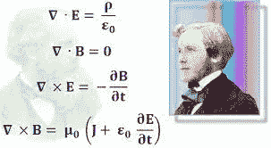

仅在几十年前，生物体的繁殖能力似乎还是一个深奥复杂的谜，然而，当科学家们理解了我们的基因串如何自我复制的要素后，生物学家们就想知道为什么要花这么长时间来思考这么简单的事情？

在 17 世纪，牛顿发现了三个简单的定律，解释了我们看到的大多数机械现象。一两个世纪后，麦克斯韦对电学做了同样的事情，用四个简单的定律解释了电学和磁学。后来爱因斯坦出现了，他基本上把这七条定律简化成了一两条。通过找到这些极其简单的解释，物理学取得了惊人的进步。

今天，科学努力记录了大量的观察数据。通常发生的情况是，科学家试图将这些数据归纳为最简单的基本公式，即“符合”观察结果的方程。这些尝试就是数学家所说的符号回归。本质上，它归结为为输出“y”建立一个最适合所提供数据集的方程。

换句话说，给定一个数字表，其行的形式为{x1，…，xn，y}，其中 y = f(x1，…，xn ),任务是搜索符号表达式的空间，以找到最适合未知神秘函数 f 的模型。

一个简单的解释是这样的:

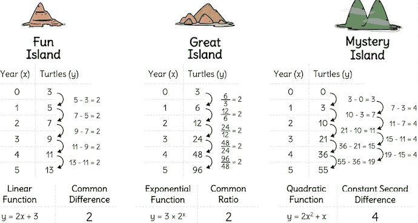

然而，当面对难以确定的函数时，许多人通过理解最小部分是如何工作的以及它们的组合是如何工作的等等来完成一个成功的解决方案。但是，有时，尽管大多数时候，这个过程需要相当长的时间才能形成一个等式。更不用说这个决议所带来的精神上的努力和犯错误的倾向了。

用计算机术语来说，这叫 NP 难。原因显而易见。就像长度为 n 的密码的数量随 n 呈指数增长一样，长度为 n 的符号表达式的数量也随 n 呈指数增长。

因此，即使我们试图用蛮力方法发现已知的公式，也需要相当长的时间。通过利用反向波兰符号，研究人员可以看到，例如普朗克黑体公式可能需要比我们宇宙的年龄更长的时间才能通过蛮力方法发现。

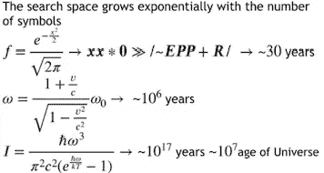

1602 年，约翰尼斯·开普勒花了 4 年时间，经过 40 多次失败的手工尝试，才把火星的轨道拟合成一个椭圆，扰乱了当时的天文学和科学理解。

然而，今天我们更有能力解决这些问题。

我喜欢有更多选择而不是更少的想法。事实上，有各种各样的方式可以让人类最终被锁定在看待事物的特定方式上，但有时没有一种方式是非常好的。这就是为什么我们在这个过程中需要工具的帮助。随着进步和理解，一定会有比人类迄今为止所做的一切更好的东西。

在这一点上，麻省理工学院计算机科学和人工智能实验室的 Max Tegmark 博士领导的研究小组试图更好地自动化和解决这一搜索问题。他们最近的工作“AI Feynman”和“AI Poincaré”在相当大的程度上改善了艺术水平，引起了科学界的广泛关注。

他们认为，数学家有时太快，以至于忽略了我们可以解决某些问题的可能性。高等数学可能真的很难，人们有时会忽略一些事情。因此，不要等待每隔几个世纪就有一个杰出的科学家或数学家诞生，也许有一天在计算机和聪明策略的帮助下，我们可以发现以前没有被探索过的方程和公式，缩短解决这些问题的时间，并改进现有的方程和公式，以更好地帮助人类。

在这篇文章中，我将探索他们在符号回归中的改进，他们受物理学启发的策略，以及他们如何利用感兴趣的数据中隐藏的简单性。我还将研究他们如何通过利用各种算法方法递归地将困难的问题分解成变量更少的简单问题。他们使用神经网络和终身学习也将是一个审查的主题。

# 第 1 部分:可理解的智能策略

你越了解你的机器学习系统实际上是如何工作的，你就越有理由相信它。与可解释性不同，可解释性是一个更加雄心勃勃的目标，旨在创建能够用人类语言解释其推理的系统。可理解的智能关注的是在更深的层次上理解解决方案的能力，从而能够信任其过程。

Tegmark 博士有物理学背景，他想借用物理学和早期计算机复杂性理论中成功的四个旧思想，并部署它们的机器学习版本。这些战略如下:

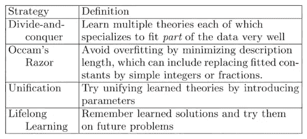

在物理学中，“奥卡姆剃刀”本质上可以归结为这样一种理解:如果你有一个简单的解释和一个复杂的解释一样准确，那么你应该选择更简单的解释。在雷·索洛门诺夫博士和安德雷·柯尔莫哥洛夫博士的领导下，这一思想被复杂性理论置于坚实的数学基础之上。唯一的问题是他们对简单复杂性的定义是 NP 难评估的。

为了抵消这一点，研究团队提出了一套更简单的复杂性标准，从某种意义上说，这是一种易于计算的妥协，因为他们的机器学习解决方案可以非常快地进行评估。

他们认为:

> 如果给定一个整数，那么一个人真正需要存储的信息量就是它在二进制中的位数。本质上，整数的对数捕获了这个数字。
> 
> *如果是有理数那么考虑两个整数的复杂度，分子的复杂度加上分母的复杂度。技术可用于寻找合适的部分。*
> 
> *然而，如果它是一个实数，人们可以通过除以计算机 CPU 的精度下限，然后取结果的对数等方法将其转换为整数。*

在这一点上，在第一个图的 y 轴上，示例是用一般实数的区间进行的，其中复杂度随着值的对数而增长(红线)。改变精确下限，红线可以放大或缩小。

为了贯彻他们新的复杂性标准，显然需要一个新的损失函数。一种简单的衡量数字复杂性的新方法，提供了一种比统计卡方检验或最小化均方误差(MSE)方法更可靠的数据拟合方法。

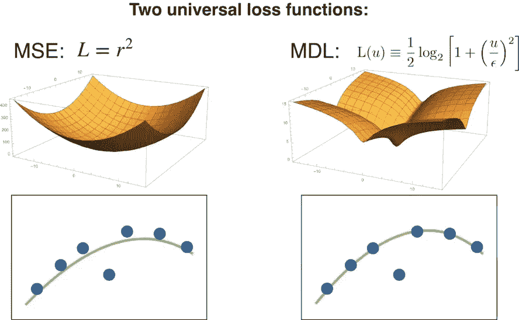

您可以立即看出，如果左侧有不需要的数据点，均方误差会将大量权重放在那些离模型相当远的点上，事实上会妥协，并向异常数据点靠拢一点。

然而，该组织的信息论方法具有相反的动机。他们的想法是指示模型在它已经可以精确处理的数据点上保持更精确，并忽略其他数据点。

现在，你可能会问自己**为什么要这样做？**这违背了机器学习中数据拟合模型的主流经典方式。

没必要担心。事实上，这让我们想到了第二个策略。一个叫做“分而治之”。本着这种精神，他们基本上试图做的是利用一组模型，而不是为整个数据集创建一个包含预测模型。

一致来说，每个模型都被激励去专门化并很好地关注数据的某些部分或方面。基于一个新的复杂性标准，剩下要做的就是收敛不同的损失函数，看看集合做得有多好。

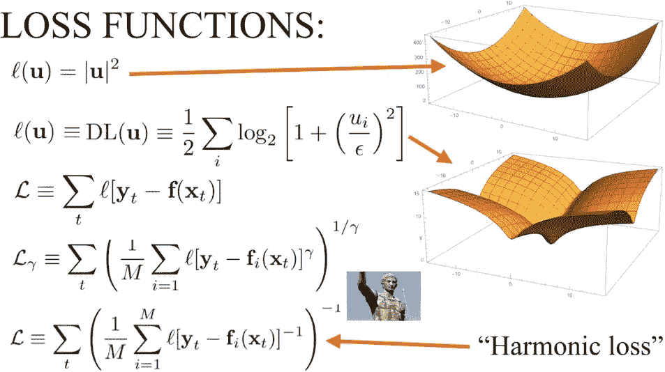

由于集合必须在各个模型之间取得平衡，调和平均值可以被认为是一个很好的评估指标。

最后，就像人类物理学家或本科生一样，研究小组提出的机器学习解决方案被放在不同的环境中，并被指示使用以前学习的解决方案，并最终统一并应用到新的解决方案中。换句话说，一旦结合，这些策略以如下方式部署终身学习策略:

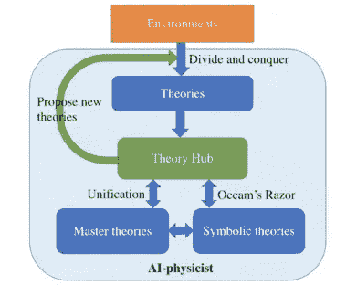

# 第 2 部分:问题表述

在过去的十年里，在从实验数据中提取自由形式的自然法则方面，已经做了一些惊人的工作。事实上，在大约十年的时间里，这个领域的技术水平一直被一种遗传算法所控制。[https://science.sciencemag.org/content/324/5923/81](https://science.sciencemag.org/content/324/5923/81)

这个程序叫做“Eureqa ”,它是由 Hod lispson 和 Michael Schmidt 创建的，用来记录分析定律。值得称赞的是，他们取得了巨大的成绩。然而，人们必须认识到，在一个过程中自动化符号回归发现不是一件容易的事情。他们所取得的成果似乎并没有抓住科学家们所知的大多数方程。它找到了一些，但在其他一些上失败了。

对此，麻省理工学院 CSAIL 的研究团队决定用不同的方式来解决这个问题。他们最初认为最好的方法是将这项任务分解成易于管理的部分。然而，在实现这一点之前，我们必须掌握与实用功能有关的性质。

但是，等一下，**这个领域与哪些功能有关？**

事实上，这是对符号回归研究的主要批评。这是缺乏一个基准。

因此，在此之前，泰格马克博士和他的博士生们在数值实验中创建了一个新的基准，以实现定量基准。在扩展这一基准之前，他们最初做的是将费曼物理学讲座中最复杂的方程转化为可免费下载的数据表。

 [## 马克斯·泰格马克的宇宙

### 编辑描述

space.mit.edu](https://space.mit.edu/home/tegmark/aifeynman.html) 

一旦完成了这一步，下一步就是尝试利用这些函数的属性。基于之前在学习函数方面的工作，他们注意到即使一些随机的通用函数是 NP 难找到的，它们也会有一些特殊的性质【https://arxiv.org/pdf/1603.00988.pdf

T. Poggio 以前的工作证实了这一说法。这项研究强调，我们关心的大多数公式是合成的。所以在某种程度上，即使一个公式由九个变量组成，人们通常也可以将其重写为具有更少变量的函数的组合。

在这一点上，他们观察到的一件事是，与一般函数不同，他们关心的一些函数有一个模块化的计算图。

这里我们可以看到一个三变量函数的例子，它可以分解为两个两变量函数的组合。

通过对神秘函数应用递归测试，研究团队证明了他们可以发现数据中发现的任何图形模块性。反过来，这允许他们利用这种图的模块化来达到他们的目的。在某种程度上，他们可以设计出越来越简单的模块，直到神秘的功能变得足够简单，以至于他们可以弄清楚它们是什么。本质上，这就是“分而治之”的方法。

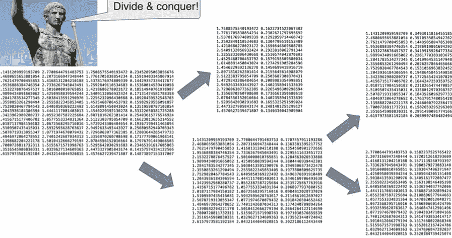

同样，函数经常显示出**对称性**和**可分性**。也许八个变量的函数只是三个变量中的一个，乘以其他五个变量中的一个，以此类推。除此之外，为了增强他们部署的机器学习程序，他们认为有用的一项技术是在前进之前对他们获得的函数进行**平滑**。我的意思是，他们进一步逼近神秘函数，试图捕捉重要的模式，同时排除噪音或其他现象。比如值 1.9999998 变成了 2，以此类推，一路自动修正。

# 第 3 部分:他们如何结合这些技术和观察来更好地解决问题？

事实证明，他们想到的分解技术相当成功。事实上，符号回归是一项困难任务的原因之一在于维数灾难。我的意思是，随着变量数量的增加，问题会指数级地变得更糟，更难发现。

然而，在一种逐步的方法中，“人工智能费曼”算法在数据表上执行了许多方法，这些方法被证明在处理手头的问题方面相当成功。这些是:

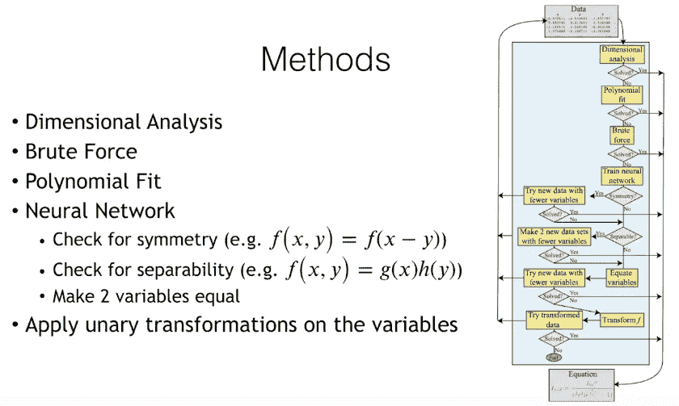

量纲分析在程序开始时进行。由此，该解决方案测试数据表是否具有我们讨论过的任何简化属性。

在这个阶段，该算法使用一种蛮力方法，利用研究人员制作的单位表，试图在前进的过程中简化。并且，这在以后的阶段证明是非常有用的。例如，如果使用神经网络的解决方案发现它依赖于第一列和第四列的唯一方式是通过两者的比率，那么程序可以立即用一个列替换第一列和第四列，这是它们的比率，以此类推。

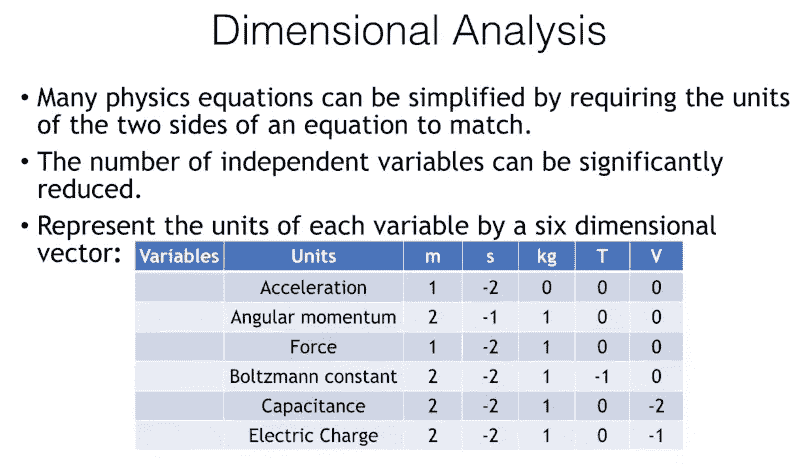

类似地，一旦完成，程序通过访问数据表并试图找到合适的公式，使用以下算法检查对称性和可分性。我们牢记 RMSE 是本文开始时建立的新的复杂性标准。

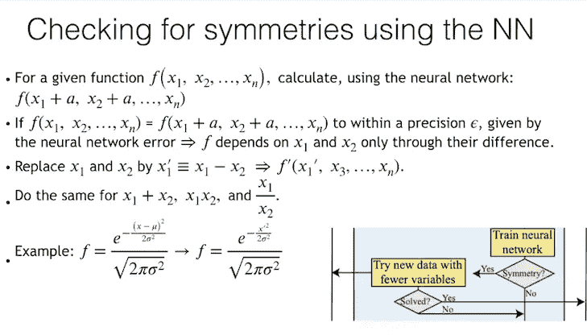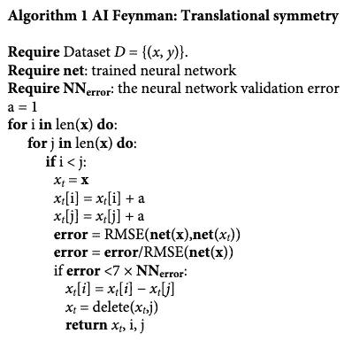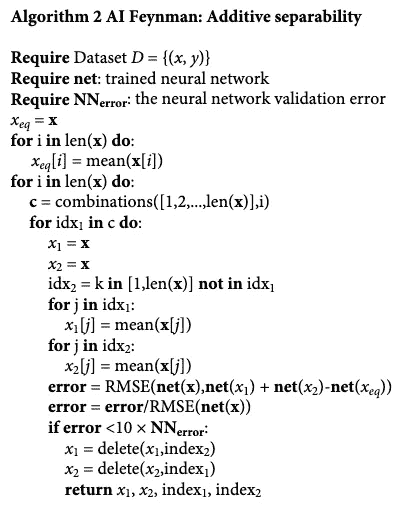

# 第 4 部分:结果

现在可以看出，关键的创新在于将传统的拟合技术与基于神经网络的策略相结合。这在某种程度上是有损数据压缩的一个例子，因为一旦发现了所讨论的属性并且递归地减少了问题，该解决方案就消除了因变量并产生了很好的结果。

在同一页上，除了计算每个方程的准确性，研究人员还跟踪神经网络发现的方程的复杂性。他们希望看到“Ai Feynman”提出什么，试图在准确性和复杂性之间取得平衡。

例如，在解决动能公式和狭义相对论这个特殊谜团的过程中，他们的神经网络内部工作的结果如下:

从广义上讲，我们可以观察到，科学家倾向于重视在复杂性和准确性方面都做得很好的公式。而且，即使“Ai Feynman”既没有被教过高中物理，也不知道特定的近似是有用的，但它自己发现，仅仅从数据来看，**质量乘以速度的平方除以 2**是动能的真正有用的近似。

这个解不仅有助于发现精确的定律，也有助于发现方程间有用的近似。

在这里，您可以看到结果，其中第一个表格的最后一行代表“Ai Feynman 2.0”的性能，正如您可以看到的那样，他们能够发现绝大多数方程，并且他们比之前的最先进算法做得好得多。

在第二张表格中，您还可以看到他们如何提高解决方案的抗噪声能力。这些数字表示添加到数据中的噪声百分比。正如你所看到的，即使噪音在 1%到 10%之间，程序也能够发现大多数数据表的方程。这意味着，与该算法的前一版本相比，他们利用图模块性的解决方案的第二版本的健壮性增加了 4 个数量级。

https://ai-feynman.readthedocs.io/en/latest/index.html

# 第 5 部分:问题是我们如何使用这个解决方案？

为了了解如何做到这一点，我在这里提供了一个 Google Collab 笔记本，其中包含您需要的所有代码以及如何使用它的示例。

 [## 谷歌联合实验室

### 编辑描述

colab.research.google.com](https://colab.research.google.com/drive/1BzjnVqle07Wt75AOwKd2G1HImmA7Kz6R?usp=sharing) 

如需进一步阅读，我建议你参考以下文章:

他们最初的尝试可以在这里找到[https://advances . science mag . org/content/advances/6/16/eaay 2631 . full . pdf](https://advances.sciencemag.org/content/advances/6/16/eaay2631.full.pdf)

他们的第二个改进版本也可以在这里找到[https://arxiv.org/pdf/2006.10782.pdf](https://arxiv.org/pdf/2006.10782.pdf)

谢谢大家！