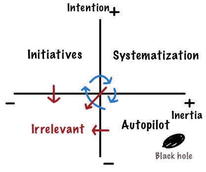
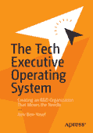

# 意图、惰性和内省

> 原文：<https://medium.com/geekculture/intention-inertia-and-introspection-74e4113472f6?source=collection_archive---------29----------------------->

我见过的最好的技术领导者，多年来一直保持卓越的，是那些从未“完成”的人。他们不断地进化、学习、实验和改变他们的想法。不断需要经历个人成长既是领导力最迷人的地方，也是焦虑和疲劳的来源。这就像是一场永无止境的斗争，你无法停止。问题和难题不断堆积在你的盘子上，去年对你有用的东西似乎不再有用了。

当我和我的客户一起工作时，我反复看到这种挣扎。在指导他们的过程中，我学到了列举一些日常的成长努力和它们之间的关系可以帮助减轻压力，让事情变得更简单。我最近出版的书《科技高管操作系统 》涵盖了管理你的注意力和精力的许多方面(顺便说一句，你可以填写下面的表格以获取样本章节)。在这篇文章中，我想把重点放在一个可以自己利用的部分，而不需要通读整本书。那就是理解平衡*意图*和*惯性*与*内省*的机制。

下图显示了一个过程的要点，我经常带我的客户去了解他们的问题。定期花时间看看每一项应该放在这张图上的什么地方，并重新评估处理它的正确方法是*自省*部分。让我们简要地检查一下图表的各个部分。

**主动性:**目前完全由你的意图和刻意努力推动的问题是你的主动主动性。还没有惯性，因此这些会议经常占据你日程表和认知负荷中的大部分。这两者都是稀缺资源，这就是为什么你应该定期反思你的努力，并想办法从这里开始。这是防止你的盘子溢出的唯一方法。对于我的客户来说，一个常见的举措是引入*间歇*来使创造力和创新常规化(同样，间歇在*技术执行操作系统*中有详细介绍，但这里有一些背景信息)。在启动这样一个变革计划的初始阶段，你可能会密切参与信息传递、概念的接受，以及随后的微调。

**系统化:**如蓝色箭头所示，从初始状态到系统化的自然流程。那是你的意图(和注意力)仍然需要的时候，但是惯性正在慢慢回升。回到前面实施间歇的例子，它通常在按计划运行 2-3 个间歇后进入系统化阶段。这通常是团队中的一些人开始掌握它并维护他们自己的创新积压(成功整合概念的关键指标)的时候。

**自动驾驶:**当一项努力被成功地灌输到团队中，它就获得了所需的惯性，不再需要你刻意的关注。占据这个空间的一整套流程、习惯和系统构成了你的组织的*文化*的重要部分。

**无关:**好吧，如果某件事没有被积极推动，也没有惯性，那么这个问题就没有实际意义。

# 碎片帐集

请注意红色箭头表示定期自省会导致事情移动到*不相关的*方块。不管你是否已经意识到某个计划不适合你的团队，或者你是否正在放弃一个过时的过程。最重要的是，这种垃圾收集会定期进行。

如果你不这样做，你将获得太多的 cruft，导致缓慢移动的庞然大物。自动驾驶模式可能会像黑洞一样适得其反，那里的东西永远不会逃脱。随着组织的发展，需要内省来看看你的文化中哪些部分应该被抛弃。

# 迭代:细化和重新调整

当然，并不是每一个不再最佳工作的过程都应该被丢弃。正如自然流程是从*计划*到*系统化*到*自动驾驶*一样，现有系统应该有一个健康的改进节奏。当你定期反省，发现一些需要注意的事情时，它会主动回到你的盘子里。这并不意味着它必须像最初引入该计划时那样复杂或耗时。是(工作)生活的圈子，是健康的。

例如，我见过一些客户致力于引进 okr，一两个季度后意识到他们需要重新调整他们如何提出目标或跟踪他们的进展。不一定代表你第一次就做错了什么，也不应该这么对待。相反，正如我们在我们的技术过程中拥抱迭代一样，我们应该在我们的组织中做同样的事情。我称之为改变文化。定期自省，这样你就知道从哪里开始，从哪里迭代！

*Aviv Ben-Yosef 2021 —在我最近出版的书中获得更多:* [***科技高管操作系统***](https://techexecutiveoperatingsystem.com/)