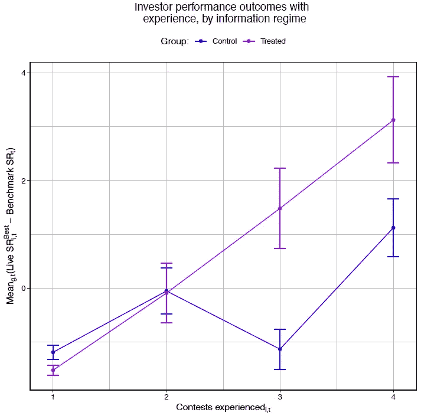

# 采访 INSEAD 大学博士生 Ahmed

> 原文：<https://medium.com/geekculture/interview-with-ahmed-phd-candidate-at-insead-c5ad86446e95?source=collection_archive---------12----------------------->

Ahmed Guecioueur 是 INSEAD 大学的博士生，这是一所领先的研究生商学院。他使用了[*quanti ACS*](http://www.quantiacs.com)*平台进行研究，我们对他进行了采访。*

你好，Ahmed，你能给我们介绍一下你自己和你的学习情况吗？

你好，我是一名对市场参与者的行为感兴趣的学术研究者。我发现交易(和一般的金融)是研究人类行为的很好的环境，因为交易者有很强的动机最大化他们的收益，同时在他们经营的约束下控制风险。

即便如此，研究表明，个人做出的决定可能会受到行为偏差的影响，从而导致次优决策。毕竟我们也是人啊！例如，理查德·塞勒因其在心理学和经济决策方面的工作获得了 2017 年的诺贝尔奖。

**您如何使用 Quantiacs 进行分析？**

在最近的一篇研究论文中，我检查了过去 Quantiacs 期货交易比赛的排行榜，以研究交易者行为的一个特定因素:交易者如何利用他们可以获得的数据？在一个数据越来越丰富的世界，这个问题有着超越量化竞赛的巨大影响。

我的主要统计分析利用了这样一个事实，即在期货竞赛 7 和 8 之间，Quantiacs 平台向交易 API 添加了一组宏观经济预测变量。因此，我比较了比赛前和比赛后参赛者的交易表现。我使用每位参赛者最佳策略的样本外(即直播时段)夏普比率来衡量表现，还通过计算每位参赛者迄今为止参加的比赛数量来衡量他们的经验如何。

总的来说，Quantiacs 框架对我的研究很有帮助，因为所有的交易者都有相同的立足点:他们有相同的目标，相同的交易领域和范围，相同的预测变量，等等。Quantiacs 为每个人维护一套公平的规则；但对于像我这样的研究人员来说，以这种方式控制潜在的混杂效应(一场没有宏观经济数据的竞赛，接着是一场有宏观经济数据的竞赛)非常有用。

**你有什么发现？**

我的发现在某些方面是意料之中的，但在另一些方面却令人惊讶。我发现，一般来说，参加交易比赛的人越多，表现越好:平均来说，一个参赛者的夏普比率随着她/他参加比赛的次数而增加。这是意料之中的，因为先前的学术研究使用经纪或交易数据发现，股票市场交易者也更擅长经验；例如，参见 Seru、Shumway 和 Stoffman 于 2010 年发表的论文。顺便说一下，我进行了一个统计分析，以说明选择效应，似乎这个结果不只是一些交易者加入或离开平台的神器，这令人放心。

**所以结果会随着经验而改善。您是否发现使用更多数据也能改善结果？**

我发现有经验的交易者在平台上获得新的变量时表现更好(控制市场条件)。对于这些交易员来说，他们似乎受益于 Quantiacs 添加到平台中的新预测变量。理性投资者应该利用他们可以利用的所有工具，包括更大的数据，来实现他们的目标，这是有道理的。

我在论文中运行了一组回归分析来测试统计显著性，但是人们也可以在下面的图表中直观地观察到这一事实，其中显示了组级别的平均值。

y 轴是平均生存周期夏普比率(SR)，通过减去基准投资组合 SR 来控制市场条件，x 轴是参与者参加的比赛数量。这种比较是在没有接触到新的预测变量(在早期的比赛中)的交易者和有接触的交易者之间进行的，他们的经验水平相同。您可以观察到性能动态变陡:

对我来说，更令人惊讶的是更大的数据对 中的 ***有经验的投资者的(缺乏)影响，比如那些第一次参与的投资者。看起来他们确实 ***而不是*** 从这些变量中受益:当运行回归分析时，他们的表现变化在统计上没有差异到零。然而，如果有经验的投资者可以利用大数据，为什么没有经验的投资者不这样做呢？***

这是个有趣的问题。你有什么想法吗？

我提出以下理论:缺乏经验的交易者更不确定哪些变量将预测资产回报的未来演变，导致他们忽略了一些原本可以用来做出更好预测的变量。随着经验的积累，他们变得不那么不确定，并且更有可能使用他们所掌握的更多数据。因此，更大的数据并不总是对投资者有帮助(尽管它也不一定会伤害投资者)。作为一种正式的理论，投资者使用历史数据解决稳健的投资组合选择问题，但受主观模型不确定性阈值的控制，这导致他们放弃某些预测变量，并且该阈值随着经验而降低。

仅使用 Quantiacs 的公开信息，你是如何测试你的想法的？

测试我的理论并不简单，因为 Quantiacs 保护用户的知识产权。我所做的是使用 Quantiacs 网页上的投资组合回报数据，对我的稳健投资组合选择模型进行数值估计。证据与我的理论一致:似乎平均来说，有经验的投资者比没有经验的投资者使用更多的预测变量。

这个理论对交易者有什么启示？更大的数据可以帮助交易者做得更好——如果他们不害怕使用它的话。

*Ahmed 很乐意听到 Quantiacs 交易者关于他们经验的任何方面，或者关于 Quantiacs 论坛***的想法。请在* [*论坛跟帖*](https://quantiacs.com/community/topic/171/interview-with-ahmed-phd-candidate-at-insead) *上留言或向他提问！**