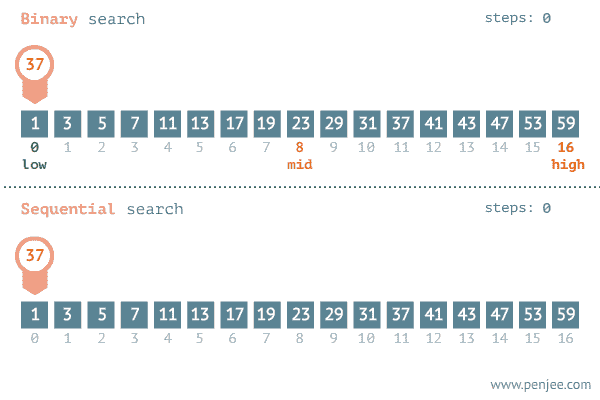

# 算法导论:二分搜索法

> 原文：<https://medium.com/geekculture/intro-to-algorithms-binary-search-6d92ee47c8c7?source=collection_archive---------15----------------------->

## 基本算法的逐步演练


Photo by [Maksym Kaharlytskyi](https://unsplash.com/@qwitka?utm_source=unsplash&utm_medium=referral&utm_content=creditCopyText) on [Unsplash](https://unsplash.com/s/photos/file-cabinet?utm_source=unsplash&utm_medium=referral&utm_content=creditCopyText)

随着我对编程和软件开发的了解越来越多，我很快意识到理解算法的重要性。当然，许多高级语言都内置了各种搜索和排序功能，但是真正理解这些功能的重要性是不可低估的。这篇文章将介绍二分搜索法算法，这是每个程序员都应该拥有的基础工具。

# 从头开始:线性搜索

可用的最简单的方法之一，[线性搜索](https://en.wikipedia.org/wiki/Linear_search)，从集合的开始处开始，一直工作到末尾，检查每个元素，直到找到目标。

想象一下在电话簿中查找一个名字。线性搜索将从第一页上的第一个名字开始，朝着电话簿的后面逐个名字地工作，直到找到目标名字。

把它翻译成计算机语言，你会得到这样的结果:

如果你想在电话簿里找安德鲁·安德森，这没问题，但是如果你想找佐伊·齐默曼，这就有点麻烦了。值得注意的是，这种方法的伸缩性也很差。如果你住在一个有 100 名居民的小镇上，每次都进行线性搜索是可行的，即使是搜索佐伊·齐默曼的电话号码。但是想象一下，搜索纽约市的电话簿，人口 1900 万。你*可以*使用线性搜索，你会*最终*找到你的目标，你真的想吗？

# 二分搜索法来了

如果我们要搜索更大的集合，我们需要另一种搜索方法。进入[二分搜索法](https://en.wikipedia.org/wiki/Binary_search_algorithm)。此方法将集合分成两半，并根据目标检查中点，每个周期将搜索的集合大小减半，直到找到目标。

*需要注意的是，二分搜索法* ***只在集合已经* ***按升序值*** *排序的情况下起作用。***

它的工作原理如下:

1.  确定排序后的集合的中点，并获取相应的元素。
2.  中点元素是大于还是小于我们的目标？如果它更大，我们可以忽略收集的后半部分。如果它较小，我们忽略前半部分。如果中点元素匹配我们的目标，那么我们就成功了，我们的搜索就结束了。
3.  拿剩下的一半，从第一步重新开始，继续直到找到目标。

## 返回电话簿:

回到纽约市的电话簿，假设我们正在搜索一个姓埃默森的人，给二分搜索法一个机会。

我们的第一步是找到我们收集的中间点。字母表有 26 个字母，所以我们的中间点是第 13 个字母“m”。我们翻到第一页的“m”名，把书撕成两半。

现在我们将中点与目标进行比较。中点是在我们寻找的目标之前还是之后？字母“e”在“m”之前，所以我们马上知道我们可以忽略后半部分，直接把这些名字扔进垃圾桶。我们已经减少到 950 万个名字，而不是 1900 万。

接下来，我们选择第一个字母和第 13 个字母的中间点，我们说是 7，因为没有半个字母。我们在“g”的第一页上将剩余的集合分成两半，由于我们的中点比我们的目标更远，我们可以再次抛出后半部分。

我们从 1900 万人减少到不到 500 万人。不断重复这个过程，很快你就能很快找到你的目标，即使你是在一个巨大的集合中搜索。与此同时，如果我们使用线性搜索，我们可能甚至不会只搜索“a”部分。到目前为止，您可能已经看到了使用二分搜索法节省的时间。



[sourced from penjee.com](https://blog.penjee.com/binary-vs-linear-search-animated-gifs/)

# 代码

好的，让我们把之前的那些指令翻译成 Javascript 函数。

> 1.确定排序后的集合的中点，并获取相应的元素。

首先，我们通过调用`array.length`找到数组的长度。值得注意的是，`array.length`的返回值是一个索引，但是数组是零索引的。这意味着我们需要先减少由`array.length`返回的值，然后再除以 2 来找到中间点。我们可以使用`parseInt`将该值四舍五入为整数，从而确保它可以用于索引我们的数组。最后，我们获取该索引处的元素。

> 2.中点元素是大于还是小于我们的目标？如果它更大，我们可以忽略收集的后半部分。如果它较小，我们忽略前半部分。如果中点元素匹配我们的目标，那么我们就成功了，我们的搜索就结束了。

幸运的是，大多数编程语言都能够比较值，不管它们是字符、字符串、整型还是浮点型等等。所以我们只需要建立一个`if...else if...else if`语句作为我们函数的逻辑门。

# 递归

> 3.拿剩下的一半，从第一步重新开始，继续直到找到目标。

那么我们如何填充我们的`if...else if...else if`语句呢？这是利用 [**递归**](https://en.wikipedia.org/wiki/Recursion_(computer_science)) 的好地方，因为我们知道我们在重复相同的步骤，直到找到目标。但是如果函数会递归调用自己，我们需要重构函数，这样它就知道要搜索数组的哪个部分。

让我们包括两个索引作为附加参数。**一个将指定从数组中的哪里开始搜索，另一个将指定从哪里停止搜索。**我们也可以使用这些索引来找到我们搜索区域的中点，这样就不需要调用`array.length`了，这将允许我们递归地调用函数，同时跟踪要搜索数组的哪个部分。

好了，我们已经重构了现有的代码，允许递归。现在是时候在每个逻辑门内部递归调用函数了。

**如果中间元素大于目标元素，我们可以在搜索中忽略中间元素及其后的所有元素。我们用相同的数组、目标和起始索引递归调用`binarySearch()`。我们的搜索将向上进行到当前中点之前的元素，因此我们传入`mid — 1`作为`stop`的值。**

**如果中间元素小于目标元素，我们可以忽略中间元素及其之前的所有元素。**这再次意味着递归调用`binarySearch()`，但这一次停止索引将保持不变。我们的搜索现在从中点之后的元素开始，所以我们传递`mid + 1`作为`start`的值。

将所有这些放在一起，它看起来像这样:

# 最后的步骤

我们快完成了，但还有一个细节需要处理。*如果我们的目标不在我们正在搜索的集合中，该怎么办？最终，我们将以一个单元素的数组结束，这将导致我们递归地调用我们的搜索函数，其开始索引大于停止索引。这不仅毫无意义，还会导致我们陷入无限循环，很快就会超出堆栈大小限制，导致函数崩溃。*

这可以通过添加一个条件来快速修复，以确保我们的开始索引小于停止索引。如果不是这种情况，则返回`-1`以表示目标不存在于给定的集合中。

Completed binary search function

# 最后一次重构

二分搜索法函数也可以迭代编写，而不是递归编写。逻辑功能相同，只是语法不同。我们可以使用具有相同逻辑条件的`while`语句，而不是使用`if...else`语句来防止无限循环。从那里，我们直接调整索引，直到找到匹配。

*来源及延伸阅读:*

```
[Binary Search, Geeks for Geeks](https://www.geeksforgeeks.org/binary-search/)[Variants of Binary Search, Geeks for Geeks](https://www.geeksforgeeks.org/variants-of-binary-search/)[Search Algorithm, Wikipedia](https://en.wikipedia.org/wiki/Search_algorithm)[David Milan's excellent demonstration of Binary Search](https://www.youtube.com/watch?v=YzT8zDPihmc)
```