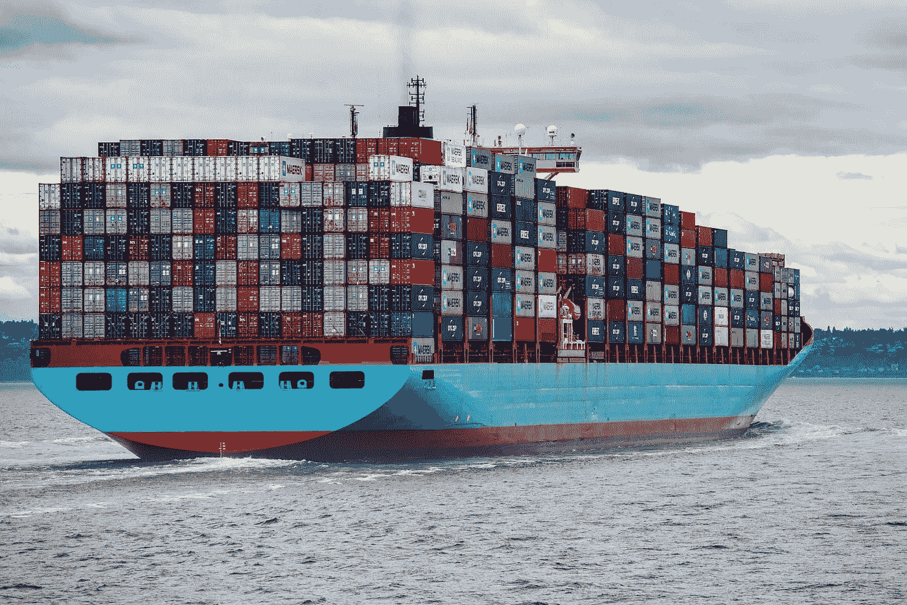
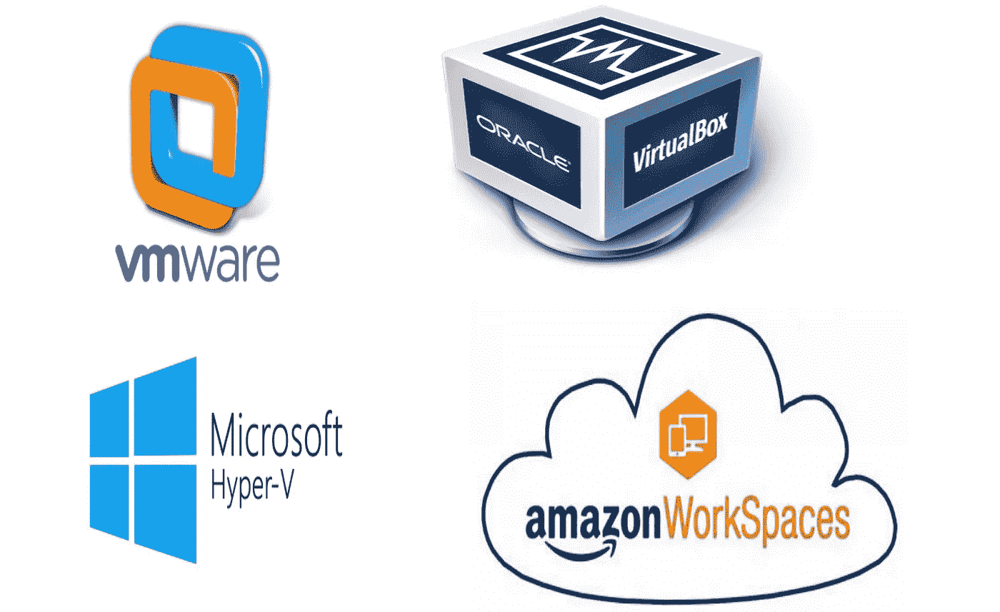
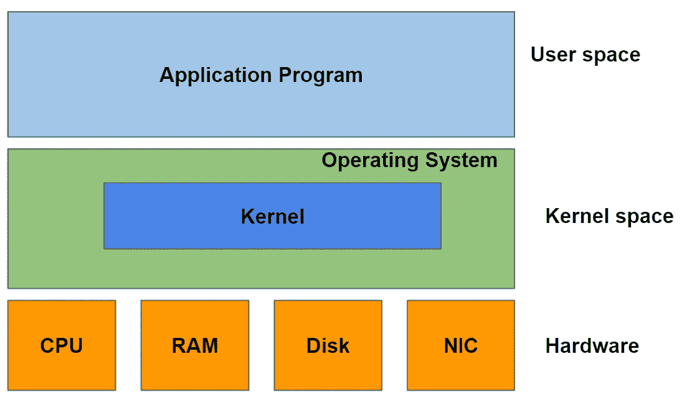
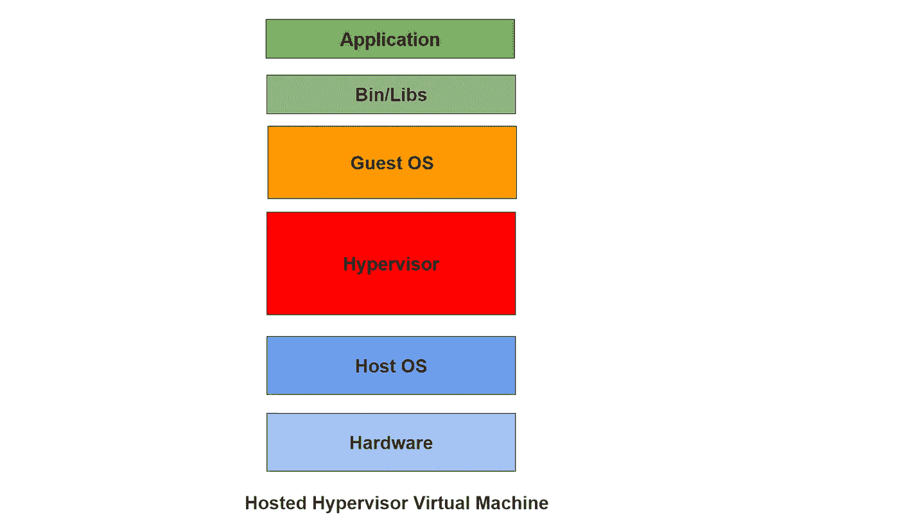
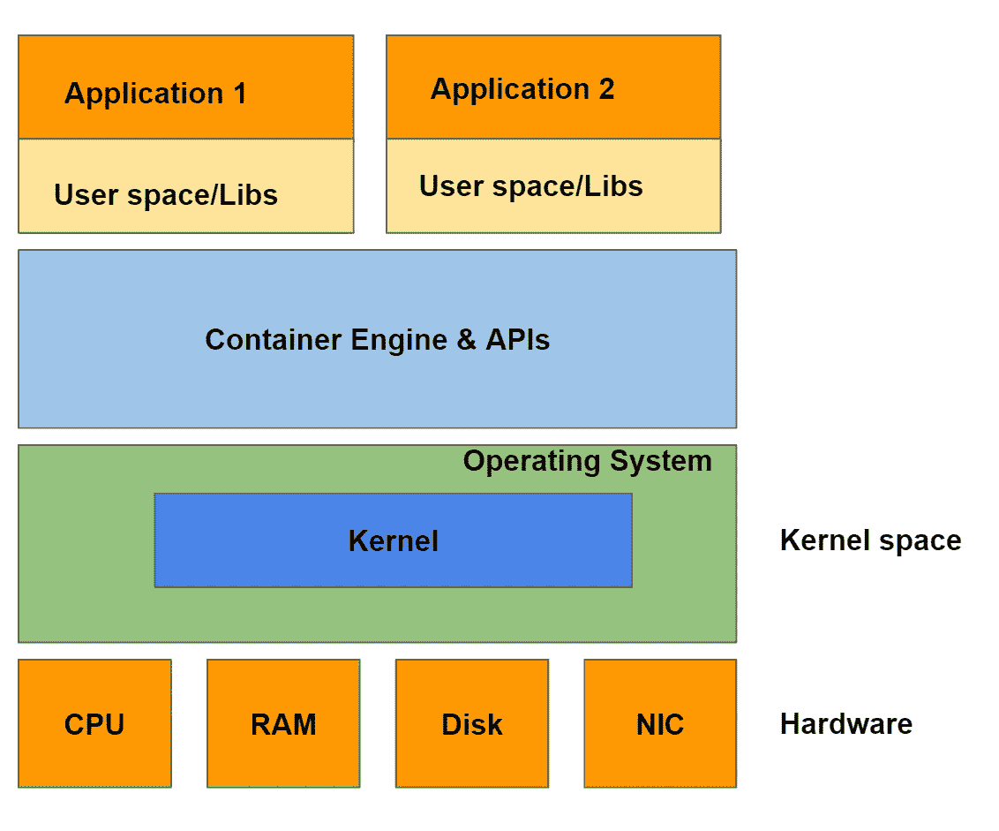
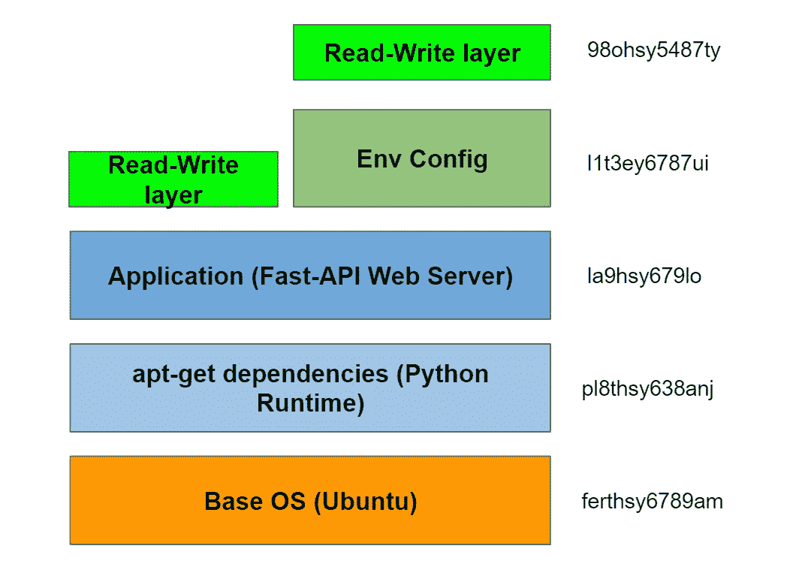
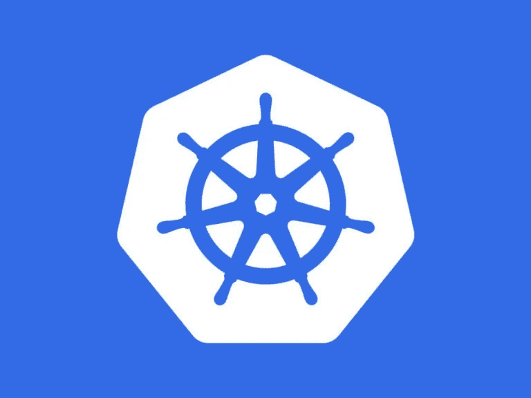

# 集装箱介绍:集装箱化基础

> 原文：<https://medium.com/geekculture/introduction-to-containers-basics-of-containerization-bb60503df931?source=collection_archive---------0----------------------->

## 集装箱化技术及其构件概述

**Ship Containers**

# 介绍

容器已经在整个技术行业得到广泛采用。几乎每个公司都开始采用容器来部署微服务。Kubernetes(K8)等容器编排技术简化了容器的管理。使用 Kubernetes 的公司已经观察到其系统在可扩展性、可靠性和可操作性方面的改进。

**Kubernetes & Docker**

初学者可能会发现很难掌握大多数集装箱化的概念。此外，由于有很多关于这个话题的信息，它也可能变得令人不知所措。然而，理解这项技术背后的背景和核心概念是很重要的。

本文试图简化容器的基础知识。我们将理解是什么导致了容器的兴起&它正在起作用。此外，我们将看看使用容器的服务部署& Kubernetes 的角色。

# 背景

让我们假设您正在 Ubuntu 机器上构建一个 web 服务。您的代码在本地机器上运行良好。您的数据中心有一台远程服务器可以运行您的应用程序。

您将本地二进制文件复制到远程服务器上，并尝试运行您的代码。接下来你会看到你的代码在那里不工作。你会好奇的发现发生了什么？这将是你的反应

**It works on my machine**

上述失败可能有多种原因。服务器上运行的操作系统可能与您的本地计算机不同。因此，它可能没有运行应用程序所需的二进制文件和文件。另一个原因可能是远程服务器上安装了不兼容的软件。例如:用于启动应用程序的不同版本的 python 或 java 解释器

上述问题导致了可移植性问题。开发人员必须花费大量时间来调试特定于环境的问题。解决这些问题可能很费时间，并且经常被大多数开发人员讨厌。因此，找到解决这些问题的方法是至关重要的。

**OPS problem**

我们将在下一节看到这个问题是如何解决的。

# 虚拟化

很多时候，特定于操作系统的依赖性会导致问题，类似于我们上面讨论的问题。如果你的本地计算机的操作系统和远程操作系统是一样的，那不是很好吗？一切都会很顺利吗？我们再也不会遇到“*它能在我的机器上工作*的问题了。然而，这并不实际，因为我们需要为每个新的操作系统配备一台新的机器，用于开发。

如果我说我们可以在一台计算机上同时运行多个操作系统呢？这将是一个极好的想法，也是硬件虚拟化的全部内容。在深入研究虚拟化之前，我们将简要了解一下操作系统是如何工作的。

**Virtualization software**

## 操作系统的工作

您的计算机有不同的硬件资源，如内存、硬盘、网络接口卡、IO 设备等。操作系统是管理硬件的软件。操作系统由一个被称为内核的系统程序组成，它在操作系统启动时被加载到内存中。内核负责进程管理、CPU 调度、文件系统和 IO。

用户程序通过内核与硬件交互。例如:-假设你的应用程序想要打开一个文件，并在其中写入内容。应用程序将调用系统调用，如 *fopen* ()和 *fwrite* ()来执行其功能。内核代表用户程序执行该功能，并将输出返回给用户程序。下图显示了应用程序运行中涉及的不同层次。

**Working of an Operating System**

## 硬件虚拟化

VMWare 和 Virtual box 等软件促进了硬件虚拟化。简单地说，你可以在一台计算机上运行多个操作系统。该软件由一个名为 Hypervisor 或虚拟机管理器的组件组成。该组件管理单个操作系统的生命周期。

下图展示了操作中涉及的不同层

**Layers involved in the functioning of a Virtual Machine**

从上图可以看出，我们有一台运行操作系统的主机。这就是所谓的主机操作系统。虚拟机管理程序运行在该主机操作系统之上。用户可以使用虚拟机管理程序启动他们自己的操作系统。这些操作系统被称为客户操作系统。

启动操作系统时，用户指定操作系统映像文件，为来宾操作系统分配文件系统空间和内存。与主机操作系统不同，来宾操作系统不能直接管理硬件。例如:-它不能通过物理网络接口卡直接发送数据包。管理程序创建硬件的虚拟实例。然后，来宾操作系统管理由虚拟机管理程序创建的虚拟硬件。因此，虚拟机管理程序让来宾操作系统认为它正在与实际的硬件进行交互。

## 硬件虚拟化的优点和缺点

虚拟化最大的好处之一是你可以在一台计算机上运行多个操作系统。虚拟机管理程序保证来宾操作系统的安全性和隔离性。如果您在 CentOS 上完成了开发，您将能够在远程服务器上运行它，前提是您在其上启动了一个来宾 CentOs。

每个虚拟机都需要自己的操作系统。这增加了运行虚拟机时的存储和内存开销。运行虚拟机时会消耗大量系统资源。因此，虚拟机是重量级的&增加了系统的复杂性。为了克服这个问题，在操作系统级别引入了虚拟化。

# 群组和名称空间

2006 年，谷歌概念化了“*控制组*或“*控制组*”。这是一个 Linux 内核特性，可以控制用户进程的资源使用。进程可以放在一起放入“*名称空间*”。然后，这些进程可以共享为给定名称空间定义的资源限制。

可以创建多个名称空间，并为每个名称空间分配资源限制。例如:-我们可以创建两个名称空间，一个用于实时应用程序，另一个用于后台作业。根据资源使用情况，可以设置两个名称空间的限制。

此外，为 cgroups 引入了名称空间隔离的概念。这类似于现有的进程隔离特性。名称空间隔离确保了 cgroup 名称空间中的进程之间的隔离。以下是几种类型的名称空间隔离功能:-

*   PID 名称空间:这确保一个名称空间中的进程不知道另一个名称空间中的进程
*   挂载名称空间:一个名称空间中的进程不能访问挂载在另一个名称空间中的文件系统
*   用户名称空间:这保证了用户进程可以在名称空间内拥有某些特权，而在名称空间外拥有不同的特权

# 容器

当我们听到容器时，首先想到的是 Docker 容器。码头集装箱已经成为集装箱化的行业标准。然而，LXC (Linux 容器)是容器化技术的第一个实现。它利用 Linux cgroups 和名称空间隔离来创建轻量级容器。事实上，Docker 的最初版本是直接建立在 LXC 之上的。与 docker 类似的还有 rocket & containerd 等其他容器。

容器克服了虚拟机的所有缺点。容器不需要安装单独的客户操作系统。它们直接运行和使用主机操作系统。容器只需要依赖的文件系统和二进制文件就可以运行。例如:-java 应用程序在容器中运行时需要 Java 运行时环境(JRE)。因此，与虚拟机相比，容器是轻量级的。

**Working of Containers**

让我们假设你正在运行一个订票系统。它目前运行在一个虚拟机上。如果用户请求出现高峰，您将不得不扩展您的系统。因此，您需要启动多个虚拟机实例。启动虚拟机是一项昂贵且耗时的操作。在扩展虚拟机时，您可能会注意到延迟峰值。

我们可以使用容器来避免上述延迟高峰。集装箱重量轻，价格便宜，可以很容易地发射出去。因此，您可以轻松地扩展您的系统&提高响应能力和性能。

# 集装箱的积木

要运行任何容器，我们首先需要创建一个映像。映像是运行应用程序的二进制文件或依赖项。让我们假设我们想要运行一个 python 服务器。在这种情况下，python 解释器成为它的主要依赖项。此外，python 解释器具有特定于操作系统的依赖性。因此，图像是使用分层方法构建的。

让我们看一个 Docker 容器的例子&它的图像。基础操作系统层并不包括整个操作系统及其内核。它只包含文件系统和相关的二进制文件。在基本操作系统之上，将有 apt-get 依赖项(Python2/Python3 解释器)。此外，您可以拥有一个应用程序，上面的层可能由环境变量组成。每一层都由一个散列来标识。

**Container Images**

假设有两个容器，一个有层 *a、b、c、*，另一个有层 *a、b、c、d。*在这种情况下，您只需要在存储库中本地存储 *a、b、c* & *d* 的一个副本。Docker 的 Union 文件系统就是这样工作的。

当一个容器启动时，它从存储库中取出所有的图像。然后，它创建 cgroups、名称空间和虚拟环境。从容器的角度来看，二进制文件似乎是整个机器中仅有的文件。集装箱有多种状态，如*运行*、*启动*、*停止。*一旦应用程序运行，容器转换到*运行*状态。

# 容器和微服务

公司正在从整体架构转向基于微服务的架构。与传统的整体式相比，微服务有数不清的优势。微服务分离了责任，允许轻松扩展应用程序。

由于容器易于携带，我们可以将微服务打包成容器的一部分。我们可以在 Ubuntu 机器上完成服务的开发&将它作为容器的一部分打包。我们可以在运行任何操作系统的主机上部署这个容器。只要我们使用具有正确基础映像的容器，主机操作系统就不必是 Ubuntu。

每个容器都有一组固定的资源配置。它有固定数量的 CPU、内存等。为了扩展微服务，我们需要扩展容器的数量。这为开发人员提供了更大的灵活性来扩大或缩小他们的应用程序。

# 容器编排

今天，大多数互联网产品公司将工作负载分布在云上的许多机器上。容器使得扩展和部署微服务变得容易。可伸缩性、可靠性和可操作性是任何分布式系统的三大基石。

在分布式环境中部署和管理微服务时，我们可能会遇到以下问题

*   诸如集装箱崩溃之类的故障
*   根据配置将容器调度到特定的机器
*   升级或回滚应用程序
*   在一组机器上放大或缩小容器

**Kubernetes**

像 Kubernetes 这样的编排引擎解决了上述问题。它简化了云上容器的部署、扩展和管理。

# 参考资料:-

*   [揭开容器 101 的神秘面纱](/free-code-camp/demystifying-containers-101-a-deep-dive-into-container-technology-for-beginners-d7b60d8511c1)
*   [集装箱 Vs 虚拟机](https://www.baeldung.com/docker-images-vs-containers)
*   [Docker 维基](https://en.wikipedia.org/wiki/Docker_(software))
*   [Docker 图像](https://alexioannides.com/2019/01/10/deploying-python-ml-models-with-flask-docker-and-kubernetes/)
*   [免费图片](https://unsplash.com/)