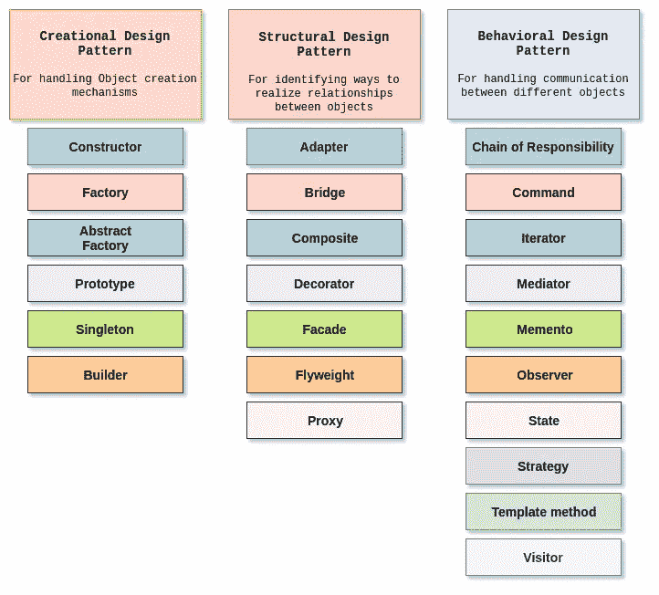

# 设计模式介绍&理解单体设计模式

> 原文：<https://medium.com/geekculture/introduction-to-design-patterns-understanding-singleton-design-pattern-5a4d49960444?source=collection_archive---------3----------------------->

Photo by [Clark Van Der Beken](https://unsplash.com/@snapsbyclark?utm_source=medium&utm_medium=referral) on [Unsplash](https://unsplash.com?utm_source=medium&utm_medium=referral)

如果你是一名软件工程师，理解设计模式并使用它们会让你成为一名优秀的软件工程师。因为如果你在一个行业工作，你可能会看到软件工程师对设计模式和它们是如何工作的一无所知。他们中的大多数是实习生或助理工程师，或者是有几年工作经验的工程师。因此，无论你处于哪个层次，理解设计模式在我们的行业中都是非常重要的一部分。因此，在这篇文章中，我将简要地解释一下设计模式，并详细解释一下单例设计模式。

# 什么是设计模式？

简单来说，设计模式是软件工程师在软件开发过程中面临的一般问题的实用解决方案。所有这些模式就像蓝图，我们可以使用和定制来解决代码中的特定问题。

关于设计模式有一些常见的误解，例如这些是我们可以在程序中应用的特定代码，设计模式是描述算法的另一种方式。人们混淆设计模式和算法的原因是因为两者都负责解决编程中的一些问题。但是算法是一组清晰的动作，我们可以用它来解决代码的特定部分，而设计模式是解决方案的高级描述。最重要的是，设计模式不是我们可以应用到程序中的特定代码，正如我已经提到的，它们就像是解决这些问题的蓝图。

设计模式总是被认为是编程时使用的良好实践。因为使用设计模式有很多好处，比如:

*   它们很容易在多个项目中重用。
*   他们使用面向对象的概念，如分解、继承和多态。
*   它们是久经考验的解决方案，因为它们建立在软件开发专家的知识和经验之上。
*   在应用程序开发中使用适当的设计模式可以使开发变得快速和容易记录。
*   他们降低了代码库的规模。
*   他们提供有助于定义系统架构的解决方案。
*   它们为应用程序的设计提供了透明度。

## 设计模式的类型

1994 年，被称为**【四人帮】**的 4 位作者发布了一本名为《设计模式》的书。在那本书里，他们将所有这些设计模式分为三类。目前有 23 种设计模式，所有这些都被归为这三类，即**创造型、结构型、**和**行为型。**

Image: Design Patterns (laptrinhx.com)

在下一章中，我将解释一种最常用的设计模式，叫做单例设计模式。

# 单一设计模式

Singleton 设计模式是一种创造性的模式，也是最简单的设计模式之一。这种模式的主要功能是，只创建一个类的实例，并只提供一个到容器(JVM 在 Java 的情况下)。

如果您想知道为什么我们只需要一个类的实例(一个类的一个对象)，最常见的原因是控制对一些共享资源的访问，比如数据库或文件。然而，这种设计模式被认为是最被滥用的设计模式之一，因为一些开发人员在使用它时没有正确理解在他们的程序中何处应用这种模式。

当你应用单例设计模式时，有几件事你应该考虑。最常见的是，在创建实例时，不应该接受任何参数。如果你想以这种方式接受参数，你应该使用工厂设计模式而不是单例模式。

另外，如果你想在你的程序中使用单例设计模式，确保不要过度使用这种模式。原因是，由于没有其他实例变量和任何可用的引用，单元测试真的很难。因此，不要在任何可能的地方使用这种设计模式，而是在必要的时候使用。

现在我将通过一个 Java 中的实例来解释如何应用单例设计模式。

## 单一设计模式的用例

但是在进入这个例子之前，您需要知道在每个单例实现中有两个共同的步骤。

*   第一步是将默认构造函数设为私有，这样可以防止其他对象对 Singleton 类使用 new 运算符。
*   然后实现一个充当构造函数的静态创建方法。在幕后，该方法调用私有构造函数来创建一个对象，并将其保存在一个静态字段中。因此，无论何时调用这个方法，它都会返回对象。

因此，在接下来的章节中，你将会看到一些单例设计模式的例子。然而，所有的例子都是基于一个场景实现的。场景非常简单；当一个人将钱存入银行时，他们会显示或打印该银行的*“利率”*。假设利率及其过程只需要创建一次。

> **注意:**应用单体设计模式最常见的用例是在处理数据库时。

## 实施例 01:

在这个例子中，我将用最简单的方式实现 Singleton 设计模式。

如果我们运行这个程序，结果将是这样的:

Image: Results of the 1st example

正如您在结果中看到的，我们得到了完全相同的实例，尽管我们创建了该类的两个实例。这意味着，单例设计模式的实现是成功的。然而，这并不是单一设计模式的完整实现。因为这将限制我们对这个实例所能做的事情。那么，让我们转到下一个例子，看看我们如何使它更完整。

## 示例 02:

如果我们运行这个程序，结果将和前面的例子完全一样。那么，为什么这种方式比第一个例子更完整、更安全呢？因为在 **"getInterestRate"** 方法中，我们检查是否创建了**"气呼呼"**对象，如果没有，我们在这里创建**"气呼呼"**对象(第 13 行)。另外，在私有构造函数中，我们防止了来自**“反射框架”**的干扰。

尽管它比第一个更安全和完整，但在这个实现中仍然有一个小缺点。因为这不是线程安全的实现。因此，在下一个例子中，我们可以看到如何实现一个完整和安全的单例设计模式。

## 实施例 03:

这个例子使用了一个叫做“**双重检查单例”的原理来实现**因此，这可以被认为是单体设计模式的完全完整和安全的实现。正如你在要点中看到的，我已经使用了 **synchronized** 关键字(第 13 行)来使代码段成为一个线程安全的代码段。

还要确保不要在方法声明中使用 **synchronized** 关键字，因为这会导致性能损失。相反，只对您想要同步的代码段使用它。

如果你有兴趣，你可以使用下面的 GitHub 链接来看看我的 Singleton 设计模式的完整实现。

 [## 尼萨尔-库马拉/克里希-LP-培训

### 在 GitHub 上创建一个帐户，为 nisal-kumara/krish-lp-training 的发展做出贡献。

github.com](https://github.com/nisal-kumara/krish-lp-training/tree/master/Design%20Patterns/Singleton) 

所以，这是我的文章的结尾，我希望你喜欢它。快乐编码👨‍💻。

## 参考

 [## 什么是设计模式？

### 设计模式是软件设计中常见问题的典型解决方案。它们就像是预制的…

重构大师](https://refactoring.guru/design-patterns/what-is-pattern)  [## 什么是设计模式？- DZone Java

### 在积累了一定的经验并在这个行业呆了足够长的时间后，我意识到…

dzone.com](https://dzone.com/articles/what-is-design-pattern)  [## 一个

### Singleton 是一种创造性的设计模式，它让您确保一个类只有一个实例，同时提供一个…

重构大师](https://refactoring.guru/design-patterns/singleton)