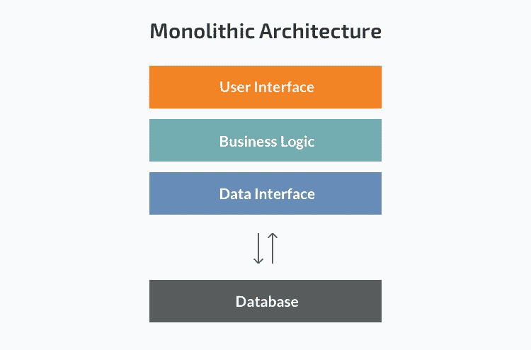
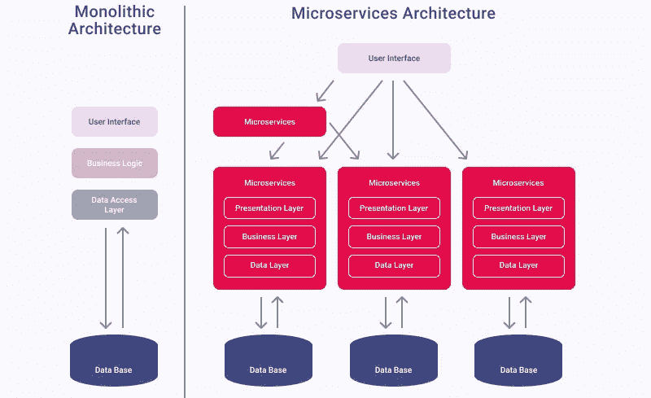

# 微服务简介

> 原文：<https://medium.com/geekculture/introduction-to-microservices-9dcaafa5d882?source=collection_archive---------7----------------------->

Photo by [Bianca Ackermann](https://unsplash.com/@biancablah?utm_source=medium&utm_medium=referral) on [Unsplash](https://unsplash.com?utm_source=medium&utm_medium=referral)

在过去的十年中，软件开发一直在快速发展，以跟上技术进步和消费者需求。因此，微服务有机会展示它的能力。现在每个人都在谈论微服务，它目前得到了 it 行业的大量关注。与此同时，一些软件开发人员和社区指出，微服务架构并不是一个全新的事物，而是 SOA 的重新命名。然而，与单片架构相比，微服务架构具有显著优势。因此，在进入微服务之前，您应该对单片架构有一个大致的了解。

# 整体建筑

整体架构被认为是构建应用程序的传统方式。在这种体系结构中，整个应用程序是作为一个单元开发的。假设您已经开发了一个基于单片架构的应用程序。该应用程序有一个客户端用户界面、包含几个流程的业务层和一个数据库。因此，所有这些被放在一起作为一个单一的单位，它使应用程序成为一个大的代码库。因此，如果您想更新或更改一个简单的东西，您必须访问整个代码库。此外，你必须更新整个代码库，即使是一个简单的改变。因此，你可能需要放下你的整个应用程序几个小时。

Image: Monolithic Architecture Representation (www.n-ix.com)

如果你认为现在的整体架构毫无用处，没有任何优势，那你就错了。因为它有几个优点，比如:

*   更容易调试和测试
*   更容易部署
*   更轻松的性能监控

然而，这种整体式架构最终变得如此难以管理有几个原因，例如:

*   代码库太大，任何一个开发者都无法完全理解
*   单一的应用程序不能使用不同的技术和语言来开发
*   如果代码库难以理解，所做的更改将对系统有害
*   即使系统的一个功能不工作，整个应用程序也会受到影响
*   应用程序不容易扩展，因为每次应用程序需要更新时，整个系统都需要重建
*   大多数时候，Monolith 应用程序都有紧密耦合的依赖关系
*   开发可能需要很多时间来构建，因为每个功能都必须一个接一个地构建

因此，整体架构的上述弱点是导致微服务发展的主要原因。

# 什么是微服务？

微服务是一种架构风格，它将应用程序构建为小型独立服务的集合，而整体应用程序是一个统一的单元。这些小服务将所有应用程序流程作为一个单独的服务来执行。因此，每个服务都有自己的业务逻辑并执行特定的功能。通常每个服务都被打包成一个 API，因此它可以与应用程序的其余组件交互，最重要的是，每个服务都可以单独更新、部署和扩展。

在软件行业中，微服务没有确切的定义，但大多数时候人们会参考 Martin Fowler 对微服务的解释来定义它。

> 简而言之，微服务架构风格是一种将单个应用程序开发为一套小服务的方法，每个小服务都在自己的进程中运行，并通过轻量级机制(通常是 HTTP 资源 API)进行通信。
> 
> 马丁·福勒

Image: Monolithic vs Microservice Architecture Representation (xbsoftware.com)

# 微服务架构的特征

## 独立组件

如您所知，在微服务应用中，所有服务都可以单独部署、维护和更新，这提供了更大的灵活性。为了实现这一点，这些服务之间不共享库和数据库。因此，我们可以防止这些服务之间的耦合。假设一个微服务中有一个 bug，但是它只影响那个特定的服务，而不会影响整个应用程序。如果是单片应用，会影响整个应用。向应用程序添加新功能时也是如此。因为在微服务应用程序中添加新功能要比在单片应用程序中添加新功能容易得多。

## 由较小的团队维护

由于微服务项目由负责多种服务的多个团队组成，每个团队应该在各个方面都是完整的。举个例子，每个领域都要有一个开发人员来处理，比如用户界面，数据库，业务逻辑，甚至 QA。因为每个团队都需要了解从消费者到后端一切。然而，团队可以彼此独立地工作，因为服务是独立的。

## 选择技术的灵活性

如果你正在开发一个单一的应用程序，你的整个团队必须坚持使用一种技术或者一个堆栈。然而，在微服务架构中，团队不会受到一开始就选择的技术的限制。他们可以根据场景为每个微服务自由应用各种技术和框架。

正如我已经提到的，您可以使用不同的语言开发微服务。但是 Java 被认为是用这种架构构建应用程序的首选之一。Java 提供了几个微服务框架，如 Spring Boot、Swagger、Jersey 和 Dropwizard。

## 容错

在开发微服务应用时，容错被认为是必须具备的特性。因为任何服务呼叫都可能由于供应商的不可用性而失败。因此，如果出现服务故障，您需要维护这种情况。从技术上来说，与单片架构相比，这是一个缺点，因为它引入了处理它的额外复杂性。

## 更好的可扩展性

微服务架构的一个主要优势是每个元素都可以独立扩展。它可确保您的应用始终正常运行，而不会在未使用的模块上浪费额外成本。在整体架构的情况下，即使没有必要，也必须对整个应用程序进行扩展。此外，每个单片应用程序在可伸缩性方面都有限制。这意味着如果您的应用程序获得了比预期更多的用户，您可能需要重新构建整体应用程序。

**刻度立方体**

Scale cube 是可伸缩性的 3D 模型，由“可伸缩性的艺术”一书定义。比例立方体使用三个轴(命名为 X、Y 和 z)来阐述微服务的可伸缩性。比例立方体可由下图表示:

Image: Scale cube representation (dzone.com)

**X 轴缩放:**这是最简单的缩放形式。在这种扩展中，应用程序的多个实例由负载平衡器部署和管理。这意味着如果一个实例不够用，您应该能够在继续处理的同时生成其他实例。这种扩展模型通常应用于架构单一，应用程序不能被分割成独立的、可部署的模块的情况。

**Y 轴缩放:**在这个缩放中，功能分解可以通过将你的架构解耦成功能来实现。基本上，它将应用程序分成许多独立的服务，每个服务只负责一项功能。微服务是功能分解的一个例子，因为它们是独立的较小的服务，有自己的数据库。

**Z 轴缩放:**该缩放模型类似于 X 轴，除了它的单个实例只处理数据的子集。每个实例都有相同的代码集，但是在数据库级别，数据被划分到不同的分片中。通常，它负责将请求路由到适当的应用程序实例。

# 微服务的优缺点

在结束这篇文章之前，我想强调一下微服务架构的主要优缺点。这些优势是网飞、谷歌、亚马逊和其他技术领导者采用微服务架构的原因。

## 优势

*   更小更快的部署
*   改进的故障隔离
*   易于理解
*   更好的可扩展性
*   混合技术堆栈
*   粒状结垢

## 不足之处

*   服务之间的通信是复杂的
*   开发人员可能需要处理网络延迟和负载平衡
*   与单片相比，测试很困难

所以，这是我的文章的结尾，我希望你喜欢它。快乐编码👨‍💻。

# 参考

 [## 微服务 vs Monolith:哪种架构最适合您的企业？

### 微服务在几年前刚刚出现，现在正呈加速趋势。的确，微服务…

www.n-ix.com](https://www.n-ix.com/microservices-vs-monolith-which-architecture-best-choice-your-business/)  [## 什么是微服务|微服务架构介绍| Edureka

### 您是否曾经想过，什么是微服务，以及扩展行业如何在构建时与微服务集成…

www.edureka.co](https://www.edureka.co/blog/what-is-microservices/)  [## 微服务的定义、优点和缺点

### 微服务似乎每天都在这个领域获得认可。基于此类服务的体系结构是…

www.chakray.com](https://www.chakray.com/what-are-microservices-definition-characteristics-and-advantages-and-disadvantages-2/)  [## 比例立方体:微服务的简化比例模型- DZone 微服务

### 微服务架构的主要优势之一是易于扩展。在经历各种部署和…

dzone.com](https://dzone.com/articles/scale-cube-simplified-scale-model)