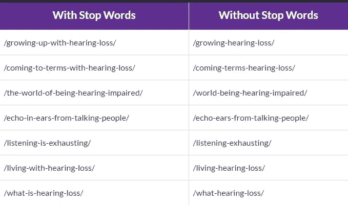
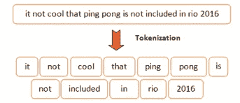
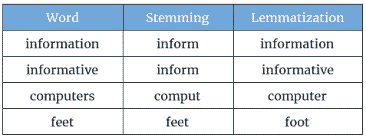
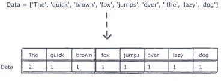

# 自然语言处理简介

> 原文：<https://medium.com/geekculture/introduction-to-nlp-bfec725e10cf?source=collection_archive---------28----------------------->

# 什么是自然语言处理(NLP)？

自然语言处理可以定义为计算机科学的一个分支，它帮助没有计算机科学知识的人让计算机为他工作。

众所周知，自从人类发明计算机以来，完成某项任务的准确度、精确度和速度都有了成倍的提高。现在，人类可以在几秒钟内解决复杂的问题，而过去人工解决这些问题需要几个小时。电脑彻底改变了我们的生活，但这种改变仅限于拥有电脑知识的人。

自从本发明以来，在该领域中已经发生了许多发展，这有助于具有很少知识的人也可以操作计算机来完成某些任务，我们已经发明了某些软件来帮助具有有限计算机知识的人在计算机上有效地执行他们的任务。

现在我们可以看到，有许多新东西是人们在电脑上做的，没有专家的帮助。

*   智能助手(如 Siri、Alexa)
*   做情感分析
*   预测文本
*   语言翻译

# 理解计算机是如何做到这一切的

正如我们所知，计算机只理解数字语言，它们不理解文字，但我们人类只处理文字，所以让我们了解这些文字如何被转换成有用的数字数据，并输入计算机。

当一个人用他的语言写作或说话时，他会使用许多对他想要传达的信息影响很小或没有影响的词。

在早期，信件和电报被用来发送信息，信件由许多单词组成，而电报只使用那些有助于传递信息的单词，我们不关心语法，因此我们知道文本中的每个单词对传递信息并不重要。

ML 算法将特定文档中的单词频率解释为一个特征，因此文档可以有 **N** 个唯一单词(例如 10000 个)，因此这里我们将为该算法提供 **N** 个特征，但是随着特征数量的增加，我们的模型性能会下降，因此为了克服这一点，我们可以删除某些不会改变文档含义的单词，就像我们在电报中所做的那样。

# **文本处理**

*   去除标点符号:在我们的机器学习模型中包含标点符号可能是一个非常糟糕的想法，因为在计算主题和理解文本情感时，标点符号没有物理意义，所以我们需要去除文本中存在的所有标点符号。

*   **移除停用字词**:停用字词是最常见的累积字词，在消息中没有意义。诸如“is”、“the”、“and”等词是英语中的一些停用词。移除这一点将提高我们的模型性能

*   **标记化:**我们将语料库中存在的文本转换成标记/单词/短语的集合。一个标记只由一个单词组成的标记化称为 1-gram 标记化器。类似地，将我们的文本分割成每个单词最多由 n 个单词组成的记号赋予器被称为 n-gram 记号赋予器。

This how tokenization is done

*   **词干化和引理化:**词干化和引理化用于将单词转换为其词根，例如 going、gone、goes 都具有相同的词根 go，因此这意味着所有这些单词都具有相同的含义，但我们的算法会将这些单词视为三个独立的单词，这将增加数据集中存在的特征。在词干分析中，我们移除单词的后缀，而词汇化借助于单词的语言学分析。有必要有详细的字典，算法可以通过这些字典将形式链接回它的引理。它借助于对那个特定单词的各种语言学见解。

difference between stemming and lemmatization

*   **去除最大和最小频繁单词**:出现在每个句子中的单词不会有助于分类或聚类，因为它们无处不在，而出现频率很低的单词也没有用，因为它们在分类中没有那么重要。

# **矢量化**

在矢量化中，我们找到每个文档中存在的特征值，并生成一个稀疏矩阵。

**反消旋**是我们用来统计文档中特征的技术之一。

在这种情况下，出现较多的单词将具有较高的值，而出现较少的单词将具有较低的值，因此出现较少的值的重要性将降低，从而使模型的性能较差。这些低值词可能会在分类或聚类问题中提供更好的性能。为了克服这个问题，我们提出了其他矢量化技术，称为 **TF-IDF 矢量化**

**TF-IDF 矢量化**赋予文档中所有单词同等的重要性。这个东西是通过把词频和逆文档频相乘来实现的。

**词频(TF):** 可以通过将一个词在文档中出现的次数**除以文档中的总字数**来计算

**逆文档频率(IDF)** :这是通过查找(文档数量**除以**包含该单词的文档数量)的对数计算的

因此，我们对文件中出现的词语给予同等的重视

通过所有这些过程，我们已经成功地将文本转换成数字形式，可以输入到机器中并得到想要的输出

这些都在这个博客里，如果你觉得博客里有什么不对的地方，请随时联系我，希望你能及时改正错误，再见，祝你有美好的一天！