# MongoDB node . js 简介—第 2 部分

> 原文：<https://medium.com/geekculture/introduction-to-node-js-with-mongodb-part-2-97542a3d5f47?source=collection_archive---------61----------------------->

在简介的第 1 部分中，我们介绍了使用 Node.js 创建数据库、创建新集合、将一个或多个文档插入集合以及搜索一个或多个文档的安装和基本演练。今天，我们将继续我们的旅程，看看其余的 CRUD 功能。你可以在这里下载今天博客[的启动代码](https://github.com/celestialheathen/node-mongo-project)。

我们的数据库目前从 MongoDB Shell 看起来是这样的。提醒一下，数据库的名称是 mydb，它包含一个名为 pets 的集合，到目前为止它有四个文档(如下所示):

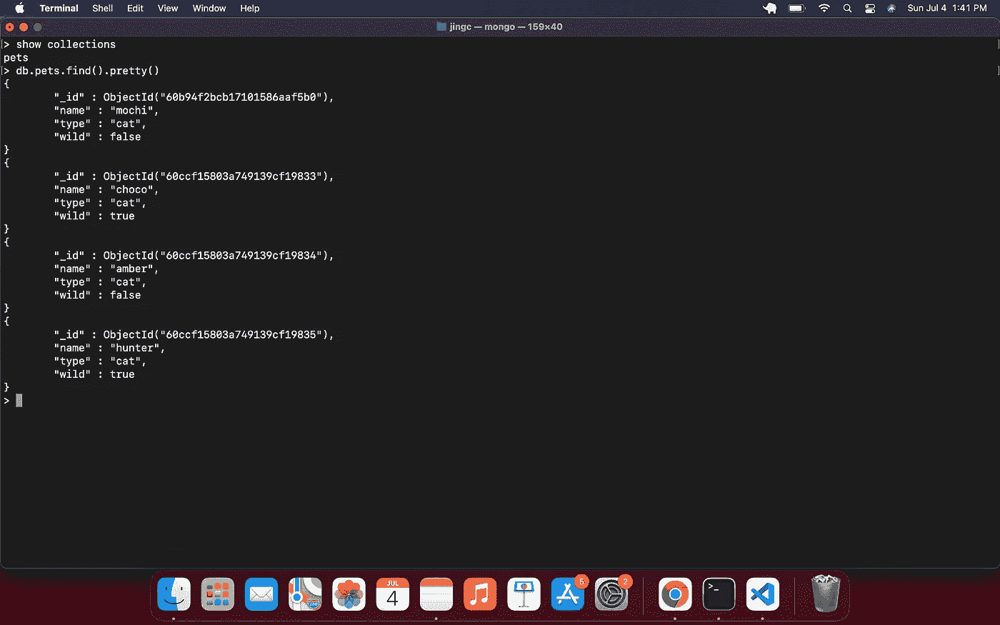

要删除一个文档，我们将在 Shell 中使用 db.pets.remove({ query })，在 Node.js 中，我们将使用 deleteOne()和 deleteMany()方法来完成此操作。注意 deleteOne()删除第一个匹配结果，如果集合包含多个匹配的文档，其余的不会受到影响。

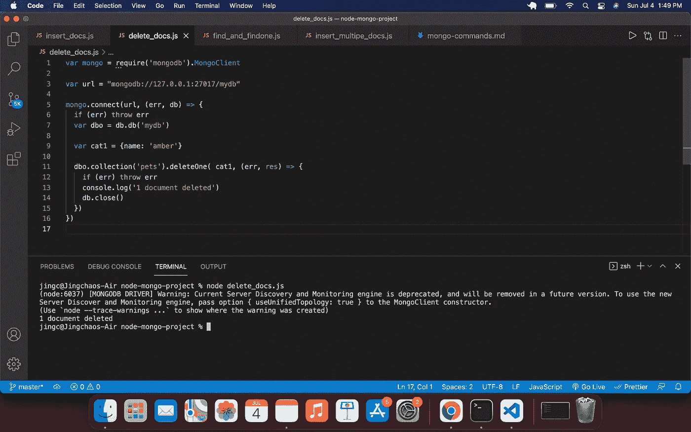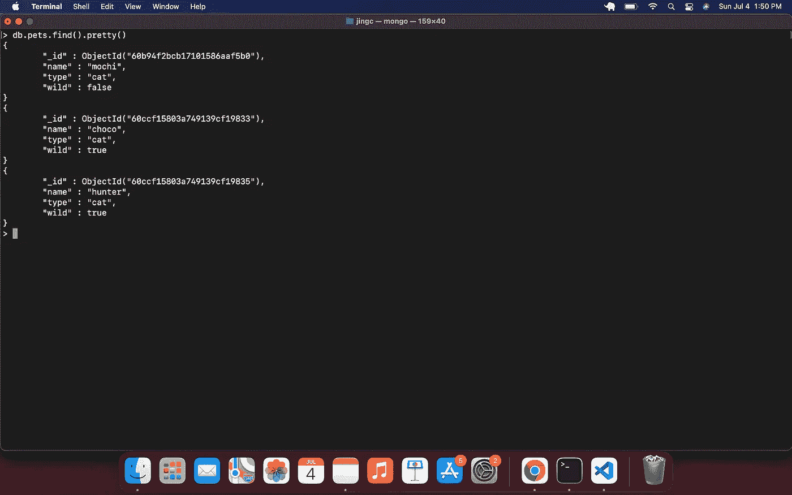

Amber is successfully deleted from our database

要删除多个符合查询条件的文档，我们可以使用 deleteMany()方法。我们可以直接将查询对象作为参数传入方法，而不是创建查询对象:

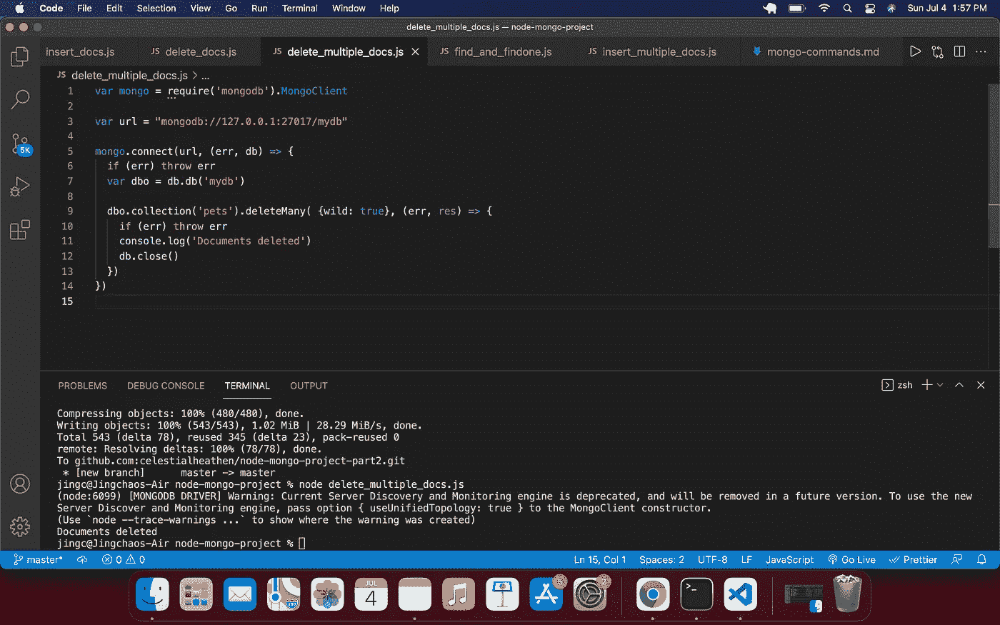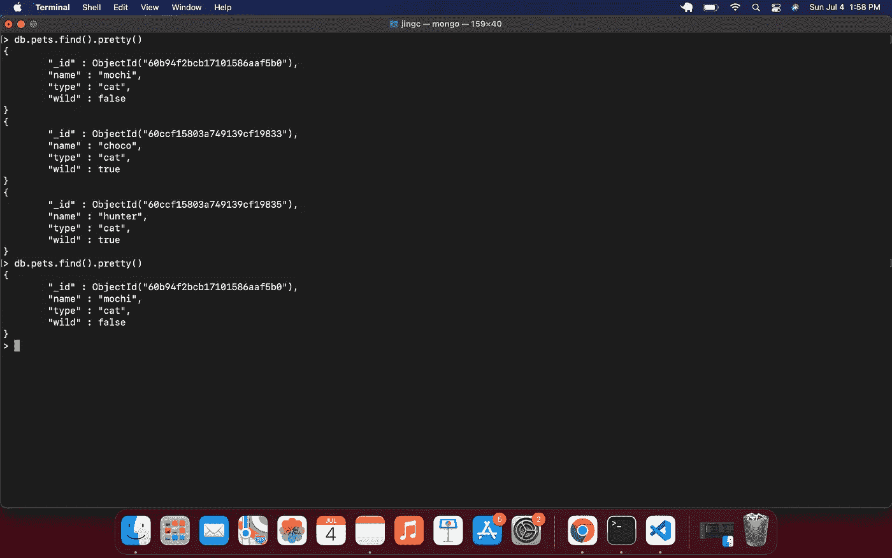

We are left with only 1 document after deleteMany({ wild: true})

类似地，为了更新一个或多个文档，我们使用 updateOne()和 updateMany()。如果您还记得我们前一篇博客中的命令，为了只更新一个特定的字段或者向文档中添加一个新的字段，我们将使用$set operator。如果没有它，更新操作将替换整个文档。

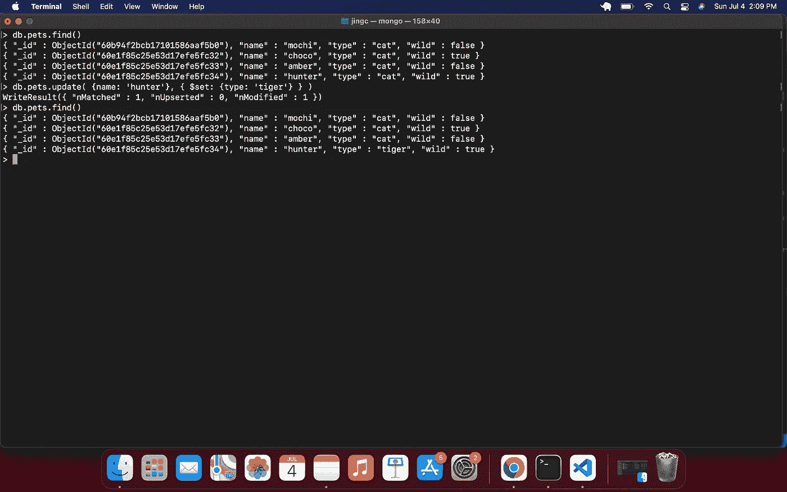

Using the #set operator to update a field

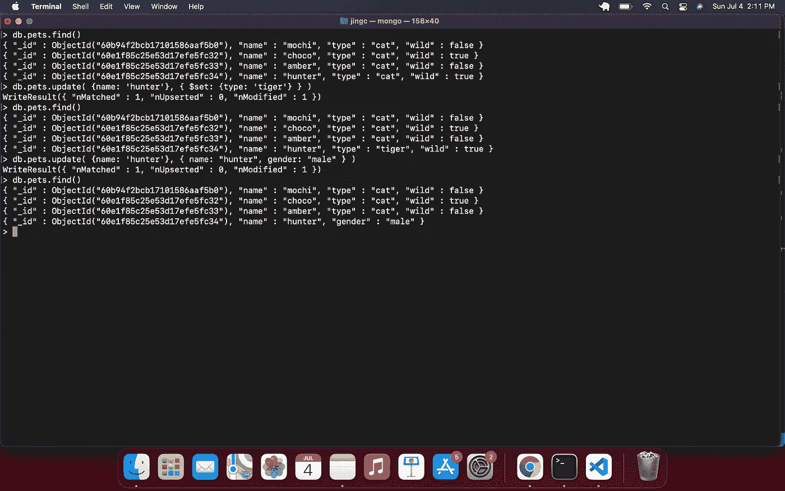

The whole document is replaced if $set operator is not used

在 Node.js 中，$set 操作符的功能相同。假设我们要给琥珀添加一个性别字段:

如果我们想为 Mochi 更新 Wild 字段，从 false 到 true:

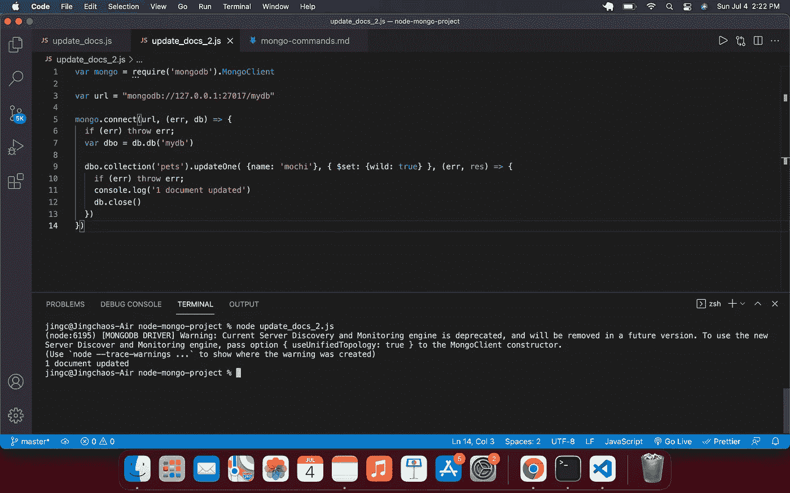

updateMany()将使用新值更新所有符合查询条件的文档。例如，如果我们想将“类型”字段从“猫”改为“猫”,我们可以这样做:

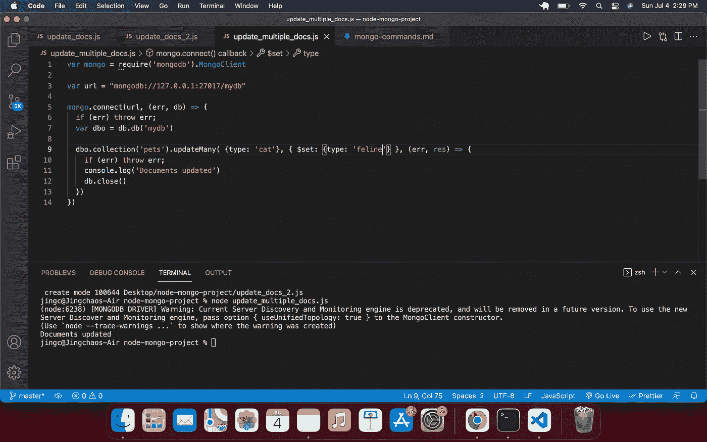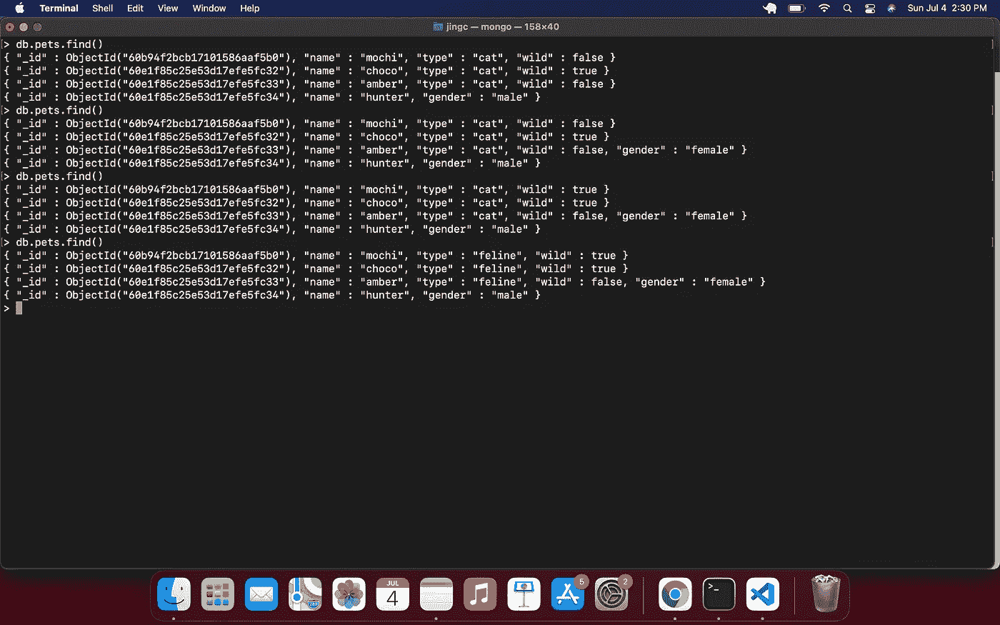

hunter is not updated since he does not have a type field

为了演示 sort()方法，我在我们的集合中插入了几只不同名字的猫。还把亨特和安珀从收藏中拿走了。

要按特定字段(如名称)进行升序排序，我们可以使用带参数的排序方法:

The Console shows the sorted cats

为了降序排序，我们需要做的就是使用{ name: -1 }作为我们的参数:

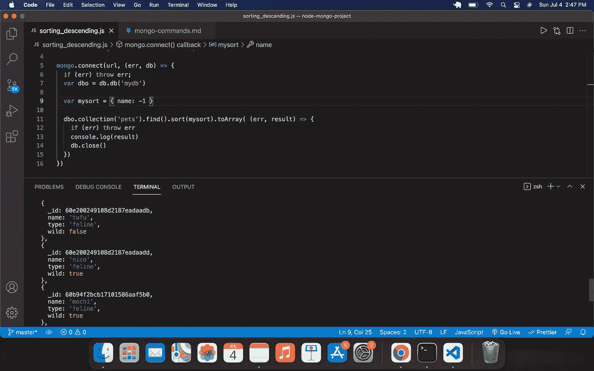

要删除整个集合，我们可以简单地使用 drop()方法。假设我们想放弃宠物系列:

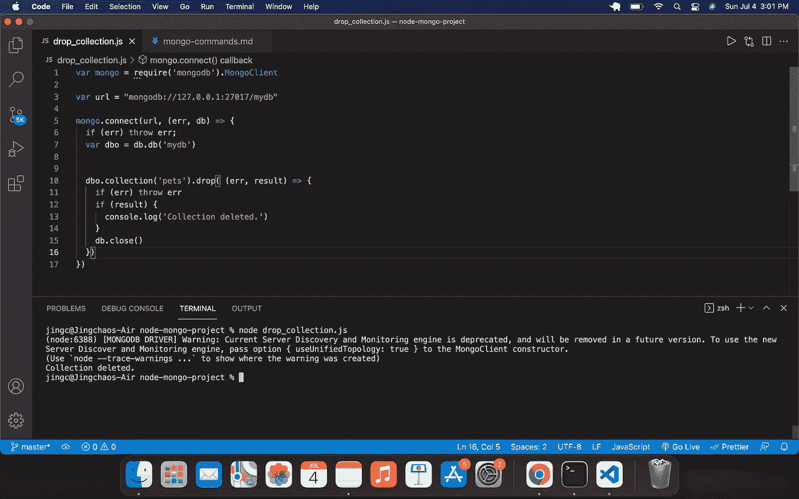

为了证明集合已经被删除，如果我们从 MongoDB Shell 中运行 show collections，不出所料，什么都没有显示:

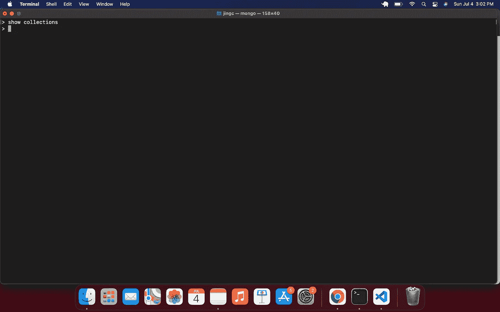

如果我们现在运行 show dbs，mydb 将不可见，因为它不包含任何集合。如果它有任何其他收藏(除了宠物)，它仍然会显示。

最后，要完全删除数据库，我们可以使用 dropDatabase()方法。可以想象，数据库中的任何收藏或文档都将被永久自动删除。

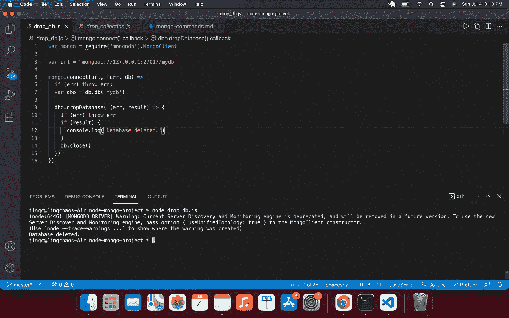

Db deleted and we did not get any error messages

这是我们关于 MongoDB 和 Node.js 的 2 部分系列的结论。希望您有机会使用这里的一些命令。今天博客的代码可以在这里下载。下次见，编码快乐！

