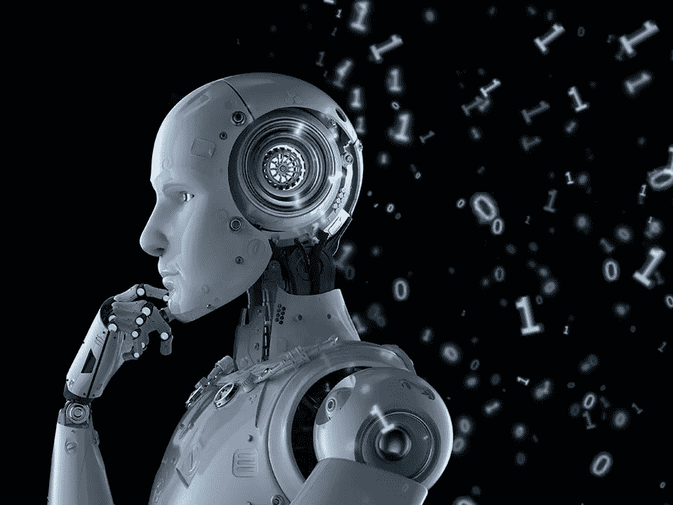

# 机器人学导论

> 原文：<https://medium.com/geekculture/introduction-to-robotics-a572ab034948?source=collection_archive---------12----------------------->

自从我们开始制造东西以来，机器人就一直在人们的脑海中。随着当前机器学习、人工智能和制造工艺的进步，机器人的应用和对机器人工程师的需求是巨大的。在这篇文章中，我试图总结机器人实际上是什么，并给出一个基本的理解。

**机器人**来源于工作“Rabota”，意思是工人。机器人学是技术的一个分支，涉及机器人的设计、构造和使用，以执行传统上由人类完成的任务。

## 什么是机器人？

> 简单地说，机器人是任何试图减少人类努力的自主操作的机器；即使它在任何方面都不像人类，它也是机器人。

一般来说，机器人由运行程序的计算机控制。这就是机器人与简单机械手(通常由人类控制)的区别。机器人的运动由控制器控制，并由计算机程序监控。

一个理想的机器人应该能够执行许多不同的任务，并且能够灵活地完成任务，只需改变程序，而不必重新设计。

## 机器人的分类

根据*日本工业机器人协会(JIRA)* ，有 6 类机器人:

**I 类:手动搬运装置:**由操作者驱动的多自由度装置。

**ⅱ类:固定顺序机器人:**按照预定的、不变的方法执行任务的装置。这个很难修改。

**第三类:可变序列机器人:**与第二类相同，但更容易修改。

**第四类:回放机器人:**这是一类机器人，其中操作员执行任务，引导机器人并记录这些动作。然后，机器人根据记录的信息重复同样的动作。

**V 类:数控机器人:**操作员使用程序向机器人提供动作，而不是手动教授。

**第六类:智能机器人:**尽管环境不断变化，但仍能理解其所处环境并成功完成某项任务的机器人。

美国机器人协会(RIA) 认为只有 3-6 级以上的机器人。法国机器人协会(AFR) 有 4 类机器人:

**A 型:**手动控制的搬运装置。

**B 型:**具有预定周期的自动处理装置

**C 型:**可编程、伺服控制的机器人。

**D 型:**与 C 型相同，但增加了从环境中获取信息的功能。

## 机器人组件

从广义上讲，机器人有以下部件:

**机械手/漫游车:**机器人的主体。它由机器人的连杆、关节和其他结构元件组成。

**末端执行器:**这个部件连接到机械手的最后一个关节(手)，机械手处理物体，连接其他机器，或者执行任务。这些是专门为一个目的而设计的。或者由机器人的控制器控制，或者由独立的末端执行器控制装置(如 PLC)控制。

**执行器:**这些是机械手的肌肉。控制器向致动器发送信号，致动器依次移动连杆和关节。

**传感器:**用于获取机器人的状态信息或者与外界环境进行通信。

**控制器:**它接收来自计算机(机器人的大脑)的数据，根据这些数据控制执行器的运动，并用感官反馈信息协调运动。

**处理器:**这是机器人的大脑。它计算机器人关节的运动，确定每个关节应该移动多少和多快，以实现所需的速度和运动。处理器通常是计算机，但专门用于此目的。

**软件:**机器人使用三种类型的软件。一个是操作处理器的操作系统。第二，机器人软件根据机器人的运动学方程计算每个关节的必要运动。第三，是面向应用的例程和程序的集合，用于机器人需要执行的特定任务，如装配、机器装载、视觉例程等。

## 机器人自由度

为了定位空间中的刚体，我们需要指定它的位置，因此需要 3 条信息。指定位置后，有无数种方法来确定对象的方向。我们需要另外 3 条信息来指定身体的方向。

需要有 6 个自由度(3 个坐标——x、y、z 和 3 个旋转轴——α、β、γ)来将物体完全放置在空间中，并根据需要对其进行定向。

因此，任何机器人都需要至少 6 个自由度来在其工作空间中放置和定向。有许多商用机器人具有 7 个自由度，因此有无限多种方式将零件定位和定向在所需位置。这样做是为了避障。

> 机器人的末端执行器从不被认为是一个附加的自由度。所有的机器人都有这个功能。

**部分自由度**是关节可能有能力移动但其运动受到限制的情况。在这种情况下，惯例是为该关节指定 1/2 的自由度。关节可以有 1/2 自由度的另一种方式是只允许它在特定值下移动。例如，如果一个关节仅处于 0、30、60、90 度。

## 机器人关节

有不同类型的关节，如线性关节、旋转关节、滑动关节或球形关节。

大多数机器人有两种类型的关节:

*   **棱柱:**线性、液压或气压缸或电动线性执行机构。它们用于龙门式、圆柱形或球形机器人。
*   **Revolute:** 旋转，虽然常见液压、气动旋转关节，但大部分都是电驱动的(通过伺服电机或步进电机)。

## 机器人坐标

机器人配置通常遵循定义它们的坐标框架。一些常见的有(棱柱形关节用 P 表示，旋转关节用 R 表示):

*   笛卡尔坐标:3P
*   圆柱形:PRP
*   球形:P2R
*   铰接式:3R
*   SCARA(选择性柔顺装配机械臂):两个/三个平行的旋转关节(允许机器人水平移动)，加上一个垂直移动的额外的棱柱关节。

具有 3 个移动关节和 3 个旋转关节的机器人用 3P3R 表示。

## 机器人参考系

机器人相对于不同的坐标框架移动。在每一帧中，运动将是不同的。三种常用的参考系是:

*   **世界参考框架:**这是通用参考框架，由 x、y、z 轴定义。用于定义机器人相对于其他对象的运动，定义机器人与之通信的其他部件和机器，以及定义运动轨迹。
*   **关节参考系:**用于指定机器人各个关节的运动。在这种情况下，可以单独访问和移动每个关节。
*   **工具参考框架:**指定机器人的手相对于附着在手上的框架的运动，所有运动都相对于这个局部 n，o，a 框架。这个帧是一个随着机器人移动而不断变化的移动帧(它随着机器人移动)。当机器人接近和离开其他物体或组装零件时，这非常有用。

## 机器人编程模式

机器人可以用多种方式编程。一些常见的是:

**物理设置:**操作员设置控制机器人运动的开关和硬停止。通常与可编程逻辑控制器(PLC)等其他设备一起使用。

**引导/示教模式:**机器人的关节通过示教盒移动。当达到期望的位置时，该位置被输入控制器。在回放过程中，机器人将关节移动到相同的位置。这通常是点对点的，也就是说，点与点之间的运动是不确定的。

**连续走过模式:**所有关节同时移动，同时连续记录动作。在回放期间，精确的运动被重复。

**软件模式:**离线或在线编写程序，由控制器执行控制运动。这是最复杂和最通用的编程模式，但需要机器人编程语法的工作知识。

## 机器人特征

*   **有效载荷:**机器人可以承载的重量，但仍保持在其他规格范围内。机器人的最大负载能力可能远远超过其指定的有效载荷。
*   **到达:**机器人在其工作空间内可以到达的最大距离。
*   **精度(有效性):**能够达到指定点的精确程度。取决于致动器的分辨率，以及机器人的反馈。
*   **可重复性(可变性):**如果多次重复运动，同一位置能够达到的精确程度。重复运动形成的圆的半径叫做重复性。这比精度更重要，因为精度每次都会产生相同的误差，这是可以纠正的；但是重复性会产生无法解释的随机误差。

**机器人工作空间**是机器人能够到达的点的集合，取决于机器人的配置及其连杆和腕关节的大小。

# 参考

*   机器人学导论，分析，控制，应用。